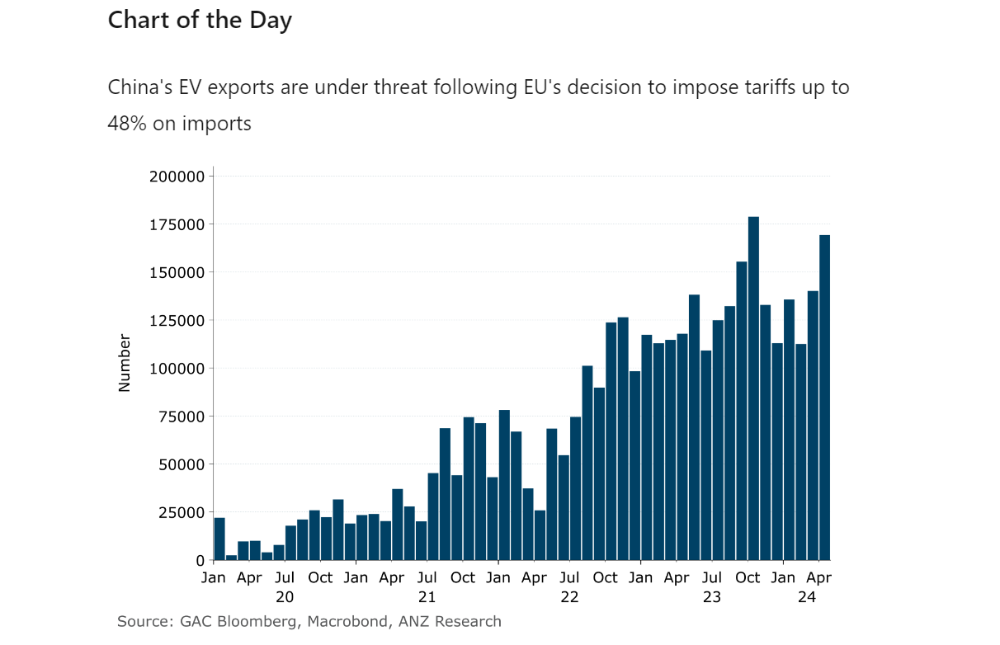

# Supply side issues push global gas prices higher

**Date:** June 14, 2024  
**Publisher:** Breakwave Advisors | **Category:** Market Insights  
**Original URL:** [https://www.breakwaveadvisors.com/insights/2024/6/14/supply-side-issues-push-global-gas-prices-higher](https://www.breakwaveadvisors.com/insights/2024/6/14/supply-side-issues-push-global-gas-prices-higher)  

---

Mixed signals on the outlook for monetary policy saw commodity markets trade sideways. However, ongoing supply side issues remain supportive.

*By*[*Daniel Hynes*](https://www.linkedin.com/in/dahynes/)

**Crude oil**steadied following strong gains earlier in the week following reports Russia will dial back output. The OPEC+ member has fallen short of its targeted output in recent months under the group’s supply cut agreement. The Energy Ministry said it plans to strictly comply with its quota in June, making up for pumping over its target in April and limited excessive output seen in May. This comes after OPEC disappointed the market with its decision to start phasing out the 2.2mb/d of cuts from the start of the fourth quarter of 2024.[**We think the market overreacted**](../pdfs/2024-06-14_supply-side-issues-push-global-gas-prices-higher_commodity-call-lost-in-translation_48ab21cede3e.pdf)[**.**](https://publications.anz.com/SingletrackCMS__DownloadDocument?docRef=2b38f3b9-2f68-4e2d-ad1c-827cb8a50eb9&uid=bd219b92-f5cc-400e-9646-4178791864b7&jobRef=f7108595-2555-428c-a4c7-6202bffb9710)OPEC made it clear that the production increase can be paused or reversed subject to market conditions. Moreover, stricter adherence to quotas could see non-compliant members reduce output in coming months. Stricter adherence to the current quotas should more than offset any potential increases from the group of eight under the gradual phase out of their voluntary cuts. This should see the crude oil market remain well supported over the next 18 months. Meanwhile, geopolitical risks continue to hover. A cargo vessel was on fire after being hit by projectiles while sailing in the Gulf of Aden.

**Global gas**markets extended gains amid a heightened risk to supply disruptions. In the latest setback for global supplies, Chevron signalled that repairs on its Wheatstone LNG platform will take longer than initially expected. Earlier this week, Austria’s OMV AG has warned that Uniper’s successful damages claim against Gazprom could risk disrupting supplies. Gazprom has been covering more than 80% of Austria’s imports over the past seven months under the long-term contract. This comes as demand in Asia is boosted by extreme heat which is pushing cooling demand higher. Despite high levels of inventory, Europe remains vulnerable to such unexpected disruptions. This saw**European gas**benchmarks rise, while**North Asian LNG**were also stronger.

**Base**and**precious metals**edged lower amid mixed signals on the outlook for monetary policy. US producer prices unexpectedly declined in May, adding to evidence that inflationary pressures are moderating. This could be aided by a weaker labour market, with initial applications for US unemployment benefits jumping higher. Earlier this week, Fed officials reduced their forecasts for the number of rate cuts this year to just one. They also warned they need to see more evidence of cooling inflation before lowering rates. Metals used extensively in the EV market were also under pressure following news that the EU plans to hit Chinese electric cars with tariffs of up to 48%. China’s EV industry has been looking at international markets to grow sales amid overcapacity in its domestic market.

**Iron ore**futures gained on sustained momentum in China’s efforts to ease its property crisis. The PBoC held a meeting this week to promote its relending policies for affordable housing and encourage state-owned companies to buy unsold homes. Brazilian iron ore miner Vale said the outlook for demand remains positive in the short, medium and long term.

> **Figure 1: Στιγμιότυπο Οθόνης 2024 06 14 101417**  
> **Interactive Data & Source:** [Linkedin](https://www.linkedin.com/newsletters/commodities-wrap-6692196755876012032/?fbclid=IwAR3kiXJqZdxmp9ZcRwBNI7FsBySI-XSC0pfPur1qzjt7OZp7PTE59Tsl1QI) | [Local Asset](file:///C:/Users/Dell/Github/Shipping/corpus/03-breakwave/insights/2024/assets/2024-06-14_supply-side-issues-push-global-gas-prices-higher_img_cea3cf84ceb9ceb3cebcceb9cf8ccf84cf85_43d248fe08fc.png)

Data source:[Commodities Wrap](https://www.linkedin.com/newsletters/commodities-wrap-6692196755876012032/?fbclid=IwAR3kiXJqZdxmp9ZcRwBNI7FsBySI-XSC0pfPur1qzjt7OZp7PTE59Tsl1QI)

---

**Tags:** Economy, Markets, Commodities  
