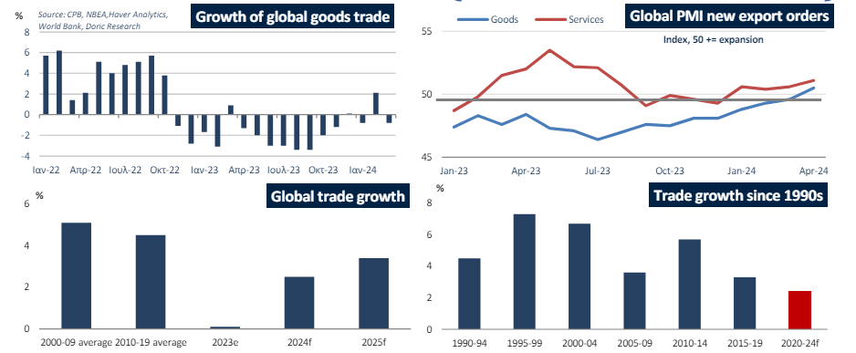

# Global economy appears to be stabilizing in early 2024

**Date:** June 17, 2024  
**Publisher:** Breakwave Advisors | **Category:** Market Insights  
**Original URL:** [https://www.breakwaveadvisors.com/insights/2024/6/17/global-economy-appears-to-be-stabilizing-in-early-2024](https://www.breakwaveadvisors.com/insights/2024/6/17/global-economy-appears-to-be-stabilizing-in-early-2024)  

---

Global trade growth is expected to recover to 2.5 percent in the current year, showing improvement from the previous year but still significantly below the average rates observed in the two decades before the pandemic.

*By*[*Michalis Voutsinas*](https://www.linkedin.com/in/michalis-voutsinas-587544163/)

After enduring successive years of overlapping negative shocks, the global economy appears to be stabilizing in early 2024, according to the World Bank. Despite facing increased financing costs and heightened geopolitical tensions, global economic activity has shown signs of strengthening during the last six months. This improvement has also positively influenced both dry bulk and container freight rates during the first half of the trading year. Global growth is expected to pick up slightly this year, primarily driven by robust economic expansion in the United States. However, the overall global economic outlook remains subdued compared to the period before the pandemic. Both advanced economies and emerging markets and developing economies are projected to grow at a slower pace during 2024-2026.

Inflation, a significant economic issue in recent years, continues to decline globally but remains above target in most advanced economies and approximately one-fourth of emerging and developing economies. The initial phase of post-pandemic disinflation benefited from falling energy prices and easing supply chain pressures. However, recent trends show a slowdown in consumer price disinflation, partly due to a rebound in energy prices and a deceleration in core inflation. Consequently, the expected monetary easing in advanced economies for this year has significantly diminished since late 2023, especially in the US. Policy rate paths differ among major economies, as the European Central Bank has opted to reduce interest rates, while the Federal Reserve continues to uphold a prolonged period of rate stability.

Against this backdrop, global growth is forecasted to remain relatively subdued at 2.6 percent in 2024, without any material change from the previous year. This reflects modest investment growth under restrictive monetary policies and moderated consumption growth due to reduced savings buffers and diminishing fiscal support. For the following couple of years, World Bank expects global growth to slightly improve to an average of 2.7 percent, driven by stronger trade growth and measured monetary policy easing.

In advanced economies, growth slowed to 1.5 percent in 2023, with significant variations across regions. Weakness in the euro area and Japan, driven by subdued domestic demand, contrasts with resilient growth in the United States. US growth is projected to average 2.5 percent this year and moderate to 1.8 percent in 2025, following an upward revision for 2024 due to stronger-than-expected consumer spending. In the euro area, growth decelerated sharply in 2023 amid tight credit conditions, weak exports, and high energy prices. Trade volumes declined for the first time outside of annual euro area contractions, reflecting reduced export competitiveness amidst elevated energy costs. Growth is expected to modestly improve to 0.7 percent in 2024, supported by recovering incomes but tempered by subdued investment and export expansion. Japan's growth is forecasted to slow to 0.7 percent in 2024 due to weak consumption expansion and slowing exports amidst normalized auto production and stabilized tourism demand.

Regarding the driving force behind dry bulk shipping demand, China experienced accelerated growth in early 2024, driven by a positive net export contribution that offset softer domestic demand. Following a sluggish performance in the previous year, both exports and imports showed signs of strength. However, overall investment growth remains tepid, with robust infrastructure and manufacturing investment counterbalanced by declining real estate investment amidst a prolonged property sector downturn. Consumer confidence remains weak, leading to subdued domestic consumption and belowpre-pandemic retail sales growth. Growth is expected to ease to 4.8 percent in 2024, down from 5.2 percent in 2023, as stronger goods exports and industrial activity are overshadowed by weaker consumption trends expected in the latter half of the year.

Global trade in goods and services stagnated in 2023, marking its weakest performance in the past 50 years outside of global recessions. This decline was exacerbated by a sharp slowdown in global industrial production, resulting in a 1.9 percent contraction in the volume of traded goods for the year. Looking forward, global trade growth is expected to recover to 2.5 percent in the current year, showing improvement from the previous year but still significantly below the average rates observed in the two decades before the pandemic. In the near term, the relationship between global trade and economic output is likely to remain weaker than before the pandemic.

Ignoring the broader macroeconomic trends, the Panamax and Supramax segments showed a clear upward trend during the twentyfourth week, while Capesize and Handysize segments maintained their levels from the previous week.

> **Figure 1: Στιγμιότυπο Οθόνης 2024 06 17 115538**  
> **Interactive Data & Source:** [Doric](https://www.doric.gr/) | [Local Asset](file:///C:/Users/Dell/Github/Shipping/corpus/03-breakwave/insights/2024/assets/2024-06-17_global-economy-appears-to-be-stabilizing-in-early-2024_img_cea3cf84ceb9ceb3cebcceb9cf8ccf84cf85_a5ddc4864d45.png)

Data source:[Doric](https://www.doric.gr/)

---

**Tags:** Drybulk, Shipping, Economy  
