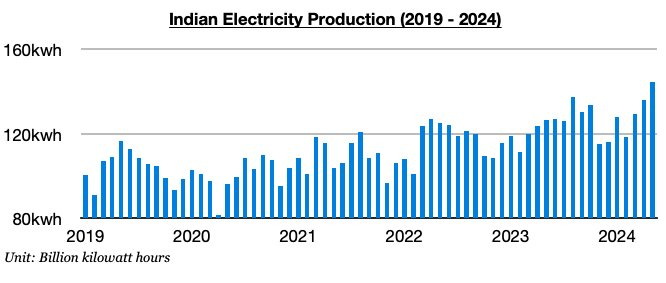
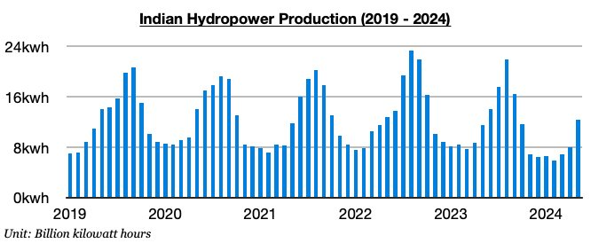
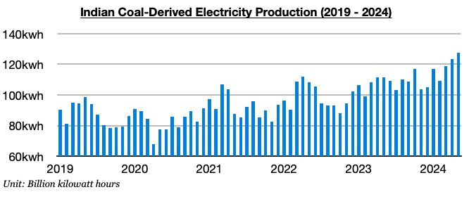

# India's Coal-Derived Electricity Generation Has Set Another Record As Predicted

**Date:** June 17, 2024  
**Publisher:** Breakwave Advisors | **Category:** Market Insights  
**Original URL:** [https://www.breakwaveadvisors.com/insights/2024/6/17/z105t87t5fyej9msyorn08l8vqlgmg](https://www.breakwaveadvisors.com/insights/2024/6/17/z105t87t5fyej9msyorn08l8vqlgmg)  

---

*By*[*Jeffrey Landsberg*](https://www.linkedin.com/in/jeffrey-landsberg-70ab957/)

India produced approximately 144.4 billion kilowatt hours of electricity last month. This is up month-on-month by 8.6 billion kilowatt hours (6%), up year-on-year by 17.8 billion kilowatt hours (14%), and is a record. The 14% year-on-year growth also marks the largest growth seen all year. Hydropower output has finally returned to growth, but that has not stopped coal-derived electricity generation from continuing to set new records as we have been predicting in Commodore's Weekly Dry Bulk Reports.

> **Figure 1: Chart 1**  
> [Local Asset](file:///C:/Users/Dell/Github/Shipping/corpus/03-breakwave/insights/2024/assets/2024-06-17_z105t87t5fyej9msyorn08l8vqlgmg_img_chart1_9e7d33f666ab.jpg)

Hydropower output totaled approximately 12.3 billion kilowatt hours last month. This is up month-on-month by 4.3 billion kilowatt hours (53%) and is up year-on-year by 800 million kilowatt hours (7%). Previously, India’s hydropower output had contracted on a year-on-year basis for ten straight months.

> **Figure 2: Chart 2**  
> [Local Asset](file:///C:/Users/Dell/Github/Shipping/corpus/03-breakwave/insights/2024/assets/2024-06-17_z105t87t5fyej9msyorn08l8vqlgmg_img_chart2_d882bade06dc.jpg)

Coal-derived electricity generation totaled approximately 127.7 billion kilowatt hours last month This is up month-on-month by 4.2 billion kilowatt hours (3%), up year-on-year by 16.3 billion kilowatt hours (15%), and is another new record. India’s coal-derived electricity generation has now grown on a year-on-year basis during each of the last thirteen months and has set records during each of the last three months. We had predicted that coal-derived generation production records would start being set in March, and this has occurred as expected. The dry bulk market remains fortunate that India’s coal-derived generation has continued to surge, as domestic coal production has also continued to surge.

> **Figure 3: Chart 3**  
> [Local Asset](file:///C:/Users/Dell/Github/Shipping/corpus/03-breakwave/insights/2024/assets/2024-06-17_z105t87t5fyej9msyorn08l8vqlgmg_img_chart3_7d6d4cd8f9a3.jpg)

---

**Tags:** Coal, Drybulk, Economy  
