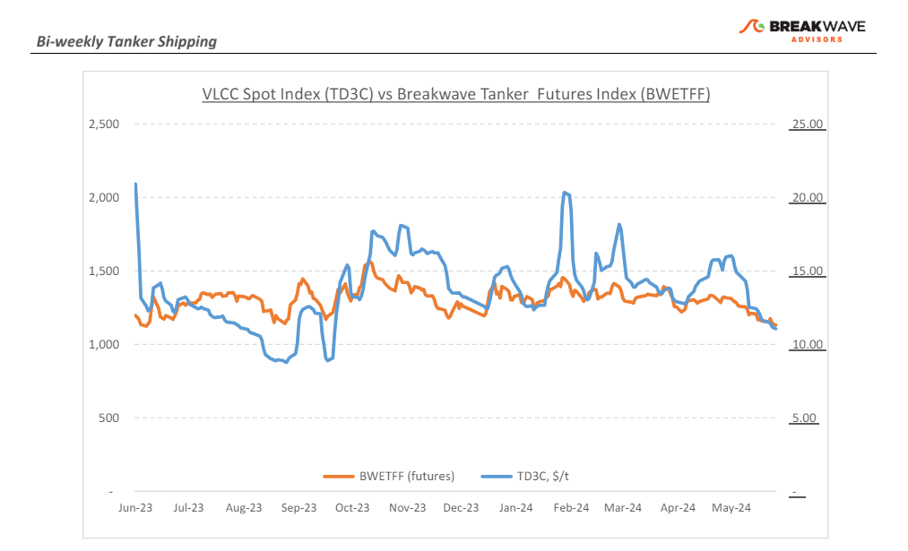
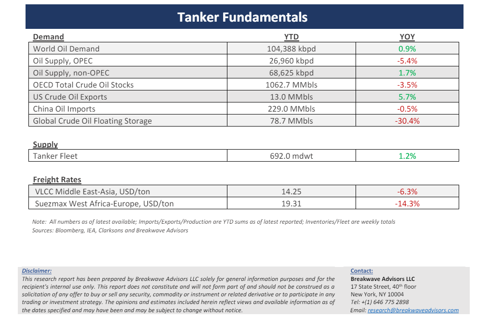

# Breakwave Bi-Weekly Tanker Report - June 18, 2024

**Date:** June 18, 2024  
**Publisher:** Breakwave Advisors | **Category:** Market Insights  
**Original URL:** [https://www.breakwaveadvisors.com/insights/2024618wet-7rsj2](https://www.breakwaveadvisors.com/insights/2024618wet-7rsj2)  

---

> **Figure 1: Cea3cf84ceb9ceb3cebcceb9cf8ccf84cf85**  
> [Local Asset](file:///C:/Users/Dell/Github/Shipping/corpus/03-breakwave/insights/2024/assets/2024-06-18_2024618wet-7rsj2_img_cea3cf84ceb9ceb3cebcceb9cf8ccf84cf85_d8836552a97e.png)

•**The VLCC Market Remains under Persistent Downward Pressure Amid Oversupply, Reduced Demand**– As we move into the second half of June and the final stretch of the first half of the year,**renewed downward pressure**is again the main dynamic for the**VLCC market**with sluggish performance in both the Atlantic and Pacific basins. As open tonnage becomes less of an issue for charterers and with limited signs of a rebound, the**current softening trend**should remain in place for the foreseeable future. From the charterers' perspective, there is a well-established approach for maintaining the downward trajectory and in the Middle East Gulf (MEG) VLCC rates have experienced a significant decline due to reduced demand and increased competition for June last-decade cargoes. A similar**quiet trend**is seen in**West Africa**, with VLCC charterers able to chip away at last-done levels due to the increasing number of Eastern ballasters looking to escape the falling Arabian Gulf market. On the benchmark MEG-China route, freight spot rates at the end of the second week of June recorded a 40% drop compared to the levels of a year ago and a 30% fall monthly. With the ongoing Eid holidays this week, it is**unlikely that the market will pick up soon**and the current oversupply of tonnage will most likely spill over into at least early July, leading some owners to lock in shorter voyages off their vessels’ dates while the market remains stuck at recent levels before a probable uptick later in the summer. Overall,**summer blues**for tanker owners are becoming a reality and, for the time being, a turnaround does not look imminent.

•**U.S. Crude Imports Surge to Highest Since 2018, While China Accelerates Stockpiling Amid Weak Demand**– U.S. crude oil**imports rose to their highest levels**since 2018 last week, driven by a rebound in volumes from Mexico and increased shipments from Canada via the**expanded Trans Mountain pipeline,**according to the U.S. Energy Information Administration (EIA). Imports from Mexico surged by 449,000 barrels per day (bpd) to 987,000 bpd in the week ending June 7, the highest in seven months. This increase followed a period in April and May when Petroleos Mexicanos had cut exports to supply more to domestic refineries, only to later reverse these cuts. Meanwhile,**China**, the world's largest crude importer, has continued to**build its crude oil****stockpiles**amid weak refinery runs. In May, China added 1.08 million bpd to its commercial or strategic inventories, up from 830,000 bpd in April, despite a soft start to the year for imports. Over the first five months of 2024,**China increased its stockpiles by 790,000 bpd**compared to the same period in 2023, with the pace of inventory builds accelerating. This surge in storage, coupled with a decline in oil imports, remains a challenge as it relates to strong crude demand growth in China for the rest of 2024.

•**Our Long-term View**– The tanker market is recovering from a long period of staggered rates as the growth in new vessel supply shrinks while oil demand is recovering in line with the global economy. A historically low orderbook combined with favorable demand fundamentals should continue to support increased spot rate volatility, which combined with the ongoing geopolitical turmoil, should support freight rates in the medium to long term.

> **Figure 2: Cea3cf84ceb9ceb3cebcceb9cf8ccf84cf85**  
> [Local Asset](file:///C:/Users/Dell/Github/Shipping/corpus/03-breakwave/insights/2024/assets/2024-06-18_2024618wet-7rsj2_img_cea3cf84ceb9ceb3cebcceb9cf8ccf84cf85_e9983656f462.png)

> **Figure 3: Cea3cf84ceb9ceb3cebcceb9cf8ccf84cf85**  
> [Local Asset](file:///C:/Users/Dell/Github/Shipping/corpus/03-breakwave/insights/2024/assets/2024-06-18_2024618wet-7rsj2_img_cea3cf84ceb9ceb3cebcceb9cf8ccf84cf85_657a54044a74.png)

### Subscribe:
