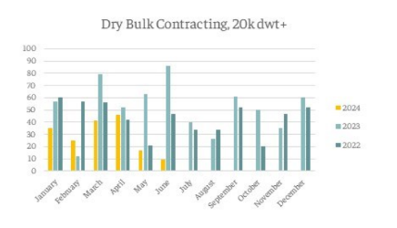
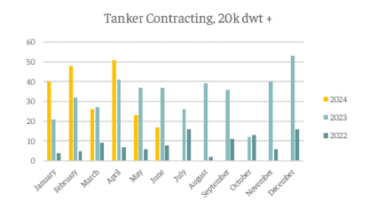

# Downward trend to the orderbook

**Date:** June 19, 2024  
**Publisher:** Breakwave Advisors | **Category:** Market Insights  
**Original URL:** [https://www.breakwaveadvisors.com/insights/2024/6/19/downward-trend-to-the-orderbook](https://www.breakwaveadvisors.com/insights/2024/6/19/downward-trend-to-the-orderbook)  

---

*By*[*Fotis Kanatas*](https://www.linkedin.com/in/fotis-kanatas/)

As we edge closer to the end of the first half of 2024, we have seen a downward trend in regard to the vessels that have been added to the orderbook. In May, only 40 vessels of the two main sectors, dry bulk and tankers have been contracted, the lowest since October 2022. At the time of writing, the orderbook for tankers is 640 vessels or 11% of the fleet, while for bulkers, it is 1,192 or 9.5% of the fleet.

Currently, the orderbook is in good shape, and bigger sized vessels are enjoying a very small Orderbook-to-Fleet ratio, with both VLCCs and Capes at 6%, and the majority of vessels scheduled for delivery in 2026 and later. Focusing on the bigger vessels, owners ordered 29 Capesize vessels so far in 2024, with orders for the whole 2023 and 2022 being 40 and 43 respectively, and with six months to go. This correlates with increased earnings this year, as 2024 is one of the strong years for dry bulk. More specifically, Capesize TCE averaged $24,300/day in Q1, and $22,200/day Q2, rates that can be compared to those in 2021, when the 2nd half of the year was significantly strong. Interestingly, owners at the time ordered a total of 88 Capesize vessel, with 60 of them in the first half of the year. It shows that owners not only order new vessels in the midst of elevated earnings but also when they believe that strong markets are ahead.

In the case of VLCCs, as we mentioned earlier, orderbook is at 6%, which has prompted owners to order more and more vessels. This year, a total of 37 VLCCs have been contracted, which is higher than what has been ordered in 2023 (18) and 2022 (16) combined. Again, the driver for increased contracting activity is increased earnings. So far in 2024, VLCC TCE averaged $45,400/day in Q1 and $42,500/day in Q2. Such earnings fall outside seasonal patterns and are again the main driving force of newbuilding activity.

On a general picture, we can see that dry bulk contracting has been lagging compared the two previous years, and only Capesize vessels have been somewhat above the previous two years, while in the other two mainstream sectors, Ultramax and Kamsarmax, vessel orders are significantly lower when considering the same periods. On tankers, data suggests that the increased contracting has been fueled by VLCCs and MRs.

> **Figure 1: Στιγμιότυπο Οθόνης 2024 06 19 104422**  
> **Interactive Data & Source:** [Intermodal](https://www.intermodal.gr/) | [Local Asset](file:///C:/Users/Dell/Github/Shipping/corpus/03-breakwave/insights/2024/assets/2024-06-19_downward-trend-to-the-orderbook_img_cea3cf84ceb9ceb3cebcceb9cf8ccf84cf85_c9c7478c3160.png)

> **Figure 2: Στιγμιότυπο Οθόνης 2024 06 19 104440**  
> **Interactive Data & Source:** [Intermodal](https://www.intermodal.gr/) | [Local Asset](file:///C:/Users/Dell/Github/Shipping/corpus/03-breakwave/insights/2024/assets/2024-06-19_downward-trend-to-the-orderbook_img_cea3cf84ceb9ceb3cebcceb9cf8ccf84cf85_23e5d5507013.png)

As far as the future is concerned, it is interesting to see whether owners will decide to splash the cash on new vessels that are now being contracted for 2027 and onwards delivery, or they will decide to refrain from newbuilding in an effort to keep supply muted and continue enjoy increased returns.

Data Source:[Intermodal](https://www.intermodal.gr/)

---

**Tags:** Tankers, Drybulk, Shipping  
