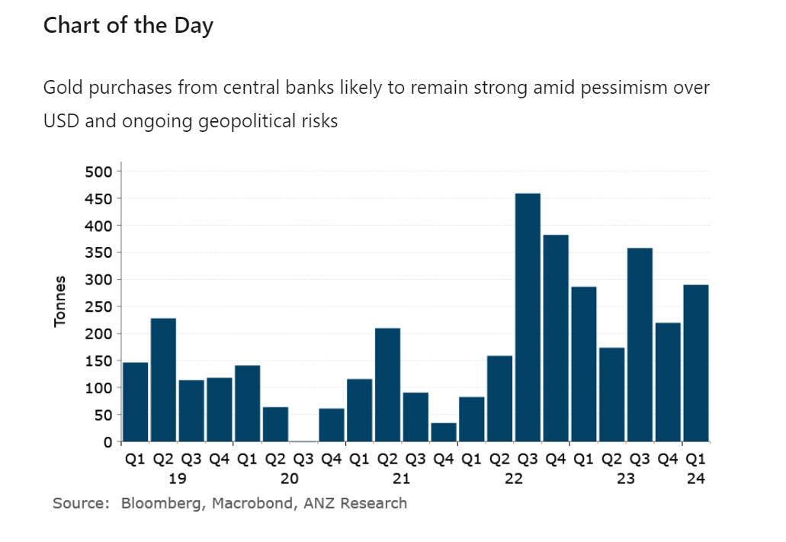

# Risk-on tone across markets boosts sentiment

**Date:** June 19, 2024  
**Publisher:** Breakwave Advisors | **Category:** Market Insights  
**Original URL:** [https://www.breakwaveadvisors.com/insights/2024/6/19/fvl4v1lwo25dt8hr1p8l31ptr8ojdk](https://www.breakwaveadvisors.com/insights/2024/6/19/fvl4v1lwo25dt8hr1p8l31ptr8ojdk)  

---

Markets remained well supported by the prospect of easing monetary policy. This helped reverse earlier losses on signs of weak demand.

*By*[*Daniel Hynes*](https://www.linkedin.com/in/dahynes/)

### Market Commentary

A broader risk-on tone across global markets helped push**crude oil**prices higher. Mixed economic data in the US boosted bets that the Federal Reserve will cut rates sooner rather than later. US industrial production increased in May; however, retail sales barely rose. This led to further gains in equity markets, which helped boost sentiment across the commodities complex. The market is shrugging of signs of softness in demand. China’s refining activity is slowing, with the Asian nation processing 14.31mb/d of crude in May, 1.8% lower than a year ago. In India, gasoline sales dropped 3.6% m/m over the first 16 days of June. Investors have instead been encouraged by rising time spreads in recent sessions. Brent crude’s spot premium over 2-month futures closed at its highest level since April, indicating near term strength in physical markets. In Europe, diesel’s premium over crude oil, known as the crack spread, has risen to a two-month high of USD21/bbl.

**European gas**prices edged higher as traders contemplate the impact of intense heatwaves on demand. Forecasts of warmer than usual weather across part of Europe over the next two weeks are raising concerns of tightening supplies. However, the gains were muted amid easing supply side issues. The region’s storage facilities remain awash with gas. Norwegian flows are normalising following unplanned outages earlier this month. Concerns of stronger demand are also driving**North Asian LNG**prices higher. Hotter than normal temperatures are being forecast for Japan over the next month, according to Bloomberg data. Extreme temperatures in India are also forcing that country to rely on more LNG imports to ease power shortages.

**Copper**was under pressure early in the session following signs of demand weakness. Stockpiles of the red metal in warehouses tracked by the London Metal Exchange jumped the most in nine months. Deliveries into warehouses in South Korea and Taiwan were particularly strong. This has been triggered by rare large-scale exports from China after a deterioration in demand in the spot market. Data released earlier this week underscored the patch performance of its economy. Growth in industrial production fell to 5.6% y/y in May. However, retail sales rose for the first time since November. Copper reversed these losses to end the session higher amid the broader risk-on tone across markets. This was aided by more reports of supply side issues. Production at Anglo American’s Los Bronces copper mine in Chile will fall around 30% next year due to plant maintenance.

**Gold**pushed higher on more bets of a rate cut in the US. The weak retail sales figure for May pointed to greater financial strain among consumers. Fed Bank of NY President John Williams said the US economy is moving in the right direction but declined to say when he would favour a rate cut. Sentiment was also boosted by a report suggesting further strength in central bank buying. A World Gold Council survey said that 29% of central bank respondents will raise their bullion holdings in the next 12 months.

**Iron ore**futures gained on better steel demand. The China Iron and Steel Association reported that daily crude steel output of its member mills in early June rose from late May.

> **Figure 1: Στιγμιότυπο Οθόνης 2024 06 19 102937**  
> **Interactive Data & Source:** [Linkedin](https://www.linkedin.com/newsletters/commodities-wrap-6692196755876012032/?fbclid=IwAR3kiXJqZdxmp9ZcRwBNI7FsBySI-XSC0pfPur1qzjt7OZp7PTE59Tsl1QI) | [Local Asset](file:///C:/Users/Dell/Github/Shipping/corpus/03-breakwave/insights/2024/assets/2024-06-19_fvl4v1lwo25dt8hr1p8l31ptr8ojdk_img_cea3cf84ceb9ceb3cebcceb9cf8ccf84cf85_51e0b10dd5ae.png)

Data source:[Commodities Wrap](https://www.linkedin.com/newsletters/commodities-wrap-6692196755876012032/?fbclid=IwAR3kiXJqZdxmp9ZcRwBNI7FsBySI-XSC0pfPur1qzjt7OZp7PTE59Tsl1QI)

---

**Tags:** Economy, Markets, Commodities  
