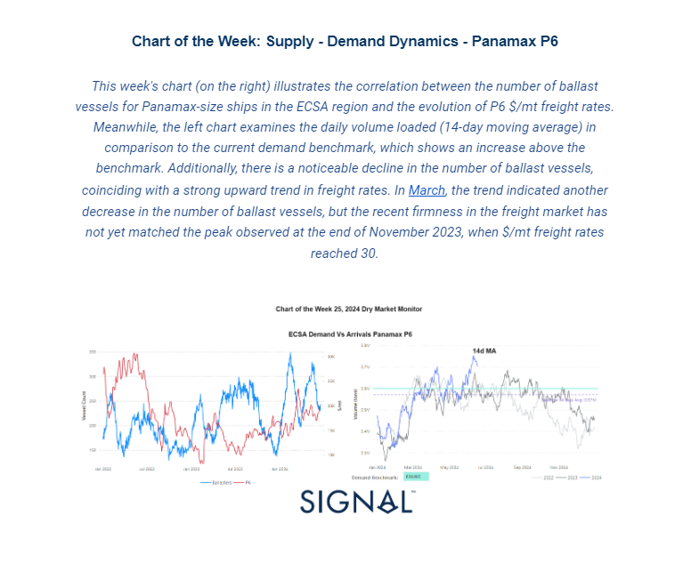
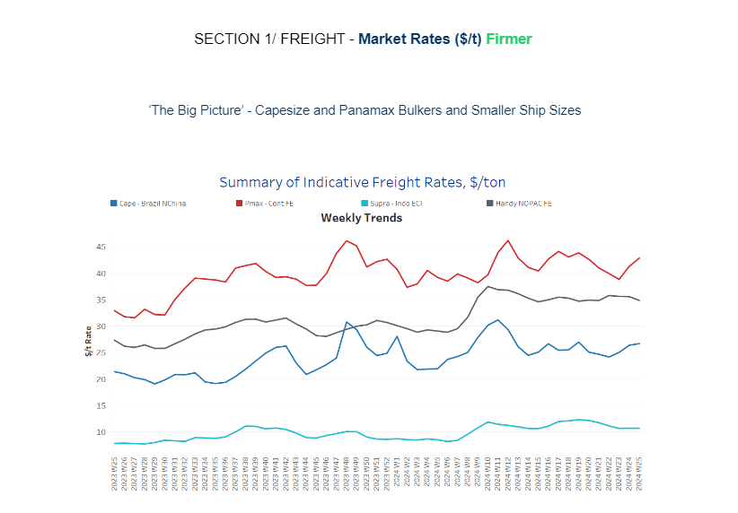
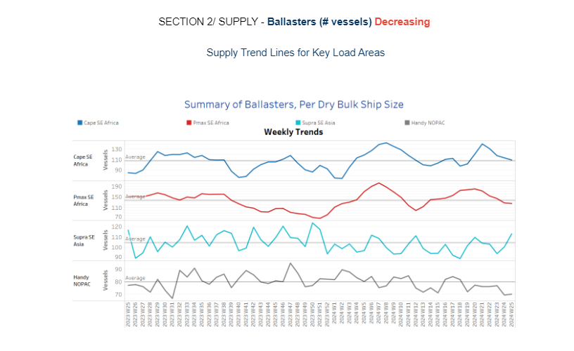
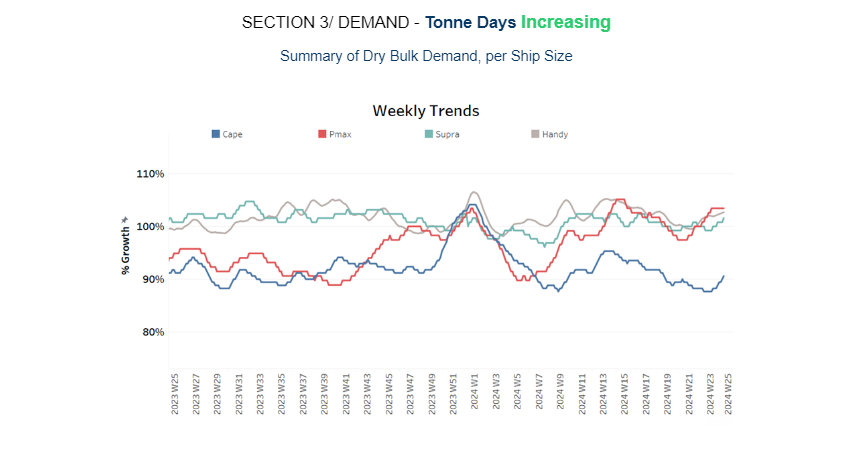
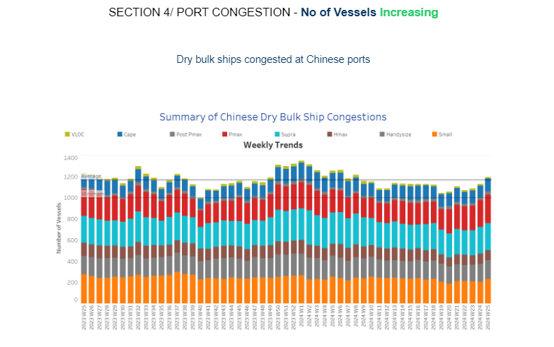

# Supply - Demand Dynamics

**Date:** June 20, 2024  
**Publisher:** Breakwave Advisors | **Category:** Market Insights  
**Original URL:** [https://www.breakwaveadvisors.com/insights/2024/6/20/supply-demand-dynamics](https://www.breakwaveadvisors.com/insights/2024/6/20/supply-demand-dynamics)  

---

**Dry Weekly Market Monitor - Week 25.2024**
Snapshot of Spot Freight Rates, Supply-Demand Trends, Port Congestions
June 19, 2024

> **Figure 1: Στιγμιότυπο Οθόνης 2024 06 20 122301**  
> **Interactive Data & Source:** [Signal Ocean Platform](https://go.signalocean.com/e/983831/-ore-giants-facing-challenges-/2q9pzb/417801414/h/EV5ZJLMXwMgMnukLj7h1uPAqUlLOD4d-aEWiIIB2URc) | [Local Asset](file:///C:/Users/Dell/Github/Shipping/corpus/03-breakwave/insights/2024/assets/2024-06-20_supply-demand-dynamics_img_cea3cf84ceb9ceb3cebcceb9cf8ccf84cf85_a6c6be4f48e4.png)

In the third week of June, significant developments are observed in the Capesize vessel rates on the Brazil to North China route, as well as in the Panamax Cont FE routes, indicating a stronger momentum for larger vessel size segments as we approach the end of the month. Specifically, the Panamax P6 route in ECSA shows promising signs for the firming of freight rates in the coming days, supported by a notable decrease in the number of ballast vessels from their peaks in mid-February and before mid-March. Looking ahead, June appears poised to conclude with an upward trend in the growth of dry bulk demand tonne days. If this trend continues, it could lead to higher vessel employment utilisation in both the Atlantic and Pacific markets, setting the stage for a potentially robust July.

On the macro side, Chinese economic development continues to disappoint with its indicators for the future steel and iron ore demand needs. Iron ore futures prices declined on Monday following disappointing economic data from China, amidst ongoing challenges like floods and high temperatures affecting near-term demand prospects. The most actively traded September iron ore contract on China’s Dalian Commodity Exchange (DCE) closed daytime trading 1.63% lower at 813 yuan ($112.05) per metric ton. Meanwhile, the benchmark July iron ore contract on the Singapore Exchange, SZZFN4, fell 2.51% to $104.8 per ton as of 0710 GMT.

Market sentiment was notably impacted by weaker-than-expected data from China's property sector, which is a major consumer of steel. Despite intensified efforts by policymakers to bolster the struggling sector and boost consumer confidence, property investment in China dropped by 10.1% in the first five months of 2024 compared to a year earlier, following a 9.8% decline in January-April, according to statistics bureau data. The combination of these factors contributed to a downturn in iron ore prices, reflecting market concerns over the economic outlook and demand conditions in China. The[major iron ore producers](https://go.signalocean.com/e/983831/-ore-giants-facing-challenges-/2q9pzb/417801414/h/EV5ZJLMXwMgMnukLj7h1uPAqUlLOD4d-aEWiIIB2URc)listed on the ASX 200—BHP Group (ASX: BHP), Rio Tinto (ASX: RIO), and Fortescue Metals Group (ASX: FMG)—are currently navigating the repercussions of an economic deceleration in China.

> **Figure 2: Στιγμιότυπο Οθόνης 2024 06 20 122402**  
> **Interactive Data & Source:** [Signal Ocean Platform](https://www.thesignalgroup.com/signal-ocean-platform) | [Local Asset](file:///C:/Users/Dell/Github/Shipping/corpus/03-breakwave/insights/2024/assets/2024-06-20_supply-demand-dynamics_img_cea3cf84ceb9ceb3cebcceb9cf8ccf84cf85_28d508cf0bc5.png)

In the third week of June, the Capesize Brazil to North China route showed signs of gaining strength, while Panamax Cont FE freight rates reversed course and began to climb. The sustainability of this momentum is yet uncertain, amid indications of declining ballast vessel numbers and an accelerated growth in tonne days expected by month-end.

- **Capesize**vessel freight rates shipments from Brazil to North China are now at around $27 per ton, marking a 27% annual increase.
- **Panamax**vessel freight rates from the Continent to the Far East rose above $ 40 per ton. Recent data indicate a 27% surge compared to the rates observed a year ago.
- **Supramax**vessel freight rates on the Indo-ECI route held levels around $11 per ton over the last four weeks, marking a 36% increase compared to a comparable week from a year ago.
- **Handysize**freight rates for the NOPAC Far East route have maintained stability, echoing the sentiment of the past five weeks, holding steady at around $35 per ton. This represents a significant 30% increase compared to rates observed a year ago.

> **Figure 3: Στιγμιότυπο Οθόνης 2024 06 20 122625**  
> **Interactive Data & Source:** [Signal Ocean Platform](https://www.thesignalgroup.com/signal-ocean-platform) | [Local Asset](file:///C:/Users/Dell/Github/Shipping/corpus/03-breakwave/insights/2024/assets/2024-06-20_supply-demand-dynamics_img_cea3cf84ceb9ceb3cebcceb9cf8ccf84cf85_24a501ff1f0a.png)

In the third week of June, there was a continued decrease in the number of ballast ships across all vessel size segments, except for indications of an increase in the Supramax segment in Southeast Asia.

- **Capesize SE Africa**: The number of ballast ships has dropped to nearly the annual average of 107, marking a decrease of approximately 40 from the peak observed nearly four weeks ago.
- **Panamax SE Africa**: The number of ballast ships has fallen below the annual average to 125, approximately 10 vessels fewer than the annual average and about 55 vessels lower than the peak observed in week 20.
- **Supramax SE Asia**: The count of ballast ships has risen to above 110, signaling the first signs of an immediate increase before the end of the month compared to the low recorded in week 23.
- **Handysize NOPAC**: Since the end of week 17, the count of ballast ships has consistently remained below the annual average of 80, with the past two weeks seeing levels decrease to around 70.

> **Figure 4: Στιγμιότυπο Οθόνης 2024 06 20 122742**  
> **Interactive Data & Source:** [Signal Ocean Platform](https://www.thesignalgroup.com/signal-ocean-platform) | [Local Asset](file:///C:/Users/Dell/Github/Shipping/corpus/03-breakwave/insights/2024/assets/2024-06-20_supply-demand-dynamics_img_cea3cf84ceb9ceb3cebcceb9cf8ccf84cf85_51e6859ed191.png)

In the third week of June, the outlook for dry tonne days began to show signs of an upward trend, building on the momentum observed at the end of the first half of the year.

- **Capesize**: The latest estimates in tonne day growth spark optimism for the end of June, marking the first upward trend after consecutive weekly decreases since the last peak observed at the end of week 13.
- **Panamax**: Last week's indications of a reversal in the decline of tonne-day growth have been strongly confirmed at the start of the third week of June. The upward trend over the past two weeks has not only persisted but has also surpassed the low point observed in week 20.
- **Supramax**: The growth rate has begun to show the first signs of an upward trend, improving from the low point observed at the end of week 21.
- **Handysize**: The upward trend is also evident in the handysize vessel segment, which has seen a growth rate recording a higher weekly percentage increase compared to the supramax segment.

> **Figure 5: Στιγμιότυπο Οθόνης 2024 06 20 122852**  
> **Interactive Data & Source:** [Signal Ocean Platform](https://www.thesignalgroup.com/signal-ocean-platform) | [Local Asset](file:///C:/Users/Dell/Github/Shipping/corpus/03-breakwave/insights/2024/assets/2024-06-20_supply-demand-dynamics_img_cea3cf84ceb9ceb3cebcceb9cf8ccf84cf85_09675d312f2c.png)

The upward trend observed in the first half of June has continued into the start of the third week, as Chinese dry bulk congestion continues to rise significantly across all vessel size segments.

- **Capesize**: Capesize ship congestion increased to 120, marking a rise of nearly 10 compared to the levels observed the previous week.
- **Panamax**: The number of Panamax vessels continued to increase, surpassing 260 and approaching 270, which is almost 20 more than the previous week.
- **Supramax**: Congestion levels showed signs of surpassing the 260 mark in the last week, ultimately settling just below 260, with a tendency to increase further in the coming days of June.
- **Handysize**: Congestion levels maintained a similar upward trend from the previous week, reaching around 180, which marks an increase of 10 compared to the previous week.

Data Source:[Signal Ocean Platform](https://www.thesignalgroup.com/signal-ocean-platform)

---

**Tags:** Drybulk, Shipping, Capesize  
