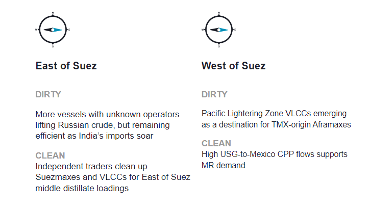
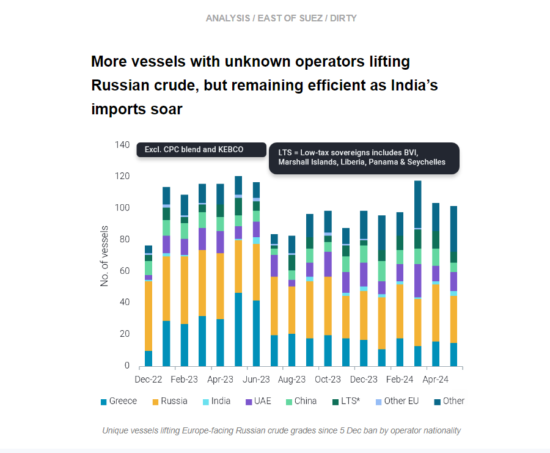
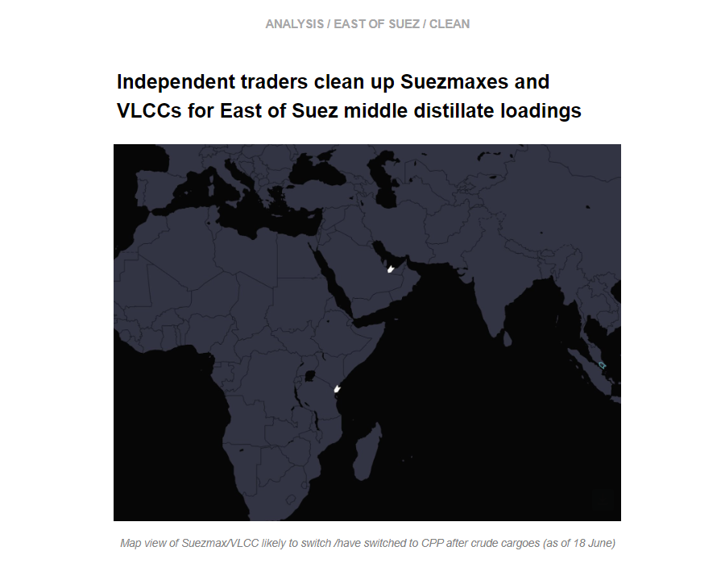
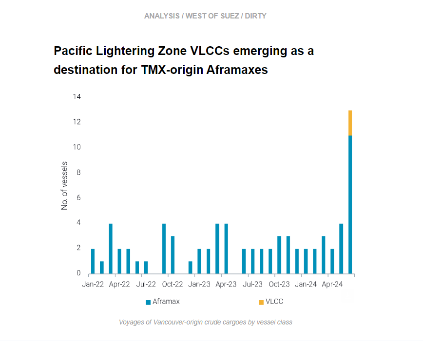
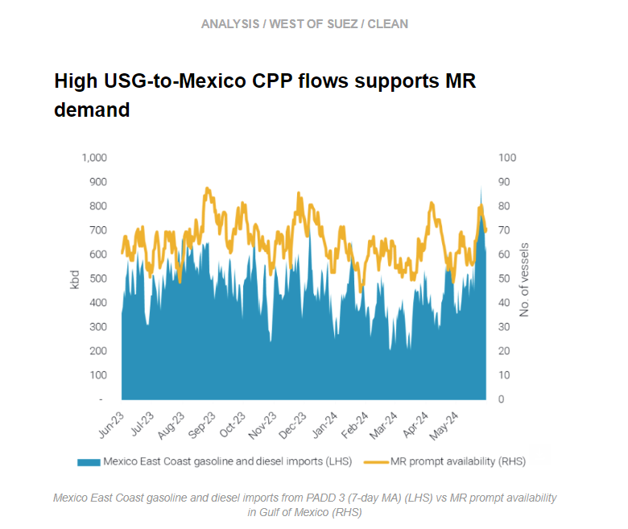

# VLCC and Suezmaxes cleaning up

**Date:** June 20, 2024  
**Publisher:** Breakwave Advisors | **Category:** Market Insights  
**Original URL:** [https://www.breakwaveadvisors.com/insights/2024/6/20/vlcc-and-suezmaxes-cleaning-up](https://www.breakwaveadvisors.com/insights/2024/6/20/vlcc-and-suezmaxes-cleaning-up)  

---

This week, in the East, we provide an update on the fleet trading Russian crude, and we discuss why a VLCC and some Suezmaxes have cleaned up. In the West, we investigate a new route emerging for TMX cargoes on Aframaxes. On the clean side, we explore Mexico’s increasing CPP demand and what this means for MRs in the US Gulf.

*By*[*Mary Melton*](https://www.linkedin.com/search/results/all/?fetchDeterministicClustersOnly=true&heroEntityKey=urn%3Ali%3Afsd_profile%3AACoAABXVyecBtg-pRnIrZe0BoWk0ygPiUfbvhsw&keywords=mary%20melton&origin=RICH_QUERY_SUGGESTION&position=0&searchId=40e8d7d2-c4d0-4022-81e7-176f6eba418b&sid=H_Y&spellCorrectionEnabled=false)

> **Figure 1: Στιγμιότυπο Οθόνης 2024 06 20 114929**  
> **Interactive Data & Source:** [Marketingmail Vortexa](https://marketingmail.vortexa.com/ODM3LU1aRS01NzgAAAGTz6mTInM6dQU9uX1nrQfvWUhbPxQm77mMW1CJN4zXEXF7jvu4pTbzh806WK-UEIn3-JEw__s=) | [Local Asset](file:///C:/Users/Dell/Github/Shipping/corpus/03-breakwave/insights/2024/assets/2024-06-20_vlcc-and-suezmaxes-cleaning-up_img_cea3cf84ceb9ceb3cebcceb9cf8ccf84cf85_2cb1bea49bfa.png)

> **Figure 2: Στιγμιότυπο Οθόνης 2024 06 20 114951**  
> **Interactive Data & Source:** [Marketingmail Vortexa](https://marketingmail.vortexa.com/ODM3LU1aRS01NzgAAAGTz6mTInM6dQU9uX1nrQfvWUhbPxQm77mMW1CJN4zXEXF7jvu4pTbzh806WK-UEIn3-JEw__s=) | [Local Asset](file:///C:/Users/Dell/Github/Shipping/corpus/03-breakwave/insights/2024/assets/2024-06-20_vlcc-and-suezmaxes-cleaning-up_img_cea3cf84ceb9ceb3cebcceb9cf8ccf84cf85_a5dca3df6cd7.png)

- As the EU weighs up further sanctions on Sovcomflot-linked vessels (Bloomberg) and the UK announced sanctions on individual vessels and the insurer Ingosstrakh, it is likely Western operators will continue to be deterred from participating in the Russian crude trade.

- We investigated the composition of the fleet lifting Russian European crude grades subject to the price cap (excl. Russian Far East). In the month of May, vessels linked to UAE operators declined, while the number linked to European operators remains consistently low. The share of vessels with operators linked to Russia remained high at around 30%. A notable change in May was the large increase in the number of vessels with unknown or newly-formed operating entities, which points to further separation between the fleet trading in Russia and the ‘mainstream’ trades. These vessels are likely not engaging with Western P&I, which demonstrates how the price cap mechanism has kept vessels away from western services while still enabling Russia to export its crude. Furthermore, preliminary data for June (days 1-20) shows[India’s imports of Russian crude](https://marketingmail.vortexa.com/ODM3LU1aRS01NzgAAAGTz6mTInM6dQU9uX1nrQfvWUhbPxQm77mMW1CJN4zXEXF7jvu4pTbzh806WK-UEIn3-JEw__s=)at an all-time high.
- The high middle-distillate yields and the attractive discounts of Russian Urals continue to make it desirable for Indian refiners. However, India increased its exposure to Russia Far East grades (Sokol, ESPO blend) in May.[Imports of these grades](https://marketingmail.vortexa.com/ODM3LU1aRS01NzgAAAGTz6mTJD_Ty5vemtkfLdPHp2sm8d3mWLrksgPVDMVlLgmkekjlVesRecBacUUXIjvkF3wOCl0=)almost doubled m-o-m, but still only accounted for about 8% of India’s total Russian crude imports. Most of India’s Russian crude imports come from Russian European grades, so the logistics could become more difficult if the sanctioning impetus continues in the West. However, the fleet remaining in the trade continues to demonstrate very high efficiency in keeping Russian crude exports at current levels.

> **Figure 3: Στιγμιότυπο Οθόνης 2024 06 20 115146**  
> **Interactive Data & Source:** [Marketingmail Vortexa](https://marketingmail.vortexa.com/ODM3LU1aRS01NzgAAAGTz6mTIyFTCarC9glKswOt4yBwjfrcf3Ygku51jtXEQz6RjzApO-ogHzyzFvx9_HCTaPhAFsI=) | [Local Asset](file:///C:/Users/Dell/Github/Shipping/corpus/03-breakwave/insights/2024/assets/2024-06-20_vlcc-and-suezmaxes-cleaning-up_img_cea3cf84ceb9ceb3cebcceb9cf8ccf84cf85_0bbe675e789b.png)

- Suezmaxes and lately at least one VLCC have entered a cleaning up phase to carry middle distillates from the East of Suez, predominantly Middle East and India West Coast. This is reportedly performed by trading houses in an effort to raise profitability by leveraging economies of scale​.

- The Red Sea attacks and in turn the rerouting via Cape of Good Hope has resulted in considerable volatility on East to West LR rates, which are hovering at multi-year highs​. Conversely, crude tanker rates are showing more stability, whilst VLCC freight rates are continuing their declining trajectory - currently at the lowest levels so far in 2024​.
- According to our data, there[are two Suezmaxes and one VLCC](https://marketingmail.vortexa.com/ODM3LU1aRS01NzgAAAGTz6mTIyFTCarC9glKswOt4yBwjfrcf3Ygku51jtXEQz6RjzApO-ogHzyzFvx9_HCTaPhAFsI=)which are likely or have already switched to CPP cargoes, with reports stating the prospect of an additional two (one VLCC currently acting as an FSO and a Suezmax)​. Despite this development,[declining prompt availability for LRs](https://marketingmail.vortexa.com/ODM3LU1aRS01NzgAAAGTz6mTI6ga42Da1e0TCrq06IoKAGxsYiVJzjlk84iviiFpG7E6UWRAm2Gz333Lx1OhnY4kFsY=)could provide support to the East-to-West LR2 rates.

> **Figure 4: Στιγμιότυπο Οθόνης 2024 06 20 115312**  
> **Interactive Data & Source:** [Marketingmail Vortexa](https://marketingmail.vortexa.com/ODM3LU1aRS01NzgAAAGTz6mTInDBXtQgu6utx5aYlU0XToeCWvXbVrwRN_BltDrmEpjeKyoI2fFZGVd3R87ZYh9AR_g=) | [Local Asset](file:///C:/Users/Dell/Github/Shipping/corpus/03-breakwave/insights/2024/assets/2024-06-20_vlcc-and-suezmaxes-cleaning-up_img_cea3cf84ceb9ceb3cebcceb9cf8ccf84cf85_0698d504bcdf.png)

- As part of our ongoing coverage of the freight dynamics around TMX, we have now observed an interesting development utilising a new vessel class.

- Though the majority of exports are going to the US West Coast via a direct Aframax voyage,[a smaller number of tankers](https://marketingmail.vortexa.com/ODM3LU1aRS01NzgAAAGTz6mTInDBXtQgu6utx5aYlU0XToeCWvXbVrwRN_BltDrmEpjeKyoI2fFZGVd3R87ZYh9AR_g=)so far have departed for a direct voyage Vancouver-to-Asia. In the last two weeks, we observed[three Aframaxes](https://marketingmail.vortexa.com/ODM3LU1aRS01NzgAAAGTz6mTI-7yZDQgCoC8fP2wzuO8fF8QpQ6gEnkqvDAPYa9v9SCDsKP5T_Pqet5BxRdVY8-D-vM=)which have loaded a Vancouver-origin cargo onto[two different VLCCs](https://marketingmail.vortexa.com/ODM3LU1aRS01NzgAAAGTz6mTI2tI394FWAa2oDBKKX0PZztK9rFwX0gtVSajBHc10OM5g7Y1_vzhWwPVUxWo-zBl_rY=)at the Pacific Lightering Zone (PLZ) offshore California.
- With VLCC rates at 2024 lows ([TD3C](https://marketingmail.vortexa.com/ODM3LU1aRS01NzgAAAGTz6mTI97Ont6j_FkyDHiniuN8R4QSF5HfsTg3CyBVdp3Y_ikTVJUEQNR8ZVMXGNm6Vr_IpPI=),[TD22](https://marketingmail.vortexa.com/ODM3LU1aRS01NzgAAAGTz6mTIjwVAVRfauOCXDl-RY5HLOIfV_ZxkYgwssFWneWOErGQyzSjsqLXZVu0SklcPkJjV_c=)), the prospect of continued utilisation of this pathway for Vancouver exports will likely prove attractive to charterers to take advantage of economies of scale. This also saves on the likely expensive freight for a direct voyage for an Aframax Vancouver-to-Asia, which has limited backhaul opportunities. For one of the vessels, the Vancouver-origin cargo was a smaller coload along with other crude grades. This demonstrates the flexibility of a relatively short voyage from Vancouver to PLZ, which also enables the Aframax to easily return to Vancouver and load again.

> **Figure 5: Στιγμιότυπο Οθόνης 2024 06 20 115423**  
> **Interactive Data & Source:** [Marketingmail Vortexa](https://marketingmail.vortexa.com/ODM3LU1aRS01NzgAAAGTz6mTI9M9jAiRtDvrR23QV7mY_NSSUp7w-MuBWRfZhy3W5m9R4SvpKfmu6kAVDd7MIhBFEZY=) | [Local Asset](file:///C:/Users/Dell/Github/Shipping/corpus/03-breakwave/insights/2024/assets/2024-06-20_vlcc-and-suezmaxes-cleaning-up_img_cea3cf84ceb9ceb3cebcceb9cf8ccf84cf85_b38e7e684b14.png)

- Gasoline and diesel imports into Mexico’s East Coast from PADD 3 are set to reach a historical high as of June 17, 2024 according to current data indicators, providing relief for USGC refiners, whose[seaborne exports](https://marketingmail.vortexa.com/ODM3LU1aRS01NzgAAAGTz6mTI9M9jAiRtDvrR23QV7mY_NSSUp7w-MuBWRfZhy3W5m9R4SvpKfmu6kAVDd7MIhBFEZY=)have grown 40% higher May-June 2024 compared to y-o-y volumes amid declining export markets and logistical constraints.

- Mexican refineries started the year with relatively strong utilisation rates, which brought gasoline and diesel import demand to[multiyear lows of 320kbd](https://marketingmail.vortexa.com/ODM3LU1aRS01NzgAAAGTz6mTIpPex5lFdpeVM6RiQFVF-J9KRxn2lIMhhhbxAl7RKRtdmUxcev-INM0G-I4gI0WdkEY=). Recently, unplanned outages and[high MR availability](https://marketingmail.vortexa.com/ODM3LU1aRS01NzgAAAGTz6mTIwm7145XLLHCiZ3ogvpMMeToBjSet-NpKpQ0Vgmfidp8zo64iBjGGk8LIeJ1I1QC7cQ=)caused low freight rates in the USG and inspired a pick up of seaborne imports from PADD 3 to meet demand requirements.
- Looking forward, as PADD 1 weekly gasoline stocks continue to build on a weekly basis and US demand looks to be falling behind for gasoline during the summer driving season, we could see continued upside in exports out of PADD 3 as refiners return from maintenance. This said, if[fewer vessels make their way to PADD 1 from Europe](https://marketingmail.vortexa.com/ODM3LU1aRS01NzgAAAGTz6mTJLYvAJTaCRNqdm8WmTjoPt_H3-ynLE5zgTIFmnlZJT_qYqXPEFvmNAgXa1Rb4wkwA6Q=), we could also see a drop in MR availability, which could provide further support to freight rates for US Gulf MRs.

Data Source:[Vortexa](https://www.vortexa.com//oil-gas-data-traders-analysts-data-scientists?gclid=Cj0KCQjw8_qRBhCXARIsAE2AtRZKOvMnbilZ_6_91d7huSFFy71pWLrnPwGwOHVzXsmsG-1a1mZnQw8aAt89EALw_wcB&hsa_acc=1782073842&hsa_ad=548425387665&hsa_cam=14746637662&hsa_grp=125038601902&hsa_kw=&hsa_mt=&hsa_net=adwords&hsa_src=g&hsa_tgt=dsa-1431852288425&hsa_ver=3&utm_campaign=%5BCD%5D%20-%20DSA%20-%20EMEA&utm_medium=cpc&utm_medium=ppc&utm_source=google&utm_source=adwords&utm_term=)

---

**Tags:** Shipping, Crude Oil, Tankers  
