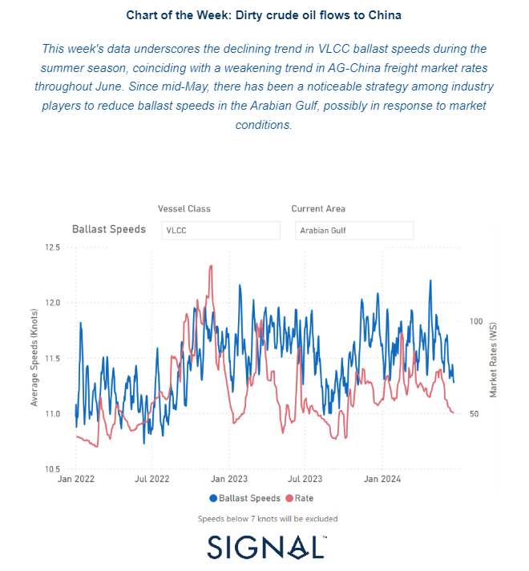
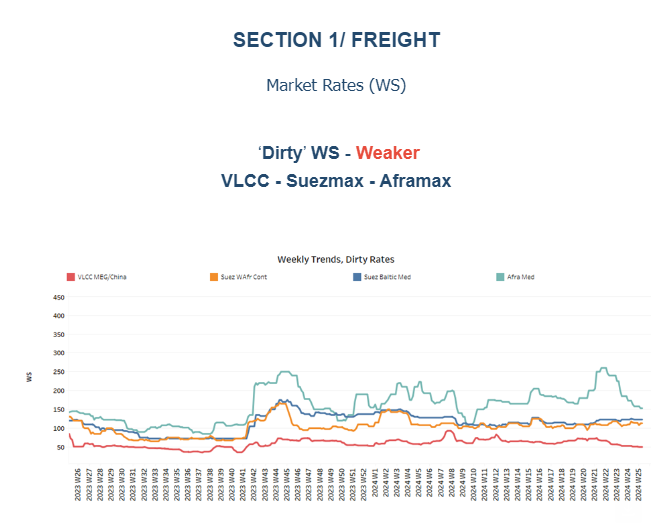
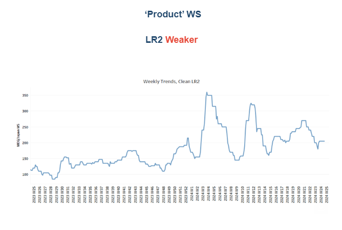
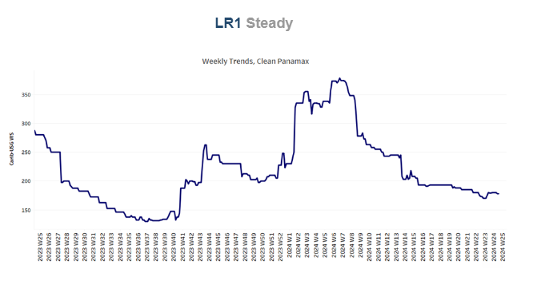
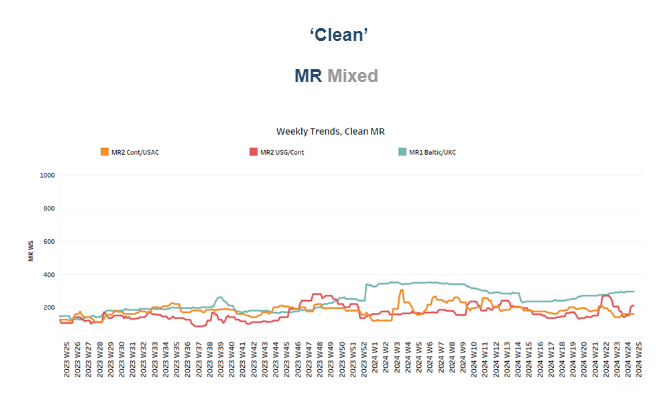
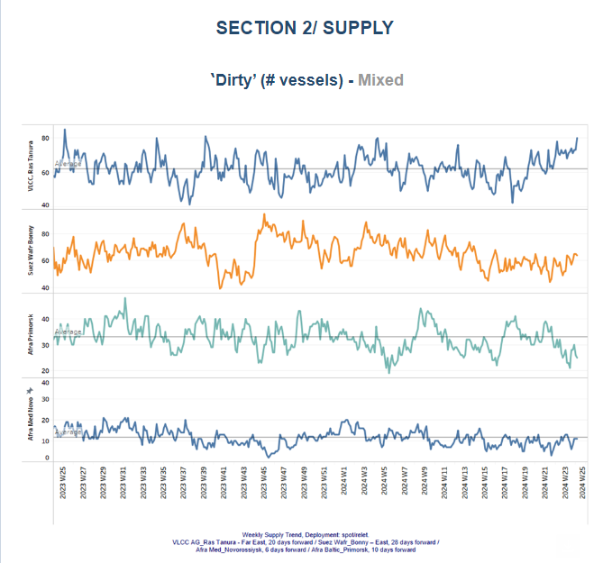
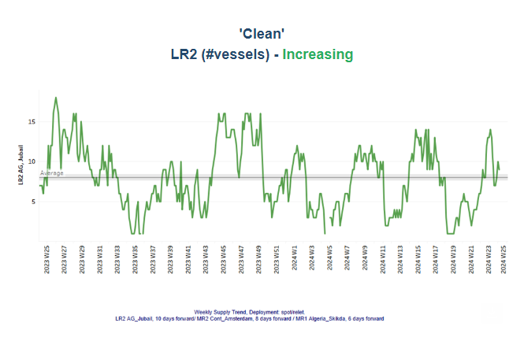
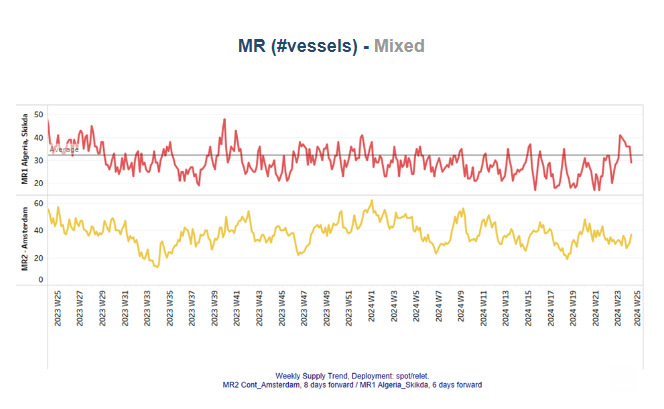
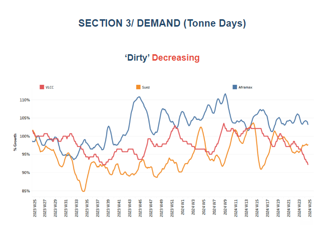
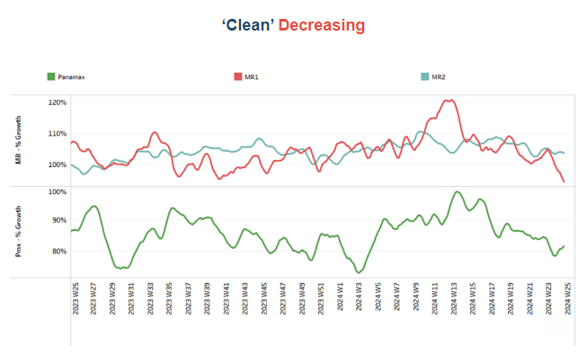

# Declining trend in VLCC ballast speeds

**Date:** June 21, 2024  
**Publisher:** Breakwave Advisors | **Category:** Market Insights  
**Original URL:** [https://www.breakwaveadvisors.com/insights/2024/6/21/declining-trend-in-vlcc-ballast-speeds](https://www.breakwaveadvisors.com/insights/2024/6/21/declining-trend-in-vlcc-ballast-speeds)  

---

## Tanker - Weekly Market Monitor

Snapshot of Crude and Product Freight Rates, Supply-Demand

Week 25, June 20, 2024

> **Figure 1: Στιγμιότυπο Οθόνης 2024 06 21 093229**  
> **Interactive Data & Source:** [Signal Ocean Platform](https://go.signalocean.com/e/983831/lish-On-Chinas-Oil-Demand-html/2q9tkx/418339965/h/7DhfYMNKlisROvppwUf0822OJFAQOiOcd7BS3jw4Myo) | [Local Asset](file:///C:/Users/Dell/Github/Shipping/corpus/03-breakwave/insights/2024/assets/2024-06-21_declining-trend-in-vlcc-ballast-speeds_img_cea3cf84ceb9ceb3cebcceb9cf8ccf84cf85_44edb064bdae.png)

As the summer season unfolds, a subdued sentiment grips the freight market, particularly evident in the VLCC MEG-China route. The number of vessels at Ras Tanura has increased approaching the end of June, yet the growth in dirty tonne days shows no signs of strengthening. Against the backdrop of a declining freight market, VLCC ballast speeds in the Arabian Gulf have decreased, indicating a cautious approach among operators. Looking ahead to the month's end, market projections suggest a continuation of this trend, with supply dynamics playing a pivotal role in shaping crude oil freight rates.

The economic performance of China, a key player in global oil demand, remains under scrutiny. Weak signals from the[Chinese economy](https://go.signalocean.com/e/983831/lish-On-Chinas-Oil-Demand-html/2q9tkx/418339965/h/7DhfYMNKlisROvppwUf0822OJFAQOiOcd7BS3jw4Myo)have contributed to concerns about oil demand, exacerbated by a decline in China's crude oil imports during the first five months of 2024 compared to the previous year. This trend underscores broader economic challenges, including a slowdown in sectors such as real estate, construction, and automobiles, which are crucial drivers of oil consumption. OPEC has maintained a relatively optimistic outlook for China's oil demand growth this year compared to other organisations, reflecting varying degrees of optimism across industry forecasts. However, the overall slowdown in China's oil demand growth highlights the complex interplay of economic factors influencing global energy markets.

> **Figure 2: Στιγμιότυπο Οθόνης 2024 06 21 093348**  
> **Interactive Data & Source:** [Signal Ocean Platform](https://www.thesignalgroup.com/signal-ocean-platform) | [Local Asset](file:///C:/Users/Dell/Github/Shipping/corpus/03-breakwave/insights/2024/assets/2024-06-21_declining-trend-in-vlcc-ballast-speeds_img_cea3cf84ceb9ceb3cebcceb9cf8ccf84cf85_176d0771cb45.png)

The end of the first half of June marked a definitive weakening trend in crude oil freight rates across several key routes. The Aframax Med route and VLCC AG-China experienced particularly notable declines, reflecting broader market dynamics influenced by factors such as fluctuating demand, geopolitical developments, and global economic conditions.

- The**VLCC**MEG-China freight rates dropped to 50WS, marking a 30% increase compared to the rates observed in the same week of June last year.
- Suezmax freight rates for shipments from**West Africa**to**continental Europe**have maintained stability at around 110 WS since the beginning of June, showing a consistent trend from the previous month. Meanwhile, rates on the**Suez Baltic Med**route have also remained steady at approximately 120 WS, reflecting a stable sentiment compared to the rates observed during the same week last year.
- Aframax**Mediterranean**freight rates are hovering around WS150, marking a 26% decrease compared to the previous month. The rates suggest a continuing trend towards further declines, with the last peak observed at the end of week 22.

> **Figure 3: Στιγμιότυπο Οθόνης 2024 06 21 093808**  
> **Interactive Data & Source:** [Signal Ocean Platform](https://www.thesignalgroup.com/signal-ocean-platform) | [Local Asset](file:///C:/Users/Dell/Github/Shipping/corpus/03-breakwave/insights/2024/assets/2024-06-21_declining-trend-in-vlcc-ballast-speeds_img_cea3cf84ceb9ceb3cebcceb9cf8ccf84cf85_2eab6adb6102.png)

- **LR2**AG freight rates have maintained levels around WS200 for the past two weeks, which is approximately 50 points lower than rates observed in mid-May but still reflects a 70% increase compared to the same week last year.

> **Figure 4: Στιγμιότυπο Οθόνης 2024 06 21 093825**  
> **Interactive Data & Source:** [Signal Ocean Platform](https://www.thesignalgroup.com/signal-ocean-platform) | [Local Asset](file:///C:/Users/Dell/Github/Shipping/corpus/03-breakwave/insights/2024/assets/2024-06-21_declining-trend-in-vlcc-ballast-speeds_img_cea3cf84ceb9ceb3cebcceb9cf8ccf84cf85_ffe386803f3b.png)

- **Panamax**Carib-to-USG rates sustained levels around WS 180 from mid May, currently standing 38% weaker than during a comparable week a year ago.

> **Figure 5: Στιγμιότυπο Οθόνης 2024 06 21 094040**  
> **Interactive Data & Source:** [Signal Ocean Platform](https://www.thesignalgroup.com/signal-ocean-platform) | [Local Asset](file:///C:/Users/Dell/Github/Shipping/corpus/03-breakwave/insights/2024/assets/2024-06-21_declining-trend-in-vlcc-ballast-speeds_img_cea3cf84ceb9ceb3cebcceb9cf8ccf84cf85_522f2c462c55.png)

- **MR1**rates for shipments from the**Baltic to the continent**have risen to nearly 300 WS, showing a 40% increase compared to levels a year ago. Meanwhile,**MR2**rates for shipments from the**continent to the USAC**have held steady at 160 WS for the second consecutive week, reflecting a 20% annual increase. On the**USG-Cont route, MR2**rates have surged above 200 WS, marking a 50% increase from the previous week.

> **Figure 6: Στιγμιότυπο Οθόνης 2024 06 21 094226**  
> **Interactive Data & Source:** [Signal Ocean Platform](https://www.thesignalgroup.com/signal-ocean-platform) | [Local Asset](file:///C:/Users/Dell/Github/Shipping/corpus/03-breakwave/insights/2024/assets/2024-06-21_declining-trend-in-vlcc-ballast-speeds_img_cea3cf84ceb9ceb3cebcceb9cf8ccf84cf85_88608756764a.png)

The supply trend for crude tankers remains mixed. The number of Aframax vessels in Primorsk has decreased, whereas the increase in VLCCs remains significantly higher than the annual average.

- **VLCC Ras Tanura**: The number of ships has risen to nearly 80, which is almost 10 more than the previous week and 20 above the annual average.
- **Suezmax Wafr**: The current ship count remains above 60 for the second consecutive week, reflecting an increase of 8 compared to levels observed two weeks ago.
- **Aframax Primorsk**: For the past three weeks, the number of ships has remained significantly lower than the annual average of 30, nearly 13 fewer than the levels recorded five weeks ago.
- **Aframax Med Novo**: Since the end of week 22, the vessel count has remained close to the annual average of 10. This trend appears likely to continue at a similar pace through the end of the month.

> **Figure 7: Στιγμιότυπο Οθόνης 2024 06 21 094443**  
> **Interactive Data & Source:** [Signal Ocean Platform](https://www.thesignalgroup.com/signal-ocean-platform) | [Local Asset](file:///C:/Users/Dell/Github/Shipping/corpus/03-breakwave/insights/2024/assets/2024-06-21_declining-trend-in-vlcc-ballast-speeds_img_cea3cf84ceb9ceb3cebcceb9cf8ccf84cf85_ba69958a6339.png)

> **Figure 8: Στιγμιότυπο Οθόνης 2024 06 21 094456**  
> **Interactive Data & Source:** [Signal Ocean Platform](https://www.thesignalgroup.com/signal-ocean-platform) | [Local Asset](file:///C:/Users/Dell/Github/Shipping/corpus/03-breakwave/insights/2024/assets/2024-06-21_declining-trend-in-vlcc-ballast-speeds_img_cea3cf84ceb9ceb3cebcceb9cf8ccf84cf85_9ca35e173858.png)

- **Clean LR2 AG Jubail**: The upward trend in the number of vessels observed in the second week of June continued steadily, with the count reaching 9. The lowest point was recorded in week 18.
- **Clean MR**: Vessel activity for MR1 at Algeria's Skikda port dropped to 29, nearly 3 below the annual average, and almost 10 below the peak observed two weeks ago. In contrast, MR2 activity in Amsterdam has shown intense volatility over the past four weeks, recently reaching 37, nearly 8 more than the previous week.

> **Figure 9: Στιγμιότυπο Οθόνης 2024 06 21 094652**  
> **Interactive Data & Source:** [Signal Ocean Platform](https://www.thesignalgroup.com/signal-ocean-platform) | [Local Asset](file:///C:/Users/Dell/Github/Shipping/corpus/03-breakwave/insights/2024/assets/2024-06-21_declining-trend-in-vlcc-ballast-speeds_img_cea3cf84ceb9ceb3cebcceb9cf8ccf84cf85_94ff617ec826.png)

- **Dirty**tonne days: The decrease in the growth of VLCC tonne days persisted for one more week before the end of June, continuing the trend of reduced activity in this segment. The subdued growth for now seems to be the prevailing pattern. Meanwhile, the Suezmax segment is showing early signs of a possible upward reversal, though confirmation of this trend is expected in the coming days as more data becomes available. In contrast, the Aframax segment presents a more complex scenario. The outlook here is characterised by high volatility, which makes it challenging to predict a definitive trend, whether upward or downward.

> **Figure 10: Στιγμιότυπο Οθόνης 2024 06 21 094707**  
> **Interactive Data & Source:** [Signal Ocean Platform](https://www.thesignalgroup.com/signal-ocean-platform) | [Local Asset](file:///C:/Users/Dell/Github/Shipping/corpus/03-breakwave/insights/2024/assets/2024-06-21_declining-trend-in-vlcc-ballast-speeds_img_cea3cf84ceb9ceb3cebcceb9cf8ccf84cf85_f29f763e5ac9.png)

- **Panamax**tonne days: The growth pace in June showed signs of a downward trend over the previous two weeks. However, there now appears to be a reversal, with growth picking up and firming compared to the low observed at the end of week 23. For**Clean****MR**tonne days, the MR1 vessel has experienced a significant decline over the past three weeks, with no signs of an imminent reversal. The last peak for MR1 was observed in weeks 17 and 18. In contrast, the growth of tonne days for MR2 vessels maintained a relatively flat momentum throughout June.

Data Source:[Signal Ocean Platform](https://www.thesignalgroup.com/signal-ocean-platform)

---

**Tags:** Shipping, Tankers, Crude  
