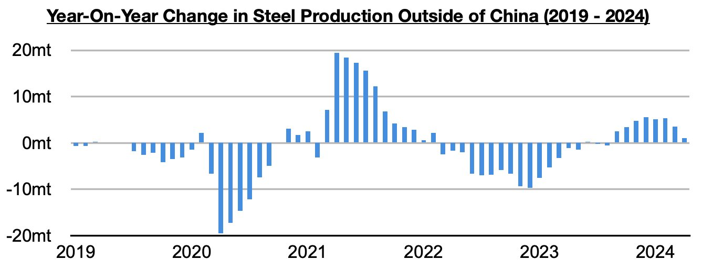
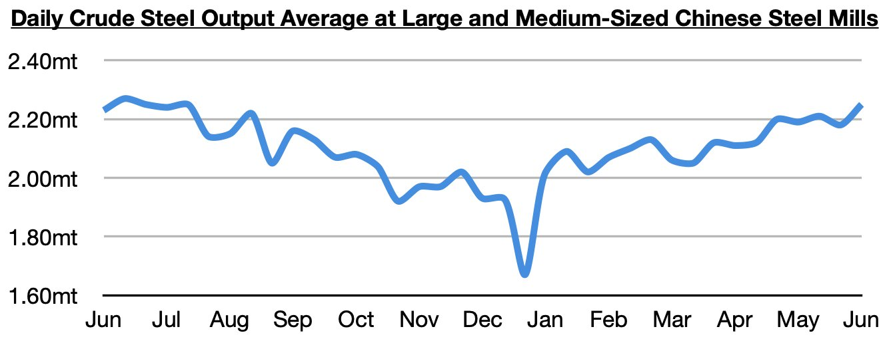
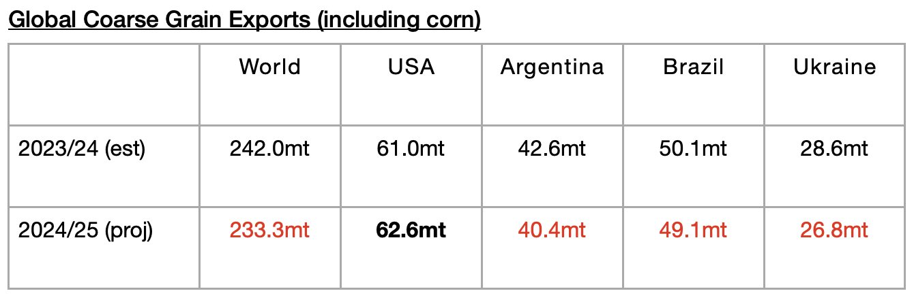
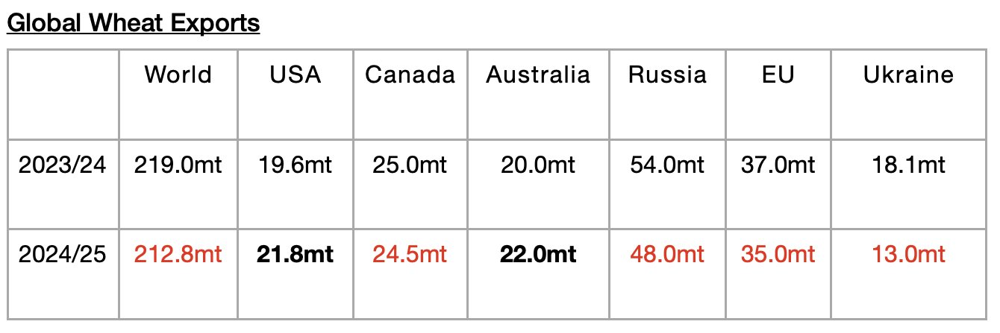

# More Headwinds Appearing For Dry Bulk Market

**Date:** June 21, 2024  
**Publisher:** Breakwave Advisors | **Category:** Market Insights  
**Original URL:** [https://www.breakwaveadvisors.com/insights/2024/6/21/pbem9g3dlump0vlwezuuwygmwbdanr](https://www.breakwaveadvisors.com/insights/2024/6/21/pbem9g3dlump0vlwezuuwygmwbdanr)  

---

*By*[*Jeffrey Landsberg*](https://www.linkedin.com/in/jeffrey-landsberg-70ab957/)

Dry bulk rates were mixed last week, with panamax and supramax rates rising while capesize and handysize rates declined. Those declines were small, though, and overall rates still remain at healthy levels across the board. Much bigger news to come out last week is that China’s steel production has climbed even further, is now at the**highest level seen since July**, and is continuing to maintain a small amount of year-on-year growth. As we have continued to stress in Commodore Research's Weekly Dry Bulk Reports and Weekly China Reports, strong manufacturing output in China this year has been contributing to significant steel consumption and, along with robust steel export volume, continues to support China’s steel production. Steel prices fell again last week, however, and the strength in China’s steel production remains fragile.

> **Figure 1: Chart 1**  
> [Local Asset](file:///C:/Users/Dell/Github/Shipping/corpus/03-breakwave/insights/2024/assets/2024-06-21_pbem9g3dlump0vlwezuuwygmwbdanr_img_chart1_5a189ef6df58.jpg)

As we also have been stressing recently in our Weekly Dry Bulk Reports, we continue to believe that this year’s return of growth in steel production outside of China also remains fragile (due to the ongoing surge in Chinese steel exports and weakness in the global economy).

> **Figure 2: Chart 2**  
> [Local Asset](file:///C:/Users/Dell/Github/Shipping/corpus/03-breakwave/insights/2024/assets/2024-06-21_pbem9g3dlump0vlwezuuwygmwbdanr_img_chart2_4eb3bba0fad0.jpg)

Also new and troubling looking forward is that grain export volume is now expected to enter a contraction again as well. In our most recent Weekly Dry Bulk Report, we discussed how global coarse grain, wheat, soybean, and soymeal exports in 2024/25 are now collectively expected to total 700.9 million tons. This is 2.7 million tons less than was predicted a month ago and would mark a year-on-year decline of 4 million tons (-1%) from the 704.9 million tons that is now expected for 2023/24. As we had been stressing in our Weekly Dry Bulk Reports, global grain export volume in 2024/25 was previously expected to rise on a year-on-year basis, but now a contraction is expected.

Coarse grain will continue to serve as the dry bulk market’s largest volume grain cargo, but for 2024/25 a contraction is expected.

> **Figure 3: Chart 3**  
> [Local Asset](file:///C:/Users/Dell/Github/Shipping/corpus/03-breakwave/insights/2024/assets/2024-06-21_pbem9g3dlump0vlwezuuwygmwbdanr_img_chart3_8552dd063b56.jpg)

Global wheat exports are also now expected to contract on a year-on-year basis.

> **Figure 4: Chart 4**  
> [Local Asset](file:///C:/Users/Dell/Github/Shipping/corpus/03-breakwave/insights/2024/assets/2024-06-21_pbem9g3dlump0vlwezuuwygmwbdanr_img_chart4_898c24bfdfc5.jpg)

---

**Tags:** China, Drybulk, Economy  
