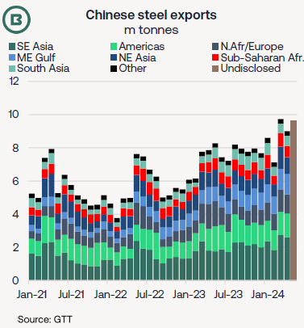
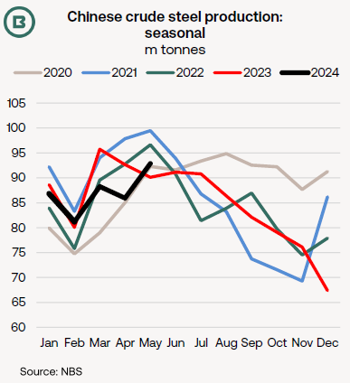
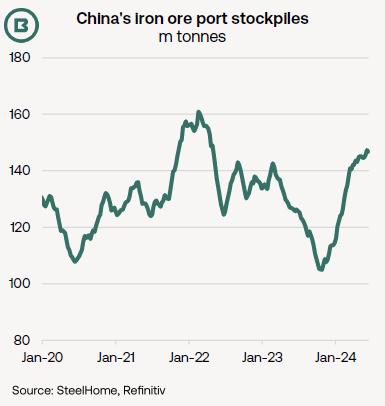

# The Big Picture: Global steel trades and China’s steel sector

**Date:** June 21, 2024  
**Publisher:** Breakwave Advisors | **Category:** Market Insights  
**Original URL:** [https://www.breakwaveadvisors.com/insights/2024/6/21/the-big-picture-global-steel-trades-and-chinas-steel-sector](https://www.breakwaveadvisors.com/insights/2024/6/21/the-big-picture-global-steel-trades-and-chinas-steel-sector)  

---

- *China’s steel exports surged 23% in January-May to 44.6m tonnes, raising China’s share of global seaborne trade and putting exports on course for their strongest year since 2016.*
- *China’s export expansion has been the dominant feature of global steel trade over the past 2-3 years—as exports from other sources either stagnate or decline.*
- *We ask if this trend can continue and report on the latest signals from China’s steel sector.*

**The last major surge in Chinese steel exports**was in 2015-16, during industrial recession. At the time, trade was equivalent to 31% of global steel output, but by 2022, the percentage had shrunk below 23%, World Steel Association data show.

That share is rising again: the chart below shows that, with production stable on an annual basis, steel exports advanced to the highest levels since 2016.

Without providing detail, China’s National Development and Reform Commission has alluded there will be**controls on 2024 steel output at a national level**. This would involve**restrictions on exports of low value-added steel products**involving high energy usage in production, according to McCloskey.

This**could mark the start of a retreat**from current historically high levels and underlines the**importance of steel trade policies to bulker demand**—both in terms of protectionism by importers and the Chinese government’s attitude to exports.

Some of China’s export growth has been at the expense of other suppliers.

**Indian**steel exports to South East Asia, for example, dwindled from 2.5m tonnes in 2021 to 0.5m tonnes in 2023. With domestic demand robust, India emerged as a net steel importer in the year ending March (with imports at 8.3m tonnes and exports at 7.5m tonnes).

The 38% yearly import jump is causing Indian steel mills concern, given**protectionist measures in Brazil, Chile and the US against Chinese steel**this year.

> **Figure 1: Market Chart 1**  
> [Local Asset](file:///C:/Users/Dell/Github/Shipping/corpus/03-breakwave/insights/2024/assets/2024-06-21_the-big-picture-global-steel-trades-and-chinas-steel-sector_img_image0_139b029ebddd.png)

For the 1H 2024 Braemar anticipates that, while China’s steel exports are on track for at least 53m tonnes (more than 20% higher YoY), combined exports from 12 other leading suppliers will be around 72-74m tonnes (minus intra-EU trades), resulting in more modest, yet positive, growth in the region of 3%.

**China’s export reach has worked to the benefit of ship demand**. As the chart above demonstrates, it is not simply a case of South East Asia absorbing surplus steel from China, but also one of**longer-haul trade growth**to more distant markets.

Volumes have increased from China into the**Americas**(shown in light green), the**Middle East**(light blue), as well as**North Africa/Europe**(grey). Combined, monthly arrivals into these regions rose from 1.8m tonnes in April 2022 to almost 4m tonnes two years later.

Apart from the lack of steel demand recovery in Europe for at least the next six months, the EU’s Cross Border Adjustment Mechanism (**CBAM**) could put steel imports into the EU at a serious cost disadvantage from 2026.

Currently in its “transitional phase”, the CBAM will apply to iron and steel (and other carbon-intensive products) entering the EU. From 2026 buyers will be required to report all carbon emissions embedded in imports, then buy and sell CBAM certificates to “ensure the carbon price of imports is equivalent to the carbon price of domestic production”.

### What Are the Latest Indications From China’s Steel Sector?

Both hot rolled coil (HRC) and rebar steel prices close to the lows of the last three years, there appears to have been little boost from the Q2 construction season. May was a comparatively strong month for crude steel output though.

> **Figure 2: Market Chart 2**  
> [Local Asset](file:///C:/Users/Dell/Github/Shipping/corpus/03-breakwave/insights/2024/assets/2024-06-21_the-big-picture-global-steel-trades-and-chinas-steel-sector_img_image1_1aa1659d4b65.png)

Some**production controls could keep the second half of 2024 in line with recent seasonal patterns**.

In Fujian province, where crude steel output in January-May surged 17.5% to 16.5m tonnes (albeit less than 4% of the national total), local government has circulated output quotas and details of monitoring methods to local steel mills, industry reports claim. This would imply a cut of approximately 4m tonnes through the rest of the year to comply.

Moreover, it has been rumoured in industry media that 15-17m tonnes of cuts are planned in the main producing province, Hebei, plus another 2m tonnes in Shanxi.

**China’s apparent steel consumption**(which takes into account net exports, but ignores changes in inventory etc.) was**down nearly -5% in the first five months of 2024**and followed contraction of -2.3% in 2023.

The threat to ship demand from less iron ore demand could be compounded by**port stockbuild**. SteelHome data put national iron ore port inventory above 146m tonnes on 14 June, marking a two-year high and a.

> **Figure 3: Sizable Net Gain of 40m Tonnes in the Past Eight Months**  
> [Local Asset](file:///C:/Users/Dell/Github/Shipping/corpus/03-breakwave/insights/2024/assets/2024-06-21_the-big-picture-global-steel-trades-and-chinas-steel-sector_img_image2_545e387b06f2.png)

Despite some apparent negatives,**three steel-related Chinese trades have performed well in 2023-24**: (1) steel exports, (2) iron ore imports and (3) coking coal imports.

Although increasing ferrous scrap use in steel production has been a policy goal,**iron ore and coking coal demand has found support from a lack of progress in scrap collection**.

Current delivered prices of $105-110/t for 62% Fe iron ore in China and $245-250/t for FOB Australia coking coal suggest scrap will again struggle to make inroads in the near term.

Efforts to**support housing markets**, plus demand from**manufacturing**and**infrastructure**sectors form the most likely demand drivers.

---

**Tags:** Drybulk, China, Iron Ore  
