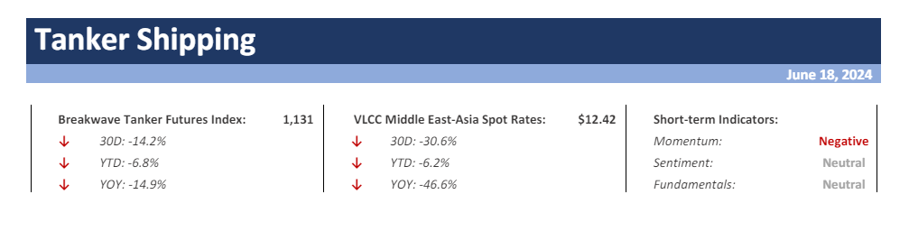

# Weekly Insights Review

**Date:** June 21, 2024  
**Publisher:** Breakwave Advisors | **Category:** Market Insights  
**Original URL:** [https://www.breakwaveadvisors.com/insights/2024/6/21/weekly-insights-review](https://www.breakwaveadvisors.com/insights/2024/6/21/weekly-insights-review)  

---

## Welcome to Our Weekly Insights Review

## Read Here Everything You Need to Know

## Breakwave Tanker Report

**The VLCC Market Remains under Persistent Downward Pressure Amid Oversupply, Reduced Demand**– As we move into the second half of June and the final stretch of the first half of the year,**renewed downward pressure**is again the main dynamic for the**VLCC market**with sluggish performance in both the Atlantic and Pacific basins.

> **Figure 1: Στιγμιότυπο Οθόνης 2024 06 18 104500**  
> **Interactive Data & Source:** [Breakwave Advisors Market Insights](https://www.breakwaveadvisors.com/insights/2024/6/17/global-economy-appears-to-be-stabilizing-in-early-2024) | [Local Asset](file:///C:/Users/Dell/Github/Shipping/corpus/03-breakwave/insights/2024/assets/2024-06-21_weekly-insights-review_img_cea3cf84ceb9ceb3cebcceb9cf8ccf84cf85_d8836552a97e.png)

> **Figure 2: Read More**  
> **Interactive Data & Source:** [Breakwave Advisors Market Insights](https://www.breakwaveadvisors.com/insights/2024/6/17/global-economy-appears-to-be-stabilizing-in-early-2024) | [Local Asset](file:///C:/Users/Dell/Github/Shipping/corpus/03-breakwave/insights/2024/assets/2024-06-21_weekly-insights-review_img_image-asset28129_90b611a5af4d.jpeg)

## Global Economy Appears to Be Stabilizing in Early 2024

Doric Weekly Market Insight

Global trade growth is expected to recover to 2.5 percent in the current year, showing improvement from the previous year but still significantly below the average rates observed in the two decades before the pandemic.

> **Figure 3: Market Chart 3**  
> **Interactive Data & Source:** [Breakwave Advisors Market Insights](https://www.breakwaveadvisors.com/insights/2024/6/17/z105t87t5fyej9msyorn08l8vqlgmg) | [Local Asset](file:///C:/Users/Dell/Github/Shipping/corpus/03-breakwave/insights/2024/assets/2024-06-21_weekly-insights-review_img_image-asset_94446043cb1c.jpeg)

## India's Coal-Derived Electricity Generation Has Set Another Record As Predicted

From Commodore's Weekly Dry Bulk Reports

India produced approximately 144.4 billion kilowatt hours of electricity last month. This is up month-on-month by 8.6 billion kilowatt hours (6%), up year-on-year by 17.8 billion kilowatt hours (14%), and is a record.

[Read More](https://www.breakwaveadvisors.com/insights/2024/6/17/z105t87t5fyej9msyorn08l8vqlgmg)

> **Figure 4: Market Chart 4**  
> **Interactive Data & Source:** [Breakwave Advisors Market Insights](https://www.breakwaveadvisors.com/insights/2024/6/18/headwinds-for-capesizes) | [Local Asset](file:///C:/Users/Dell/Github/Shipping/corpus/03-breakwave/insights/2024/assets/2024-06-21_weekly-insights-review_img_image-asset28229_ac46e114851d.jpeg)

## Headwinds for Capesizes

The Fix - Global Market Update

The mid-sized dry bulk segments propelled the Baltic Dry Index higher last week, while the capesizes faced headwinds amid weaker demand.

[Read More](https://www.breakwaveadvisors.com/insights/2024/6/18/headwinds-for-capesizes)

> **Figure 5: Market Chart 5**  
> **Interactive Data & Source:** [Breakwave Advisors Market Insights](https://www.breakwaveadvisors.com/insights/2024/6/19/fvl4v1lwo25dt8hr1p8l31ptr8ojdk) | [Local Asset](file:///C:/Users/Dell/Github/Shipping/corpus/03-breakwave/insights/2024/assets/2024-06-21_weekly-insights-review_img_image-asset28329_600e358521ba.jpeg)

## Risk-On Tone Across Markets Boosts Sentiment

Commodities Wrap

Markets remained well supported by the prospect of easing monetary policy. This helped reverse earlier losses on signs of weak demand.

> **Figure 6: Market Chart 6**  
> **Interactive Data & Source:** [Breakwave Advisors Market Insights](https://www.breakwaveadvisors.com/insights/2024/6/19/downward-trend-to-the-orderbook) | [Local Asset](file:///C:/Users/Dell/Github/Shipping/corpus/03-breakwave/insights/2024/assets/2024-06-21_weekly-insights-review_img_image-asset28429_1204c66eb899.jpeg)

## Downward Trend to the Orderbook

Intermodal Weekly Market Report

As we edge closer to the end of the first half of 2024, we have seen a downward trend in regard to the vessels that have been added to the orderbook.

> **Figure 7: Istock 485480338**  
> **Interactive Data & Source:** [Breakwave Advisors Market Insights](https://www.breakwaveadvisors.com/insights/2024/6/20/the-long-view) | [Local Asset](file:///C:/Users/Dell/Github/Shipping/corpus/03-breakwave/insights/2024/assets/2024-06-21_weekly-insights-review_img_istock-485480338_e8cd5e92a0e9.jpg)

## The Long View

Gibson Tanker Market Report

Oil demand will peak this decade, that is the call by the International Energy Agency (IEA) who released their Oil 2024 report this week.

> **Figure 8: Market Chart 8**  
> **Interactive Data & Source:** [Breakwave Advisors Market Insights](https://www.breakwaveadvisors.com/insights/2024/6/20/vlcc-and-suezmaxes-cleaning-up) | [Local Asset](file:///C:/Users/Dell/Github/Shipping/corpus/03-breakwave/insights/2024/assets/2024-06-21_weekly-insights-review_img_image-asset28529_41e988be1c44.jpeg)

## VLCC and Suezmaxes Cleaning Up

Vortexa Freight Weekly

This week, in the East, we provide an update on the fleet trading Russian crude, and we discuss why a VLCC and some Suezmaxes have cleaned up.

[Read More](https://www.breakwaveadvisors.com/insights/2024/6/20/vlcc-and-suezmaxes-cleaning-up)

> **Figure 9: Market Chart 9**  
> **Interactive Data & Source:** [Breakwave Advisors Market Insights](https://www.breakwaveadvisors.com/insights/2024/6/20/supply-demand-dynamics) | [Local Asset](file:///C:/Users/Dell/Github/Shipping/corpus/03-breakwave/insights/2024/assets/2024-06-21_weekly-insights-review_img_image-asset28629_41d89ce57514.jpeg)

## Supply - Demand Dynamics

Signal Ocean - Dry Weekly Market Monitor

In the third week of June, significant developments are observed in the Capesize vessel rates on the Brazil to North China route, as well as in the Panamax Cont FE routes, indicating a stronger momentum for larger vessel size segments as we approach the end of the month.

> **Figure 10: Market Chart 10**  
> **Interactive Data & Source:** [Breakwave Advisors Market Insights](https://www.breakwaveadvisors.com/insights/2024/6/21/pbem9g3dlump0vlwezuuwygmwbdanr) | [Local Asset](file:///C:/Users/Dell/Github/Shipping/corpus/03-breakwave/insights/2024/assets/2024-06-21_weekly-insights-review_img_image-asset28729_c5fc802115b3.jpeg)

## More Headwinds Appearing for Dry Bulk Market

From Commodore's Weekly Dry Bulk Reports

Dry bulk rates were mixed last week, with panamax and supramax rates rising while capesize and handysize rates declined.

> **Figure 11: Market Chart 11**  
> **Interactive Data & Source:** [Breakwave Advisors Market Insights](https://www.breakwaveadvisors.com/insights/2024/6/21/the-big-picture-global-steel-trades-and-chinas-steel-sector) | [Local Asset](file:///C:/Users/Dell/Github/Shipping/corpus/03-breakwave/insights/2024/assets/2024-06-21_weekly-insights-review_img_image-asset28829_bb961d27f5b4.jpeg)

## The Big Picture: Global Steel Trades and China’s Steel Sector

Braemar Weekly Dry Market Report

China’s steel exports surged 23% in January-May to 44.6m tonnes, raising China’s share of global seaborne trade and putting exports on course for their strongest year since 2016..

> **Figure 12: Pexels Earl Andre Roca 530105282 16737194**  
> **Interactive Data & Source:** [Breakwave Advisors Market Insights](https://www.breakwaveadvisors.com/insights/2024/6/21/declining-trend-in-vlcc-ballast-speeds) | [Local Asset](file:///C:/Users/Dell/Github/Shipping/corpus/03-breakwave/insights/2024/assets/2024-06-21_weekly-insights-review_img_pexels-earl-andre-roca-530105282-167_1b1e4a1b171c.jpg)

## Declining Trend in VLCC Ballast Speeds

Signal Ocean - Tanker Weekly Market Monitor

As the summer season unfolds, a subdued sentiment grips the freight market, particularly evident in the VLCC MEG-China route.

---

**Tags:** Drybulk, Tankers, Economy  
