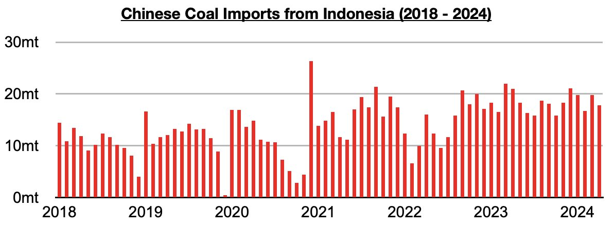
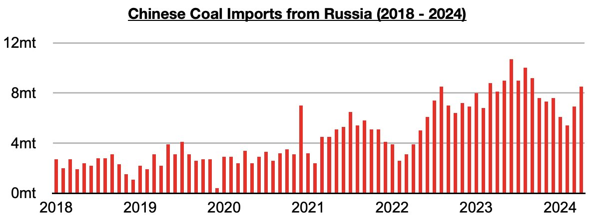
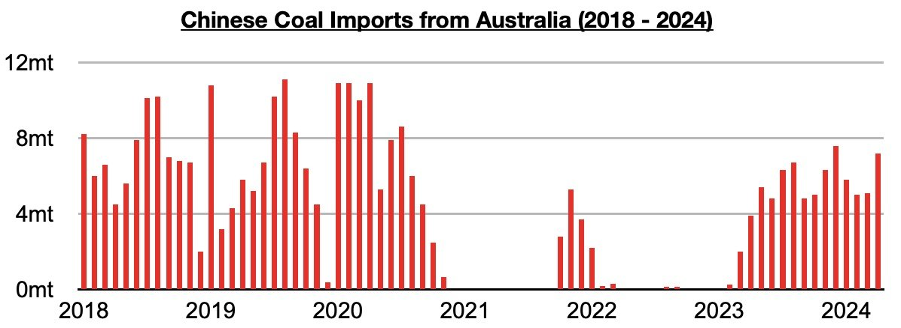
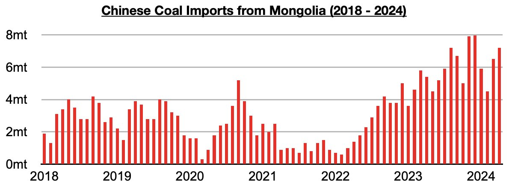

# Russia Remains China's Second Largest Source of Coal Imports

**Date:** June 24, 2024  
**Publisher:** Breakwave Advisors | **Category:** Market Insights  
**Original URL:** [https://www.breakwaveadvisors.com/insights/2024/6/24/e9gyg511s1ygafix8s6rh42bojb4wk](https://www.breakwaveadvisors.com/insights/2024/6/24/e9gyg511s1ygafix8s6rh42bojb4wk)  

---

*By*[*Jeffrey Landsberg*](https://www.linkedin.com/in/jeffrey-landsberg-70ab957/)

The most recently released nation-specific import data shows that in April China imported 17.8 million tons of coal from Indonesia. This is down from March by 2 million tons (-10%) and is down year-on-year by 3.2 million tons (-21%). Indonesia has not surprisingly remained China's primary source of coal imports.

> **Figure 1: Chart 1**  
> [Local Asset](file:///C:/Users/Dell/Github/Shipping/corpus/03-breakwave/insights/2024/assets/2024-06-24_e9gyg511s1ygafix8s6rh42bojb4wk_img_chart1_aa350f3288dd.jpg)

Imports from Russia, China’s second largest source of coal imports during the last several months, totaled 8.5 million tons. This is up from March by 1.6 million tons (23%) and is up year-on-year by 400,000 tons (5%).

> **Figure 2: Chart 2**  
> [Local Asset](file:///C:/Users/Dell/Github/Shipping/corpus/03-breakwave/insights/2024/assets/2024-06-24_e9gyg511s1ygafix8s6rh42bojb4wk_img_chart2_ed7684981940.jpg)

Imports from Australia totaled 7.2 million tons. This is up from March by 1.1 million tons (41%) and is up year-on-year by 3.3 million tons (85%). This has marked the largest amount of coal that China has imported from Australia all year.

> **Figure 3: Chart 3**  
> [Local Asset](file:///C:/Users/Dell/Github/Shipping/corpus/03-breakwave/insights/2024/assets/2024-06-24_e9gyg511s1ygafix8s6rh42bojb4wk_img_chart3_83f9a1572783.jpg)

Imports from Mongolia totaled 7.2 million tons. This is up from March by 700,000 tons (11%) and is up year-on-year by 1.8 million tons (33%).

> **Figure 4: Chart 4**  
> [Local Asset](file:///C:/Users/Dell/Github/Shipping/corpus/03-breakwave/insights/2024/assets/2024-06-24_e9gyg511s1ygafix8s6rh42bojb4wk_img_chart4_c52af3d2a685.jpg)

---

**Tags:** China, Drybulk, Economy  
