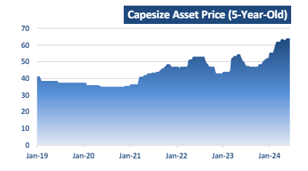
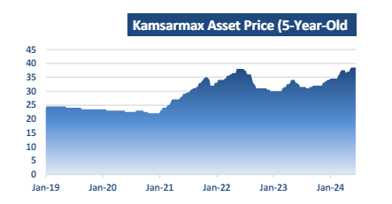
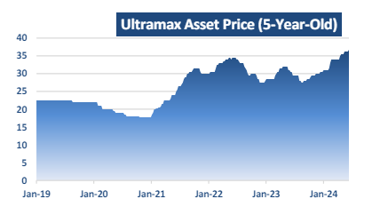
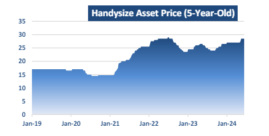

# In a positive week for the spot market

**Date:** June 24, 2024  
**Publisher:** Breakwave Advisors | **Category:** Market Insights  
**Original URL:** [https://www.breakwaveadvisors.com/insights/2024/6/24/in-a-positive-week-for-the-spot-market](https://www.breakwaveadvisors.com/insights/2024/6/24/in-a-positive-week-for-the-spot-market)  

---

*By*[*Michalis Voutsinas*](https://www.linkedin.com/in/michalis-voutsinas-587544163/)

In a positive week for the spot market, the Baltic Dry Index closed just below 2000 points today. After a soft start, the Capesize index gained momentum throughout the week, settling today at $26,059 daily, marking a 6.3 percent increase week-on-week. The Kamsarmax segment was the only one to see a decline, finishing today at $16,441 daily, lacking the vigor seen in previous weeks. Conversely, Supramax reported gains for the second consecutive week, reaching $15,382 daily this Friday. Handysize vessels also performed well, with daily rates climbing 5.8 percent higher than the previous Friday's close, reaching $13,548 daily. Reflecting on the past six months, all segments have exceeded last year's levels, surpassing market expectations.

In the first five months of the year, China imported 513.75 million tonnes of iron ore from international markets, marking a notable 7 percent increase compared to the previous year. Concurrently, iron ore exports from Brazil remained robust, contributing to Capesize vessels achieving a year-to-date average of $23,352 daily. This performance contrasts sharply with the $12,034 daily average recorded in 2023. Reflecting this robust market, asset prices have also seen significant increases; modern eco Capesizes are currently priced around $64 million, representing a 23 percent rise year-onyear. Buoyed by a strong first quarter, the largest bulk carriers have maintained an upward trajectory throughout the year.

> **Figure 1: Στιγμιότυπο Οθόνης 2024 06 24 115235**  
> **Interactive Data & Source:** [Doric](https://www.doric.gr/) | [Local Asset](file:///C:/Users/Dell/Github/Shipping/corpus/03-breakwave/insights/2024/assets/2024-06-24_in-a-positive-week-for-the-spot-market_img_cea3cf84ceb9ceb3cebcceb9cf8ccf84cf85_e5a6137803f7.png)

On the same wavelength, China imported 204.97 million tonnes of coal in the first five months of the year, marking a 12.6 percent increase compared to the same period in 2023. This growth has been primarily driven by reduced domestic output, which fell by 3.5 percent in the first four months of the year due to safety inspections in major coal-producing regions. Additionally, China's January to May soybean imports from Brazil remained strong, contributing to a yearto-date average daily rate of $15,931 for the segment, approximately $4,000 higher than the corresponding average of the previous year. In this context, modern eco Kamsarmax vessels are currently priced at $38.5 million. This reflects a 16.7 percent increase in asset prices compared to the previous year.

> **Figure 2: Στιγμιότυπο Οθόνης 2024 06 24 115257**  
> **Interactive Data & Source:** [Doric](https://www.doric.gr/) | [Local Asset](file:///C:/Users/Dell/Github/Shipping/corpus/03-breakwave/insights/2024/assets/2024-06-24_in-a-positive-week-for-the-spot-market_img_cea3cf84ceb9ceb3cebcceb9cf8ccf84cf85_586ca5c3e90d.png)

Despite early assertions from China's coal industry in April that imports were not expected to increase this year, the world's largest buyer has shown continued strong demand. China's coal imports have remained robust, underscoring its substantial appetite in the global market. Meanwhile, India's coal imports surged by 7.7 percent to 268.24 million tonnes during the financial year 2023-24, bolstered by competitive seaborne prices and anticipated growth in power demand over the summer months. On the steel trade front, China's steel exports soared by 15 percent year-on-year in May, reaching 44.66 million tonnes in the first five months of 2024. This represents a significant increase of 24.7 percent from the previous year. Against this backdrop, the Supramax segment achieved a year-to-date average of $13,914 daily, marking a 5 percent increase annually. In reference to asset prices, modern eco Ultramax vessels are currently priced at $37 million, reflecting a solid 17 percent rise compared to summer 2023 levels.

> **Figure 3: Στιγμιότυπο Οθόνης 2024 06 24 115452**  
> **Interactive Data & Source:** [Doric](https://www.doric.gr/) | [Local Asset](file:///C:/Users/Dell/Github/Shipping/corpus/03-breakwave/insights/2024/assets/2024-06-24_in-a-positive-week-for-the-spot-market_img_cea3cf84ceb9ceb3cebcceb9cf8ccf84cf85_668c19a1010e.png)

With steel trades being more active this year, other minor bulks have followed suit. Trade in minor bulks, including bauxite, increased by 2.1 percent compared to the fourth quarter of 2023 and by 7.3 percent compared to the first quarter of 2023. Minor bulk trade shows the highest correlation with global GDP growth, which has been revised upwards by all major international organizations. In this context, the Handysize segment achieved a year-to-date average of $12,471 daily, marking a 5.8 percent increase annually. Reflecting this upward trend, modern eco Handysize vessels are currently priced at $28.5 million, representing a solid 9.6 percent rise year-on-year.

> **Figure 4: Στιγμιότυπο Οθόνης 2024 06 24 115458**  
> **Interactive Data & Source:** [Doric](https://www.doric.gr/) | [Local Asset](file:///C:/Users/Dell/Github/Shipping/corpus/03-breakwave/insights/2024/assets/2024-06-24_in-a-positive-week-for-the-spot-market_img_cea3cf84ceb9ceb3cebcceb9cf8ccf84cf85_4b4868070e10.png)

Overall, the spot market has shown significant resilience and growth across all segments, with increased trading activity, robust asset prices, and enhanced market performance reflecting a strong start to the year and promising outlook for the remainder of 2024.

Data source:[Doric](https://www.doric.gr/)

---

**Tags:** Drybulk, Shipping, Economy  
