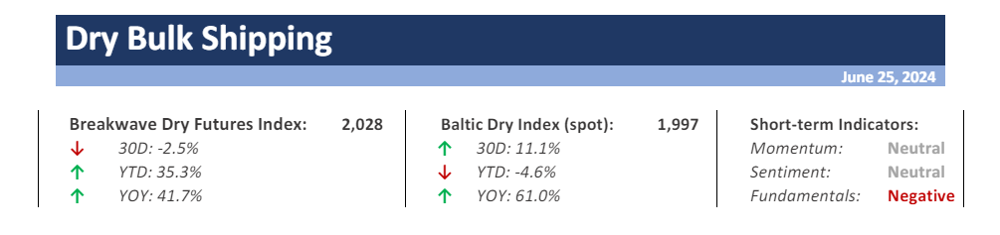
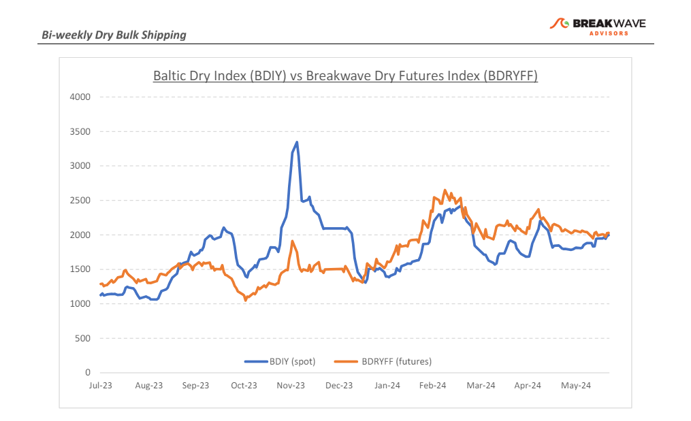
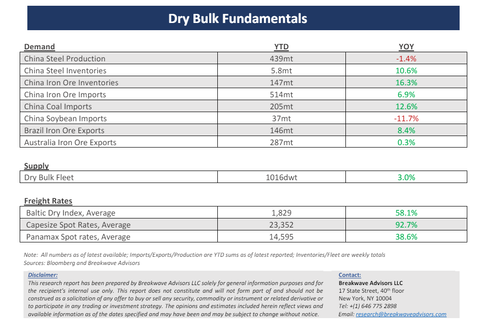

# Breakwave Bi-Weekly Dry Bulk Report - June 25, 2024

**Date:** June 25, 2024  
**Publisher:** Breakwave Advisors | **Category:** Market Insights  
**Original URL:** [https://www.breakwaveadvisors.com/insights/2024625dry-87w49](https://www.breakwaveadvisors.com/insights/2024625dry-87w49)  

---

> **Figure 1: Cea3cf84ceb9ceb3cebcceb9cf8ccf84cf85**  
> [Local Asset](file:///C:/Users/Dell/Github/Shipping/corpus/03-breakwave/insights/2024/assets/2024-06-25_2024625dry-87w49_img_cea3cf84ceb9ceb3cebcceb9cf8ccf84cf85_f0721b611ce5.png)

**· Volatility Declines as Spot Rates Remain Rangebound**– Not much has changed over the past fortnight, as Capesize spot rates hover in the mid/low-20,000s range and the**futures**curve remains relatively**flat to spot.**Such**lack of volatility**is quite**unusual**for the otherwise unstable Capesize market, but it seems the current elevated conference rates are satisfactory for both buyers and sellers. As we look into the rest of the summer, we believe we are in a**calm-before-the-storm**period as we anticipate some gradual deterioration for transportation demand as it relates to iron ore and bauxite, two of the most important drivers of Capesize cargo demand.**Iron ore**is**oversupplied**while declining prices should disincentivize producers to export more.**Bauxite**exports out of West Africa will soon decrease due to**seasonal factors**as the rainy season affects inland logistics. The combination of the above should negatively affect shipping demand for the next few months. Although**expectations remain high**across the shipping space, one should be considerate that it is the**supply and demand of ships and not sentiment**that ultimately shape earnings, and current expectations as implied by asset prices are**quite high**and, in some cases, forecast returns that did not exist even in the highs of the shipping supercycle in the 2000s. Of course, similar hopes exist outside the shipping space as well, especially in commodity-focused areas, as the**western world seems to expect a shortage of materials**, in sharp contrast to**a rather commodity-unresponsive Chinese market**. Shipping is heavily relied on China and will continue to do so, and thus it requires significant progress in the Chinese economy prior to meaningful and lasting upturn.

**· Iron Ore Remains the Achilles Heel for Dry Bulk Shipping**– Market imbalances drive trade, and once again the steelmaking material appears oversupplied in a market where demand remains subdued. Falling**iron ore prices**are once again approaching the**psychological $100/ton**mark, despite a broader commodities market that appears quite optimistic.**Breakeven levels**for many miners (especially for the marginal ton of product) are around that level, having risen considerably from pre-Covid levels due to**inflationary pressures**across the production chain. China’s**inventories**sit at**2-year highs**, steel demand will at best match last year’s rate (about 1 billion tons per year), and there is little to suggest that the significant YoY increases of the first half will repeat for the reminder for the year. In such an environment**Capesize rates remain very resilient**and only time will tell if indeed there is a tighter vessel supply element that is supporting the dry bulk market or it is just sentiment spillover from other segments the main reason for the impressive performance, the latter being a**risky proposition**for owners who are paying top dollar for secondhand vessels priced at**almost zero potential investment returns.**

**· Our Long-term View –**The last few years have been characterized by increased geopolitical uncertainty. Going forward, we expect such events to continue to affect global trade and have a meaningful impact on effective vessel supply. Combined with the potential for a multi-year cyclical rebound in China’s economic activity following the recent economic turmoil, dry bulk shipping should experience higher volatility on top of a secular tightness driven by increasing bulk commodity demand and a slower fleet growth as a result of a relatively low orderbook.

> **Figure 2: Cea3cf84ceb9ceb3cebcceb9cf8ccf84cf85**  
> [Local Asset](file:///C:/Users/Dell/Github/Shipping/corpus/03-breakwave/insights/2024/assets/2024-06-25_2024625dry-87w49_img_cea3cf84ceb9ceb3cebcceb9cf8ccf84cf85_fee99cb5ccdd.png)

> **Figure 3: Cea3cf84ceb9ceb3cebcceb9cf8ccf84cf85**  
> [Local Asset](file:///C:/Users/Dell/Github/Shipping/corpus/03-breakwave/insights/2024/assets/2024-06-25_2024625dry-87w49_img_cea3cf84ceb9ceb3cebcceb9cf8ccf84cf85_109b3722d1f2.png)

### Subscribe:
