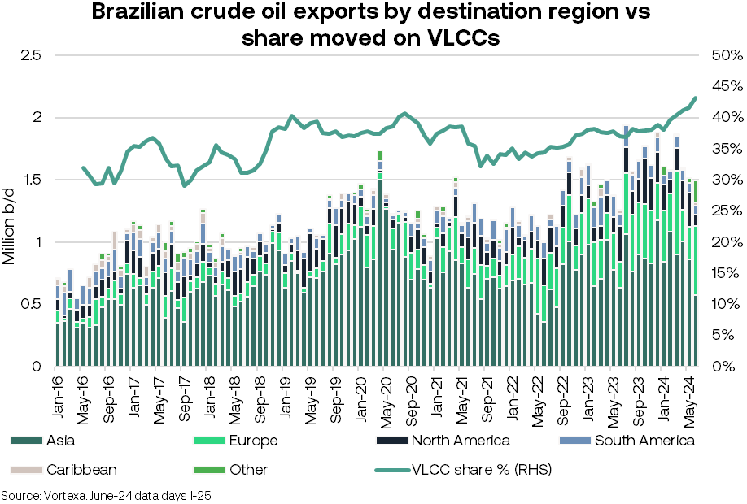

# Brazil's booming crude exports

**Date:** June 26, 2024  
**Publisher:** Breakwave Advisors | **Category:** Market Insights  
**Original URL:** [https://www.breakwaveadvisors.com/insights/2024/6/26/brazils-booming-crude-exports](https://www.breakwaveadvisors.com/insights/2024/6/26/brazils-booming-crude-exports)  

---

“A shift to Europe and rising VLCC demand”

- Since 2016, Brazilian crude oil exports have grown by nearly 1 million b/d, averaging 1.6 million b/d in 2024 so far. Most of Brazil's crude exports are destined for Asia, with China alone accounting for 40%. However, since 2022, an increasing share has been directed to Europe, compensating for the crude supplies Europe lost from Russia. Brazilian crude exports to Europe have risen by 124% since 2021, averaging 411k b/d thus far in 2024. Higher exports of Brazilian crude could help ease the medium crude supply tightness in Europe, however some of Europe’s older, less upgraded refineries may not be well suited to Brazilian grades.
- Brazil's offshore oil production has increased by 400k b/d over 2023 to reach 3.4 million b/d, according to the National Agency of Petroleum, Natural Gas, and Biofuels (ANP). Production is expected to rise by an additional 1.6 million b/d by 2030 as new projects come online. State-run Petrobras plans to bring 14 new production platforms into operation by 2028. This production growth is anticipated to far exceed domestic demand, with ANP projecting Brazil will become one of the top five global exporters of crude oil by 2030.
- Growing exports is likely to provide support for VLCCs. The percentage of exports being moved on VLCCs has increased from 32% in 2016 to 42% so far in 2024. Braemar records a 6% increase in VLCC fixtures out of Brazil in the first half of 2024 compared to the same period in 2023.

> **Figure 1: Market Chart 1**  
> [Local Asset](file:///C:/Users/Dell/Github/Shipping/corpus/03-breakwave/insights/2024/assets/2024-06-26_brazils-booming-crude-exports_img_image3_95fffc361398.png)

---

**Tags:** Tankers, Crude, Shipping  
