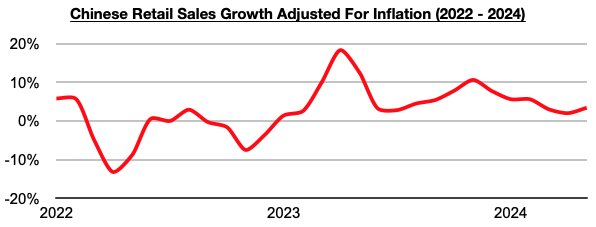
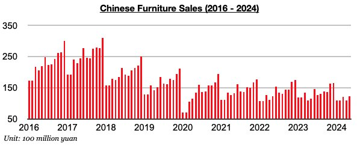
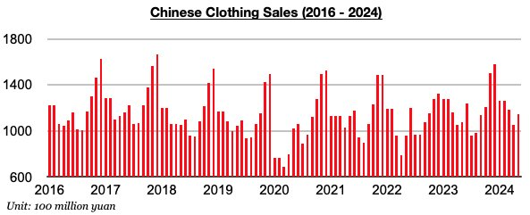
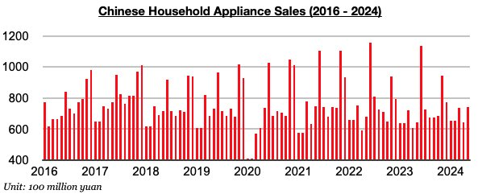

# Improvement in China's Consumer Strength

**Date:** June 27, 2024  
**Publisher:** Breakwave Advisors | **Category:** Market Insights  
**Original URL:** [https://www.breakwaveadvisors.com/insights/2024/6/27/improvement-in-chinas-consumer-strength](https://www.breakwaveadvisors.com/insights/2024/6/27/improvement-in-chinas-consumer-strength)  

---

*By*[*Jeffrey Landsberg*](https://www.linkedin.com/in/jeffrey-landsberg-70ab957/)

As we discussed in Commodore Research's most recent Weekly China Report, China’s retail sales in May grew year-on-year by 3.7% which has marked the strongest growth seen since February. Taking May’s 0.3% inflation into account, retail sales adjusted for inflation grew year-on-year by 3.4%. This has also marked the strongest growth seen since February.

> **Figure 1: Chart 1 (1)**  
> [Local Asset](file:///C:/Users/Dell/Github/Shipping/corpus/03-breakwave/insights/2024/assets/2024-06-27_improvement-in-chinas-consumer-strength_img_chart128129_52d5e681c030.jpg)

China’s retail sales growth has stayed below November’s peak, but the growth at least continues to exceed inflation (which means more goods continue to be purchased). During each of the last seventeen months, China’s retail sales growth has exceeded inflation. Prior to the last seventeen months, China’s retail sales came in lower than inflation for four straight months. Overall, it remains positive that Chinese consumers continue to buy more goods than they did a year ago. This still cannot be said about consumers in many other major economies including in the United States.

Also significant is that all three of the categories we monitor saw year-on-year growth last month, which marks a feat not seen since July 2021. Furniture sales in China in May rose year-on-year by 7%. Furniture sales have now increased on a year-on-year basis for two straight months.

> **Figure 2: Chart 2 (1)**  
> [Local Asset](file:///C:/Users/Dell/Github/Shipping/corpus/03-breakwave/insights/2024/assets/2024-06-27_improvement-in-chinas-consumer-strength_img_chart228129_f07ede21e274.jpg)

Clothing sales in China (which includes garments, footwear, hats, and knitwear) rose year-on-year by 7%. Clothing sales have now increased on a year-on-year basis during thirteen of the last sixteen months.

> **Figure 3: Chart 3 (1)**  
> [Local Asset](file:///C:/Users/Dell/Github/Shipping/corpus/03-breakwave/insights/2024/assets/2024-06-27_improvement-in-chinas-consumer-strength_img_chart328129_903e2faf567c.jpg)

Household appliance sales (which includes consumer electronics) in China rose on a year-on-year basis by 16%. Sales have now increased on a year-on-year basis during seven of the last eight months.

> **Figure 4: Chart 4 (1)**  
> [Local Asset](file:///C:/Users/Dell/Github/Shipping/corpus/03-breakwave/insights/2024/assets/2024-06-27_improvement-in-chinas-consumer-strength_img_chart428129_894f814bea68.jpg)

---

**Tags:** China, Economy  
