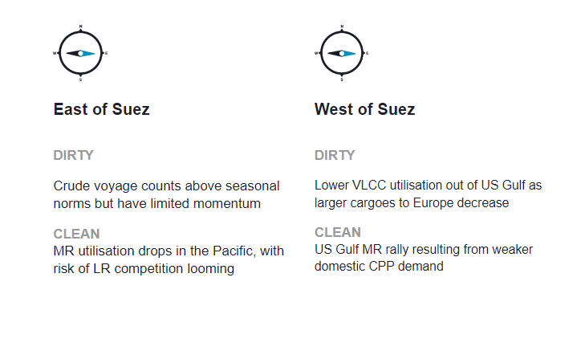
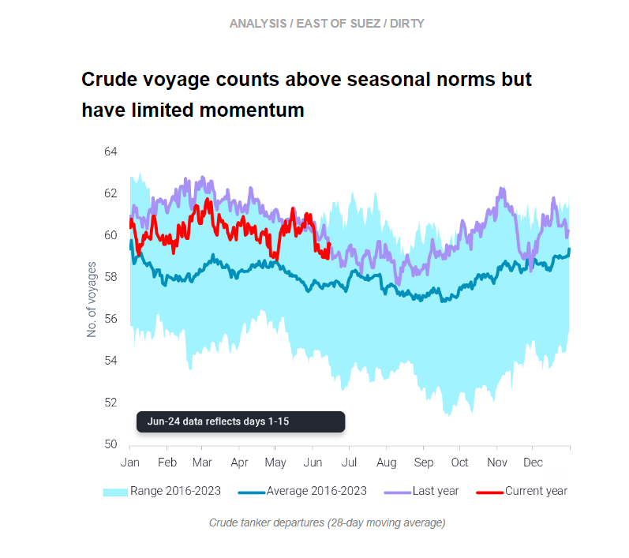
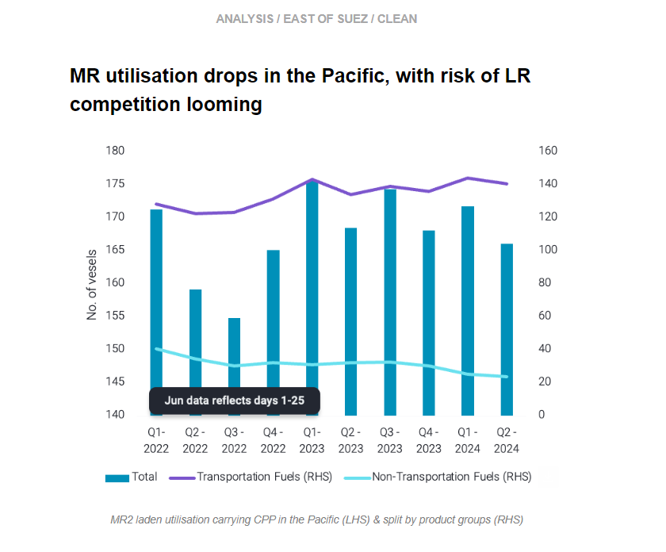
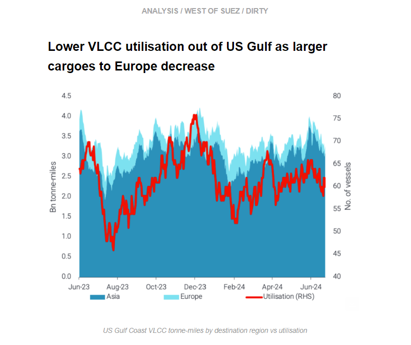
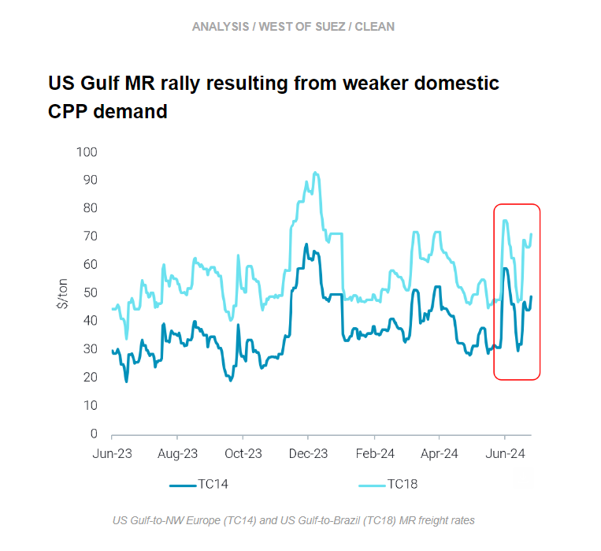

# Limited momentum for crude voyages

**Date:** June 27, 2024  
**Publisher:** Breakwave Advisors | **Category:** Market Insights  
**Original URL:** [https://www.breakwaveadvisors.com/insights/2024/6/27/limited-momentum-for-crude-voyages](https://www.breakwaveadvisors.com/insights/2024/6/27/limited-momentum-for-crude-voyages)  

---

This week, in the East, we discuss the outlook for crude tanker demand in the context of the global crude supply picture. On the clean side, we investigate why MR utilisation is dropping in the Pacific. In the West, we explore the drop in VLCC utilisation out of the US Gulf, and we zoom in on the MR rally in the US Gulf.

*By*[*Mary Melton*](https://www.linkedin.com/search/results/all/?fetchDeterministicClustersOnly=true&heroEntityKey=urn%3Ali%3Afsd_profile%3AACoAABXVyecBtg-pRnIrZe0BoWk0ygPiUfbvhsw&keywords=mary%20melton&origin=RICH_QUERY_SUGGESTION&position=0&searchId=40e8d7d2-c4d0-4022-81e7-176f6eba418b&sid=H_Y&spellCorrectionEnabled=false)

> **Figure 1: Στιγμιότυπο Οθόνης 2024 06 27 113125**  
> **Interactive Data & Source:** [Marketingmail Vortexa](https://marketingmail.vortexa.com/ODM3LU1aRS01NzgAAAGT88PUbrTAFqS-aJnmIeZSN_F125dN2hSdLR0HPDE1qbCQ-w4O7DprUlvxbe3GU3QIcRGZ4k4=) | [Local Asset](file:///C:/Users/Dell/Github/Shipping/corpus/03-breakwave/insights/2024/assets/2024-06-27_limited-momentum-for-crude-voyages_img_cea3cf84ceb9ceb3cebcceb9cf8ccf84cf85_f4ee3ff4b7cf.png)

> **Figure 2: Στιγμιότυπο Οθόνης 2024 06 27 113140**  
> **Interactive Data & Source:** [Marketingmail Vortexa](https://marketingmail.vortexa.com/ODM3LU1aRS01NzgAAAGT88PUbrTAFqS-aJnmIeZSN_F125dN2hSdLR0HPDE1qbCQ-w4O7DprUlvxbe3GU3QIcRGZ4k4=) | [Local Asset](file:///C:/Users/Dell/Github/Shipping/corpus/03-breakwave/insights/2024/assets/2024-06-27_limited-momentum-for-crude-voyages_img_cea3cf84ceb9ceb3cebcceb9cf8ccf84cf85_2ba632e45178.png)

- As we approach the halfway point of 2024, has crude tanker demand so far this year been different from the record-setting year in 2023? Demand in terms of the[number of voyages](https://marketingmail.vortexa.com/ODM3LU1aRS01NzgAAAGT88PUbrTAFqS-aJnmIeZSN_F125dN2hSdLR0HPDE1qbCQ-w4O7DprUlvxbe3GU3QIcRGZ4k4=)has been consistently lower than last year’s numbers on a seasonal basis, but still above seasonal norms.

- In previous newsletters, we discussed why Aframaxes particularly have been underemployed. A notable recent change has been the global downturn in VLCC employment, which is driven by a tightening of crude cargoes available. This is partially from a flattening out in crude supply growth from[non-OPEC suppliers (Guyana, Brazil, US)](https://marketingmail.vortexa.com/ODM3LU1aRS01NzgAAAGT88PUbrTAFqS-aJnmIeZSN_F125dN2hSdLR0HPDE1qbCQ-w4O7DprUlvxbe3GU3QIcRGZ4k4=)limiting Atlantic Basin employment and softer demand from Asia for Middle East crude, as Russian crude remains key for India and China. After a heavy refinery maintenance season in East Asia plus a reduction in implied refining runs across Asia (as a result of oversupplied products markets), crude demand has been softer. We expect to see relatively muted demand from NE Asia continue in the short-term due to these factors, even as refinery maintenance season wraps up.
- Will things look up for crude tankers in H2 2024? OPEC+ cuts have been extended to September, export capacity extensions have been muted from some members and there is declining export potential for others in the OPEC+ group. There is some upside for crude employment with the gradual expansion of production over the next 18 months, but in the short-term the signals for higher crude tanker employment are limited. However, the key point is that in the current muted crude demand environment, and with limited upside for crude supply additions in the short-term, crude tanker demand is likely to be softer in Q3. (Read more in our[exclusive crude market report here](https://marketingmail.vortexa.com/ODM3LU1aRS01NzgAAAGT88PUbzVglBQQ7jmlskAwBQgC_LPFrFjqG9voFdn2x4I2Wu92drALBmjboT_SYJ0tew9Q-aw=))

> **Figure 3: Στιγμιότυπο Οθόνης 2024 06 27 113338**  
> **Interactive Data & Source:** [Marketingmail Vortexa](https://marketingmail.vortexa.com/ODM3LU1aRS01NzgAAAGT88PUbgT2CluG34Xcb2FHEtdNFyrkfBgy5FfJybbnbdZgTX1mrmIYjP-3J-C0ifkAMT-0YN4=) | [Local Asset](file:///C:/Users/Dell/Github/Shipping/corpus/03-breakwave/insights/2024/assets/2024-06-27_limited-momentum-for-crude-voyages_img_cea3cf84ceb9ceb3cebcceb9cf8ccf84cf85_d05e90d04bb3.png)

- Demand for MR2s in the East is muted, with[utilisation](https://marketingmail.vortexa.com/ODM3LU1aRS01NzgAAAGT88PUbgT2CluG34Xcb2FHEtdNFyrkfBgy5FfJybbnbdZgTX1mrmIYjP-3J-C0ifkAMT-0YN4=)per day dropping by 4% q-o-q. Despite the current CPP oversupply in the region which has suppressed margins, the drop seems to be driven from non-transportation fuels.

- As a result, although MR freight rates remain at persistently high levels, overall these have remained quite flat, noting in June a slight drop from the average of the last month of the first quarter (1-3% down).
- A risk for MRs in the Pacific could stem from increased competition of LR1s and LR2s, as these[vessels are losing their share to the East-to-West middle distillate routes](https://marketingmail.vortexa.com/ODM3LU1aRS01NzgAAAGT88PUbvDZHgQiq4INhxgvzqZDlpojz67k4Ar1EJuVCTK_6ntJel3aHbnnmDu18_4ryExdnwc=)due to the recent Suezmax and VLCCs cleaning up.

> **Figure 4: Στιγμιότυπο Οθόνης 2024 06 27 114924**  
> **Interactive Data & Source:** [Marketingmail Vortexa](https://marketingmail.vortexa.com/ODM3LU1aRS01NzgAAAGT88PUbvp1XP_gQsTQ1fa_rqyyjQDy7TW5nl8gAmAMK2GLXMxqcTTwl5cn7XuMitL0xCtjNJM=) | [Local Asset](file:///C:/Users/Dell/Github/Shipping/corpus/03-breakwave/insights/2024/assets/2024-06-27_limited-momentum-for-crude-voyages_img_cea3cf84ceb9ceb3cebcceb9cf8ccf84cf85_63538653c274.png)

- US Gulf Coast VLCC tonne-miles have fallen for the month of June as larger cargoes to Europe decrease as buyers show a lack of interest. This comes even as[US Gulf crude/condensate exports in June increased towards Europe (days 1-25)](https://marketingmail.vortexa.com/ODM3LU1aRS01NzgAAAGT88PUbvp1XP_gQsTQ1fa_rqyyjQDy7TW5nl8gAmAMK2GLXMxqcTTwl5cn7XuMitL0xCtjNJM=), but moving forward European buying interest for light sweet barrels is slowing down.

- August loadings look challenged as arbs to Asia have narrowed further (Argus). This could add further downward pressure on VLCC utilisation out of the US Gulf, which is already low and sending[TD22 freight rates](https://marketingmail.vortexa.com/ODM3LU1aRS01NzgAAAGT88PUbrVh4AQhvPpGawefU5QiSjRiSMS1mmMuDotQx9XNmJufNng2odkFP28fK2lIbKQumGI=)to their lowest levels since Jan 2024.
- [Onshore crude inventories in Europe](https://marketingmail.vortexa.com/ODM3LU1aRS01NzgAAAGT88PUbgjEQ890VxRaOmL72pjPU_9_ZAP626sOaJWm_6EUfpn6ERXL4IA9dbDONb4V-CJ6yz8=)have built over the past two months, suggesting lack of interest from buyers in a saturated market and lower employment opportunities for bigger parcels and hence VLCCs on the US Gulf - Europe route.

> **Figure 5: Στιγμιότυπο Οθόνης 2024 06 27 115104**  
> **Interactive Data & Source:** [Marketingmail Vortexa](https://marketingmail.vortexa.com/ODM3LU1aRS01NzgAAAGT88PUbqNewwX2ecS636qbkTShxKS3QnnnaPbedXNV7uLhTkpwCJJ3lKNaMBVhSLZ2iJyikoI=) | [Local Asset](file:///C:/Users/Dell/Github/Shipping/corpus/03-breakwave/insights/2024/assets/2024-06-27_limited-momentum-for-crude-voyages_img_cea3cf84ceb9ceb3cebcceb9cf8ccf84cf85_a8b9ebe55ae2.png)

- [MR freight rates](https://marketingmail.vortexa.com/ODM3LU1aRS01NzgAAAGT88PUbqNewwX2ecS636qbkTShxKS3QnnnaPbedXNV7uLhTkpwCJJ3lKNaMBVhSLZ2iJyikoI=)out of the US Gulf have shown a lot of volatility over the last month. After a big rally in early June, rates then fell around 30% before beginning another rally that has resulted in an increase in rates of over 60% over the last 2 weeks. Vessel supply fundamentals are undoubtedly contributing to the recent rally, as[prompt vessel supply in the USG dropped sharply](https://marketingmail.vortexa.com/ODM3LU1aRS01NzgAAAGT88PUbmJmKIHz8kgxF_Z8700Rzl73H1G1SlapAS6qqf-1osHXKnmoINe7YzcV-GJdLQhvV_o=)over the past week. However, we want to focus on some of the positive tanker demand signals we are seeing.

- [PADD 3 CPP exports](https://marketingmail.vortexa.com/ODM3LU1aRS01NzgAAAGT88PUbiltQCZSd4Pim3Gc82IHLWzrW7WQ4PEE1AeQxrXPgK_Gj7Akkjs9HZRew1bZyaRNZ4s=)have increased 19% m-o-m (June days 1-24). This comes after a muted summer gasoline demand season, which is pushing some of these barrels to the export market.[Increased road fuel demand from Mexico](https://marketingmail.vortexa.com/ODM3LU1aRS01NzgAAAGT88PUblPCa6iOENKWml08TbbQxBL-ZCZVh5BSo3uUZ6YJ5VGDbyIJ2Ye0m1C2oIbm-1Es9Fs=)is absorbing these volumes, plus departures[of PADD 3 diesel for Brazil are at a 13-month high](https://marketingmail.vortexa.com/ODM3LU1aRS01NzgAAAGT88PUbngPvDjSZMToQRM8e3YsZ74DkX9oqMoFDmYreerXKokQfUGlMugoV28TUvrqH5yQNNk=)(though still well under pre-Russian products ban levels). These higher exports out of the US do indicate weaker domestic demand and can be interpreted as a “push” factor, but this is currently stimulating MR demand.
- However, with the Dangote refinery ramping up, the peak summer US driving season demand behind us and indications of an oversupplied Atlantic Basin products market, this MR rally is likely to be temporary. However, indications that Mexico’s CPP demand will remain robust amid refinery problems will likely continue to provide MR employment. Additionally, a currently open arbitrage for diesel USG-to-Med (Argus) may stimulate higher enquiries.

Data Source:[Vortexa](https://www.vortexa.com//oil-gas-data-traders-analysts-data-scientists?gclid=Cj0KCQjw8_qRBhCXARIsAE2AtRZKOvMnbilZ_6_91d7huSFFy71pWLrnPwGwOHVzXsmsG-1a1mZnQw8aAt89EALw_wcB&hsa_acc=1782073842&hsa_ad=548425387665&hsa_cam=14746637662&hsa_grp=125038601902&hsa_kw=&hsa_mt=&hsa_net=adwords&hsa_src=g&hsa_tgt=dsa-1431852288425&hsa_ver=3&utm_campaign=%5BCD%5D%20-%20DSA%20-%20EMEA&utm_medium=cpc&utm_medium=ppc&utm_source=google&utm_source=adwords&utm_term=)

---

**Tags:** Shipping, Crude Oil, Tankers  
