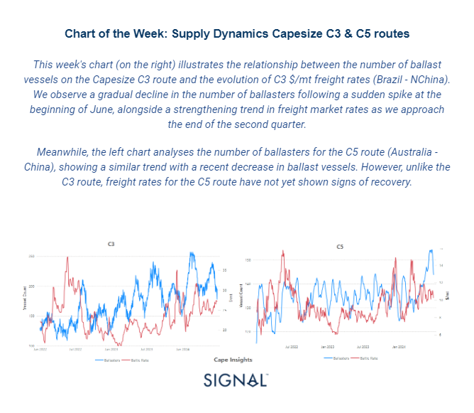
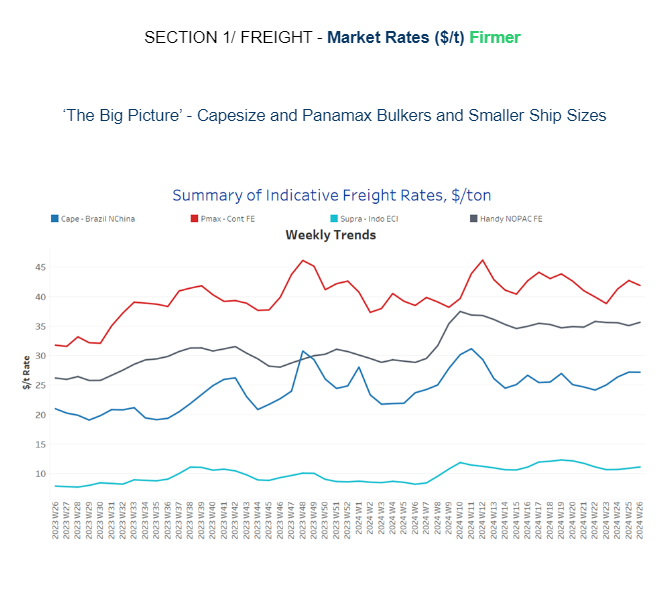
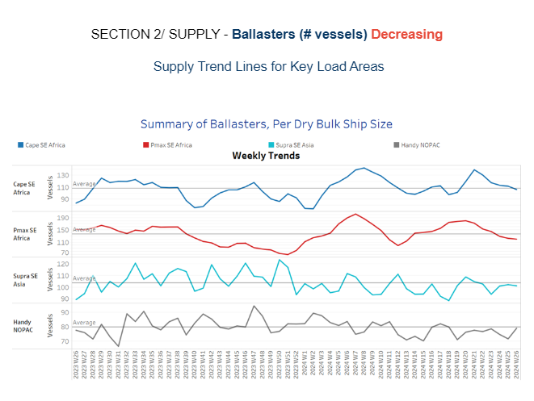
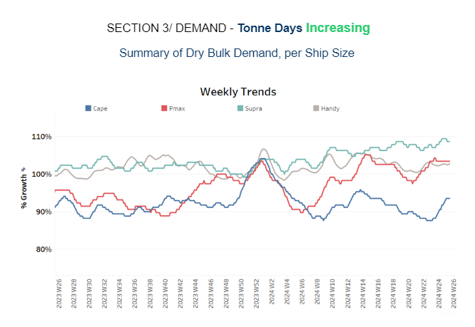
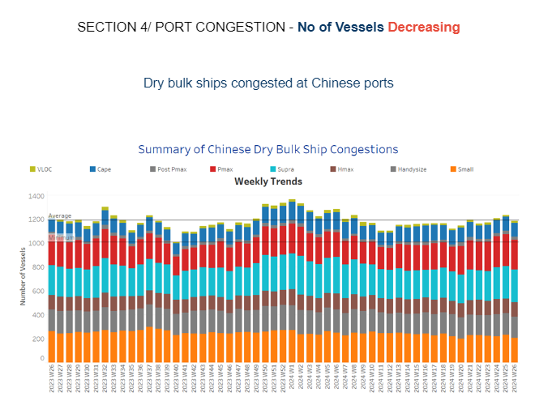

# Supply Dynamics Capesize C3 & C5 routes

**Date:** June 27, 2024  
**Publisher:** Breakwave Advisors | **Category:** Market Insights  
**Original URL:** [https://www.breakwaveadvisors.com/insights/2024/6/27/supply-dynamics-capesize-c3-amp-c5-routes](https://www.breakwaveadvisors.com/insights/2024/6/27/supply-dynamics-capesize-c3-amp-c5-routes)  

---

**Dry Weekly Market Monitor - Week 26.2024**
Snapshot of Spot Freight Rates, Supply-Demand Trends, Port Congestions
June 26, 2024

> **Figure 1: Στιγμιότυπο Οθόνης 2024 06 27 111713**  
> **Interactive Data & Source:** [Signal Ocean Platform](https://go.signalocean.com/e/983831/h-forecasts-as-exports-improve/2qbdkd/419430605/h/qz76SrOKcXd0aU3jxZrAIBRRhj00xkWni11Zx3_5qYI) | [Local Asset](file:///C:/Users/Dell/Github/Shipping/corpus/03-breakwave/insights/2024/assets/2024-06-27_supply-dynamics-capesize-c3-amp-c5-routes_img_cea3cf84ceb9ceb3cebcceb9cf8ccf84cf85_a1274e7895d6.png)

In the last days of June, the dry bulk freight market showed signs of recovery in the Capesize segment, with hopes for a firmer Chinese economic performance reflected in the last closing of iron ore prices. Iron ore futures prices rebounded on Tuesday, buoyed by robust demand for the crucial steelmaking ingredient and renewed optimism regarding economic stimulus in China, the world's largest consumer.

The most actively traded September iron ore contract on China’s Dalian Commodity Exchange (DCE) recovered to surpass the psychological barrier of 800 yuan ($110.16) per metric ton, closing daytime trading at 801 yuan per ton. Earlier in the session, it had dipped to an intraday low of 791 yuan per ton, the lowest in 11 weeks. Similarly, the benchmark July iron ore contract on the Singapore Exchange reversed its earlier losses, posting a 1.12% gain to settle at $103.75 per ton as of 0734 GMT. Market sentiment was bolstered by renewed expectations of economic stimulus in China, following remarks from Premier Li Qiang affirming the country's confidence in achieving its annual growth target of around 5%. Li also emphasised the commitment to ensuring stability in industrial sectors, further supporting market optimism. Amid growing optimism, a[Bloomberg](https://go.signalocean.com/e/983831/h-forecasts-as-exports-improve/2qbdkd/419430605/h/qz76SrOKcXd0aU3jxZrAIBRRhj00xkWni11Zx3_5qYI)survey of economists has raised China's growth forecasts, buoyed by improvements in exports.

> **Figure 2: Στιγμιότυπο Οθόνης 2024 06 27 111732**  
> **Interactive Data & Source:** [Signal Ocean Platform](https://www.thesignalgroup.com/signal-ocean-platform) | [Local Asset](file:///C:/Users/Dell/Github/Shipping/corpus/03-breakwave/insights/2024/assets/2024-06-27_supply-dynamics-capesize-c3-amp-c5-routes_img_cea3cf84ceb9ceb3cebcceb9cf8ccf84cf85_42bcab8e0df8.png)

In the final days of June, the dry bulk freight market is showing signs of gaining stronger traction, particularly in the larger vessel size categories. Of note is a notable increase in the Capesize Brazil to N China rates, which is bolstering confidence in market stability.

- **Capesize**vessel freight rates shipments from Brazil to North China remained stable at approximately $27 per ton compared to the previous week, reflecting a notable 25% increase from the same time last year.
- **Panamax**vessel freight rates from the Continent to the Far East continued to exceed $40 per ton. Recent data shows a 29% increase compared to rates recorded a year ago.
- **Supramax**vessel freight rates on the Indo-ECI route held levels around $11 per ton throughout June, marking a 46% increase compared to a comparable week from a year ago.
- **Handysize**freight rates for the NOPAC Far East route have remained consistent over the past six weeks, holding steady at approximately $36 per ton. This marks a notable 36% increase compared to rates observed one year ago.

> **Figure 3: Στιγμιότυπο Οθόνης 2024 06 27 111747**  
> **Interactive Data & Source:** [Signal Ocean Platform](https://www.thesignalgroup.com/signal-ocean-platform) | [Local Asset](file:///C:/Users/Dell/Github/Shipping/corpus/03-breakwave/insights/2024/assets/2024-06-27_supply-dynamics-capesize-c3-amp-c5-routes_img_cea3cf84ceb9ceb3cebcceb9cf8ccf84cf85_05e27fa0f19b.png)

Towards the end of June, there has been a consistent decline in the number of ballast ships across all vessel size segments, with the exception of a noted increase in the Handysize segment in NOPAC.

- **Capesize SE Africa**: The number of ballast ships has dropped nearly below the annual average of 107, marking a decrease of approximately 34 from the peak observed nearly five weeks ago.
- **Panamax SE Africa**: The number of ballast ships has fallen below 120, approximately 16vessels fewer than the annual average and about 60 vessels lower than the peak observed in week 20.
- **Supramax SE Asia**: The count of ballast ships has remained below the annual average of 103 since the end of week 24, with the lowest point observed in week 21 when the number stood at 94.
- **Handysize NOPAC**: Following a decline observed in the previous week, there are now indications of an increase in the number of ballast vessels approaching the annual average of 80, marking an increase of about 9 compared to the previous week.

> **Figure 4: Στιγμιότυπο Οθόνης 2024 06 27 111804**  
> **Interactive Data & Source:** [Signal Ocean Platform](https://www.thesignalgroup.com/signal-ocean-platform) | [Local Asset](file:///C:/Users/Dell/Github/Shipping/corpus/03-breakwave/insights/2024/assets/2024-06-27_supply-dynamics-capesize-c3-amp-c5-routes_img_cea3cf84ceb9ceb3cebcceb9cf8ccf84cf85_ae5ad968b16b.png)

In the final days of June, the outlook for dry tonne days in the Capesize segment has shown a surprising upward trend. Additionally, other vessel size categories are gradually recovering from the lows experienced six weeks ago.

- **Capesize**: The latest estimates in tonne day growth have confirmed the optimism from the end of the previous week, with recent growth reaching the highest levels since the last peak in week 14.
- **Panamax**:Last week's signs of a reversal in the decline of tonne-day growth have been strongly confirmed in the second half of June. The upward trend over the past three weeks has not only persisted but has also surpassed the low point observed in week 20.
- **Supramax**: The growth rate continued the upward trend observed in the previous week, improving from the low point recorded at the end of week 21.
- **Handysize**: The upward trend is also evident in the Handysize vessel segment since the end of week 22. However, it now appears to be following a steady pace as the month draws to a close.

> **Figure 5: Στιγμιότυπο Οθόνης 2024 06 27 111817**  
> **Interactive Data & Source:** [Signal Ocean Platform](https://www.thesignalgroup.com/signal-ocean-platform) | [Local Asset](file:///C:/Users/Dell/Github/Shipping/corpus/03-breakwave/insights/2024/assets/2024-06-27_supply-dynamics-capesize-c3-amp-c5-routes_img_cea3cf84ceb9ceb3cebcceb9cf8ccf84cf85_f336e850a7be.png)

The upward trend observed in the first half of June, which peaked at the start of the third week, now appears to be ending the month with a downward correction.

- **Capesize**: Capesize ship congestion remained almost unchanged from the previous week, holding at around 118. This marks an increase of nearly 8 compared to levels observed two weeks ago.
- **Panamax**: The number of Panamax vessels dropped significantly below the 250 mark, nearly 19 fewer than the previous week.
- **Supramax**: Congestion levels remained steady at the 270 mark, consistent with the previous week. This represents an increase of about 20 compared to six weeks ago.
- **Handysize**: Congestion levels continued their upward trend from the previous week, settling just below 180. This marks a decrease of 6 compared to levels two weeks ago.

Data Source:[Signal Ocean Platform](https://www.thesignalgroup.com/signal-ocean-platform)

---

**Tags:** Drybulk, Shipping, Capesize  
