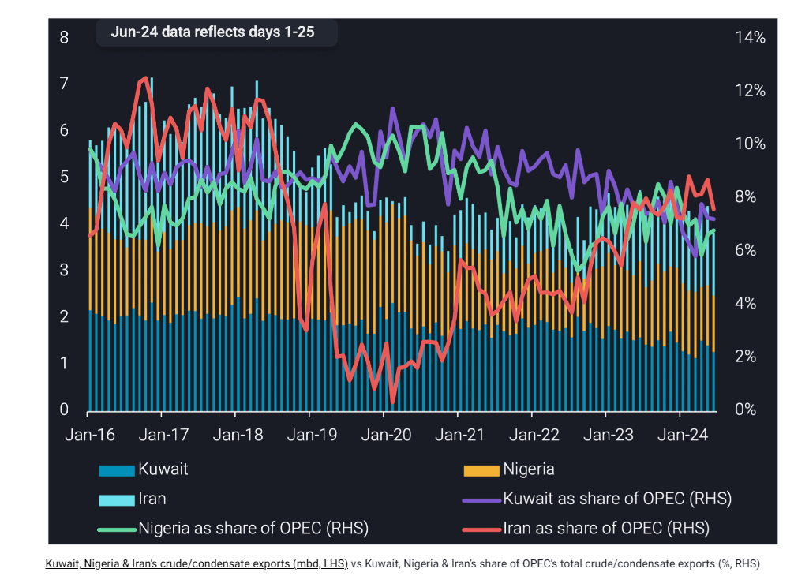

# Iranian crude exports rise, lifting its ranking in OPEC

**Date:** June 28, 2024  
**Publisher:** Breakwave Advisors | **Category:** Market Insights  
**Original URL:** [https://www.breakwaveadvisors.com/insights/2024/6/28/iranian-crude-exports-rise-lifting-its-ranking-in-opec](https://www.breakwaveadvisors.com/insights/2024/6/28/iranian-crude-exports-rise-lifting-its-ranking-in-opec)  

---

This insight explores Iran’s recent increase in its crude/condensate exports, making it OPEC’s fourth largest crude exporter in May.

*By*[*Armen Azizian*](https://www.linkedin.com/in/armenazizian/)

Iran’s crude/condensate exports accounted for 9% of OPEC’s crude/condensate exports in February 2024 and again in May 2024, the highest share since August 2018. Rising crude exports mean Iran has overtaken Kuwait and Nigeria to be the fourth largest crude/condensate exporter in OPEC. Iran’s crude exports averaged 1.56mbd across January-May this year, around 250kbd higher than both Kuwait and Nigeria.

Despite ongoing sanctions, Iran managed to increase its crude/condensate exports to 1.7mbd in May, the highest levels observed in more than five years. An increase in its crude production, higher demand from China and a net increase in the size of its dark fleet have helped facilitate its increase in exports.

On the other hand, Kuwait and Nigeria have pivoted more towards raising clean product exports, thereby reducing crude exports. New refineries such as Kuwait’s Al-Zour plant and Nigeria’s Dangote refinery have added 300kbd of CPP exports in May compared to January 2024. This figure is likely to grow for the latter especially as ramp-up continues in the coming months (read our latest insight on the Dangote refinery). While CPP exports have been on the rise, Kuwaiti and Nigerian crude exports have fallen by 160kbd in May from January levels.

This shift to higher CPP exports, coupled with Iran’s increase in crude/condensate exports means the only OPEC members exporting more than Iran are UAE, Iraq and Saudi Arabia.

> **Figure 1: Στιγμιότυπο Οθόνης 2024 06 28 093456**  
> **Interactive Data & Source:** [Vortexa](https://www.vortexa.com//oil-gas-data-traders-analysts-data-scientists?gclid=Cj0KCQjw8_qRBhCXARIsAE2AtRZKOvMnbilZ_6_91d7huSFFy71pWLrnPwGwOHVzXsmsG-1a1mZnQw8aAt89EALw_wcB&hsa_acc=1782073842&hsa_ad=548425387665&hsa_cam=14746637662&hsa_grp=125038601902&hsa_kw=&hsa_mt=&hsa_net=adwords&hsa_src=g&hsa_tgt=dsa-1431852288425&hsa_ver=3&utm_campaign=%5BCD%5D%20-%20DSA%20-%20EMEA&utm_medium=cpc&utm_medium=ppc&utm_source=google&utm_source=adwords&utm_term=) | [Local Asset](file:///C:/Users/Dell/Github/Shipping/corpus/03-breakwave/insights/2024/assets/2024-06-28_iranian-crude-exports-rise-lifting-its-ranking-in-opec_img_cea3cf84ceb9ceb3cebcceb9cf8ccf84cf85_2d8c4d9bb541.png)

Data Source:[Vortexa](https://www.vortexa.com//oil-gas-data-traders-analysts-data-scientists?gclid=Cj0KCQjw8_qRBhCXARIsAE2AtRZKOvMnbilZ_6_91d7huSFFy71pWLrnPwGwOHVzXsmsG-1a1mZnQw8aAt89EALw_wcB&hsa_acc=1782073842&hsa_ad=548425387665&hsa_cam=14746637662&hsa_grp=125038601902&hsa_kw=&hsa_mt=&hsa_net=adwords&hsa_src=g&hsa_tgt=dsa-1431852288425&hsa_ver=3&utm_campaign=%5BCD%5D%20-%20DSA%20-%20EMEA&utm_medium=cpc&utm_medium=ppc&utm_source=google&utm_source=adwords&utm_term=)

---

**Tags:** Shipping, Crude Oil, Tankers  
