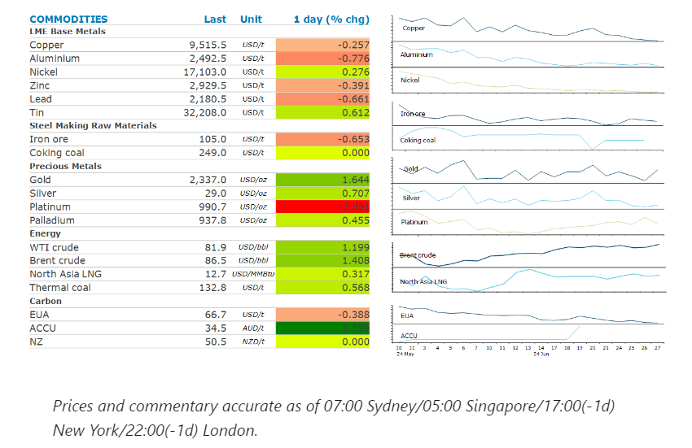
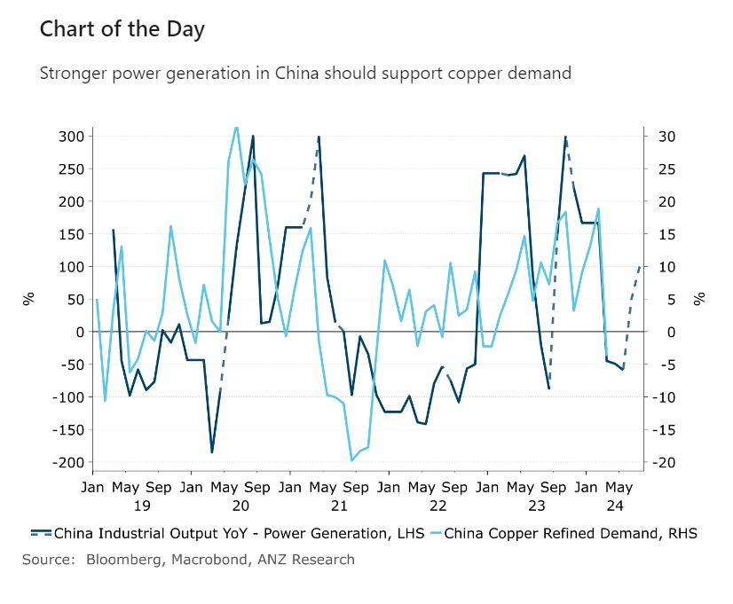

# Risk on tone across markets pushed commodities higher

**Date:** June 28, 2024  
**Publisher:** Breakwave Advisors | **Category:** Market Insights  
**Original URL:** [https://www.breakwaveadvisors.com/insights/2024/6/28/risk-on-tone-across-markets-pushed-commodities-higher](https://www.breakwaveadvisors.com/insights/2024/6/28/risk-on-tone-across-markets-pushed-commodities-higher)  

---

Sentiment was bolstered by a broader risk-on tone across markets. Further supply side issues across energy and metals also provided some support..

*By*[*Daniel Hynes*](https://www.linkedin.com/in/dahynes/)

> **Figure 1: Στιγμιότυπο Οθόνης 2024 06 28 094122**  
> [Local Asset](file:///C:/Users/Dell/Github/Shipping/corpus/03-breakwave/insights/2024/assets/2024-06-28_risk-on-tone-across-markets-pushed-commodities-higher_img_cea3cf84ceb9ceb3cebcceb9cf8ccf84cf85_1bb6d08e4350.png)

### Market Commentary

**Crude oil**edged higher despite weak near-term fundamentals. The unexpected rise in US inventories last week raised alarm bells, with the market expecting a drawdown as the US summer driving season begins. US stockpiles increased by 3.59mbbl last week, while gasoline stockpiles rose by 2,654kbbl. Nevertheless, prices gained amid a risk-on tone across broader markets. This was triggered by data that signalled further US labour market weakness. The US dollar subsequently weakened, boosting investor appetite across the commodities complex. The market is also comforted by the fact that any weaker fundamentals will be protected by OPEC’s supply policies.

**Global LNG**prices gained amid ongoing supply side issues. Net gas flows to the Corpus Christi LNG terminal in the US fell sharply on Thursday, according to Bloomberg data. Cheniere Energy’s plant was undergoing two days of maintenance that was supposed to end Wednesday. In Poland, Orlen SA warned gas companies in Hungary and Austria that it could seize their payments for imports from Russia’s Gazprom. However, the Russian gas giant could still be looking to increase its LNG exports despite efforts from the West to sanction the industry.

**Copper**was largely unchanged despite the bullish tone across broader markets. That may change as the market contemplates stronger demand amid ongoing supply side issues. The decarbonisation of the global economy is putting increasing pressure on power grids. This is being amplified by climate change, with extreme weather raising demand for electricity-driven cooling. This is likely to see increased spending on grid infrastructure if shortages are to be avoided in coming years.[**This has important implications for metals such as copper and aluminium**](../pdfs/2024-06-28_risk-on-tone-across-markets-pushed-commodities-higher_commodity-call-metals-coming-into-po_30c0f47e66b7.pdf)[**.**](https://publications.anz.com/SingletrackCMS__DownloadDocument?docRef=75613383-dbca-4e65-856c-8eb6c917c278&uid=bd219b92-f5cc-400e-9646-4178791864b7&jobRef=fb31bff0-4e7b-419a-bb1e-0b675ed06213)China’s power industry accounts around a third of the country’s total copper demand. The rise in investment in long-range power lines should also benefit aluminium. This will see the share of demand coming from the electricity sector rise sharply in both metal markets.

**Gold**gained after data suggested softening in the US labour market, supporting calls that the Fed should be able to cut rates in the second half of the year. High borrowing costs are weighing on the economy. Pending home sales and orders placed with US factories both unexpectedly fell in May, the former to a record low. Safe haven demand has emerged in recent weeks amid the challenging political backdrop. Upcoming elections in France, the UK and the US are raising concerns of policy shifts. A weaker US dollar during the session also bolstered investor demand.

**Iron ore**held onto its two-day gain on the prospect of stronger demand in China. Beijing eased homebuying requirements earlier this week, including lower required down payments and a lower mortgage rate floor. These latest measures could drive an increase in residential property transactions and help alleviate the worst housing oversupply by inventory-clearance time in the country.

> **Figure 2: Στιγμιότυπο Οθόνης 2024 06 28 094247**  
> **Interactive Data & Source:** [Linkedin](https://www.linkedin.com/newsletters/commodities-wrap-6692196755876012032/?fbclid=IwAR3kiXJqZdxmp9ZcRwBNI7FsBySI-XSC0pfPur1qzjt7OZp7PTE59Tsl1QI) | [Local Asset](file:///C:/Users/Dell/Github/Shipping/corpus/03-breakwave/insights/2024/assets/2024-06-28_risk-on-tone-across-markets-pushed-commodities-higher_img_cea3cf84ceb9ceb3cebcceb9cf8ccf84cf85_d2c7a1867d5c.png)

Data source:[Commodities Wrap](https://www.linkedin.com/newsletters/commodities-wrap-6692196755876012032/?fbclid=IwAR3kiXJqZdxmp9ZcRwBNI7FsBySI-XSC0pfPur1qzjt7OZp7PTE59Tsl1QI)

---

**Tags:** Economy, Markets, Commodities  
