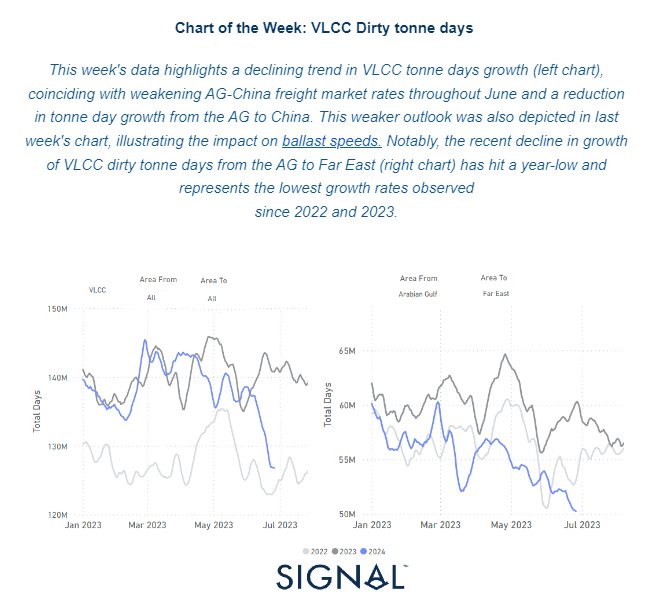
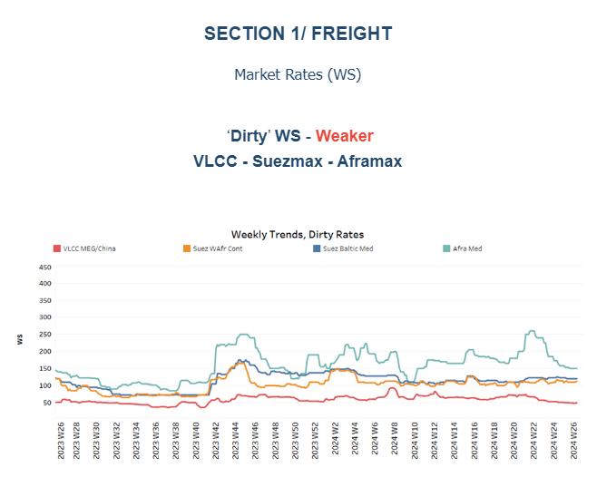
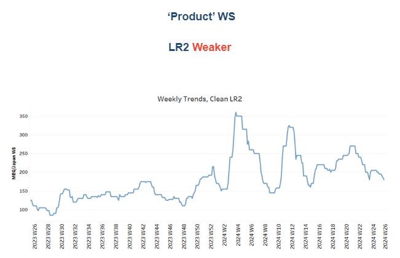
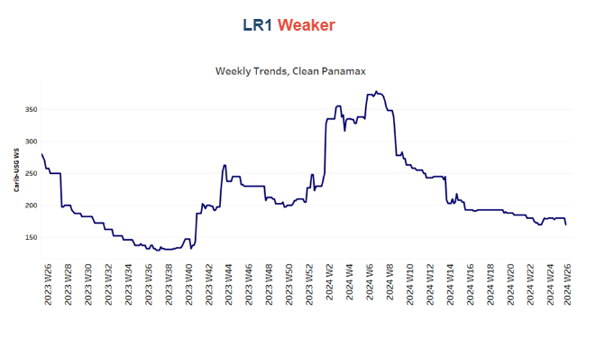
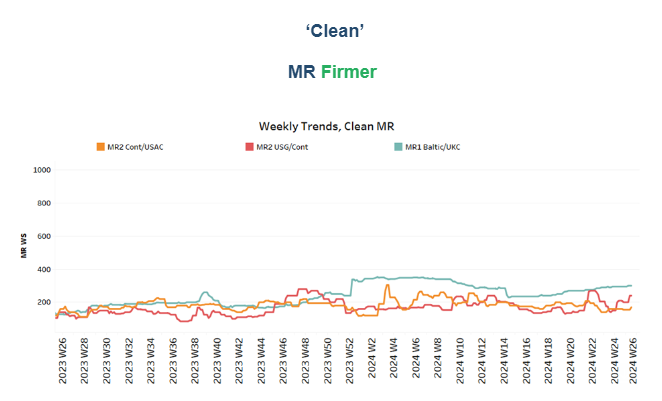
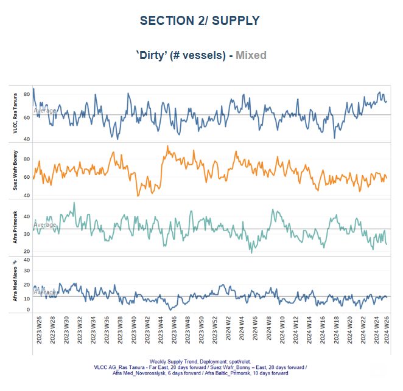
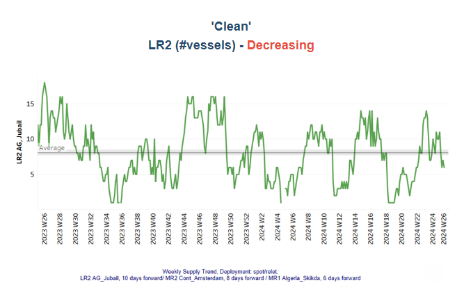
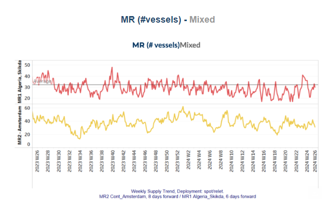
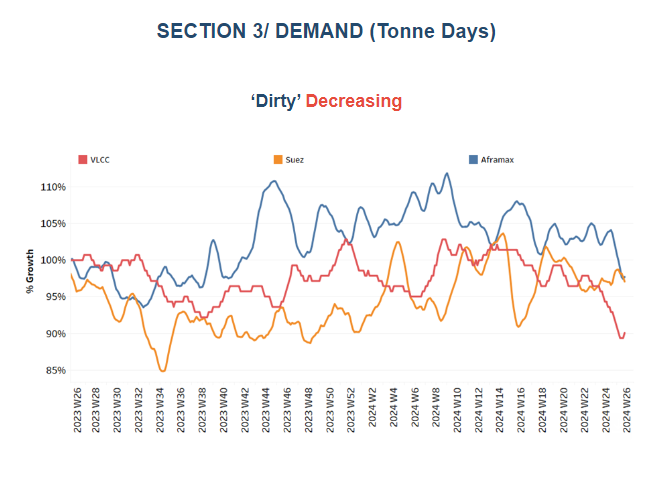
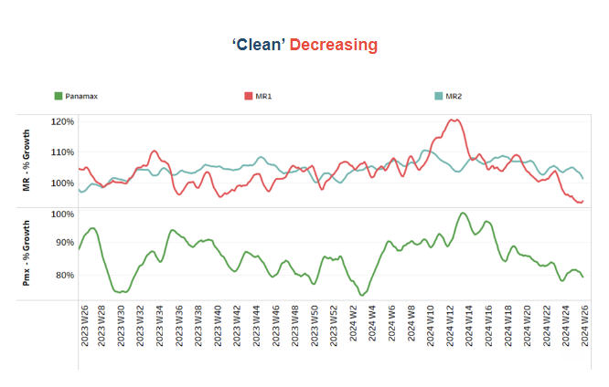

# VLCC Dirty tonne days

**Date:** June 28, 2024  
**Publisher:** Breakwave Advisors | **Category:** Market Insights  
**Original URL:** [https://www.breakwaveadvisors.com/insights/2024/6/28/t8lyc2i9np89wd0kd1a4g13l8jvdd7](https://www.breakwaveadvisors.com/insights/2024/6/28/t8lyc2i9np89wd0kd1a4g13l8jvdd7)  

---

## Tanker - Weekly Market Monitor

Snapshot of Crude and Product Freight Rates, Supply-Demand

Week 26, June 27, 2024

> **Figure 1: Στιγμιότυπο Οθόνης 2024 06 28 084151**  
> **Interactive Data & Source:** [Signal Ocean Platform](https://go.signalocean.com/e/983831/inery-runs-russell-2024-06-17-/2qbht3/419975687/h/5tQ4DMKvy0ZvWWugzdalOBsK7R7TelWaRaVmW8Q1NhE) | [Local Asset](file:///C:/Users/Dell/Github/Shipping/corpus/03-breakwave/insights/2024/assets/2024-06-28_t8lyc2i9np89wd0kd1a4g13l8jvdd7_img_cea3cf84ceb9ceb3cebcceb9cf8ccf84cf85_10813f86e97b.png)

The final week of June saw a noticeable weakening in crude oil freight rates, particularly evident in the VLCC AG-China and Aframax cross-Mediterranean routes. In contrast, the MR clean segment showed a more stable trend, although growth in demand tonne days did not surpass previous weekly rates. Assessing the supply dynamics and the growth of dirty tonne days in the VLCC segment, upcoming days are expected to challenge freight rate evolution with downward pressure, exacerbated by ongoing geopolitical tensions and uncertainties surrounding Chinese crude oil imports, which[declined](https://go.signalocean.com/e/983831/inery-runs-russell-2024-06-17-/2qbht3/419975687/h/5tQ4DMKvy0ZvWWugzdalOBsK7R7TelWaRaVmW8Q1NhE)in the first five months of the year.

Meanwhile,[oil prices](https://go.signalocean.com/e/983831/set-us-demand-concerns-4438976/2qbht6/419975687/h/5tQ4DMKvy0ZvWWugzdalOBsK7R7TelWaRaVmW8Q1NhE)experienced a modest rise on Thursday amidst escalating geopolitical tensions in the Middle East, countering worries about weakening demand triggered by a surprising increase in U.S. crude stockpiles. Brent crude oil futures increased by 70 cents, or 0.82%, reaching $85.95 a barrel by 1202 GMT, while U.S. West Texas Intermediate crude futures rose by 57 cents, or 0.7%, to $81.47. Both benchmarks had closed slightly higher on Wednesday.

The U.S. Energy Information Administration (EIA) reported a significant 3.6 million barrel rise in the country's crude oil inventories last week, contrary to analysts' expectations of a 2.9 million barrel drawdown as per Reuters' poll. Additionally, U.S. gasoline stocks increased by 2.7 million barrels, contrasting with forecasts of a 1 million barrel decrease. These inventory reports heightened concerns about supply-demand balance, even as geopolitical tensions provided some support to oil prices.

> **Figure 2: Στιγμιότυπο Οθόνης 2024 06 28 084732**  
> **Interactive Data & Source:** [Signal Ocean Platform](https://www.thesignalgroup.com/signal-ocean-platform) | [Local Asset](file:///C:/Users/Dell/Github/Shipping/corpus/03-breakwave/insights/2024/assets/2024-06-28_t8lyc2i9np89wd0kd1a4g13l8jvdd7_img_cea3cf84ceb9ceb3cebcceb9cf8ccf84cf85_dbf1a49ef608.png)

As June draws to a close, there is a noticeable downward trend in VLCC MEG-China freight rates, marking the weakest performance recorded since the beginning of the year. Similarly, the Aframax Med route is experiencing significant downward pressure, with the latest peak observed four weeks ago.

- The**VLCC**MEG-China freight rates remained low at 50 WS, reflecting a 26% decrease compared to rates observed a year ago.
- Suezmax freight rates for shipments from**West Africa to continental Europe**have held steady around 110 WS, maintaining consistency from the previous month. Similarly, rates on the**Suez Baltic Med route**have remained stable at approximately 120 WS, indicating consistent sentiment compared to rates observed in the same week last year and maintaining stability throughout June.
- Aframax**Mediterranean**freight rates have remained steady around WS150 since the conclusion of week 24, signalling a 40% decline compared to the previous month. These rates indicate a sustained trend towards lower freight rates, with the most recent peak noted at the end of week 22.

> **Figure 3: Στιγμιότυπο Οθόνης 2024 06 28 084908**  
> **Interactive Data & Source:** [Signal Ocean Platform](https://www.thesignalgroup.com/signal-ocean-platform) | [Local Asset](file:///C:/Users/Dell/Github/Shipping/corpus/03-breakwave/insights/2024/assets/2024-06-28_t8lyc2i9np89wd0kd1a4g13l8jvdd7_img_cea3cf84ceb9ceb3cebcceb9cf8ccf84cf85_f35133fe12ab.png)

- **LR2**AG freight rates fell to WS180, marking a 20-point decrease from rates observed a week ago. Recent sentiment suggests a 44% increase compared to the same week last year.

> **Figure 4: Στιγμιότυπο Οθόνης 2024 06 28 085026**  
> **Interactive Data & Source:** [Signal Ocean Platform](https://www.thesignalgroup.com/signal-ocean-platform) | [Local Asset](file:///C:/Users/Dell/Github/Shipping/corpus/03-breakwave/insights/2024/assets/2024-06-28_t8lyc2i9np89wd0kd1a4g13l8jvdd7_img_cea3cf84ceb9ceb3cebcceb9cf8ccf84cf85_1995f6e359b9.png)

- **Panamax**Carib-to-USG rates dropped by 10 points from the previous week, settling around WS 170. Currently, they are 32% weaker compared to rates during a similar week last year.

> **Figure 5: Στιγμιότυπο Οθόνης 2024 06 28 085040**  
> **Interactive Data & Source:** [Signal Ocean Platform](https://www.thesignalgroup.com/signal-ocean-platform) | [Local Asset](file:///C:/Users/Dell/Github/Shipping/corpus/03-breakwave/insights/2024/assets/2024-06-28_t8lyc2i9np89wd0kd1a4g13l8jvdd7_img_cea3cf84ceb9ceb3cebcceb9cf8ccf84cf85_fa4e373d809d.png)

- **MR1**rates for shipments from the**Baltic to the continent**maintained strong momentum, nearing 300 WS and indicating a 50% increase compared to levels a year ago. Meanwhile,**MR2**rates for shipments from the**continent to the USAC**rose to 170 WS, up 10 points from the previous week, reflecting a 40% annual increase. On the**USG-Cont**route, MR2 rates surged to 240 WS, marking a notable 130% annual increase.

> **Figure 6: Στιγμιότυπο Οθόνης 2024 06 28 091253**  
> **Interactive Data & Source:** [Signal Ocean Platform](https://www.thesignalgroup.com/signal-ocean-platform) | [Local Asset](file:///C:/Users/Dell/Github/Shipping/corpus/03-breakwave/insights/2024/assets/2024-06-28_t8lyc2i9np89wd0kd1a4g13l8jvdd7_img_cea3cf84ceb9ceb3cebcceb9cf8ccf84cf85_a08fa28817c9.png)

The supply trend for crude tankers maintained a persistent increase at the VLCC Ras Tanura. Conversely, in the Aframax Primosk, there are indications of a drop below the annual average. This divergence highlights contrasting market dynamics within the crude tanker industry, where certain segments continue to thrive while others face potential challenges.

- **VLCC Ras Tanura**: The number of ships has now reached nearly 73, which is almost 10 above the annual average.
- **Suezmax Wafr**: The current ship count remains around 60 for the third consecutive week, reflecting an increase of 16 compared to low observed at the end of week 22.
- **Aframax Primorsk**: For the past four weeks, the number of ships has remained significantly lower than the annual average of 30, nearly 14 fewer than the levels recorded six weeks ago.
- **Aframax Med Novo**: Since the end of week 22, the vessel count has hovered around the annual average of 10. This pattern is expected to persist at a similar rate through the end of the month.

> **Figure 7: Στιγμιότυπο Οθόνης 2024 06 28 091425**  
> **Interactive Data & Source:** [Signal Ocean Platform](https://www.thesignalgroup.com/signal-ocean-platform) | [Local Asset](file:///C:/Users/Dell/Github/Shipping/corpus/03-breakwave/insights/2024/assets/2024-06-28_t8lyc2i9np89wd0kd1a4g13l8jvdd7_img_cea3cf84ceb9ceb3cebcceb9cf8ccf84cf85_0700811adadb.png)

> **Figure 8: Στιγμιότυπο Οθόνης 2024 06 28 091440**  
> **Interactive Data & Source:** [Signal Ocean Platform](https://www.thesignalgroup.com/signal-ocean-platform) | [Local Asset](file:///C:/Users/Dell/Github/Shipping/corpus/03-breakwave/insights/2024/assets/2024-06-28_t8lyc2i9np89wd0kd1a4g13l8jvdd7_img_cea3cf84ceb9ceb3cebcceb9cf8ccf84cf85_a3c3c81dc92f.png)

- **Clean LR2 AG Jubail**: The downward trend in the number of vessels observed in the third week of June has continued, with the count nearing the end of the month showing indications of a decline to around 6 vessels.
- **Clean MR**: Vessel activity for MR1 at Algeria's Skikda port has increased to 30, marking a rise of nearly 10 from the recent low observed just a week ago. Meanwhile, MR2 activity in Amsterdam has shown signs of decline, recently dropping to 31, which is nearly 7 fewer than the previous week.

> **Figure 9: Στιγμιότυπο Οθόνης 2024 06 28 091709**  
> **Interactive Data & Source:** [Signal Ocean Platform](https://www.thesignalgroup.com/signal-ocean-platform) | [Local Asset](file:///C:/Users/Dell/Github/Shipping/corpus/03-breakwave/insights/2024/assets/2024-06-28_t8lyc2i9np89wd0kd1a4g13l8jvdd7_img_cea3cf84ceb9ceb3cebcceb9cf8ccf84cf85_b8927816b691.png)

- **Dirty**tonne days: The decrease in the growth of VLCC tonne days remained significantly low at the end of June, with recent growth now at its lowest point in the past twelve months. Meanwhile, in the Suezmax segment, early signs of a potential upward reversal have shifted into a downward correction. Similarly, the Aframax segment is also experiencing a declining pace, indicating a broader downturn in these market segments. This overall trend suggests a challenging environment for the tanker market, as multiple vessel classes face sustained pressure and reduced activity levels.

> **Figure 10: Στιγμιότυπο Οθόνης 2024 06 28 091814**  
> **Interactive Data & Source:** [Signal Ocean Platform](https://www.thesignalgroup.com/signal-ocean-platform) | [Local Asset](file:///C:/Users/Dell/Github/Shipping/corpus/03-breakwave/insights/2024/assets/2024-06-28_t8lyc2i9np89wd0kd1a4g13l8jvdd7_img_cea3cf84ceb9ceb3cebcceb9cf8ccf84cf85_857dcd0363cb.png)

- **Panamax**tonne days: The growth pace at the end of June showed signs of a downward trend, despite an uptick in growth at the end of the previous week. This brief improvement did not continue through to the end of the month.
- For**Clean MR**tonne days, the MR1 vessel continued experiencing a significant decline over the past four weeks, with still no signs of an imminent reversal. The growth of tonne days for MR2 vessels began to decline at the end of week 24, and recent figures are now approaching the low recorded in week 12.

Data Source:[Signal Ocean Platform](https://www.thesignalgroup.com/signal-ocean-platform)

---

**Tags:** Shipping, Tankers, Crude  
