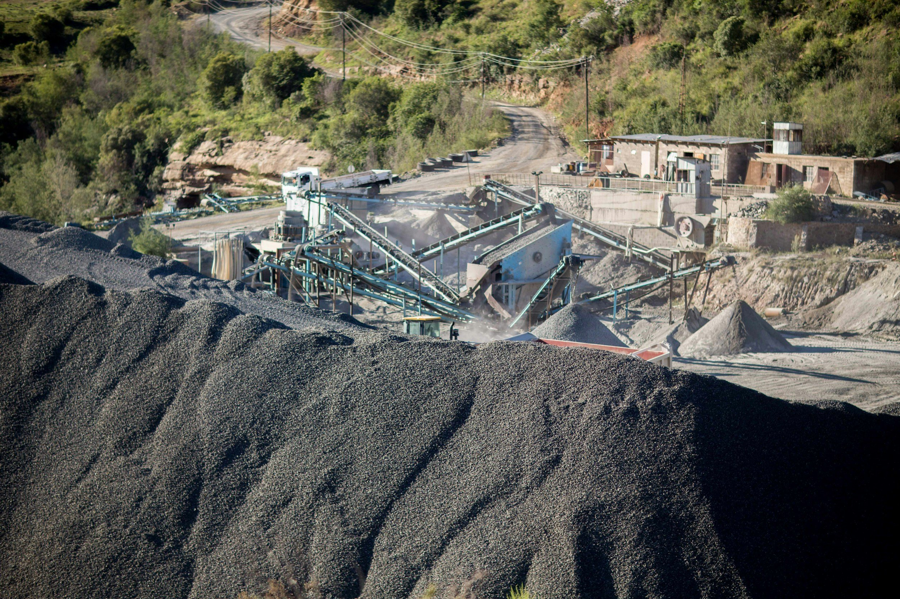

# Weekly Insights Review

**Date:** June 28, 2024  
**Publisher:** Breakwave Advisors | **Category:** Market Insights  
**Original URL:** [https://www.breakwaveadvisors.com/insights/2024/6/28/weekly-insights-review](https://www.breakwaveadvisors.com/insights/2024/6/28/weekly-insights-review)  

---

## Welcome to Our Weekly Insights Review

## Read Here Everything You Need to Know

## Breakwave Tanker Report

**Volatility Declines as Spot Rates Remain Rangebound**– Not much has changed over the past fortnight, as Capesize spot rates hover in the mid/low-20,000s range and the**futures**curve remains relatively**flat to spot.**

> **Figure 1: Στιγμιότυπο Οθόνης 2024 06 25 122324**  
> **Interactive Data & Source:** [Breakwave Advisors Market Insights](https://www.breakwaveadvisors.com/insights/2024/6/24/in-a-positive-week-for-the-spot-market) | [Local Asset](file:///C:/Users/Dell/Github/Shipping/corpus/03-breakwave/insights/2024/assets/2024-06-28_weekly-insights-review_img_cea3cf84ceb9ceb3cebcceb9cf8ccf84cf85_f0721b611ce5.png)

> **Figure 2: Read More**  
> **Interactive Data & Source:** [Breakwave Advisors Market Insights](https://www.breakwaveadvisors.com/insights/2024/6/24/in-a-positive-week-for-the-spot-market) | [Local Asset](file:///C:/Users/Dell/Github/Shipping/corpus/03-breakwave/insights/2024/assets/2024-06-28_weekly-insights-review_img_image-asset_48bed0909e23.jpeg)

## In a Positive Week for the Spot Market

Doric Weekly Market Insight

In a positive week for the spot market, the Baltic Dry Index closed just below 2000 points today.

> **Figure 3: Market Chart 3**  
> **Interactive Data & Source:** [Breakwave Advisors Market Insights](https://www.breakwaveadvisors.com/insights/2024/6/24/e9gyg511s1ygafix8s6rh42bojb4wk) | [Local Asset](file:///C:/Users/Dell/Github/Shipping/corpus/03-breakwave/insights/2024/assets/2024-06-28_weekly-insights-review_img_image-asset28129_48a127e78212.jpeg)

## Russia Remains China's Second Largest Source of Coal Imports

From Commodore's Weekly Dry Bulk Reports

The most recently released nation-specific import data shows that in April China imported 17.8 million tons of coal from Indonesia.

[Read More](https://www.breakwaveadvisors.com/insights/2024/6/24/e9gyg511s1ygafix8s6rh42bojb4wk)

> **Figure 4: Market Chart 4**  
> **Interactive Data & Source:** [Breakwave Advisors Market Insights](https://www.breakwaveadvisors.com/insights/2024/6/24/uncertain-macro-backdrop-stymies-commodities-rally) | [Local Asset](file:///C:/Users/Dell/Github/Shipping/corpus/03-breakwave/insights/2024/assets/2024-06-28_weekly-insights-review_img_image-asset_18d684093913.jpeg)

## Uncertain Macro Backdrop Stymies Commodities Rally

Commodities Wrap

Mixed economic data raised concerns over commodity demand, weighing on prices. Investor appetite was also weakened amid a stronger USD.

> **Figure 5: Market Chart 5**  
> **Interactive Data & Source:** [Breakwave Advisors Market Insights](https://www.breakwaveadvisors.com/insights/2024/6/25/o0yud7yuhnc4liytygdbppahrqe7y4) | [Local Asset](file:///C:/Users/Dell/Github/Shipping/corpus/03-breakwave/insights/2024/assets/2024-06-28_weekly-insights-review_img_image-asset28229_862c316cc8ae.jpeg)

## Disappointing Economic Data

The Fix - Global Market Update

The Baltic Dry Index continued to advance last week, but unlike the preceding one, the capesizes and the smaller segments, rather than the panamaxes, propelled it higher.

> **Figure 6: Unsplash Image 0iv9lmpdn0**  
> **Interactive Data & Source:** [Breakwave Advisors Market Insights](https://www.breakwaveadvisors.com/insights/2024/6/26/three-questions-for-asset-allocators-politics-nvidia-and-bonds) | [Local Asset](file:///C:/Users/Dell/Github/Shipping/corpus/03-breakwave/insights/2024/assets/2024-06-28_weekly-insights-review_img_unsplash-image-0iv9lmpdn0_9c1a84ae34e4.jpg)

## Three Questions for Asset Allocators: Politics, Nvidia and Bonds

Forvis Mazars Weekly Note

The more the potential for government giveaways is reduced, the more world leaders are incentivised to make riskier decisions, and the more uncertain the outcomes. Are markets pricing in political risks?

> **Figure 7: Market Chart 7**  
> **Interactive Data & Source:** [Breakwave Advisors Market Insights](https://www.breakwaveadvisors.com/insights/2024/6/26/brazils-booming-crude-exports) | [Local Asset](file:///C:/Users/Dell/Github/Shipping/corpus/03-breakwave/insights/2024/assets/2024-06-28_weekly-insights-review_img_image-asset28329_afa3197d25ce.jpeg)

## Brazil's Booming Crude Exports

Braemar

A shift to Europe and rising VLCC demand..

> **Figure 8: Market Chart 8**  
> **Interactive Data & Source:** [Breakwave Advisors Market Insights](https://www.breakwaveadvisors.com/insights/2024/6/26/demolition-activities-within-the-dry-bulk-and-tanker-sectors) | [Local Asset](file:///C:/Users/Dell/Github/Shipping/corpus/03-breakwave/insights/2024/assets/2024-06-28_weekly-insights-review_img_image-asset28429_d56e025c35a5.jpeg)

## Demolition Activities Within the Dry Bulk and Tanker Sectors

Intermodal Weekly Market Report

Building upon our prior analyses which explored the sales & purchase, and contracting activities within the dry bulk and tanker sectors for the year 2024,...

[Read More](https://www.breakwaveadvisors.com/insights/2024/6/26/demolition-activities-within-the-dry-bulk-and-tanker-sectors)

> **Figure 9: Market Chart 9**  
> **Interactive Data & Source:** [Breakwave Advisors Market Insights](https://www.breakwaveadvisors.com/insights/2024/6/27/improvement-in-chinas-consumer-strength) | [Local Asset](file:///C:/Users/Dell/Github/Shipping/corpus/03-breakwave/insights/2024/assets/2024-06-28_weekly-insights-review_img_image-asset28529_a92e9d0f8e77.jpeg)

## Improvement in China's Consumer Strength

From Commodore's Weekly Dry Bulk Reports

As we discussed in Commodore Research's most recent Weekly China Report, China’s retail sales in May grew year-on-year by 3.7% which has marked the strongest growth seen since February.

> **Figure 10: 011**  
> **Interactive Data & Source:** [Breakwave Advisors Market Insights](https://www.breakwaveadvisors.com/insights/2024/6/27/supply-dynamics-capesize-c3-amp-c5-routes) | [Local Asset](file:///C:/Users/Dell/Github/Shipping/corpus/03-breakwave/insights/2024/assets/2024-06-28_weekly-insights-review_img_011_ff9ed2d49e46.jpg)

## Supply Dynamics Capesize C3 & C5 Routes

Signal Ocean - Dry Weekly Market Monitor

In the last days of June, the dry bulk freight market showed signs of recovery in the Capesize segment, with hopes for a firmer Chinese economic performance reflected in the last closing of iron ore prices.

> **Figure 11: Pexels Rafid Sahrear 480671561 19302826**  
> **Interactive Data & Source:** [Breakwave Advisors Market Insights](https://www.breakwaveadvisors.com/insights/2024/6/27/limited-momentum-for-crude-voyages) | [Local Asset](file:///C:/Users/Dell/Github/Shipping/corpus/03-breakwave/insights/2024/assets/2024-06-28_weekly-insights-review_img_pexels-rafid-sahrear-480671561-19302_a2417b883c40.jpg)

## Limited Momentum for Crude Voyages

Vortexa Freight Weekly

This week, in the East, we discuss the outlook for crude tanker demand in the context of the global crude supply picture.

> **Figure 12: Market Chart 12**  
> **Interactive Data & Source:** [Breakwave Advisors Market Insights](https://www.breakwaveadvisors.com/insights/2024/6/28/t8lyc2i9np89wd0kd1a4g13l8jvdd7) | [Local Asset](file:///C:/Users/Dell/Github/Shipping/corpus/03-breakwave/insights/2024/assets/2024-06-28_weekly-insights-review_img_image-asset28629_fc6f9e83c7d5.jpeg)

## VLCC Dirty Tonne Days

Signal Ocean - Tanker Weekly Market Monitor

The final week of June saw a noticeable weakening in crude oil freight rates, particularly evident in the VLCC AG-China and Aframax cross-Mediterranean routes.

> **Figure 13: Cea3cf84ceb9ceb3cebcceb9cf8ccf84cf85**  
> **Interactive Data & Source:** [Breakwave Advisors Market Insights](https://www.breakwaveadvisors.com/insights/2024/6/28/iranian-crude-exports-rise-lifting-its-ranking-in-opec) | [Local Asset](file:///C:/Users/Dell/Github/Shipping/corpus/03-breakwave/insights/2024/assets/2024-06-28_weekly-insights-review_img_cea3cf84ceb9ceb3cebcceb9cf8ccf84cf85_1fbc6e2c202b.png)

## Iranian Crude Exports Rise, Lifting Its Ranking in OPEC

Vortexa Freight Weekly

This insight explores Iran’s recent increase in its crude/condensate exports, making it OPEC’s fourth largest crude exporter in May.

> **Figure 14: Market Chart 14**  
> **Interactive Data & Source:** [Breakwave Advisors Market Insights](https://www.breakwaveadvisors.com/insights/2024/6/28/risk-on-tone-across-markets-pushed-commodities-higher) | [Local Asset](file:///C:/Users/Dell/Github/Shipping/corpus/03-breakwave/insights/2024/assets/2024-06-28_weekly-insights-review_img_image-asset28729_bb98113a85de.jpeg)

## Risk on Tone Across Markets Pushed Commodities Higher

Commodities Wrap

Sentiment was bolstered by a broader risk-on tone across markets. Further supply side issues across energy and metals also provided some support..

---

**Tags:** Drybulk, Tankers, Economy  
