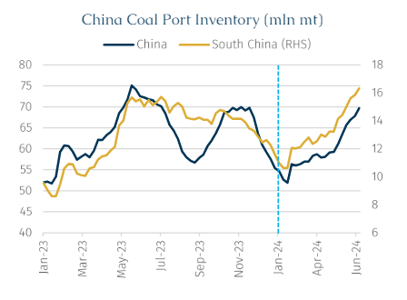
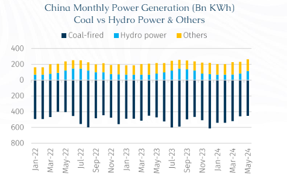
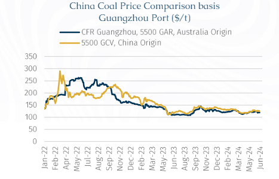
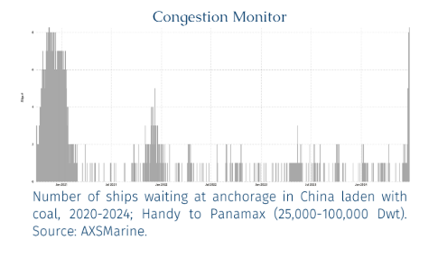
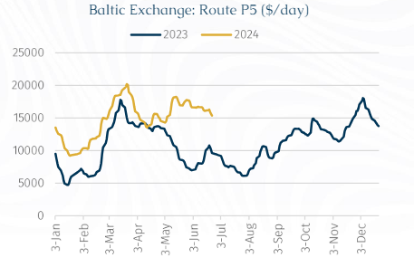

# Coal ‘Reservoir’ And Seaborne Trade Prospects

**Date:** July 01, 2024  
**Publisher:** Breakwave Advisors | **Category:** Market Insights  
**Original URL:** [https://www.breakwaveadvisors.com/insights/2024/7/1/coal-reservoir-and-seaborne-trade-prospects](https://www.breakwaveadvisors.com/insights/2024/7/1/coal-reservoir-and-seaborne-trade-prospects)  

---

> **Figure 1: Rgb Color Brs Shipbrokers Monogram Logo**  
> **Interactive Data & Source:** [Breakwave Advisors Market Insights](https://www.breakwaveadvisors.com/insights/2024/7/1/coal-reservoir-and-seaborne-trade-prospects#_msocom_1) | [Local Asset](file:///C:/Users/Dell/Github/Shipping/corpus/03-breakwave/insights/2024/assets/2024-07-01_coal-reservoir-and-seaborne-trade-prospects_img_rgb-color-brs-shipbrokers-monogram-l_ee79606c8e74.png)

To prepare for China’s summer peak electricity demand (June to August), the country’s thermal coal port inventories have been steadily accumulating, even surpassing last winter's peak of 70mn mt, to reach 71.2mn mt last week according to a Mysteel survey. However, this is noticeably lower than the 75.1mn mt recorded at the same time last year.

However, the port inventory situation varies significantly across different regions. Notably reports suggests that there has been a rapid stockpiling of thermal coal at ports in Southern China, with some recent reports of overfilled inventories. According to MTJH, thermal coal port inventories in South China have climbed to 16.3mn mt, exceeding the July 2022 peak of 15.7mn mt and surpassing the highest volume in the past 3 years.

The buildup reflects an underlying weak appetite for coal consumption as there is a steady increase in hydropower generation capacity. Indeed, this is pushing out coal generated electricity from the energy mix and resulting in a lower-than-expected daily coal consumption at power plants. Consequently, under the backdrop of ample inventory at power plants, there’s a lack of need to restock and to buy more coal from the ports.

Despite the stable coal demand outside the electricity generation sector (notably coal-chemistry, construction, metallurgical industry etc.), the consumption from these sectors is insufficient to keep the coal market afloat, which is weighing on prices. With this in mind, we will breakdown the intricate and intertwined drivers behind the Chinese coal surplus and its potential impact on the shipping market later in the year.

> **Figure 2: Στιγμιότυπο Οθόνης 2024 07 01 113410**  
> **Interactive Data & Source:** [Breakwave Advisors Market Insights](https://www.breakwaveadvisors.com/insights/2024/7/1/coal-reservoir-and-seaborne-trade-prospects#_msocom_1) | [Local Asset](file:///C:/Users/Dell/Github/Shipping/corpus/03-breakwave/insights/2024/assets/2024-07-01_coal-reservoir-and-seaborne-trade-prospects_img_cea3cf84ceb9ceb3cebcceb9cf8ccf84cf85_0aeea6542fd2.png)

Hydropower: Since the arrival of the rainy* season, rainfall in most parts of southern China has been above average. Compared to the relatively dry conditions experienced over the past two years, hydropower output has recovered significantly. Simultaneously, the share of wind power and other renewable sources in the electricity market is continuing to grow and chip away at coal’s prominent position in China’s total power mix.

According to latest data from the National Bureau of Statistics, China's total thermal power generation in May was 454bn kWh, down 4.3% y-o-y. Meanwhile, hydropower generation was 115bn kWh, up 38.6% y-o-y, while other power generation (nuclear, wind, solar, etc.) totalled 149 bn kWh, representing a 10% y-o-y increase.

*Typically, South China will be rainier earlier in the spring from April-May. Then the rains move north to the CJK region from June-July onwards.

> **Figure 3: Στιγμιότυπο Οθόνης 2024 07 01 113431**  
> **Interactive Data & Source:** [Breakwave Advisors Market Insights](https://www.breakwaveadvisors.com/insights/2024/7/1/coal-reservoir-and-seaborne-trade-prospects#_msocom_1) | [Local Asset](file:///C:/Users/Dell/Github/Shipping/corpus/03-breakwave/insights/2024/assets/2024-07-01_coal-reservoir-and-seaborne-trade-prospects_img_cea3cf84ceb9ceb3cebcceb9cf8ccf84cf85_4ceff974f1ee.png)

Weather: While increased rainfall has boosted hydropower generation and lowered temperatures, it has also exerted significant headwinds on land transportation. For example, at Chaozhou Port, persistent rainfall (with only three rain-free days in the past month) has severely impeded port productivity and trucking activity. Coupled with already high inventories at downstream power plants, there is scant motivation for power plants to shift coal from the port during such prolonged wet weather conditions.

As a result, inventories at Chaozhou Port (South China) recently hit a record 840,000 mt, up 43.3% from the 586,000 mt stored at the same time last year. Moreover, at the time of writing, there is no sign of an easing.

Port Storage Bottlenecks: In the event of a prolonged absence of end-user demand, the surge in coal imports so far this year has led to an increase in port inventories. Port storage is bursting at the seams, and it appears unlikely that seaborne arrivals will be absorbed, unless end-users begin directing coal inland.

Overall, the market consensus is for Chinese coal imports to remain high. For context, comparing to previous years’ (2016-2022) average of around 300mn mt, it is anticipated to be a slight decline compared to last year's 470mn mt (with approximately 400mn mt transported by sea).[[AW1]](https://www.breakwaveadvisors.com/insights/2024/7/1/coal-reservoir-and-seaborne-trade-prospects#_msocom_1)The import volume in 2024 is projected to be around 430mn mt, with seaborne imports around 350mn mt (Mongolian and part of Russian coal excluded). However, during the first five months of this year, spurred by the continuous decline in coal prices, China imported 205mn mt of coal, up 12.6% y-o-y, further exacerbating the operational pressure on ports.

Falling Coal Prices: In the context of continuous falling coal prices which have been steadily weakening since late 2023, coal traders are caught in a vicious cycle of purchasing more imported coal (to lower their average costs) and stockpiling it at ports (thereby incurring storage costs), while waiting for coal prices to rise in line with their expectations for a rebound in the Chinese economy. Presently, the trading thesis is that the upcoming summer peak demand for coal will drive a price rally, thus far this expectation has made traders reluctant to offload their holdings at a loss.

> **Figure 4: Στιγμιότυπο Οθόνης 2024 07 01 114931**  
> [Local Asset](file:///C:/Users/Dell/Github/Shipping/corpus/03-breakwave/insights/2024/assets/2024-07-01_coal-reservoir-and-seaborne-trade-prospects_img_cea3cf84ceb9ceb3cebcceb9cf8ccf84cf85_e90ce705b668.png)

Impact on the Shipping Market

As Chinese ports experience a shortage of space to store the incoming coal, which has led to vessel delays and an uptick in waiting days at anchorage to discharge (thereby incurring demurrage costs).

For instance, at Lianyungang, the port inventory is at full capacity, thereby requiring all vessels to pre-coordinate with the port authority before calling at the port. In South China, Guangzhou's ports are also full, with incoming vessels waiting an average of seven days (but up to two weeks in some cases) at the anchorage before granted permission to discharge. According to AXSMarine data, the number of coal-laden vessels waiting at anchorage outside Chinese ports has reached another peak similar to the levels seen at the end of 2020. Back then, due to China's unofficial import ban on Australian coal, a large number of ships were forced to wait at the anchorage for clarification.

> **Figure 5: Στιγμιότυπο Οθόνης 2024 07 01 115125**  
> [Local Asset](file:///C:/Users/Dell/Github/Shipping/corpus/03-breakwave/insights/2024/assets/2024-07-01_coal-reservoir-and-seaborne-trade-prospects_img_cea3cf84ceb9ceb3cebcceb9cf8ccf84cf85_938d9ca77e7b.png)

The apparent contradiction between China's high import volumes in the first five months of this year and relatively sluggish downstream demand is explained by the use of port storage as a temporary reservoir for supplies. This supported the overall dry freight demand at the start of this year, in particular for Panamax and Supramax tonnage deploying in the Pacific market.

> **Figure 6: Στιγμιότυπο Οθόνης 2024 07 01 115142**  
> [Local Asset](file:///C:/Users/Dell/Github/Shipping/corpus/03-breakwave/insights/2024/assets/2024-07-01_coal-reservoir-and-seaborne-trade-prospects_img_cea3cf84ceb9ceb3cebcceb9cf8ccf84cf85_30b702451ba8.png)

In the short term, the congestion, due to the significant number of vessels being forced to wait at ports for discharge, should in theory cause a vessel supply tightness in the Pacific and support the freight level.

However, the current stockpiles buildup suggests that can dent demand for the seaborne markets down the road. Looking into 2H24, the appetite for seaborne imported coal might be restrained, even if seasonal uplift in the third quarter can boost coal demand, it will take time for power plants to consume existing stockpiles (both within the power plants as well as the stock in the ports).

In sum, the plausible outcome of the recent imbalances from the coal oversupply is that China’s seaborne imports are reduced. The seaborne supply is supplementary to the domestic coal mining industry therefore any reduction in demand will negatively impact shipowners in the Pacific for the 2H24 for the Supramax and Panamax vessels.

---

**Tags:** Economy, Drybulk, Coal  
