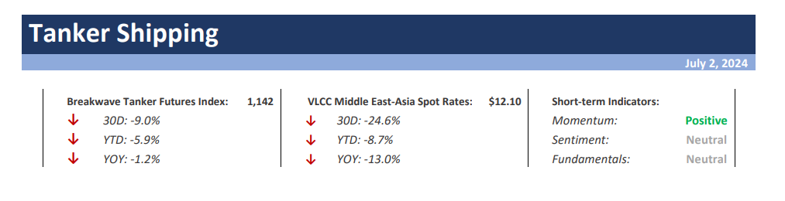
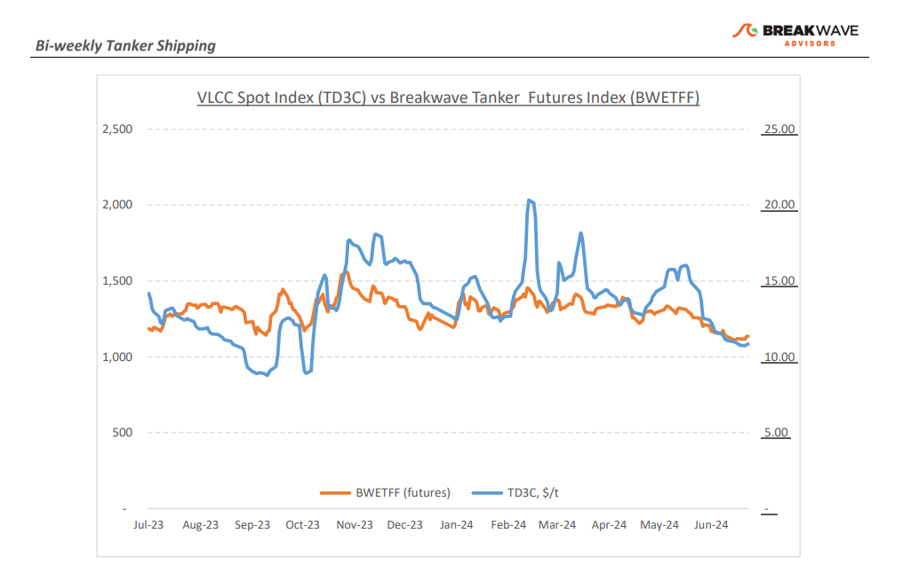
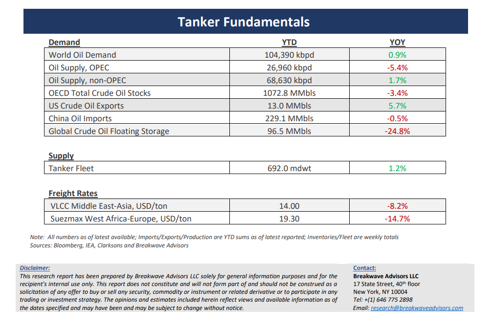

# Breakwave Bi-Weekly Tanker Report - July 2, 2024

**Date:** July 02, 2024  
**Publisher:** Breakwave Advisors | **Category:** Market Insights  
**Original URL:** [https://www.breakwaveadvisors.com/insights/2024618wet-7rsj2-sljkb](https://www.breakwaveadvisors.com/insights/2024618wet-7rsj2-sljkb)  

---

> **Figure 1: Cea3cf84ceb9ceb3cebcceb9cf8ccf84cf85**  
> [Local Asset](file:///C:/Users/Dell/Github/Shipping/corpus/03-breakwave/insights/2024/assets/2024-07-02_2024618wet-7rsj2-sljkb_img_cea3cf84ceb9ceb3cebcceb9cf8ccf84cf85_87b965fd3605.png)

•**The VLCC Market Steadies Following a Month of Constant Pressure, as a Rare Positive Factor Emerges**– The VLCC market remained**relatively stable**in the final week of June, following persistent downward pressure recorded earlier in the month.**Downward momentum seems to have slowed down**, although the potential for weakening summer demand clouds the prospect for firmer rates for the time being. On the benchmark Middle East Gulf to China route, rates managed to increase slightly on a weekly basis, though they now have declined more than 20% from the previous month. Similarly, in the Atlantic market conditions mirrored those in the Middle East Gulf: the rate for the West Africa to China route rose by 2% but has declined by roughly 17% for the month. Comparing today's picture to market’s sentiment at the end of June last year, it is noteworthy that**despite reduced summer demand and a challenging macro environment,**VLCC traders remain relatively**optimistic**about the progression of freight rates. More surprisingly, as June draws to a close, market sources have begun to indicate some interest in**VLCCs for Clean Petroleum Products**(CPP) business, which is true, will introduce a new dynamic and add further pressure to charterers, although it remains unclear how significant or sustainable this factor might be. Despite any such potential interest in CPP, the VLCC market's future hinges on**overcoming**the**subdued demand**typical of the summer months.

•**Oil Prices Steadying at Recent Highs as the US Driving Season Gets Underway**– The**US summer driving**season is anticipated to**boost gasoline**consumption, providing a supportive factor for oil prices. Historically, the increased travel and transportation activities during this period drive up demand for gasoline, which can help counterbalance some of the downward pressures seen in other parts of the market.**Geopolitical tensions**continue to play a significant role in the oil market, with ongoing conflicts in Gaza and Ukraine heightening fears of potential supply disruptions. These tensions can lead to volatility in oil prices as traders react to the risk of reduced oil output from key producing areas or prolong the ongoing disruptions in critical supply routes. Meanwhile,**China's economic landscape**presents a**mixed**picture for global oil demand. The country continues to deal with several economic challenges, including weak consumer spending and high unemployment rates. These issues have**the potential to further dampen China's**overall energy**consumption**, which is a critical component of global oil demand. While the**US summer driving season**is likely to lend some**support**to oil prices through increased gasoline consumption,**ongoing geopolitical tensions and economic challenges in China**introduce a level of**uncertainty**that could affect the overall stability and direction of the oil market in the coming months.

•**Our Long-term View**– The tanker market is recovering from a long period of staggered rates as the growth in new vessel supply shrinks while oil demand is recovering in line with the global economy. A historically low orderbook combined with favorable demand fundamentals should continue to support increased spot rate volatility, which combined with the ongoing geopolitical turmoil, should support freight rates in the medium to long term.

> **Figure 2: Cea3cf84ceb9ceb3cebcceb9cf8ccf84cf85**  
> [Local Asset](file:///C:/Users/Dell/Github/Shipping/corpus/03-breakwave/insights/2024/assets/2024-07-02_2024618wet-7rsj2-sljkb_img_cea3cf84ceb9ceb3cebcceb9cf8ccf84cf85_e143b4564224.png)

> **Figure 3: Cea3cf84ceb9ceb3cebcceb9cf8ccf84cf85**  
> [Local Asset](file:///C:/Users/Dell/Github/Shipping/corpus/03-breakwave/insights/2024/assets/2024-07-02_2024618wet-7rsj2-sljkb_img_cea3cf84ceb9ceb3cebcceb9cf8ccf84cf85_7cedcf889da7.png)

### Subscribe:
