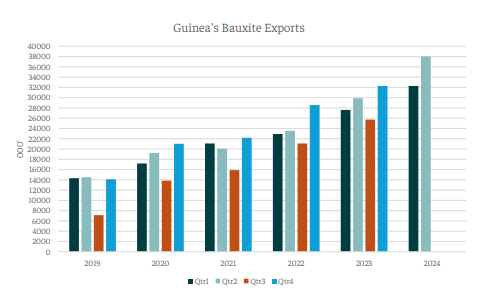
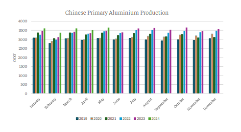

# Heightened aluminium production

**Date:** July 03, 2024  
**Publisher:** Breakwave Advisors | **Category:** Market Insights  
**Original URL:** [https://www.breakwaveadvisors.com/insights/2024/7/3/t7xkmuo6xk35z6uqvrbogq25i50qce](https://www.breakwaveadvisors.com/insights/2024/7/3/t7xkmuo6xk35z6uqvrbogq25i50qce)  

---

*By*[*Yiannis Parganas*](https://www.linkedin.com/in/yiannis-p-36a2141a7/)

During the second quarter, we have observed an unprecedented surge in bauxite exports from Guinea, reaching a new record high of 38.01 million tons. The majority of these exports are directed towards China, aligning with the robust production trends in the Chinese primary aluminium sector. China's primary aluminium production has also set a new record, achieving 17.77 million tons in the first five months of 2024, a 5.4% increase compared to the previous record set in 2023 for the same period.

> **Figure 1: Στιγμιότυπο Οθόνης 2024 07 03 101919**  
> **Interactive Data & Source:** [Intermodal](https://www.intermodal.gr/) | [Local Asset](file:///C:/Users/Dell/Github/Shipping/corpus/03-breakwave/insights/2024/assets/2024-07-03_t7xkmuo6xk35z6uqvrbogq25i50qce_img_cea3cf84ceb9ceb3cebcceb9cf8ccf84cf85_f800904b9214.png)

This increase is driven by strong demand from the solar power and NEV industries, which collectively account for 44% of aluminium usage. However, this is not the sole factor contributing to the heightened aluminium production. Yunnan, a major aluminium production hub in China and the second-largest province with installed hydropower capacity, significantly influences this trend. The reliance on hydropower generation in Yunnan is evident, as seen in the reduced aluminium production during the hydropower shortages in the second half of 2022- 2023.

> **Figure 2: Στιγμιότυπο Οθόνης 2024 07 03 101931**  
> **Interactive Data & Source:** [Intermodal](https://www.intermodal.gr/) | [Local Asset](file:///C:/Users/Dell/Github/Shipping/corpus/03-breakwave/insights/2024/assets/2024-07-03_t7xkmuo6xk35z6uqvrbogq25i50qce_img_cea3cf84ceb9ceb3cebcceb9cf8ccf84cf85_65b40de79d82.png)

In late April and May, Yunnan experienced heavy rains, with precipitation levels in many areas expected to be 20 to 50 percent higher than average, potentially leading to more floods. Looking ahead to the third quarter of 2024, we anticipate a seasonal decline in Guinea's bauxite exports due to the rainy season. However, if hydropower generation remains strong in China, the demand for aluminium production could offset this decrease, providing additional support to Australian exports during the summer months, while, the latter part of the year could witness another surge in Guinea's bauxite exports, in line with the projected record volumes of aluminium production in China.

Data Source:[Intermodal](https://www.intermodal.gr/)

---

**Tags:** Shipping, China, Commodities  
