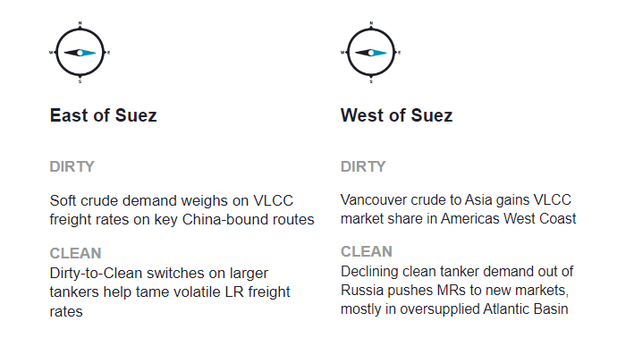
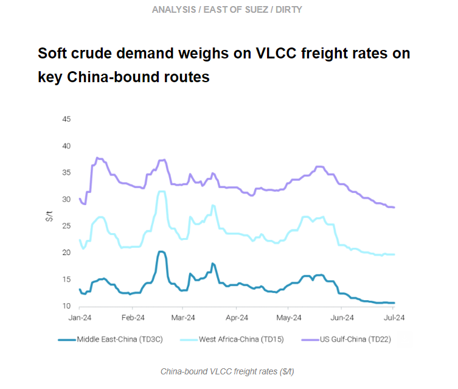
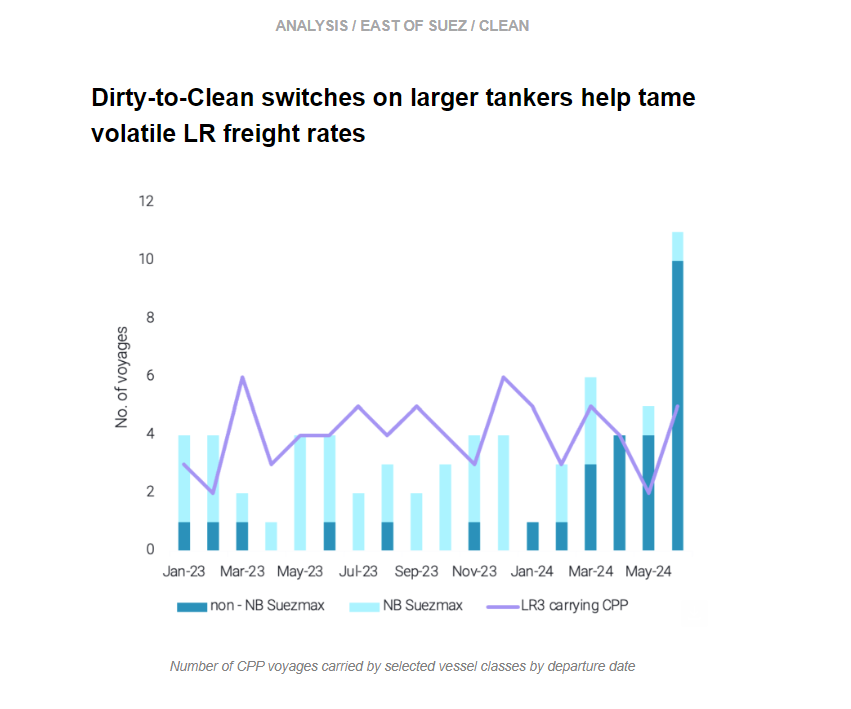
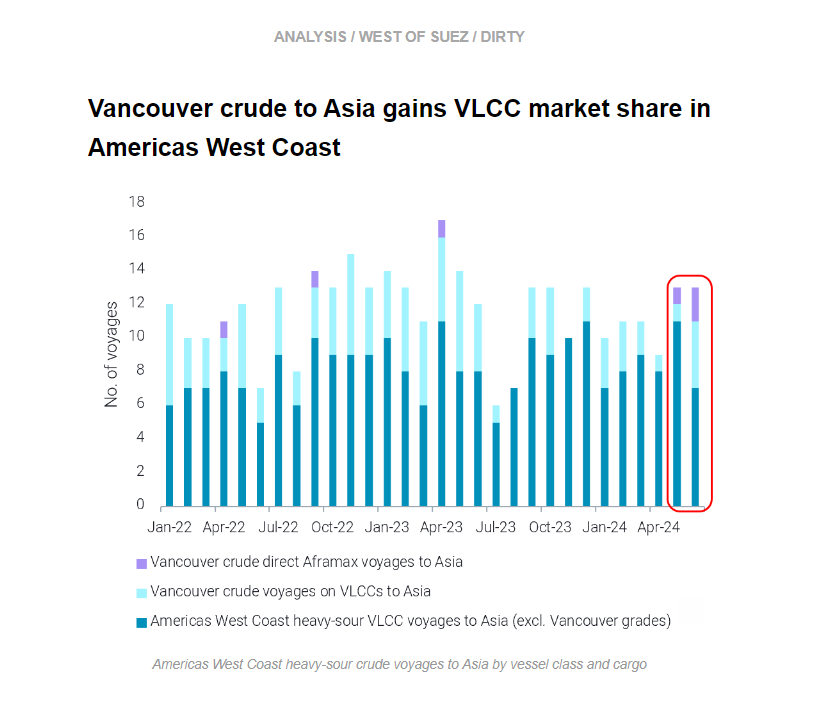
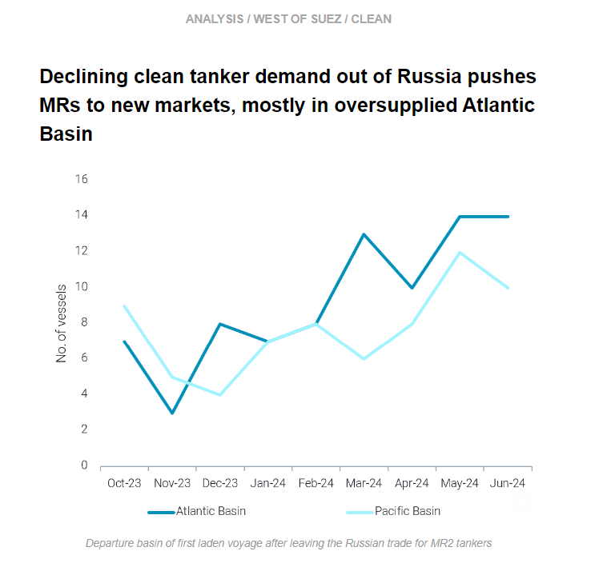

# Vancouver crude gains in VLCC market

**Date:** July 04, 2024  
**Publisher:** Breakwave Advisors | **Category:** Market Insights  
**Original URL:** [https://www.breakwaveadvisors.com/insights/2024/7/4/vancouver-crude-gains-in-vlcc-market](https://www.breakwaveadvisors.com/insights/2024/7/4/vancouver-crude-gains-in-vlcc-market)  

---

This week, in the East, we discuss the outlook for Chinese crude demand as China-bound VLCC rates reach year-to-date lows. On the clean side, we investigate why recent switches from dirty-to-clean for large vessel classes are taming volatility in LR rates. In the West, we look at the increased employment of VLCCs for Vancouver crude at the expense of other West Coast Americas heavy-sour grades. Finally, we explore where MRs leaving the Russian CPP trade are now trading.

*By*[*Mary Melton*](https://www.linkedin.com/search/results/all/?fetchDeterministicClustersOnly=true&heroEntityKey=urn%3Ali%3Afsd_profile%3AACoAABXVyecBtg-pRnIrZe0BoWk0ygPiUfbvhsw&keywords=mary%20melton&origin=RICH_QUERY_SUGGESTION&position=0&searchId=40e8d7d2-c4d0-4022-81e7-176f6eba418b&sid=H_Y&spellCorrectionEnabled=false)

> **Figure 1: Στιγμιότυπο Οθόνης 2024 07 04 115725**  
> **Interactive Data & Source:** [Marketingmail Vortexa](https://marketingmail.vortexa.com/ODM3LU1aRS01NzgAAAGUGCLCDN3oEEYYRsrJOazGz9Ns6GSymWCr5h4P0Q_7E6xzObjytHSsjjQd0YrfLOQ5MC-So74=) | [Local Asset](file:///C:/Users/Dell/Github/Shipping/corpus/03-breakwave/insights/2024/assets/2024-07-04_vancouver-crude-gains-in-vlcc-market_img_cea3cf84ceb9ceb3cebcceb9cf8ccf84cf85_c6a90af2b6b8.png)

> **Figure 2: Στιγμιότυπο Οθόνης 2024 07 04 115736**  
> **Interactive Data & Source:** [Marketingmail Vortexa](https://marketingmail.vortexa.com/ODM3LU1aRS01NzgAAAGUGCLCDN3oEEYYRsrJOazGz9Ns6GSymWCr5h4P0Q_7E6xzObjytHSsjjQd0YrfLOQ5MC-So74=) | [Local Asset](file:///C:/Users/Dell/Github/Shipping/corpus/03-breakwave/insights/2024/assets/2024-07-04_vancouver-crude-gains-in-vlcc-market_img_cea3cf84ceb9ceb3cebcceb9cf8ccf84cf85_4f75595bb0db.png)

- China-bound VLCC freight rates ([TD3C](https://marketingmail.vortexa.com/ODM3LU1aRS01NzgAAAGUGCLCDN3oEEYYRsrJOazGz9Ns6GSymWCr5h4P0Q_7E6xzObjytHSsjjQd0YrfLOQ5MC-So74=),[TD15](https://marketingmail.vortexa.com/ODM3LU1aRS01NzgAAAGUGCLCDksYiACwq5xX7IYAMJYZimVBMC3_39lRb-QKcowmt5g-e-VURlKg0-KZUmUE9R1ji4c=),[TD22](https://marketingmail.vortexa.com/ODM3LU1aRS01NzgAAAGUGCLCDi9O6q7w4XHUhyNbHScorN8FKAS5KuFFbg0OVf6yKf_mWSUutkGgBGMSxIpZbAIeSIQ=)) have been declining since mid-May, reaching year-to-date lows on July 1st.

- This decline is primarily driven by a soft China demand outlook even post-refining maintenance peak season. Chinese oil majors have cut runs at their operating units in June, while some Shandong teapot refiners have extended turnarounds to avoid bearish margins.[China’s onshore crude inventories](https://marketingmail.vortexa.com/ODM3LU1aRS01NzgAAAGUGCLCDQJ8xdBF5cg4rOypUpznzBkQf1kFmxK5D1jPtE7WOEGt1C0EzWLzGAHaeiWpCTr24II=)increased for the third consecutive week by June 30th, despite a m-o-m decrease in[seaborne crude imports](https://marketingmail.vortexa.com/ODM3LU1aRS01NzgAAAGUGCLCDZdW4elu1w_oslyzEpxKRmLUedYMAp_ajDtx0pFFEEvwzcjBjZMaskWJdJ6P27yb_N8=). We believe the recent stock build is due to demand weakness rather than a government mandate to expand the national reserve.
- China’s crude demand is expected to remain below last year’s levels without further incentives from Beijing. The soft China outlook could also encourage VLCC employment outside the key China-bound routes, such as reverse-lightering from TMX-origin Aframaxes and dirty-clean switches.

> **Figure 3: Στιγμιότυπο Οθόνης 2024 07 04 120009**  
> **Interactive Data & Source:** [Marketingmail Vortexa](https://marketingmail.vortexa.com/ODM3LU1aRS01NzgAAAGUGCLCDoHeSNguzQu1EMe7PPFHHMRZQawvCjVicubvy_bIaELpkw0B03WzGzdGnPMFyUUUJdo=) | [Local Asset](file:///C:/Users/Dell/Github/Shipping/corpus/03-breakwave/insights/2024/assets/2024-07-04_vancouver-crude-gains-in-vlcc-market_img_cea3cf84ceb9ceb3cebcceb9cf8ccf84cf85_8a86b0937530.png)

- According to our data, there[are 14 Suezmaxes](https://marketingmail.vortexa.com/ODM3LU1aRS01NzgAAAGUGCLCDoHeSNguzQu1EMe7PPFHHMRZQawvCjVicubvy_bIaELpkw0B03WzGzdGnPMFyUUUJdo=)which either have or are in the process of switching from carrying dirty to clean cargoes in 2024. These tankers are involved in voyages predominantly originating from the East of Suez (mainly Middle East and India) and destined towards the West of Suez.

- There are also up to[8 VLCCs](https://marketingmail.vortexa.com/ODM3LU1aRS01NzgAAAGUGCLCDinZng5Ub5MkT8dw-_6PUcFdhnxdX55h6CuNpdb5CyyZMiXbLGuqYD4lJtOQl1dPTSA=)which have or could potentially make the switch from dirty-to-clean based on a compilation of our data and reports.
- Trading houses have played a crucial role in instigating these switches in an effort to raise profitability by leveraging economies of scale. The Red Sea attacks which led to Cape of Good Hope rerouting have driven a volatility surge on East-to-West LR rates. On the other hand, Suezmax and VLCC rates are displaying more stability, with the latter continuing their declining trajectory since the end of May, currently at the[lowest levels](https://marketingmail.vortexa.com/ODM3LU1aRS01NzgAAAGUGCLCDZ4cKCHJwTJIIDP3W-1N21hkr3Hc2OGmVTxfV8GT70JZnVgXE0ifiIx_b3qwxckm-Ls=)for the year.

> **Figure 4: Στιγμιότυπο Οθόνης 2024 07 04 120202**  
> **Interactive Data & Source:** [Marketingmail Vortexa](https://marketingmail.vortexa.com/ODM3LU1aRS01NzgAAAGUGCLCDHNKFQadwKFpqGNWQnr9spF6oB6VjAO_9a5SyAOTOg4tOHwhdE4vH19X5VWMnVXC-ik=) | [Local Asset](file:///C:/Users/Dell/Github/Shipping/corpus/03-breakwave/insights/2024/assets/2024-07-04_vancouver-crude-gains-in-vlcc-market_img_cea3cf84ceb9ceb3cebcceb9cf8ccf84cf85_056c276684f0.png)

- With the ramp up of TMX and increased Aframax loadings at Westridge Terminal in Vancouver, reverse lightering of VLCCs for direct voyages to Asia is increasingly common. This allows for charterers to take advantage of economies of scale, as well as being an efficient use of Aframax tonnage as the VLCCs are loaded at the Pacific Lightering Zone (PLZ), only a short-haul voyage from Vancouver.

- Asia’s demand for heavy-sour Canadian crude originating from Vancouver is capping demand for other Americas West Coast heavy-sour grades (notably from Ecuador, West Coast Mexico and Colombia). In June,[exports of Vancouver-origin grades](https://marketingmail.vortexa.com/ODM3LU1aRS01NzgAAAGUGCLCDHNKFQadwKFpqGNWQnr9spF6oB6VjAO_9a5SyAOTOg4tOHwhdE4vH19X5VWMnVXC-ik=)(Cold Lake and Access Western Blend) accounted for about 47% of all exports of heavy-sour crude from the Americas West Coast to Asia. At the same time,[exports of the other heavy-sour crudes from Americas West Coast](https://marketingmail.vortexa.com/ODM3LU1aRS01NzgAAAGUGCLCDcWn2Ncdnyb71gy7iU5MOzmyeELzatIzdCqd_l5JyYvOHJuVR-pTc6UX-9pn0mwSSEc=)(Oriente, Castilla, Napo, Maya, Vasconia) fell 40% m-o-m.
- This gain in market share for Vancouver-origin grades going to Asia at the expense of the other heavy sour grades has not resulted in any notable gains in employment for VLCCS in the region. June voyage counts actually fell by one, as the[number of voyages for the other heavy-sour Americas West Coast crude grades decreased by 37% m-o-m](https://marketingmail.vortexa.com/ODM3LU1aRS01NzgAAAGUGCLCDOFacm_oOWyEwJwZ5A1T4nIhsz8gt7INtgpPmOzZgFOtzFkT1wAp0bxKJlib6zeWPJ4=). At a time when VLCC freight rates are at ytd lows and Asian appetite for Americas crude is muted, this is not good news for the vessel class. Saudi OSPs are reportedly going to decrease in August (Reuters), which could stimulate more Asian buying of MEG crude at the expense of Americas grades

> **Figure 5: Στιγμιότυπο Οθόνης 2024 07 04 120222**  
> **Interactive Data & Source:** [Marketingmail Vortexa](https://marketingmail.vortexa.com/ODM3LU1aRS01NzgAAAGUGCLCDkEtwsETU9NpzvcBajFWZ5FClRlXZS2BYs-kDiODqEsvuO1dBwS7iYX7p0kAWGOm8Ac=) | [Local Asset](file:///C:/Users/Dell/Github/Shipping/corpus/03-breakwave/insights/2024/assets/2024-07-04_vancouver-crude-gains-in-vlcc-market_img_cea3cf84ceb9ceb3cebcceb9cf8ccf84cf85_1dc942a9c37d.png)

- Drone strikes on Russian refineries plus regular seasonal maintenance ushered in a marked reduction in CPP exports out of Russian since March. Focusing on diesel, Russia’s most profitable CPP export,[volumes remain low](https://marketingmail.vortexa.com/ODM3LU1aRS01NzgAAAGUGCLCDkEtwsETU9NpzvcBajFWZ5FClRlXZS2BYs-kDiODqEsvuO1dBwS7iYX7p0kAWGOm8Ac=)since refinery attacks (June exports were 22% lower y-o-y). This has translated to a decline in voyage counts for MRs carrying Russian diesel, which have consistently remained below last year’s levels. Voyage counts fell further in June, which also coincides with[falling demand for Russian diesel from Turkey](https://marketingmail.vortexa.com/ODM3LU1aRS01NzgAAAGUGCLCDrXw0Cvpkn3IpMahtNVjGzN1Uz7Ki-IsakZFvyWE80VjlTDOVNXWLgVyFmV0mMVNvWA=).

- In a wider context, the decline in Russian CPP exports over the last three months has pushed MRs seeking employment to other markets. MRs left the Russian CPP trade in higher numbers in May and June, most commonly for the Atlantic Basin. The Med is the most common location for a vessel’s first load after leaving Russia, but South America East Coast and WAf are also popular for the vessels remaining in the Atlantic Basin. One-third of the MRs which left the Russian trade and loaded in a new market in May went to NE/SE Asia, likely enticed by healthy freight rates in the region in April, when the vessels would have made the decision to reposition. The softening in MR demand in Asia and the big increases in Atlantic Basin earnings in May (Baltic Exchange) likely decreased the attractiveness of the Pacific Basin markets for vessels leaving Russia in June compared to May.
- This extra vessel supply in the Atlantic Basin markets is likely to weigh on freight rates, specifically in Europe, where we see the majority of extra supply. The weakness on TC2 due to[muted PADD 1 gasoline demand](https://marketingmail.vortexa.com/ODM3LU1aRS01NzgAAAGUGCLCDVLs9kpvoOEss5KED4G_5ZpWkV0WMukaLbYxERVNaSqWv0vieDcvhvxdUcB317hYBBo=), the ramp up of Dangote and the[continued reduction in WAf demand for European CPP](https://marketingmail.vortexa.com/ODM3LU1aRS01NzgAAAGUGCLCDRyMOVLUNm669jfDF9Z2L9Ho1qoeFPvfvLWMRnQDD1iphJuCy6tY30BqH973t1m2dFw=), and[3 months of falling Turkish diesel exports](https://marketingmail.vortexa.com/ODM3LU1aRS01NzgAAAGUGCLCDSzzuuUNCMrbhvLSU5qBicc3U7W2s3-8Qwsbqn4xqL56NuFANtP-rQsbrGXcKCOLQ6Q=)all point to an overall weakening in demand for MRs in Europe.

Data Source:[Vortexa](https://www.vortexa.com//oil-gas-data-traders-analysts-data-scientists?gclid=Cj0KCQjw8_qRBhCXARIsAE2AtRZKOvMnbilZ_6_91d7huSFFy71pWLrnPwGwOHVzXsmsG-1a1mZnQw8aAt89EALw_wcB&hsa_acc=1782073842&hsa_ad=548425387665&hsa_cam=14746637662&hsa_grp=125038601902&hsa_kw=&hsa_mt=&hsa_net=adwords&hsa_src=g&hsa_tgt=dsa-1431852288425&hsa_ver=3&utm_campaign=%5BCD%5D%20-%20DSA%20-%20EMEA&utm_medium=cpc&utm_medium=ppc&utm_source=google&utm_source=adwords&utm_term=)

---

**Tags:** Shipping, Crude Oil, Tankers  
