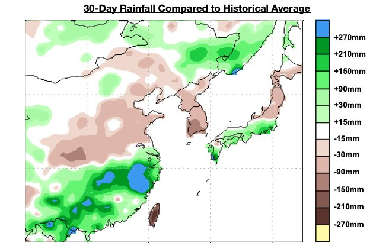
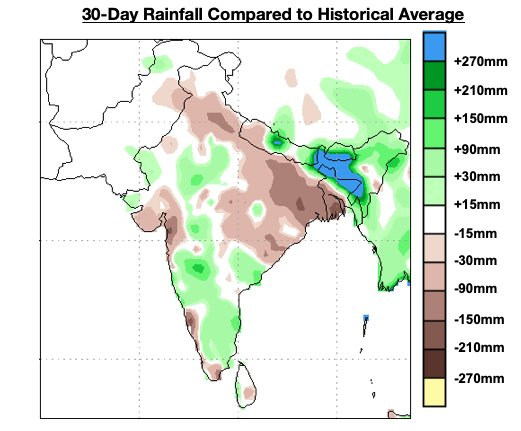
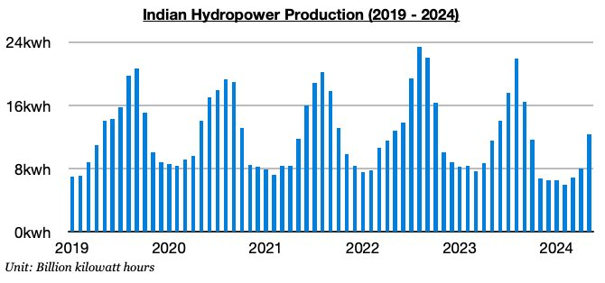
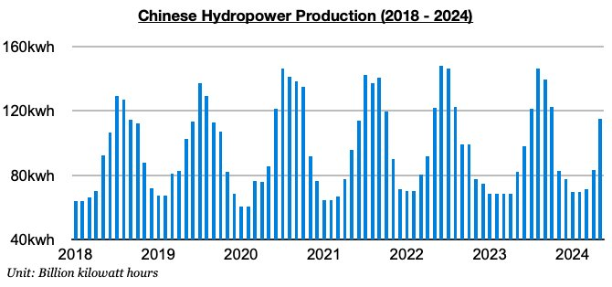

# A Tale of Two Very Different Rainy Seasons

**Date:** July 05, 2024  
**Publisher:** Breakwave Advisors | **Category:** Market Insights  
**Original URL:** [https://www.breakwaveadvisors.com/insights/2024/7/5/a-tale-of-two-very-different-rainy-seasons](https://www.breakwaveadvisors.com/insights/2024/7/5/a-tale-of-two-very-different-rainy-seasons)  

---

*By*[*Jeffrey Landsberg*](https://www.linkedin.com/in/jeffrey-landsberg-70ab957/)

As we have been discussing in Commodore's Weekly Dry Bulk Reports, China’s rainfall has been much greater than usual since April and has been resulting in a surge in hydropower output. April saw hydropower output grow year-on-year by 22%, and in May it grew 40% (which marked only the second time in the ten years where 40% growth occurred). Data is pending for June, but rainfall was greater than usual again in the south and hydropower output has certainly continued to surge.

> **Figure 1: Chart 1**  
> [Local Asset](file:///C:/Users/Dell/Github/Shipping/corpus/03-breakwave/insights/2024/assets/2024-07-05_a-tale-of-two-very-different-rainy-seasons_img_chart1_bf03ba095a56.jpg)

As we also have been highlighting in our reports, hydropower output has been more muted in India. Heavy rainfall has been an issue for China, but not for India. Rainfall most recently was lower than usual in vital parts of India last month, and we expect June’s data will show India’s hydropower output has reverted back to contraction.

> **Figure 2: Chart 2**  
> [Local Asset](file:///C:/Users/Dell/Github/Shipping/corpus/03-breakwave/insights/2024/assets/2024-07-05_a-tale-of-two-very-different-rainy-seasons_img_chart2_dac81d889a32.jpg)

Most of India’s major hydro stations are located on the western coast, north, and eastern third where rainfall was predominantly lower than usual. As a result, there is a solid chance that once June’s data is released it will show that India’s hydropower output fell back into contraction last month. As we discussed in earlier work, May saw India’s hydropower output grow year-on-year by 7% — but prior to that, India’s hydropower output had contracted on a year-on-year basis for ten straight months. There is now a solid chance that hydropower output is back in a contraction.

> **Figure 3: Chart 3**  
> [Local Asset](file:///C:/Users/Dell/Github/Shipping/corpus/03-breakwave/insights/2024/assets/2024-07-05_a-tale-of-two-very-different-rainy-seasons_img_chart3_19cde73bb153.jpg)

In China, rainfall has remained much stronger than usual in the south where most of the nation’s major hydro stations are located. June’s data when it is released is all but guaranteed to show that hydropower output has continued to surge. For us, the only real question is if May’s robust 40% year-on-year growth will be topped. Overall, robust hydropower output will remain a strong headwind for China’s coal-derived electricity generation. It remains concerning to us that China’s coal-derived electricity generation in May experienced a rare contraction due to the hydropower output surge, and that domestic coal production — while also contracting that month — finally fared better than coal-derived electricity generation.

> **Figure 4: Chart 4**  
> [Local Asset](file:///C:/Users/Dell/Github/Shipping/corpus/03-breakwave/insights/2024/assets/2024-07-05_a-tale-of-two-very-different-rainy-seasons_img_chart4_ce3f3a389257.jpg)

---

**Tags:** Coal, China, Economy  
