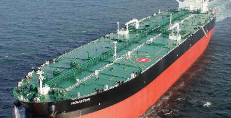
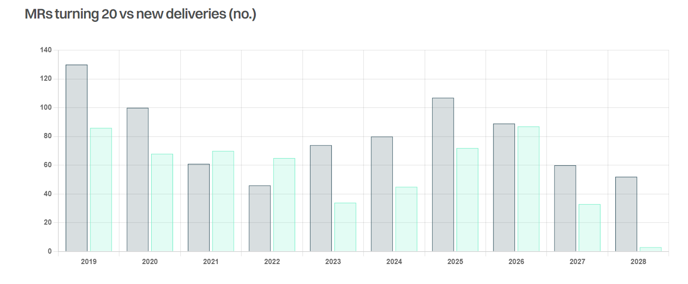

# Mired in MRs

**Date:** July 05, 2024  
**Publisher:** Breakwave Advisors | **Category:** Market Insights  
**Original URL:** [https://www.breakwaveadvisors.com/insights/2024/7/5/mired-in-mrs](https://www.breakwaveadvisors.com/insights/2024/7/5/mired-in-mrs)  

---

> **Figure 1: Στιγμιότυπο Οθόνης 2024 07 05 095300**  
> **Interactive Data & Source:** [Gibsons Co](https://www.gibsons.co.uk/market-reports) | [Local Asset](file:///C:/Users/Dell/Github/Shipping/corpus/03-breakwave/insights/2024/assets/2024-07-05_mired-in-mrs_img_cea3cf84ceb9ceb3cebcceb9cf8ccf84cf85_1b8893120651.png)

MR tankers, the workhorses of both the clean and occasionally dirty product markets form the largest segment of the tanker industry. They are essential for the overall functioning of the market, making a detailed analysis of MR supply crucial for understanding tanker market dynamics.

MRs are ageing fast, with the numbers between the ages of 15 to 19 years accounting for nearly 30% of the existing fleet. This raises concerns that a substantial number of tankers will soon exceed 20 years of age, limiting their trading capabilities in regions where they typically operate. Whilst the fleet is ageing, we have also seen an increase in ordering activity. Last year, 114 units were ordered, with another 71 this year, already more than half of last year’s total. As such, the MR orderbook currently stands at close to 230 vessels, representing 13% of the existing fleet.

Nonetheless, despite the increase in scheduled deliveries in 2025 and 2026, the number of tankers in the 15-to-19-year bracket is still higher. In addition, another 13% of the current fleet is 20 years of age or over, with many of these vessels finding alternative employment opportunities outside the conventional market, primarily on the back of changing geopolitical dynamics. The Russia-Ukraine war coupled with the Red Sea crisis has boosted tonne miles demand. At the same time, the growing influx of vessels into the dark fleet has pulled tonnage from the mainstream MR market helping to support rates. We currently estimate that 181 out of approximately 1,720 vessels in the MR fleet are exclusively trading in Iran, Venezuela, and Russia. This significant portion, which is around 10% of the fleet, is substantial enough for their absence from the main trade to be felt.

The combination of growing demand and tightening supply of tankers available to international players is supporting the consistent strength in the MR market. For the year to date, global spot TCE earnings have averaged $35,000/day (non-Eco) and $31,250/day in 2022/23. This compares to an average of $13,500/day between 2010 and 2019.

Structural changes in clean tanker flows due to sanctions on Russia are likely to stay in place for the foreseeable future. However, there is a great degree of uncertainty when it comes to Red Sea attacks. It is impossible to predict how long the Israel/Gaza conflict will last, but if/when tanker traffic through the Red Sea resumes, it will have negative implications for clean tonne miles demand, although it will be felt most acutely by larger product carriers. For the MR trade specifically, the Dangote refinery in West Africa and the Olmeca refinery in Mexico could disrupt the traditional structure of the clean trade, potentially harming the market. On the upside, however, the earmarked closure of multiple refineries in Europe between 2025 and 2027 may still facilitate regional CPP imports despite disappointing demand indicators.

The exact effects of these demand-side developments are yet to play out. On supply side, however, the picture is much clearer: unless the orderbook continues to grow, the size of the fleet under 20 years of age will continue to shrink.

> **Figure 2: Στιγμιότυπο Οθόνης 2024 07 05 095602**  
> **Interactive Data & Source:** [Gibsons Co](https://www.gibsons.co.uk/market-reports) | [Local Asset](file:///C:/Users/Dell/Github/Shipping/corpus/03-breakwave/insights/2024/assets/2024-07-05_mired-in-mrs_img_cea3cf84ceb9ceb3cebcceb9cf8ccf84cf85_340d8003659d.png)

Data source:[Gibson Shipbrokers](https://www.gibsons.co.uk/market-reports)

---

**Tags:** Tankers, Shipping, Crude Oil  
