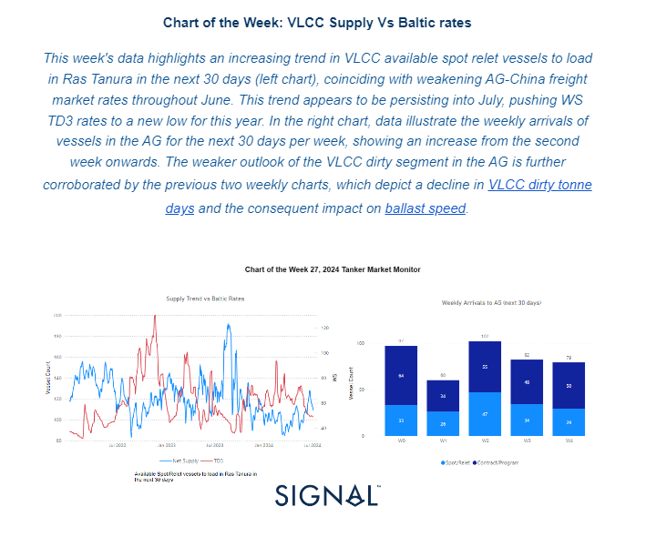
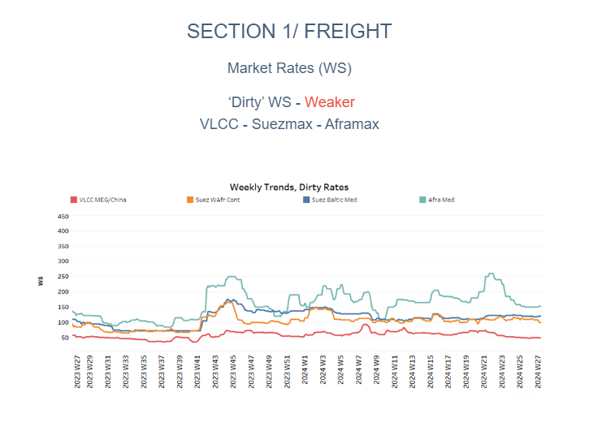
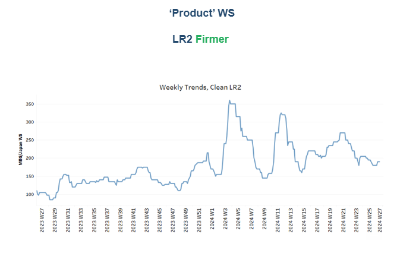
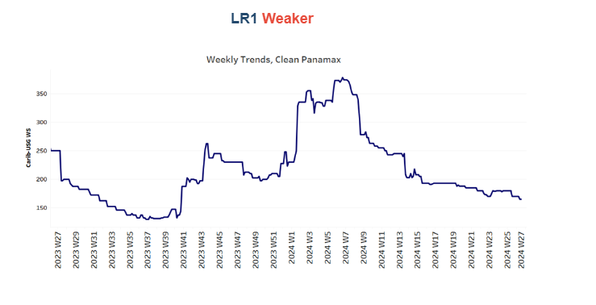
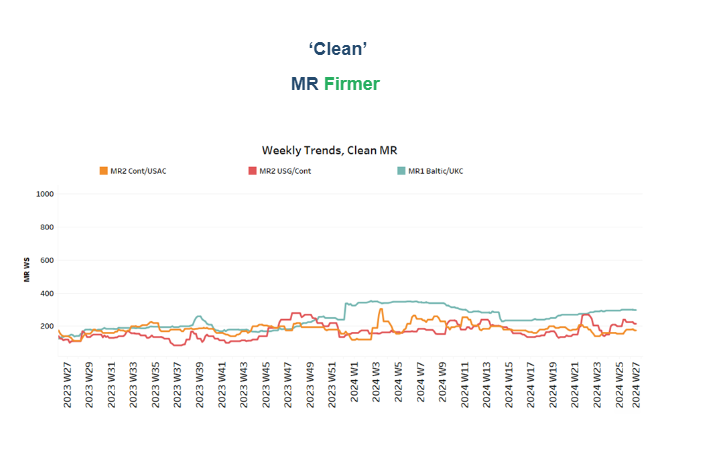
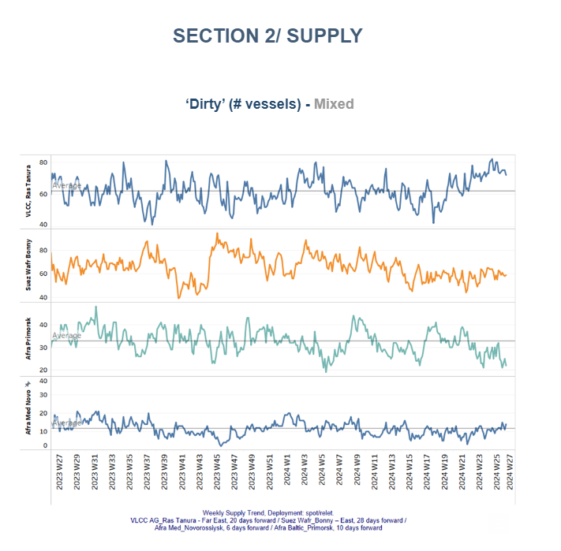
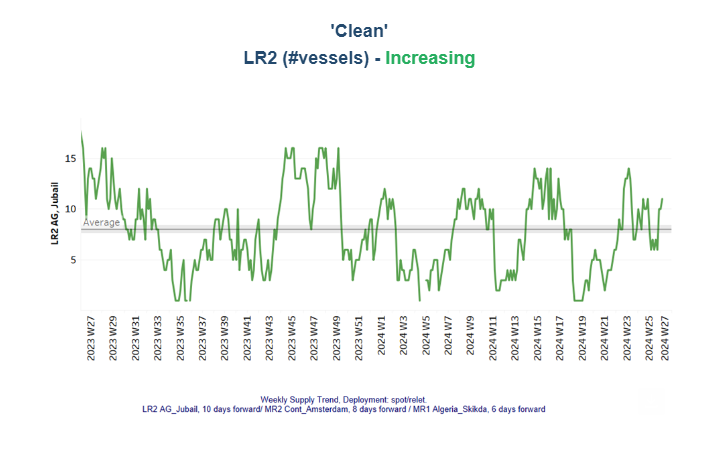
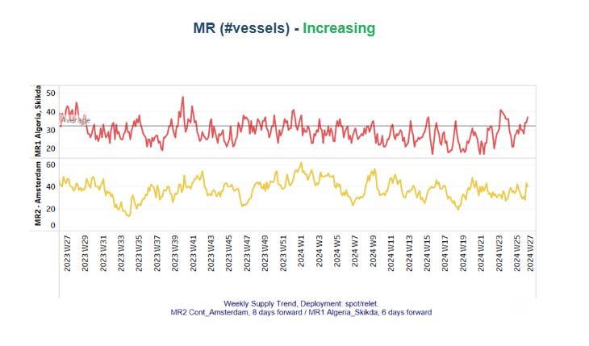
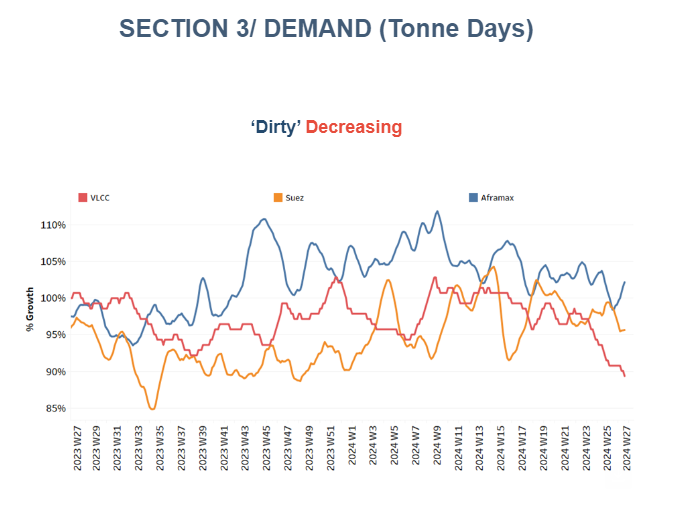
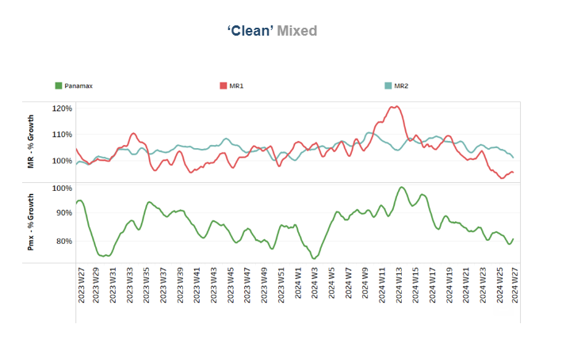

# VLCC Supply Vs Baltic rates

**Date:** July 05, 2024  
**Publisher:** Breakwave Advisors | **Category:** Market Insights  
**Original URL:** [https://www.breakwaveadvisors.com/insights/2024/7/5/vlcc-supply-vs-baltic-rates](https://www.breakwaveadvisors.com/insights/2024/7/5/vlcc-supply-vs-baltic-rates)  

---

## Tanker - Weekly Market Monitor

Snapshot of Crude and Product Freight Rates, Supply-Demand

Week 27, July 04, 2024

> **Figure 1: Στιγμιότυπο Οθόνης 2024 07 05 084527**  
> **Interactive Data & Source:** [Signal Ocean Platform](https://go.signalocean.com/e/983831/Cut-Production-Again-Soon-html/2qc2fd/421195769/h/v34Q9kiwtlTBj_gBwmAKRHiYKOG-KwAYEkse7LPYRak) | [Local Asset](file:///C:/Users/Dell/Github/Shipping/corpus/03-breakwave/insights/2024/assets/2024-07-05_vlcc-supply-vs-baltic-rates_img_cea3cf84ceb9ceb3cebcceb9cf8ccf84cf85_6d05e536065f.png)

The first week of July saw a continued weakening in crude oil freight rates, driven by the increasing supply of VLCCs, which exerted significant downward pressure on the market. The increased availability of spot relet vessels in Ras Tanura suggests a potential oversupply in the market, which has contributed to the decline in AG-China freight rates. As more vessels become available, competition among them intensifies, leading to lower rates. This oversupply scenario is likely to persist, keeping the WS TD3 rates suppressed.

The right chart's data on weekly arrivals in the AG for the next 30 days highlights a significant rise in vessel arrivals from the second week onward. This increase in arrivals may further exacerbate the oversupply situation, as more vessels enter the market looking for cargoes. This trend aligns with the observed weakening in the VLCC dirty segment, as illustrated in the previous charts of our weekly market monitor.

The decline in VLCC dirty tonne days indicates a reduced demand for VLCCs in the market, contributing to the downward pressure on freight rates. Additionally, the impact on ballast speeds suggests that vessels are sailing at slower speeds due to the lack of available cargoes, further indicating a weak market outlook.

Overall, the data from the left and right charts, along with the previous weekly charts, paint a comprehensive picture of a struggling VLCC market in the AG. The combination of increasing vessel availability, rising weekly arrivals, declining tonne days, and reduced ballast speeds all point towards a continued weak market environment for VLCCs in the near term.

In terms of oil supply and prices, recent data shows that[OPEC+ has extended its production cuts](https://go.signalocean.com/e/983831/Cut-Production-Again-Soon-html/2qc2fd/421195769/h/v34Q9kiwtlTBj_gBwmAKRHiYKOG-KwAYEkse7LPYRak)totaling 3.66 million barrels per day (bpd) until 2025. These cuts aim to stabilise the oil market by reducing excess supply and supporting higher oil prices. The decision to extend the cuts reflects OPEC+'s ongoing strategy to manage oil production levels in response to global economic conditions and demand fluctuations. By carefully controlling supply, OPEC+ seeks to mitigate market volatility, maintain a balanced oil market, and ensure economic stability for both producers and consumers. This approach highlights OPEC+'s crucial role in shaping the global oil landscape and underscores the importance of coordinated efforts to sustain market equilibrium.

> **Figure 2: Στιγμιότυπο Οθόνης 2024 07 05 084655**  
> **Interactive Data & Source:** [Signal Ocean Platform](https://www.thesignalgroup.com/signal-ocean-platform) | [Local Asset](file:///C:/Users/Dell/Github/Shipping/corpus/03-breakwave/insights/2024/assets/2024-07-05_vlcc-supply-vs-baltic-rates_img_cea3cf84ceb9ceb3cebcceb9cf8ccf84cf85_77ca087797cf.png)

The noticeable downward trend in VLCC MEG-China freight rates persisted into the first week of July, marking the weakest performance recorded since the beginning of the year. Similarly, the Aframax Med route continues to face significant downward pressure, with the latest peak observed six weeks ago.

- The**VLCC**MEG-China freight rates have dropped to 49 WS, reflecting a significant 16% decrease compared to the rates observed a year ago.
- Suezmax freight rates for shipments from**West Africa to continental Europe**were holding steady at 110 WS throughout June. However, early indications for July suggest a drop of 10 points. Similarly, rates on the**Suez Baltic Med**route have remained stable at approximately 120 WS through early July, reflecting consistent sentiment compared to rates observed in the same week a month ago.
- Aframax**Mediterranean**freight rates have remained steady around WS150 since the conclusion of week 24, signalling a 30% decline compared to the previous month.

> **Figure 3: Στιγμιότυπο Οθόνης 2024 07 05 084711**  
> **Interactive Data & Source:** [Signal Ocean Platform](https://www.thesignalgroup.com/signal-ocean-platform) | [Local Asset](file:///C:/Users/Dell/Github/Shipping/corpus/03-breakwave/insights/2024/assets/2024-07-05_vlcc-supply-vs-baltic-rates_img_cea3cf84ceb9ceb3cebcceb9cf8ccf84cf85_39e4211197d5.png)

- **LR2**AG freight rates rose to WS190, marking a 10-point increase from rates observed a week ago. Recent sentiment suggests a 90% increase compared to the same week last year.

> **Figure 4: Στιγμιότυπο Οθόνης 2024 07 05 084725**  
> **Interactive Data & Source:** [Signal Ocean Platform](https://www.thesignalgroup.com/signal-ocean-platform) | [Local Asset](file:///C:/Users/Dell/Github/Shipping/corpus/03-breakwave/insights/2024/assets/2024-07-05_vlcc-supply-vs-baltic-rates_img_cea3cf84ceb9ceb3cebcceb9cf8ccf84cf85_40cad96bfca9.png)

- **Panamax**Carib-to-USG rates dropped by 5 points from the previous week, settling around WS 165. Currently, they are 34% weaker compared to rates during a similar week last year.

> **Figure 5: Στιγμιότυπο Οθόνης 2024 07 05 084758**  
> **Interactive Data & Source:** [Signal Ocean Platform](https://www.thesignalgroup.com/signal-ocean-platform) | [Local Asset](file:///C:/Users/Dell/Github/Shipping/corpus/03-breakwave/insights/2024/assets/2024-07-05_vlcc-supply-vs-baltic-rates_img_cea3cf84ceb9ceb3cebcceb9cf8ccf84cf85_961f019dbc11.png)

- **MR1**rates for shipments from the**Baltic to the continent**continued their robust momentum from the end of June, reaching nearly 290 WS and signalling a 50% increase compared to levels a year ago. Meanwhile,**MR2 rates**for shipments from the**continent to the USAC**climbed to 175 WS, up 5 points from the previous week, reflecting a 13% annual increase. On the USG-Cont route, MR2 rates eased from last week's peaks to 210 WS, still marking a significant 70% annual increase.

> **Figure 6: Στιγμιότυπο Οθόνης 2024 07 05 084814**  
> **Interactive Data & Source:** [Signal Ocean Platform](https://www.thesignalgroup.com/signal-ocean-platform) | [Local Asset](file:///C:/Users/Dell/Github/Shipping/corpus/03-breakwave/insights/2024/assets/2024-07-05_vlcc-supply-vs-baltic-rates_img_cea3cf84ceb9ceb3cebcceb9cf8ccf84cf85_9289a168022f.png)

The supply trend for crude tankers at the VLCC Ras Tanura has shown a consistent increase over the last six weeks. In contrast, the Aframax Primosk continues to indicate a decline below the annual average, contrasting with the highs observed during week 20.

- **VLCC Ras Tanura**: The supply of crude tankers at VLCC Ras Tanura has steadily increased over the past six weeks. Conversely, Aframax Primosk continues to demonstrate a decline below the annual average, diverging from the peak levels observed in week 20.
- **Suezmax Wafr**: The current ship count remains around 60 for the fourth consecutive week, reflecting an increase of 14 compared to low observed at the end of week 22.
- **Aframax Primorsk**: For the past five weeks, the number of ships has consistently remained well below the annual average of 30, nearly 10 fewer than the peak recorded at the beginning of week 26.
- **Aframax Med Novo**: Since the end of week 22, the vessel count has consistently hovered around the annual average of 10. Early estimates for July suggest a slight upward trend, which is expected to be confirmed in the coming days.

> **Figure 7: Στιγμιότυπο Οθόνης 2024 07 05 085242**  
> **Interactive Data & Source:** [Signal Ocean Platform](https://www.thesignalgroup.com/signal-ocean-platform) | [Local Asset](file:///C:/Users/Dell/Github/Shipping/corpus/03-breakwave/insights/2024/assets/2024-07-05_vlcc-supply-vs-baltic-rates_img_cea3cf84ceb9ceb3cebcceb9cf8ccf84cf85_3f87575325c9.png)

> **Figure 8: Στιγμιότυπο Οθόνης 2024 07 05 085255**  
> **Interactive Data & Source:** [Signal Ocean Platform](https://www.thesignalgroup.com/signal-ocean-platform) | [Local Asset](file:///C:/Users/Dell/Github/Shipping/corpus/03-breakwave/insights/2024/assets/2024-07-05_vlcc-supply-vs-baltic-rates_img_cea3cf84ceb9ceb3cebcceb9cf8ccf84cf85_99c38c532962.png)

- **Clean LR2 AG Jubail:**The downward trend in the number of vessels observed in the last days of June has now reversed to an upward move, with the count nearing 11, showing indications of an increase above the annual trend in the next few days.**Clean MR**: Vessel activity for**MR1**at Algeria's Skikda port has surged to 37, marking a significant rise of nearly 16 from the low observed just two weeks ago. Meanwhile,**MR2**activity in Amsterdam has also shown signs of growth, climbing above 40, which is an increase of nearly 15 compared to the previous week.

> **Figure 9: Στιγμιότυπο Οθόνης 2024 07 05 085309**  
> **Interactive Data & Source:** [Signal Ocean Platform](https://www.thesignalgroup.com/signal-ocean-platform) | [Local Asset](file:///C:/Users/Dell/Github/Shipping/corpus/03-breakwave/insights/2024/assets/2024-07-05_vlcc-supply-vs-baltic-rates_img_cea3cf84ceb9ceb3cebcceb9cf8ccf84cf85_f3ecf80ed307.png)

- **Dirty**tonne days: The growth of VLCC tonne days continued to decline sharply in the first week of July, reaching its lowest point in the past twelve months. In contrast, early signs of a potential upward reversal in the Suezmax segment at the end of June have now turned into a downward correction for July. It is noteworthy that initial indications suggest a possible upward trend in Aframax tonne days, although it remains uncertain whether this will be sustained in the weeks ahead in July.

> **Figure 10: Στιγμιότυπο Οθόνης 2024 07 05 085321**  
> **Interactive Data & Source:** [Signal Ocean Platform](https://www.thesignalgroup.com/signal-ocean-platform) | [Local Asset](file:///C:/Users/Dell/Github/Shipping/corpus/03-breakwave/insights/2024/assets/2024-07-05_vlcc-supply-vs-baltic-rates_img_cea3cf84ceb9ceb3cebcceb9cf8ccf84cf85_8822edede600.png)

- **Panamax**tonne days: Amid signs for an improvement, still growth rates are significantly weaker from the growth observed ten weeks ago.

- For**Clean MR**tonne days, the MR1 vessel has witnessed a notable decline over the past month, despite early indications of a potential turnaround. Meanwhile, the growth in tonne days for MR2 vessels started to decrease towards the end of week 24, with recent figures reflecting levels not seen since week 12.

Data Source:[Signal Ocean Platform](https://www.thesignalgroup.com/signal-ocean-platform)

---

**Tags:** Shipping, Tankers, Crude  
