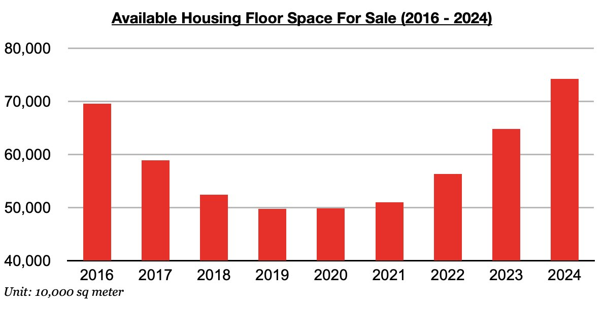
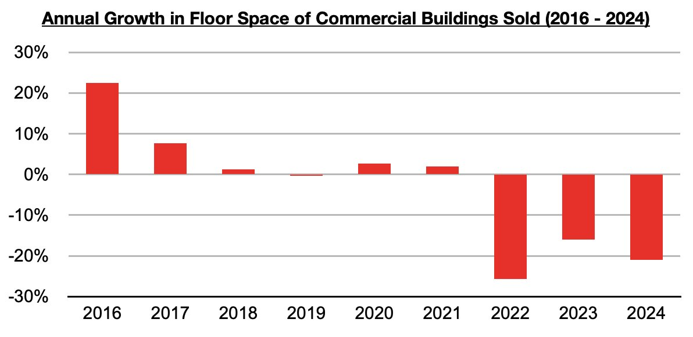

# China's Decision to Buy Unsold Homes Not Yet Having Major Impact

**Date:** July 08, 2024  
**Publisher:** Breakwave Advisors | **Category:** Market Insights  
**Original URL:** [https://www.breakwaveadvisors.com/insights/2024/7/8/miv998ruaula0selug8xmke4lo73x3](https://www.breakwaveadvisors.com/insights/2024/7/8/miv998ruaula0selug8xmke4lo73x3)  

---

*By*[*Jeffrey Landsberg*](https://www.linkedin.com/in/jeffrey-landsberg-70ab957/)

As we discussed in Commodore Research's most recent Weekly China Report, May ended with 742 million square meters of floor space available in China's commercial buildings (which includes residential buildings). This has marked another tiny 0.5% decline from the previous month, and has marked a third straight month that available floor space has declined. Prior to these last three months, September was the last time that available floor space declined. Still, though, this 742 million square meter total remains a great deal higher than seen in previous years.

> **Figure 1: Chart 1 (1)**  
> [Local Asset](file:///C:/Users/Dell/Github/Shipping/corpus/03-breakwave/insights/2024/assets/2024-07-08_miv998ruaula0selug8xmke4lo73x3_img_chart128129_f2a771abcf77.jpg)

Overall, the last several years have continued to struggle with a huge amount of excess floor space available in the housing market. This continues to come not from just more homes being built in China, but very significantly also from sales decreasing. Sales this year have contracted year-on-year by 21%, which continues to put this year on pace to end as the third straight year that sales have contracted.

As we have stressed often in our weekly reports, this year’s ongoing contraction in sales remains much larger than the 16% contraction that was seen last year and is fairly close to the record 26% contraction that was seen in 2022. 2017 remains the last year that saw any significant growth in housing sales in China. 2018 through 2021 saw growth average just 1% (which included a small contraction in 2019), and 2022 through this year have seen a huge contraction.

> **Figure 2: Chart 2 (1)**  
> [Local Asset](file:///C:/Users/Dell/Github/Shipping/corpus/03-breakwave/insights/2024/assets/2024-07-08_miv998ruaula0selug8xmke4lo73x3_img_chart228129_a71359260a55.jpg)

---

**Tags:** China, Economy, Drybulk  
