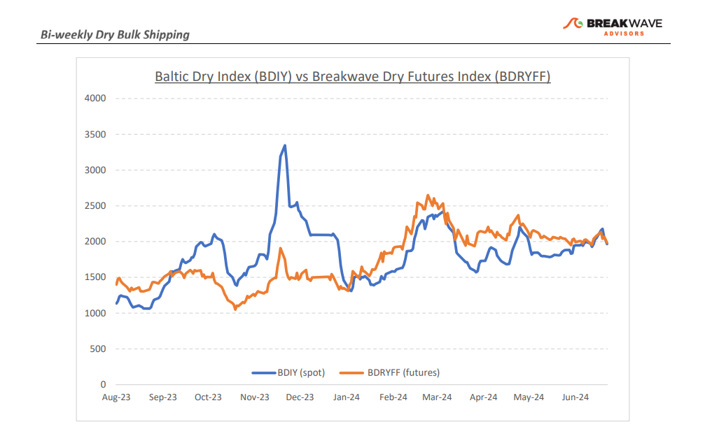
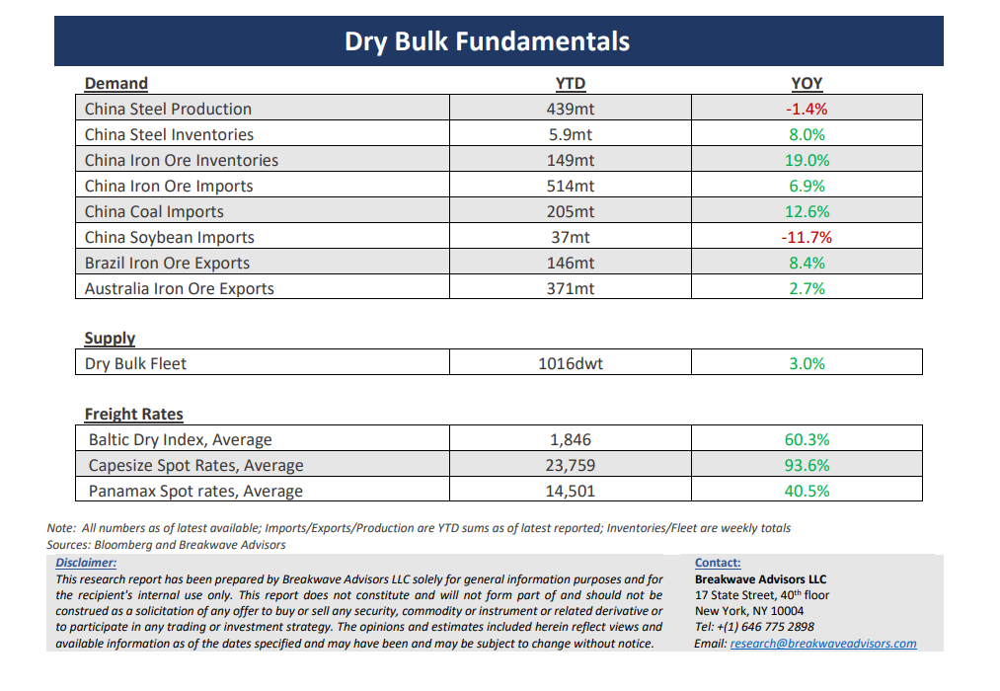

# Breakwave Bi-Weekly Dry Bulk Report - July 9, 2024

**Date:** July 09, 2024  
**Publisher:** Breakwave Advisors | **Category:** Market Insights  
**Original URL:** [https://www.breakwaveadvisors.com/insights/2024625dry-87w49-b6s86](https://www.breakwaveadvisors.com/insights/2024625dry-87w49-b6s86)  

---

> **Figure 1: Cea3cf84ceb9ceb3cebcceb9cf8ccf84cf85**  
> [Local Asset](file:///C:/Users/Dell/Github/Shipping/corpus/03-breakwave/insights/2024/assets/2024-07-09_2024625dry-87w49-b6s86_img_cea3cf84ceb9ceb3cebcceb9cf8ccf84cf85_19b37e1009d9.png)

**· Freight Futures Volatility Drops to 5-Year Lows as Spot Rates Remain Rangebound**– Volatility has all but disappeared in the**usually highly volatile**freight futures market, as**spot rates**have remained relatively**steady**and any tightness or slackness in the tonnage supply have so far appeared temporary in nature. Although spot rates are still at healthy and mostly profitable levels, the**lack of volatility****is a worrisome sign**, in our view. After all, if everyone feels comfortable with the current conference rates, the risk of**a potential “vacuum”**in the market balance could remain overlooked and lead to a mini panic if hedgers keep increasing gross risk exposure due to a lower implied volatility. Whether it is a**“calm-before-the-storm”**situation or a reflection of the usual**summer lull**is yet to be seen, but we continue to be cautious given the relatively slow seasonal demand period ahead of us. Clearly,**year-to-date**dry bulk volumes have been**exceptionally strong**despite the lack of end user demand in China, the most important region for dry bulk, and a “**reversion-to-the-mean**” development will see volumes declining significantly on a sequential basis as we head into the second half of the year. On the other hand, a lot of other**China-focused commodity markets**are betting on a Chinese**resurgence**and if such an expectation becomes reality, then volumes might not decline as much as we anticipate. Overall, we see**little reason for a sizable move**either way for freight, but, as always, this is shipping, and the next move will end up being significant and most likely quite violent, especially against a flattish and rangebound future curve, if history is any guidance.

**· Iron Ore Inventories Continue to Build as Demand Remains Lukewarm**– As**profit margins**for Chinese steel mills are heading back down to**record lows**, it is interesting to observe an iron ore market where from one hand wants to reflect the overall bullishness similar to most other commodities but on the other hand to also price-in the**considerable oversupply**of the steelmaking material, not only in the seaborne market but also at portside inventory. Although breakeven levels for miners have increased considerably over the last several years, iron ore prices still remain profitable at above $100/ton. At the same time,**deep negative steel margins**continue to put a lot of financial pressure on steel mills in China.**Inventories are being built**, as steel mills cannot make money processing ore at current prices. As we head into the second half of the year, we can’t help wondering how the current situation will resolve: Either iron ore must drop considerably to price out the high-cost iron ore miners or Chinese steel production needs to pick up meaningly to absorb the excess supply. For now, the**odds of a significant increase**in production seem distant as the Chinese economy remains under pressure, especially for the very important real estate sector.

**· Our Long-term View –**The last few years have been characterized by increased geopolitical uncertainty. Going forward, we expect such events to continue to affect global trade and have a meaningful impact on effective vessel supply. Combined with the potential for a multi-year cyclical rebound in China’s economic activity following the recent economic turmoil, dry bulk shipping should experience higher volatility on top of a secular tightness driven by increasing bulk commodity demand and a slower fleet growth as a result of a relatively low orderbook.

> **Figure 2: Cea3cf84ceb9ceb3cebcceb9cf8ccf84cf85**  
> [Local Asset](file:///C:/Users/Dell/Github/Shipping/corpus/03-breakwave/insights/2024/assets/2024-07-09_2024625dry-87w49-b6s86_img_cea3cf84ceb9ceb3cebcceb9cf8ccf84cf85_6e841b38d49d.png)

> **Figure 3: Cea3cf84ceb9ceb3cebcceb9cf8ccf84cf85**  
> [Local Asset](file:///C:/Users/Dell/Github/Shipping/corpus/03-breakwave/insights/2024/assets/2024-07-09_2024625dry-87w49-b6s86_img_cea3cf84ceb9ceb3cebcceb9cf8ccf84cf85_08ff9e6658f2.png)

### Subscribe:
