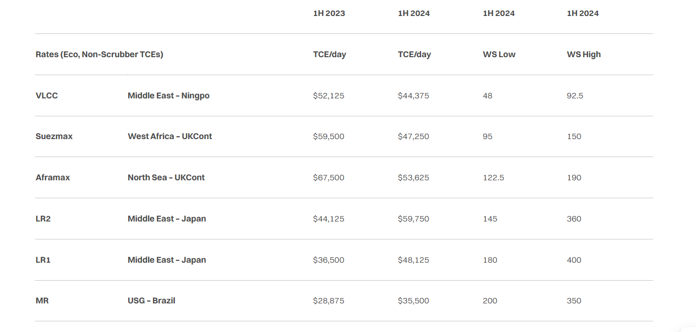
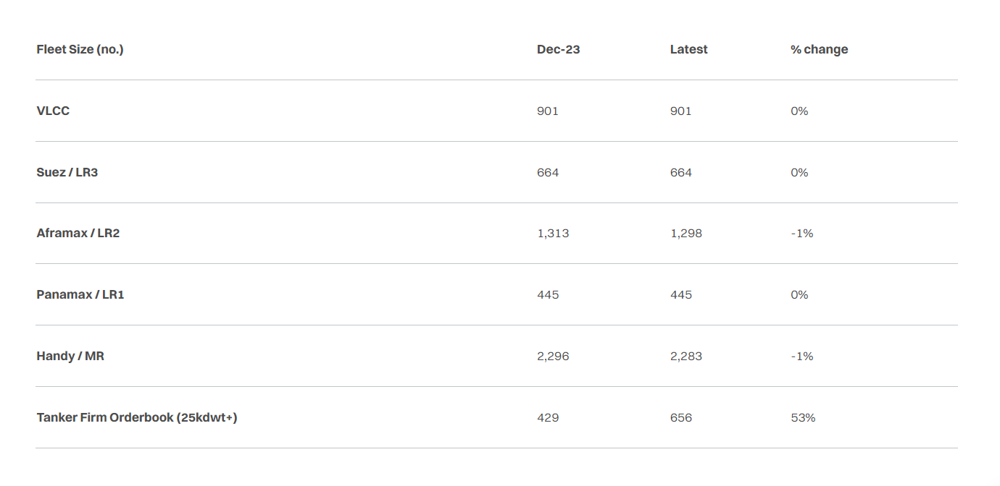
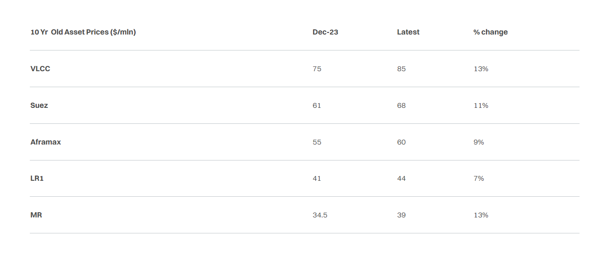
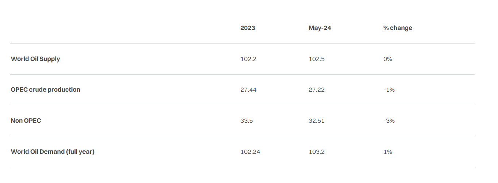
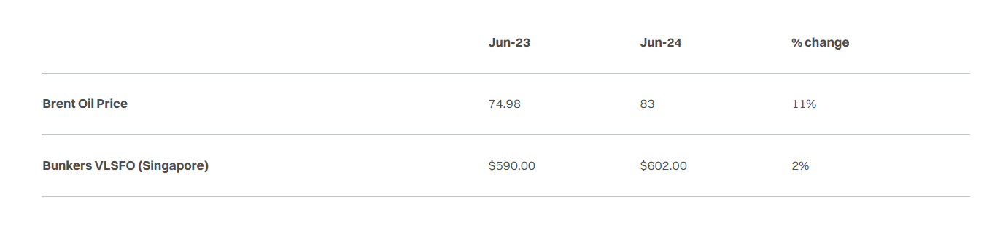

# Mid-year review

**Date:** July 10, 2024  
**Publisher:** Breakwave Advisors | **Category:** Market Insights  
**Original URL:** [https://www.breakwaveadvisors.com/insights/2024/7/10/mid-year-review](https://www.breakwaveadvisors.com/insights/2024/7/10/mid-year-review)  

---

> **Figure 1: Tankers 4 Square**  
> **Interactive Data & Source:** [Gibsons Co](https://www.gibsons.co.uk/market-reports) | [Local Asset](file:///C:/Users/Dell/Github/Shipping/corpus/03-breakwave/insights/2024/assets/2024-07-10_mid-year-review_img_tankers-4-square_a310bd6dfbdb.jpg)

The onset of the EU’s Emission Trading System and fresh OPEC+ supply cuts were expected to be the big news stories at the start of this year. However, Houthi attacks on commercial shipping stole the show, leading to large-scale re-routing from the Suez Canal to the Cape of Good Hope, marking the start to another turbulent year in the tanker market. Initially, these attacks were aimed at Israeli linked shipping; however, targeting has become increasingly non-discriminate. The Iran-backed Houthi ramped up attacks on commercial shipping in January and February, and after a brief early spring lull the attacks increased again in May and June with apparent greater sophistication. Since the attacks started one ship has been seized, two ships have been sunk, and tragically, four sailors’ lives have been lost. Despite international efforts the attacks have continued unabated, and no solution to the crisis is in sight.

The impact on rates was limited in late 2023, but in the 1st quarter of 2024 the clean markets tightened considerably, affecting especially LR2 rates, which soared in January and remained elevated, albeit volatile throughout the 1st half of 2024. VLCC utilisation also increased, largely due to charterers taking advantage of improved economies of scale for cargoes forced to circumvent the Red Sea. However, average rates for VLCCs were middling despite a spike in May.

This weakness comes despite increases in Iranian and Iraqi crude exports in the first half of the year, exporting an additional 270,000 b/d and 160,000 b/d, respectively. Meanwhile, non-OPEC+ oil supply growth continued its relentless rise, with US oil supply increasing by 170,000 b/d in the first half of 2024, which is a slower rate compared with recent years, whilst both Guyana and Brazil added over 200,000 b/d each. The outcome of OPEC+ meetings this year has been to extend the bulk of existing cuts into 2025, with the latest round of cuts tapering off from October 2024, decreasing by 180,000 b/d each month until October 2025.

The introduction of the EU’s Emissions Trading System in January 2024 didn’t translate into any additional volatility. The EU ETS was extended to include all large ships (>5,000 dwt) entering EU ports. 20% of emissions starting or ending outside of the EU and 40% of emissions occurring between two EU ports are now covered. The effect of this measure on tanker markets has been minimal, although the cost of compliance will rise over time.

One of the few areas where disruption eased was in Panama. Water levels in the Panama Canal slowly increased and transit restrictions were gradually lifted throughout the first half of 2024, which has led to a degree of normalisation in auction prices and the products trade from the US Gulf to the West Coast of Latin America.

We also saw the much-coveted Dangote refinery in Nigeria start initial production in January with fuel oil, naphtha, jet and diesel being exported internationally ahead of gasoline supplies for the domestic market. The ramp up has so far been slow but full-scale operations at key secondary units are clearly approaching. The refinery has partially been supplied by imports from the US Gulf, at least in part due to tight availability of domestic production compared to WTI. West African imports of gasoline from Europe will likely continue to slow as Dangote ramps up, weighing on the product market in the Atlantic Basin.

May saw the long-promised TMX pipeline begin commercial operations, averaging circa 350,000 b/d of exports to the US West Coast and long haul to Asia. A total of 20 Aframaxes were loaded in the first full month of operation, just shy of the 22 loadings expected by TransMountain, but higher than what was expected by the market. Adjustments in crude quality transported through the pipeline could see increased utilisation by refiners on the West Coast, challenging long haul exports to Asia.

Despite the deep production cuts introduced by OPEC+, oil prices averaged $83.44/bbl, compared to $79.91/bbl over the same period in 2023, as supply growth continued to meet demand. However, the second half of the year could be more volatile for the oil market, as a slowdown in supply growth and continued OPEC+ cuts could lead to an overall deficit. In the product market, refining margins generally weakened during the first half of the year, although some signs of a rebound have been seen recently.

Tanker fleet additions were limited, with 33 tankers (>25,000dwt) added to the fleet in the first half of 2024, compared to 69 in H1 2023. With all asset classes profitable, it comes as no surprise that scrapping was limited to only 5 tankers in the same period. Newbuild orders were off to a strong start with 229 tankers (>25,000dwt) ordered year to date, which compares strongly to 326 orders over the entire year of 2023. These new orders are largely spread for delivery between 2026 and 2027, with some going as far back as 2029.

Second hand asset prices have staged another increase off the back of already high levels, with the exception of older VLCCs decreasing in price by 4% compared to the first half of 2023. Suezmaxes showed the greatest increase in price, as both modern and more dated units were up between 10-20% year on year. Newbuild prices also rose, up between 5-9% across crude tankers, and 3-10% in the clean tanker segment.

With no end in sight to the war in Ukraine, and the Red Sea increasingly closed to commercial shipping, the back half of 2024 started on a strong footing. Several factors could add to already volatile markets, such as the strong hurricane season forecast by the US National Hurricane Center and continued geopolitical uncertainty.

## Summary Table – Market & Fleet Data

> **Figure 2: Στιγμιότυπο Οθόνης 2024 07 10 125900**  
> **Interactive Data & Source:** [Gibsons Co](https://www.gibsons.co.uk/market-reports) | [Local Asset](file:///C:/Users/Dell/Github/Shipping/corpus/03-breakwave/insights/2024/assets/2024-07-10_mid-year-review_img_cea3cf84ceb9ceb3cebcceb9cf8ccf84cf85_e35825cda8b0.png)

> **Figure 3: Στιγμιότυπο Οθόνης 2024 07 10 125912**  
> **Interactive Data & Source:** [Gibsons Co](https://www.gibsons.co.uk/market-reports) | [Local Asset](file:///C:/Users/Dell/Github/Shipping/corpus/03-breakwave/insights/2024/assets/2024-07-10_mid-year-review_img_cea3cf84ceb9ceb3cebcceb9cf8ccf84cf85_638646fe072b.png)

> **Figure 4: Στιγμιότυπο Οθόνης 2024 07 10 125927**  
> **Interactive Data & Source:** [Gibsons Co](https://www.gibsons.co.uk/market-reports) | [Local Asset](file:///C:/Users/Dell/Github/Shipping/corpus/03-breakwave/insights/2024/assets/2024-07-10_mid-year-review_img_cea3cf84ceb9ceb3cebcceb9cf8ccf84cf85_26aa5dad6583.png)

> **Figure 5: Στιγμιότυπο Οθόνης 2024 07 10 125944**  
> **Interactive Data & Source:** [Gibsons Co](https://www.gibsons.co.uk/market-reports) | [Local Asset](file:///C:/Users/Dell/Github/Shipping/corpus/03-breakwave/insights/2024/assets/2024-07-10_mid-year-review_img_cea3cf84ceb9ceb3cebcceb9cf8ccf84cf85_33a8bb258628.png)

> **Figure 6: Στιγμιότυπο Οθόνης 2024 07 10 125958**  
> **Interactive Data & Source:** [Gibsons Co](https://www.gibsons.co.uk/market-reports) | [Local Asset](file:///C:/Users/Dell/Github/Shipping/corpus/03-breakwave/insights/2024/assets/2024-07-10_mid-year-review_img_cea3cf84ceb9ceb3cebcceb9cf8ccf84cf85_fedec7e00255.png)

Data source:[Gibson Shipbrokers](https://www.gibsons.co.uk/market-reports)

---

**Tags:** Tankers, Shipping, Crude Oil  
