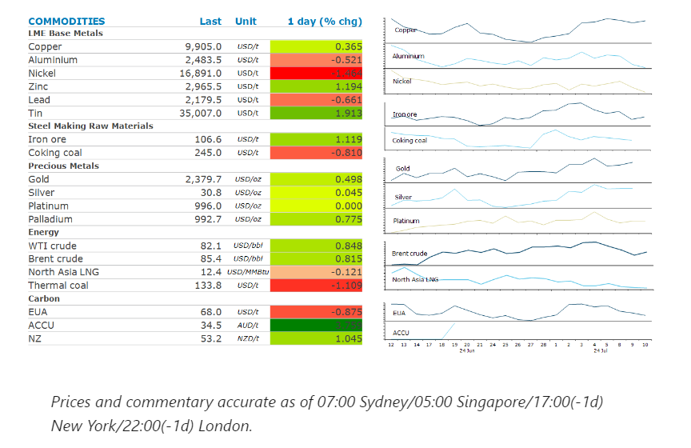
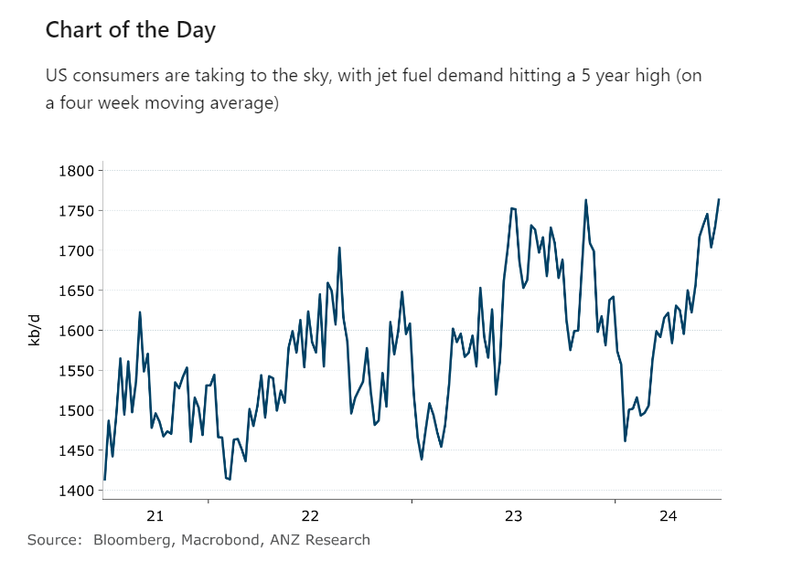

# Oil gains amid increasing travel by US consumers

**Date:** July 11, 2024  
**Publisher:** Breakwave Advisors | **Category:** Market Insights  
**Original URL:** [https://www.breakwaveadvisors.com/insights/2024/7/11/oil-gains-amid-increasing-travel-by-us-consumers](https://www.breakwaveadvisors.com/insights/2024/7/11/oil-gains-amid-increasing-travel-by-us-consumers)  

---

Signs of strong demand helped boost sentiment in the energy sector. However, rising inventories weighed on metal markets.

*By*[*Daniel Hynes*](https://www.linkedin.com/in/dahynes/)

> **Figure 1: Στιγμιότυπο Οθόνης 2024 07 11 091721**  
> **Interactive Data & Source:** [Linkedin](https://www.linkedin.com/newsletters/commodities-wrap-6692196755876012032/?fbclid=IwAR3kiXJqZdxmp9ZcRwBNI7FsBySI-XSC0pfPur1qzjt7OZp7PTE59Tsl1QI) | [Local Asset](file:///C:/Users/Dell/Github/Shipping/corpus/03-breakwave/insights/2024/assets/2024-07-11_oil-gains-amid-increasing-travel-by-us-consumers_img_cea3cf84ceb9ceb3cebcceb9cf8ccf84cf85_c38667a2cb40.png)

### Market Commentary

**Brent crude**rose amid signs of strong demand. Jet fuel demand, on a four-week moving average badid, rose to its highest level for this time of year since 2019, according to Energy Information Administration (EIA) data. Meanwhile, gasoline demand on a four-week average also improved to the highest since 2021 seasonally. Inventories of the motor fuel fell to their lowest level since May. EIA’s weekly inventory report showed that crude oil commercial stockpiles fell 3.443kbbl last week, more than the API report suggested. The strong demand was driven by robust travel around the US Independence Day holiday. However, the gains were muted amid ongoing concerns about demand in China. Data on Wednesday underscored the economic challenges, with deflationary pressures persisting as factory gate prices fell. Key OPEC+ members continue to pump above quota limits, also limiting gains. Data published by the OPEC secretariat showed some members, including Iraq, Kazakhstan and Russia, are collectively producing several hundred thousand barrels a day above quota. These members are expected to reduce output to make up for overproducing earlier in the year.

**European gas**prices edged lower as traders become more relaxed with the supply risks. Recent unplanned outages and concerns about remaining flows from Russia have boosted volatility. However, Europe is entering peak summer with inventories fuller than usual, while steady flows of gas from Norway have returned. North Asia LNG prices held around USD12/mmBtu as the market monitors the restart of the Freeport LNG plant. Gas flows to the plant remain low following Hurricane Beryl. Ports on the Texas coast also remain closed, with the backlog of tankers surging to 34, according to Bloomberg data.

**Gold**prices edged higher as Powell notes progress on inflation. Addressing lawmakers in Washington, he said he has confidence that inflation is headed downwards. However, he stressed that the Fed has more work to do. Investor demand continues to pick up, with gold-backed exchange traded funds saw inflows for a second consecutive month in June.

The prospect of easing monetary policy boosted sentiment in the**base metals**sector. However, signs of weak demand limited the gains. Copper stockpiles jumped 2.3% to 195.5kt, their highest level since October 2021, on the London Metal Exchange. Most of the gains came in warehouses in Korea and Taiwan, which are the closest delivery points for metal flowing out of China. Metal that originated from China now makes up 45% of all copper stored in LME warehouses, with a large portion of the increase since May coming from the country. Exports from China have also jumped to record levels this year as traders make use of better pricing on the international market.

**Iron ore**fell for the third time in four days as steel mills and developers struggle with persistently weak demand. One of China’s biggest mills, Angang Steel, reported a preliminary loss of CNY2.68bn in H1 2024. Property developer China Vanke is also expected to report a first half loss this week.

> **Figure 2: Στιγμιότυπο Οθόνης 2024 07 11 091635**  
> **Interactive Data & Source:** [Linkedin](https://www.linkedin.com/newsletters/commodities-wrap-6692196755876012032/?fbclid=IwAR3kiXJqZdxmp9ZcRwBNI7FsBySI-XSC0pfPur1qzjt7OZp7PTE59Tsl1QI) | [Local Asset](file:///C:/Users/Dell/Github/Shipping/corpus/03-breakwave/insights/2024/assets/2024-07-11_oil-gains-amid-increasing-travel-by-us-consumers_img_cea3cf84ceb9ceb3cebcceb9cf8ccf84cf85_90d886a31e05.png)

Data source:[Commodities Wrap](https://www.linkedin.com/newsletters/commodities-wrap-6692196755876012032/?fbclid=IwAR3kiXJqZdxmp9ZcRwBNI7FsBySI-XSC0pfPur1qzjt7OZp7PTE59Tsl1QI)

---

**Tags:** Economy, Markets, Commodities  
