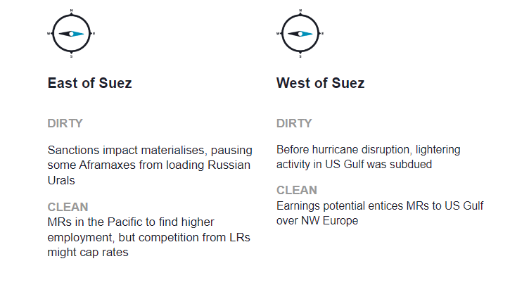
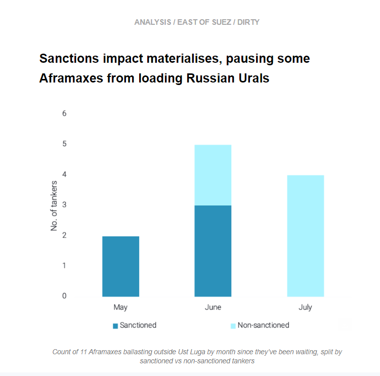
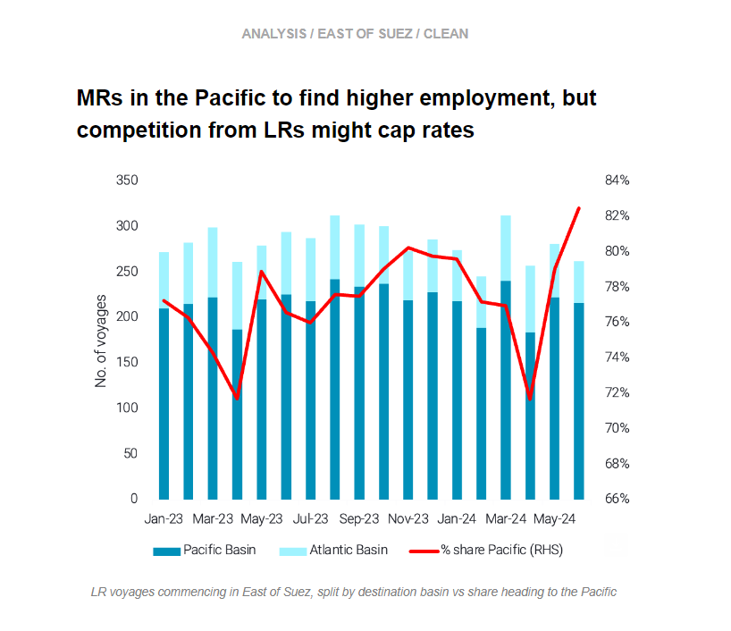
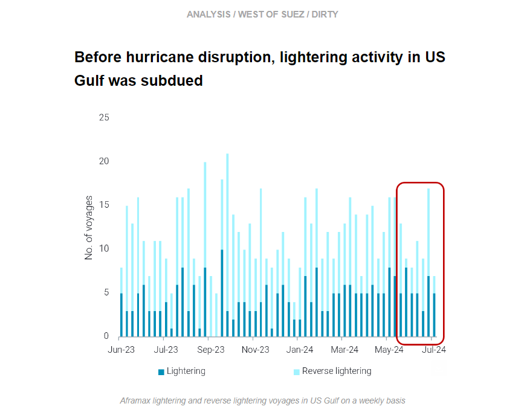
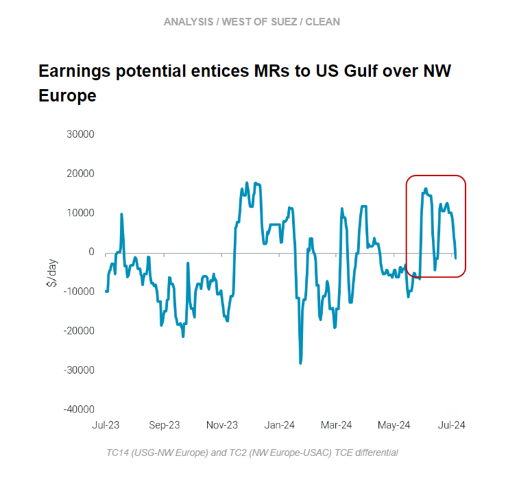

# US Gulf lightering subdued even before hurrican

**Date:** July 11, 2024  
**Publisher:** Breakwave Advisors | **Category:** Market Insights  
**Original URL:** [https://www.breakwaveadvisors.com/insights/2024/7/11/vjz1twli65m261jmmitks302mx9cvx](https://www.breakwaveadvisors.com/insights/2024/7/11/vjz1twli65m261jmmitks302mx9cvx)  

---

This week, we investigate why Aframaxes entered the port of Ust Luga and then left again to anchor nearby. On the clean side, we look at the implications for higher MR counts in the Pacific at the same time as increased competition from LRs. Over in the West, we discuss why lightering activity in the US Gulf was subdued even before this week’s hurricane disruption. Finally, we explore the MR earnings differential between the US Gulf and NW Europe.

*By*[*Mary Melton*](https://www.linkedin.com/search/results/all/?fetchDeterministicClustersOnly=true&heroEntityKey=urn%3Ali%3Afsd_profile%3AACoAABXVyecBtg-pRnIrZe0BoWk0ygPiUfbvhsw&keywords=mary%20melton&origin=RICH_QUERY_SUGGESTION&position=0&searchId=40e8d7d2-c4d0-4022-81e7-176f6eba418b&sid=H_Y&spellCorrectionEnabled=false)

> **Figure 1: Στιγμιότυπο Οθόνης 2024 07 11 083956**  
> **Interactive Data & Source:** [Marketingmail Vortexa](https://marketingmail.vortexa.com/ODM3LU1aRS01NzgAAAGUO88lxtb78UlBpdR7J5ufJvquj9_9f4l173m6CABzfwPzsUQEc1IYzfwqZW0fcQf35yB5PS8=) | [Local Asset](file:///C:/Users/Dell/Github/Shipping/corpus/03-breakwave/insights/2024/assets/2024-07-11_vjz1twli65m261jmmitks302mx9cvx_img_cea3cf84ceb9ceb3cebcceb9cf8ccf84cf85_32c513c00088.png)

> **Figure 2: Στιγμιότυπο Οθόνης 2024 07 11 084013**  
> **Interactive Data & Source:** [Marketingmail Vortexa](https://marketingmail.vortexa.com/ODM3LU1aRS01NzgAAAGUO88lxtb78UlBpdR7J5ufJvquj9_9f4l173m6CABzfwPzsUQEc1IYzfwqZW0fcQf35yB5PS8=) | [Local Asset](file:///C:/Users/Dell/Github/Shipping/corpus/03-breakwave/insights/2024/assets/2024-07-11_vjz1twli65m261jmmitks302mx9cvx_img_cea3cf84ceb9ceb3cebcceb9cf8ccf84cf85_308fc9e326f7.png)

- As of the 9th July, there are[11 Aframaxes ballasting outside Ust Luga](https://marketingmail.vortexa.com/ODM3LU1aRS01NzgAAAGUO88lxtb78UlBpdR7J5ufJvquj9_9f4l173m6CABzfwPzsUQEc1IYzfwqZW0fcQf35yB5PS8=). Nine of these tankers are in Ust Luga anchorage whilst two are waiting just south of Porvoo. This could be the result of sanctions, as five of these 11 Aframaxes in anchorage north of the port are sanctioned. Eight of these 11 Aframaxes have entered the port but have then diverted away to anchorage, where they have been since.

- The implications suggest that sanctions may be creating hesitancy with buyers of cargoes on these specific tankers. On the other hand, this could be indicative of Russia adhering to OPEC cuts and hence reducing Russian crude loadings.
- Moving forward, if sanctions on tankers in the Russian trade continues, we could observe Aframax idle counts in the Baltics rise, as these vessels will not be able to easily find employment in other markets. At the same time, this could also suggest a logistical bottleneck for Russian loadings, at least in the near-term.

> **Figure 3: Στιγμιότυπο Οθόνης 2024 07 11 084037**  
> **Interactive Data & Source:** [Marketingmail Vortexa](https://marketingmail.vortexa.com/ODM3LU1aRS01NzgAAAGUO88lx0oRi09ryRnCtdjcemtKB_6prKVNBEdgCksNzHiLn7m3bXkqSpgyDnKPKj_v6I3zkuA=) | [Local Asset](file:///C:/Users/Dell/Github/Shipping/corpus/03-breakwave/insights/2024/assets/2024-07-11_vjz1twli65m261jmmitks302mx9cvx_img_cea3cf84ceb9ceb3cebcceb9cf8ccf84cf85_c324d1992150.png)

- The MR fleet distribution between the[Pacific](https://marketingmail.vortexa.com/ODM3LU1aRS01NzgAAAGUO88lx0oRi09ryRnCtdjcemtKB_6prKVNBEdgCksNzHiLn7m3bXkqSpgyDnKPKj_v6I3zkuA=)and the[Atlantic](https://marketingmail.vortexa.com/ODM3LU1aRS01NzgAAAGUO88lxgRBWnwc8GT1C4-EbBec_LcZEDiHXp20Si9lZnQZ_dDWBTaFalVuzfNh3kvSkZXltqM=)has tilted towards the former, on the back of higher Panama transits but recently also due to a[higher number of ballasters via the COGH from Europe and Africa](https://marketingmail.vortexa.com/ODM3LU1aRS01NzgAAAGUO88lxl3BgmyIgAeP3okwx0uA2CR_dlLAsiIT7_2nYpHEhosZFQhPjaZ1VsPIVBQJUNhRZKc=).

- This tonnage overhang has exerted downward pressure on MR rates. Nevertheless, as refineries in Asia are recovering from outages and China’s export margins are improving compared to the domestic ones, the stagnant utilisation in the Pacific will likely find support.
- However, this support will be capped due to the VLCC and Suezmax clean-ups. This is muscling out LRs in East-to-West trades, in turn causing them to focus eastwards. Evidently,[the share of LRs loading in the Pacific and heading East](https://marketingmail.vortexa.com/ODM3LU1aRS01NzgAAAGUO88lxiQhiURnrLP1g9BCJMVUZEInRe73sHxtYZIqXl7Py_3PyY0HZ79ASqWtmz2gmbeq26w=)has risen by more than 10% within two months.

> **Figure 4: Στιγμιότυπο Οθόνης 2024 07 11 084050**  
> **Interactive Data & Source:** [Marketingmail Vortexa](https://marketingmail.vortexa.com/ODM3LU1aRS01NzgAAAGUO88lxohLxmPSxXqHEpv5KnlheXLt9ALsw2SjPSvxPj49zUjmIawCL1JGMhQjLRjbyRswgbo=) | [Local Asset](file:///C:/Users/Dell/Github/Shipping/corpus/03-breakwave/insights/2024/assets/2024-07-11_vjz1twli65m261jmmitks302mx9cvx_img_cea3cf84ceb9ceb3cebcceb9cf8ccf84cf85_d309b1208208.png)

- Lightering activity (both[reverse lightering](https://marketingmail.vortexa.com/ODM3LU1aRS01NzgAAAGUO88lxohLxmPSxXqHEpv5KnlheXLt9ALsw2SjPSvxPj49zUjmIawCL1JGMhQjLRjbyRswgbo=)and[lightering](https://marketingmail.vortexa.com/ODM3LU1aRS01NzgAAAGUO88lxpRxgXo-o_DAey5E9wB2j9L2xdX0gxKmeHdlGFhet6bt4dVi7WUjQXFI3ejs4AWEdqE=)) in the US Gulf came to a halt over the weekend with the approach of Hurricane Beryl, but the disruption caused by the storm is likely to be short-lived. Lightering activity dropped almost 60% w-o-w, albeit after the previous week was very busy as a result of[increased loadings](https://marketingmail.vortexa.com/ODM3LU1aRS01NzgAAAGUO88lxm-cTyrBHy35FEHMRrV5uDj3oSEHoWSBBXCjADZQozOJNJhkuVhkFyXkFjlhwY1GEAg=)to Asia compared to recent weeks and a large parcel going to ARA.

- Zooming out on the bigger picture, the US Gulf has seen a decline in overall lightering activity since mid-May. This has to do with fewer exports to NE Asia and less need for reverse-lightering. This was balanced out by higher US imports of Middle East crude in late May due to the reduction in availability of Mexican crudes, which kept demand for lightering supported. However, as[Mexican crude exports](https://marketingmail.vortexa.com/ODM3LU1aRS01NzgAAAGUO88lxtXCqoV1iR3yhsTAJhw-Rdd3rFGuTqqM4V2us4jmDr7ucJpwDkQ6r-5QVA8zy2knTu4=)are now increasing, the need for MEG imports and therefore lightering has declined.
- Moving forward, lightering activity will likely remain below historical levels. As Saudi OSPs decrease, Saudi grades will become more competitive at the expense of Atlantic Basin-origin crudes at a time when Asia has a weaker appetite for crude purchases from Asia. These factors will likely keep VLCC enquiries subdued and thus cap upside for reverse-lightering.

> **Figure 5: Στιγμιότυπο Οθόνης 2024 07 11 084102**  
> **Interactive Data & Source:** [Marketingmail Vortexa](https://marketingmail.vortexa.com/ODM3LU1aRS01NzgAAAGUO88lxh1_UWTgtfWYAcbgYnyOOxzSODge-5dXjzgygWKSY1YX59g1Q--1Ul8kOGFdEFHkqT8=) | [Local Asset](file:///C:/Users/Dell/Github/Shipping/corpus/03-breakwave/insights/2024/assets/2024-07-11_vjz1twli65m261jmmitks302mx9cvx_img_cea3cf84ceb9ceb3cebcceb9cf8ccf84cf85_1c6f0d350cc7.png)

- During Q2, demand for European gasoline in North America East Coast (US Atlantic Coast and East Coast Canada) has been lacklustre compared to seasonal averages.[Voyage counts for MR2s carrying gasoline NW Europe-to-North America East Coast](https://marketingmail.vortexa.com/ODM3LU1aRS01NzgAAAGUO88lxh1_UWTgtfWYAcbgYnyOOxzSODge-5dXjzgygWKSY1YX59g1Q--1Ul8kOGFdEFHkqT8=)have remained well below the seasonal average for most of the quarter, only just approaching the seasonal average in June due to an increase in voyages to East Coast Canada in June.

- Higher MR2 arrivals into North America East Coast have had a notable effect on vessel supply in the US Gulf. After discharge, vessels have been enticed to the USG by higher earning potential there compared to Northwest Europe. The TCE differential ([TC14](https://marketingmail.vortexa.com/ODM3LU1aRS01NzgAAAGUO88lxgWzI2gIUwSDTRv9WClSF6DLnkgLeo49AV2iwDKojDbK8iNb1i1EKkts-xAet0N-tig=)vs[TC2](https://marketingmail.vortexa.com/ODM3LU1aRS01NzgAAAGUO88lxnjSkeQ6onb3xAL_7uDrQHYnVkELb9Mt3cAzchB-b3RXCm9OhqQjCbWTpnYUSeYJz7I=)) shot upwards in late May, as the earnings spread widened to the highest value since December.
- Earnings in the US Gulf have been high as weak US domestic demand[dramatically increased CPP exports](https://marketingmail.vortexa.com/ODM3LU1aRS01NzgAAAGUO88lxvQa8XIF9VRIqkjeKo5mpgmYGl2YUh4yTYjNdzDka4XqnZTFPIiqRscuEZsihfZiXkc=)while also[Mexican CPP demand increased](https://marketingmail.vortexa.com/ODM3LU1aRS01NzgAAAGUO88lxhnI042HjYxClsSMbTVQlPp_gc_wy2atuO6kon_OvLOj5vnhbG9obltRkBtSyB5Uwr4=). Most of these US Gulf exports have been going short-haul, so vessel supply in the region has remained quite high. The addition of extra vessels enticed by high USG earnings in June has already caused a[big increase in prompt vessel supply](https://marketingmail.vortexa.com/ODM3LU1aRS01NzgAAAGUO88lxuEYkS_MrYODvFKfBlgWpmNnGZ9xKF2ZNj8Nd3gLkVoYcMTCp-Ga1iMI2lwG8syLr0c=)(currently at a 1-year high), which has sent earnings in the region tumbling this month ([TC14](https://marketingmail.vortexa.com/ODM3LU1aRS01NzgAAAGUO88lxgWzI2gIUwSDTRv9WClSF6DLnkgLeo49AV2iwDKojDbK8iNb1i1EKkts-xAet0N-tig=),[TC18](https://marketingmail.vortexa.com/ODM3LU1aRS01NzgAAAGUO88lxuCCqvY97MwTRgxpF0I1InfmDFLvl1VvvGkbrubWxkV99NKa1PqgCZrS2c-IYcuzrV4=)).

Data Source:[Vortexa](https://www.vortexa.com//oil-gas-data-traders-analysts-data-scientists?gclid=Cj0KCQjw8_qRBhCXARIsAE2AtRZKOvMnbilZ_6_91d7huSFFy71pWLrnPwGwOHVzXsmsG-1a1mZnQw8aAt89EALw_wcB&hsa_acc=1782073842&hsa_ad=548425387665&hsa_cam=14746637662&hsa_grp=125038601902&hsa_kw=&hsa_mt=&hsa_net=adwords&hsa_src=g&hsa_tgt=dsa-1431852288425&hsa_ver=3&utm_campaign=%5BCD%5D%20-%20DSA%20-%20EMEA&utm_medium=cpc&utm_medium=ppc&utm_source=google&utm_source=adwords&utm_term=)

---

**Tags:** Shipping, Crude Oil, Tankers  
