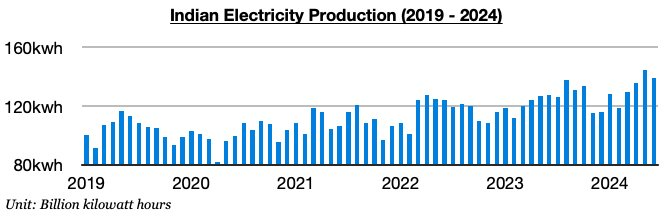
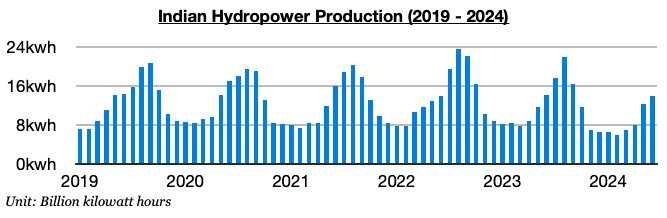

# India's Hydropower Production Back in Contraction

**Date:** July 12, 2024  
**Publisher:** Breakwave Advisors | **Category:** Market Insights  
**Original URL:** [https://www.breakwaveadvisors.com/insights/2024/7/12/3zoo1mgg8zlaoaisfdbplxx1785uaf](https://www.breakwaveadvisors.com/insights/2024/7/12/3zoo1mgg8zlaoaisfdbplxx1785uaf)  

---

*By*[*Jeffrey Landsberg*](https://www.linkedin.com/in/jeffrey-landsberg-70ab957/)

As we discussed in Commodore Research's most recent Weekly Dry Bulk Report, India produced approximately 139.2 billion kilowatt hours of electricity in June. This is down month-on-month by 5.2 billion kilowatt hours (-4%) but is up year-on-year by 12 billion kilowatt hours (10%).

> **Figure 1: Chart1**  
> [Local Asset](file:///C:/Users/Dell/Github/Shipping/corpus/03-breakwave/insights/2024/assets/2024-07-12_3zoo1mgg8zlaoaisfdbplxx1785uaf_img_chart1_b234f1549b91.jpg)

Noteworthy is that hydropower output ended up falling back into a year-on-year contraction, as we believed was likely to occur. Most of India’s major hydro stations are located on the western coast, north, and eastern third portion of the country where rainfall was lower than usual last month.

> **Figure 2: Chart 2**  
> [Local Asset](file:///C:/Users/Dell/Github/Shipping/corpus/03-breakwave/insights/2024/assets/2024-07-12_3zoo1mgg8zlaoaisfdbplxx1785uaf_img_chart2_dac81d889a32.jpg)

Hydropower output totaled approximately 13.8 billion kilowatt hours. This is up month-on-month by 1.5 billion kilowatt hours (12%) but is down year-on-year by 300 million kilowatt hours (-3%). May previously saw hydropower output finally grow on a year-on-year basis (before May, it had contracted for ten straight months).

> **Figure 3: Chart 3**  
> [Local Asset](file:///C:/Users/Dell/Github/Shipping/corpus/03-breakwave/insights/2024/assets/2024-07-12_3zoo1mgg8zlaoaisfdbplxx1785uaf_img_chart3_84b14cfab74c.jpg)

---

**Tags:** Economy, Drybulk, Energy  
