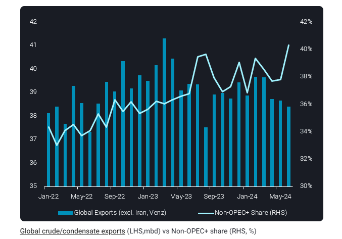
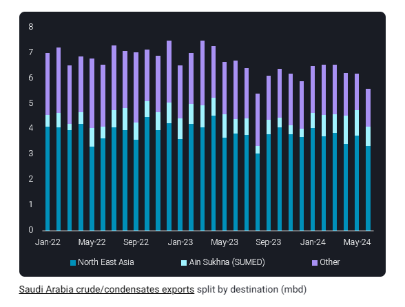

# Global crude exports fall in June, Non-OPEC+ gains share

**Date:** July 12, 2024  
**Publisher:** Breakwave Advisors | **Category:** Market Insights  
**Original URL:** [https://www.breakwaveadvisors.com/insights/2024/7/12/global-crude-exports-fall-in-june-non-opec-gains-share](https://www.breakwaveadvisors.com/insights/2024/7/12/global-crude-exports-fall-in-june-non-opec-gains-share)  

---

Global crude/condensate seaborne exports fell m-o-m to 38.5mbd in June, while Non-OPEC+ supplies sharply increased market share at the expense of Saudi Arabia.

*By*[*Jay Maroo*](https://www.linkedin.com/in/jay-m-336a3633/)

Total crude/condensate exports fell by almost 180kbd in June, marking the fourth successive monthly decline and putting full-month exports at the lowest since August 2023. The largest declines in exports came from Saudi Arabia (600kbd lower) while UAE, Iraq (both 200kbd) and Kuwait (40kbd) also posted lower levels.

Some non-OPEC countries helped to compensate for lower OPEC exports to some extent. US exports rose by 290kbd m-o-m, while Angola and Brazil grew 110kbd and 80kbd. Russian exports, excluding Kazakh origin grades CPC Blend and KEBCO, were little changed m-o-m.

> **Figure 1: Στιγμιότυπο Οθόνης 2024 07 12 131924**  
> **Interactive Data & Source:** [Vortexa](https://www.vortexa.com//oil-gas-data-traders-analysts-data-scientists?gclid=Cj0KCQjw8_qRBhCXARIsAE2AtRZKOvMnbilZ_6_91d7huSFFy71pWLrnPwGwOHVzXsmsG-1a1mZnQw8aAt89EALw_wcB&hsa_acc=1782073842&hsa_ad=548425387665&hsa_cam=14746637662&hsa_grp=125038601902&hsa_kw=&hsa_mt=&hsa_net=adwords&hsa_src=g&hsa_tgt=dsa-1431852288425&hsa_ver=3&utm_campaign=%5BCD%5D%20-%20DSA%20-%20EMEA&utm_medium=cpc&utm_medium=ppc&utm_source=google&utm_source=adwords&utm_term=) | [Local Asset](file:///C:/Users/Dell/Github/Shipping/corpus/03-breakwave/insights/2024/assets/2024-07-12_global-crude-exports-fall-in-june-non-opec-gains-share_img_cea3cf84ceb9ceb3cebcceb9cf8ccf84cf85_da9c6d771e54.png)

The latest data for June fits and extends the structural trend of Non-OPEC+ supplies contributing to a growing share or global seaborne supplies. Non-OPEC+ crude/condensate accounted for more than 40% of global exports in June, a multi-year high. However the sharp market share increase in June is also a result of a steep decline in Saudi Arabia’s exports.

> **Figure 2: Στιγμιότυπο Οθόνης 2024 07 12 132026**  
> **Interactive Data & Source:** [Vortexa](https://www.vortexa.com//oil-gas-data-traders-analysts-data-scientists?gclid=Cj0KCQjw8_qRBhCXARIsAE2AtRZKOvMnbilZ_6_91d7huSFFy71pWLrnPwGwOHVzXsmsG-1a1mZnQw8aAt89EALw_wcB&hsa_acc=1782073842&hsa_ad=548425387665&hsa_cam=14746637662&hsa_grp=125038601902&hsa_kw=&hsa_mt=&hsa_net=adwords&hsa_src=g&hsa_tgt=dsa-1431852288425&hsa_ver=3&utm_campaign=%5BCD%5D%20-%20DSA%20-%20EMEA&utm_medium=cpc&utm_medium=ppc&utm_source=google&utm_source=adwords&utm_term=) | [Local Asset](file:///C:/Users/Dell/Github/Shipping/corpus/03-breakwave/insights/2024/assets/2024-07-12_global-crude-exports-fall-in-june-non-opec-gains-share_img_cea3cf84ceb9ceb3cebcceb9cf8ccf84cf85_9a35487cd730.png)

At just under 5.6mbd, Saudi Arabia’s June export total represents the lowest monthly total since Aug 2023. The main components of the decline are fewer loadings bound for some key Far East Asian buyers (China, South Korea, Taiwan), along with a sharp decline in exports to Egypt’s Ain Sukhna – from where cargoes can be moved via the SUMED pipeline for re-export at Egypt’s Sidi Kerir port. The vast majority of the exports from Sidi Kerir are for European refiners.

Looking ahead, the global decline in seaborne exports is a strong support factor for outright crude prices, as opposed to any momentum from the demand side which appears to be largely lacking. The bulls in the market may put some hope in the recently announced SPR refills in China (on top of the minor ones in the US). However, weak Chinese refinery runs, as implied via Vortexa onshore inventories and crude import data, are likely to dilute the SPR buying which is anyway limited in extent (see this blog for more details). While OPEC+ is currently evidently putting a strong focus on compliance, October 2024 is approaching very quickly. At that point in time OPEC+ are supposed to start adding supplies to the market, with Saudi Arabia and the UAE alone scheduled to boost supplies by close to 1.5mbd over 12 months to September 2025. However, current market dynamics strongly suggest that this would not be possible without undermining oil prices, putting the entire group’s production schedule into doubt.

Data Source:[Vortexa](https://www.vortexa.com//oil-gas-data-traders-analysts-data-scientists?gclid=Cj0KCQjw8_qRBhCXARIsAE2AtRZKOvMnbilZ_6_91d7huSFFy71pWLrnPwGwOHVzXsmsG-1a1mZnQw8aAt89EALw_wcB&hsa_acc=1782073842&hsa_ad=548425387665&hsa_cam=14746637662&hsa_grp=125038601902&hsa_kw=&hsa_mt=&hsa_net=adwords&hsa_src=g&hsa_tgt=dsa-1431852288425&hsa_ver=3&utm_campaign=%5BCD%5D%20-%20DSA%20-%20EMEA&utm_medium=cpc&utm_medium=ppc&utm_source=google&utm_source=adwords&utm_term=)

---

**Tags:** Tankers, Shipping, Crude Oil  
