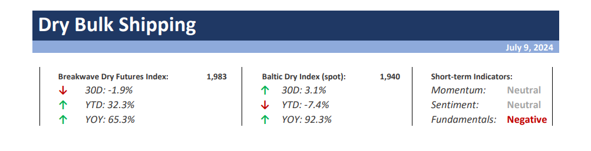

# Weekly Insights Review

**Date:** July 12, 2024  
**Publisher:** Breakwave Advisors | **Category:** Market Insights  
**Original URL:** [https://www.breakwaveadvisors.com/insights/2024/7/12/weekly-insights-review](https://www.breakwaveadvisors.com/insights/2024/7/12/weekly-insights-review)  

---

## Welcome to Our Weekly Insights Review

## Read Here Everything You Need to Know

## Breakwave Dry Bulk Report

**Freight Futures Volatility Drops to 5-Year Lows as Spot Rates Remain Rangebound**– Volatility has all but disappeared in the**usually highly volatile**freight futures market, as**spot rates**have remained relatively**steady**and any tightness or slackness in the tonnage supply have so far appeared temporary in nature.

> **Figure 1: Στιγμιότυπο Οθόνης 2024 07 09 114111**  
> **Interactive Data & Source:** [Breakwave Advisors Market Insights](https://www.breakwaveadvisors.com/insights/2024/7/8/global-factory-activity-shows-mixed-performance) | [Local Asset](file:///C:/Users/Dell/Github/Shipping/corpus/03-breakwave/insights/2024/assets/2024-07-12_weekly-insights-review_img_cea3cf84ceb9ceb3cebcceb9cf8ccf84cf85_19b37e1009d9.png)

> **Figure 2: Read More**  
> **Interactive Data & Source:** [Breakwave Advisors Market Insights](https://www.breakwaveadvisors.com/insights/2024/7/8/global-factory-activity-shows-mixed-performance) | [Local Asset](file:///C:/Users/Dell/Github/Shipping/corpus/03-breakwave/insights/2024/assets/2024-07-12_weekly-insights-review_img_image-asset_eae51596a066.jpeg)

## Global Factory Activity Shows Mixed Performance

Doric Weekly Market Insight

The Baltic indices stumbled into the typically strong third quarter of the trading year with a rather uninspiring performance.

> **Figure 3: Market Chart 3**  
> **Interactive Data & Source:** [Breakwave Advisors Market Insights](https://www.breakwaveadvisors.com/insights/2024/7/8/miv998ruaula0selug8xmke4lo73x3) | [Local Asset](file:///C:/Users/Dell/Github/Shipping/corpus/03-breakwave/insights/2024/assets/2024-07-12_weekly-insights-review_img_image-asset28129_44fee34ae799.jpeg)

## China's Decision to Buy Unsold Homes Not Yet Having Major Impact

From Commodore's Weekly Dry Bulk Reports

As we discussed in Commodore Research's most recent Weekly China Report, May ended with 742 million square meters of floor space available in China's commercial buildings (which includes residential buildings).

[Read More](https://www.breakwaveadvisors.com/insights/2024/7/8/miv998ruaula0selug8xmke4lo73x3)

> **Figure 4: Market Chart 4**  
> **Interactive Data & Source:** [Breakwave Advisors Market Insights](https://www.breakwaveadvisors.com/insights/2024/7/9/qtty8wmw268o9yxm03baoojsf3x0wd) | [Local Asset](file:///C:/Users/Dell/Github/Shipping/corpus/03-breakwave/insights/2024/assets/2024-07-12_weekly-insights-review_img_image-asset28329_8e14766beb18.jpeg)

## All Vessel Segments Contributing to the Headwinds

The Fix - Global Market Update

After five weeks of gains, the Baltic Dry Index declined by more than four per cent over the past five sessions, with all vessel segments contributing to the headwinds.

> **Figure 5: Market Chart 5**  
> **Interactive Data & Source:** [Breakwave Advisors Market Insights](https://www.breakwaveadvisors.com/insights/2024/7/8/oil-gains-amid-tightening-supplies) | [Local Asset](file:///C:/Users/Dell/Github/Shipping/corpus/03-breakwave/insights/2024/assets/2024-07-12_weekly-insights-review_img_image-asset28229_ba955edcfb9c.jpeg)

## Oil Gains Amid Tightening Supplies

Commodities Wrap

Increasing expectations of a Fed rate cut kept market sentiment positive last week. Weakness in the USD supported investor appetite.

> **Figure 6: Market Chart 6**  
> **Interactive Data & Source:** [Breakwave Advisors Market Insights](https://www.breakwaveadvisors.com/insights/2024/7/9/its-still-the-economy-stupid) | [Local Asset](file:///C:/Users/Dell/Github/Shipping/corpus/03-breakwave/insights/2024/assets/2024-07-12_weekly-insights-review_img_image-asset28429_583526070e9f.jpeg)

## It’s -Still- The Economy, Stupid

Forvis Mazars Weekly Note

The three things investors should know this week

1. Despite an ostensible return to centrism in France and the UK, voters remain resentful.

...

[Read More](https://www.breakwaveadvisors.com/insights/2024/7/9/its-still-the-economy-stupid)

> **Figure 7: Pexels Ojas Narappanawar 382627 4606157 (1)**  
> **Interactive Data & Source:** [Breakwave Advisors Market Insights](https://www.breakwaveadvisors.com/insights/2024/7/10/-dynamic-period-for-the-tanker-market) | [Local Asset](file:///C:/Users/Dell/Github/Shipping/corpus/03-breakwave/insights/2024/assets/2024-07-12_weekly-insights-review_img_pexels-ojas-narappanawar-382627-4606_756ef1765263.jpg)

## Α Dynamic Period for the Tanker Market

Intermodal Weekly Market Report

The first half of 2024 has been a dynamic period for the tanker market, characterised by a number of significant events and evolving trends that have collectively influenced freight rates, fleet developments and commodity flows.

> **Figure 8: Tankers 4 Square**  
> **Interactive Data & Source:** [Breakwave Advisors Market Insights](https://www.breakwaveadvisors.com/insights/2024/7/10/mid-year-review) | [Local Asset](file:///C:/Users/Dell/Github/Shipping/corpus/03-breakwave/insights/2024/assets/2024-07-12_weekly-insights-review_img_tankers-4-square_a310bd6dfbdb.jpg)

## Mid-Year Review

Gibson Tanker Market Report

The onset of the EU’s Emission Trading System and fresh OPEC+ supply cuts were expected to be the big news stories at the start of this year.

[Read More](https://www.breakwaveadvisors.com/insights/2024/7/10/mid-year-review)

> **Figure 9: Market Chart 9**  
> **Interactive Data & Source:** [Breakwave Advisors Market Insights](https://www.breakwaveadvisors.com/insights/2024/7/11/vjz1twli65m261jmmitks302mx9cvx) | [Local Asset](file:///C:/Users/Dell/Github/Shipping/corpus/03-breakwave/insights/2024/assets/2024-07-12_weekly-insights-review_img_image-asset28529_2063123f4d7a.jpeg)

## Us Gulf Lightering Subdued Even Before Hurrican

Vortexa Freight Weekly

This week, we investigate why Aframaxes entered the port of Ust Luga and then left again to anchor nearby.

[Read More](https://www.breakwaveadvisors.com/insights/2024/7/11/vjz1twli65m261jmmitks302mx9cvx)

> **Figure 10: Market Chart 10**  
> **Interactive Data & Source:** [Breakwave Advisors Market Insights](https://www.breakwaveadvisors.com/insights/2024/7/11/iron-ore-flows-amp-capesize-tonne-days) | [Local Asset](file:///C:/Users/Dell/Github/Shipping/corpus/03-breakwave/insights/2024/assets/2024-07-12_weekly-insights-review_img_image-asset28629_ed4b923e0a96.jpeg)

## Iron Ore Flows & Capesize Tonne Days

Signal Ocean - Dry Weekly Market Monitor

The second week of July brings a downward revision in the performance of the Capesize segment, while the decreasing count of ballasters fosters optimism for the coming days.

[Read More](https://www.breakwaveadvisors.com/insights/2024/7/11/iron-ore-flows-amp-capesize-tonne-days)

> **Figure 11: Market Chart 11**  
> **Interactive Data & Source:** [Breakwave Advisors Market Insights](https://www.breakwaveadvisors.com/insights/2024/7/11/oil-gains-amid-increasing-travel-by-us-consumers) | [Local Asset](file:///C:/Users/Dell/Github/Shipping/corpus/03-breakwave/insights/2024/assets/2024-07-12_weekly-insights-review_img_image-asset28729_51498ed7740d.jpeg)

## Oil Gains Amid Increasing Travel by Us Consumers

Commodities Wrap

Signs of strong demand helped boost sentiment in the energy sector. However, rising inventories weighed on metal markets.

> **Figure 12: Market Chart 12**  
> **Interactive Data & Source:** [Breakwave Advisors Market Insights](https://www.breakwaveadvisors.com/insights/2024/7/12/dirty-amp-clean-tonne-days) | [Local Asset](file:///C:/Users/Dell/Github/Shipping/corpus/03-breakwave/insights/2024/assets/2024-07-12_weekly-insights-review_img_image-asset28829_b860b56d6c8b.jpeg)

## Dirty & Clean Tonne Days

Signal Ocean - Tanker Weekly Market Monitor

The second week of July has seen a continued weakening in crude oil freight rates.

> **Figure 13: Market Chart 13**  
> **Interactive Data & Source:** [Breakwave Advisors Market Insights](https://www.breakwaveadvisors.com/insights/2024/7/12/3zoo1mgg8zlaoaisfdbplxx1785uaf) | [Local Asset](file:///C:/Users/Dell/Github/Shipping/corpus/03-breakwave/insights/2024/assets/2024-07-12_weekly-insights-review_img_image-asset28929_129753705e57.jpeg)

## India's Hydropower Production Back in Contraction

From Commodore's Weekly Dry Bulk Reports

As we discussed in Commodore Research's most recent Weekly Dry Bulk Report, India produced approximately 139.2 billion kilowatt hours of electricity in June.

[Read More](https://www.breakwaveadvisors.com/insights/2024/7/12/3zoo1mgg8zlaoaisfdbplxx1785uaf)

> **Figure 14: Στιγμιότυπο Οθόνης 2024 07 12 132153**  
> **Interactive Data & Source:** [Breakwave Advisors Market Insights](https://www.breakwaveadvisors.com/insights/2024/7/12/global-crude-exports-fall-in-june-non-opec-gains-share) | [Local Asset](file:///C:/Users/Dell/Github/Shipping/corpus/03-breakwave/insights/2024/assets/2024-07-12_weekly-insights-review_img_cea3cf84ceb9ceb3cebcceb9cf8ccf84cf85_4f600e03e745.png)

## Global Crude Exports Fall in June, Non-Opec+ Gains Share

Vortexa Freight Weekly

Global crude/condensate seaborne exports fell m-o-m to 38.5mbd in June, while Non-OPEC+ supplies sharply increased market share at the expense of Saudi Arabia.

---

**Tags:** Shipping, Economy, Markets  
