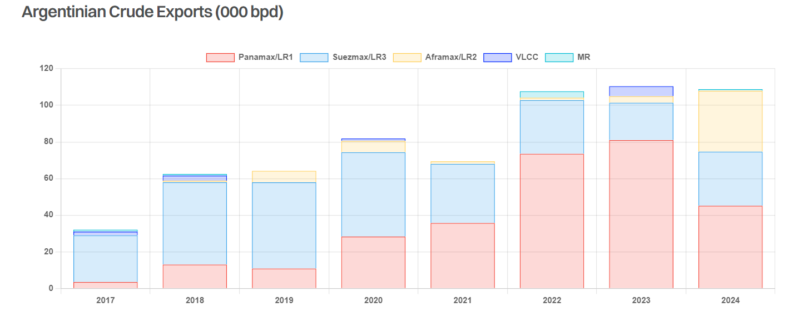

# Cash Cow

**Date:** July 15, 2024  
**Publisher:** Breakwave Advisors | **Category:** Market Insights  
**Original URL:** [https://www.breakwaveadvisors.com/insights/2024/7/15/cash-cow](https://www.breakwaveadvisors.com/insights/2024/7/15/cash-cow)  

---

> **Figure 1: Oil Drilling**  
> **Interactive Data & Source:** [Gibsons Co](https://www.gibsons.co.uk/market-reports) | [Local Asset](file:///C:/Users/Dell/Github/Shipping/corpus/03-breakwave/insights/2024/assets/2024-07-15_cash-cow_img_oil-drilling_1f62af173c53.jpg)

In December 2023, when the newly elected Xavier Milei took the oath as the Argentinian president, the country was reeling under hyper-inflation, which stood at 133.5% annually. Whilst Argentina’s new president has been anything but quiet as he seeks to rejuvenate the economy, the country’s oil and gas sector has been making quiet progress towards boosting production and exports.

In the Vaca Muerta, home to the continent’s largest shale formation holding the world’s second largest shale gas and fourth largest shale oil reserves, crude oil production recently reached around 300,000 bpd. Plans are currently underway to boost this to 1 million bpd by 2030, supported by tax breaks for investments of over $1 billion, and import duty exemptions on equipment designed to support exploration and production.

State-owned oil producer YPF has now started to build a $2.5 billion crude oil pipeline, connecting the Vaca Muerta shale field to Punta Colorada port in the Atlantic basin. The Oil & Gas Journal reports that construction of the first 130 km of the planned 600-km line has commenced. It is expected to transport 180,000 bpd by 2026, and eventually reach 400,000 b/d in 2030. The loading terminal will be equipped with two single point moorings designed to accommodate VLCCs.

The IEA estimates that light tight oil (LTO) supply from Argentina is set to rise by 520,000 bpd from 2023 to 830,000 bpd by 2030, helping to increase total output to 1.2 million bpd. Argentinian crude imports are negligible, thus a rise in domestic production is projected largely to head for export. Seaborne crude exports have been steady at just over 100,000 b/d over the past 2.5 years and are mainly transported through Aframax, Panamax and Suezmax vessels to the USA and Brazil, albeit with some unusual flows to the UAE. The past 6 months saw a surge in Aframax loadings, increasing their market share from 4% last year to nearly 30% so far in 2024, which is again mainly transported to US refineries. Further changes are likely, with VLCCs gaining market share once the Punta Colorada pipeline commences its operations.

Expanding crude production in Argentina has largely gone under the radar, and the country is unlikely to challenge the big crude exporters in the same way the US has done following its own shale revolution. Current production plans suggest that the country could make it into the top 20 exporters by the end of the decade with much of the output destined for Asia. As such, whilst these developments will be welcome news for the VLCC sector in particular, they are unlikely to be transformative.

> **Figure 2: Στιγμιότυπο Οθόνης 2024 07 15 130848**  
> **Interactive Data & Source:** [Gibsons Co](https://www.gibsons.co.uk/market-reports) | [Local Asset](file:///C:/Users/Dell/Github/Shipping/corpus/03-breakwave/insights/2024/assets/2024-07-15_cash-cow_img_cea3cf84ceb9ceb3cebcceb9cf8ccf84cf85_04e7d84a7373.png)

Data source:[Gibson Shipbrokers](https://www.gibsons.co.uk/market-reports)
