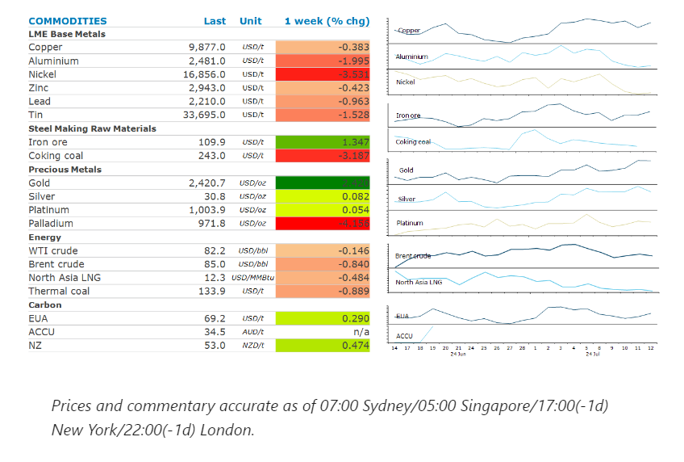
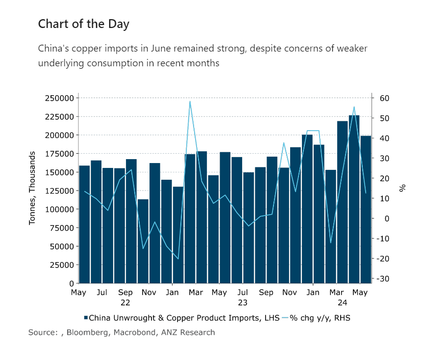

# Sentiment supported by strong commodity imports into China

**Date:** July 15, 2024  
**Publisher:** Breakwave Advisors | **Category:** Market Insights  
**Original URL:** [https://www.breakwaveadvisors.com/insights/2024/7/15/sentiment-supported-by-strong-commodity-imports-into-china](https://www.breakwaveadvisors.com/insights/2024/7/15/sentiment-supported-by-strong-commodity-imports-into-china)  

---

The prospect of easing monetary policy helped boost sentiment across the commodity complex. However, this was offset by easing supply side issues.

*By*[*Daniel Hynes*](https://www.linkedin.com/in/dahynes/)

> **Figure 1: Στιγμιότυπο Οθόνης 2024 07 15 094502**  
> [Local Asset](file:///C:/Users/Dell/Github/Shipping/corpus/03-breakwave/insights/2024/assets/2024-07-15_sentiment-supported-by-strong-commodity-imports-into-china_img_cea3cf84ceb9ceb3cebcceb9cf8ccf84cf85_d7c5807b3836.png)

### Market Commentary

**Gold**rallied late in the week as investor expectations of a rate cut by the Fed rose. This was triggered by a flurry of economic data, including consumer prices, which have signalled a slowdown in inflation. US Treasury yields subsequently fell and the USD weaken, helping boost investor appetite. The market is now almost fully pricing-in a September move, which should see investors continue to increase their exposure to gold.

**Crude oil**came under pressure last week as supply risks eased. Brent crude fell sharply on Friday after news broke that a framework for a ceasefire between Israel and Hamas had been agreed. This could see oil’s recent geopolitical risk premium wound back relatively quickly. Nevertheless, risks to supply have not completely evaporated. In Canada, wildfires have erupted around the country’s oil sands capital of Port McMurry, impacting some production. This offset signals of strengthening demand. EIA’s weekly inventory report highlighted strong growth in oil demand over the US summer. US jet fuel demand, on a four-week moving average, rose to its highest level for this time of year since 2019, while gasoline demand also improved to its highest since 2021 seasonally.

**Global gas**prices ended the week lower despite ongoing risks to supply. Earlier in the week, prices fell after Hurricane Beryl caused less damage than originally expected. However, many LNG export facilities in Texas remain without electricity, significantly curtailing US supply. Meanwhile, extreme heat is boosting cooling demand across Europe and Asia. Japanese LNG buyers are beginning to secure shipments from the spot market, as hot weather lifts gas-fired power generation and threatens to drain inventories. Southeast Europe is also battling heat waves.

**Copper**recorded its seventh decline in eight weeks, as rising inventories weigh on sentiment. Copper stockpiles in LME warehouses rose by 7.5% last week and have nearly doubled since mid-May to reach their highest level since October 2021. However, prices gained on Friday on data showing strong demand from China. While[**refined copper imports fell in June**](../pdfs/2024-07-15_sentiment-supported-by-strong-commodity-imports-into-china_china-commodity-trade-data-june-2024_9fb8b99c0301.pdf)[**,**](https://publications.anz.com/SingletrackCMS__DownloadDocument?docRef=d9e3ff50-9cb2-4fb4-9813-c8ad9add54c9&uid=bd219b92-f5cc-400e-9646-4178791864b7&jobRef=599f31e7-a333-40f9-b01f-61ac4a4915cd)this was offset by an 8.7% y/y increase in concentrate imports. This lifted total copper imports 7% y/y, implying strong demand.**Nickel**also found some support on Friday after BHP announced it is shutting its WA nickel operations. This follows moves by other nickel producers to shut operations in Western Australia amid a glut of metal.**Lithium**prices also continue to push lower. The persistently weak price is prompting lithium producers to exit the market and other producers will either reduce or defer investments. The[**supply overhang is not that large**](../pdfs/2024-07-15_sentiment-supported-by-strong-commodity-imports-into-china_commodity-call-lithium-not-yet-disch_d8f1cff74ab5.pdf), and the fall in prices looks overdone.

**Iron ore**futures fell sharply on signs of abundant supply. Inventories at Chinese ports rose last week to their highest since early June, according to Steelhome data. China’s imports of the steel making raw material remain strong, with June volumes up 2.2% y/y to 97.6mt. The market is hopeful that China’s Third Plenum will deliver further stimulus measures.

> **Figure 2: Στιγμιότυπο Οθόνης 2024 07 15 094618**  
> **Interactive Data & Source:** [Linkedin](https://www.linkedin.com/newsletters/commodities-wrap-6692196755876012032/?fbclid=IwAR3kiXJqZdxmp9ZcRwBNI7FsBySI-XSC0pfPur1qzjt7OZp7PTE59Tsl1QI) | [Local Asset](file:///C:/Users/Dell/Github/Shipping/corpus/03-breakwave/insights/2024/assets/2024-07-15_sentiment-supported-by-strong-commodity-imports-into-china_img_cea3cf84ceb9ceb3cebcceb9cf8ccf84cf85_d05eb3071928.png)

Data source:[Commodities Wrap](https://www.linkedin.com/newsletters/commodities-wrap-6692196755876012032/?fbclid=IwAR3kiXJqZdxmp9ZcRwBNI7FsBySI-XSC0pfPur1qzjt7OZp7PTE59Tsl1QI)

---

**Tags:** Commodities, China, Shipping  
