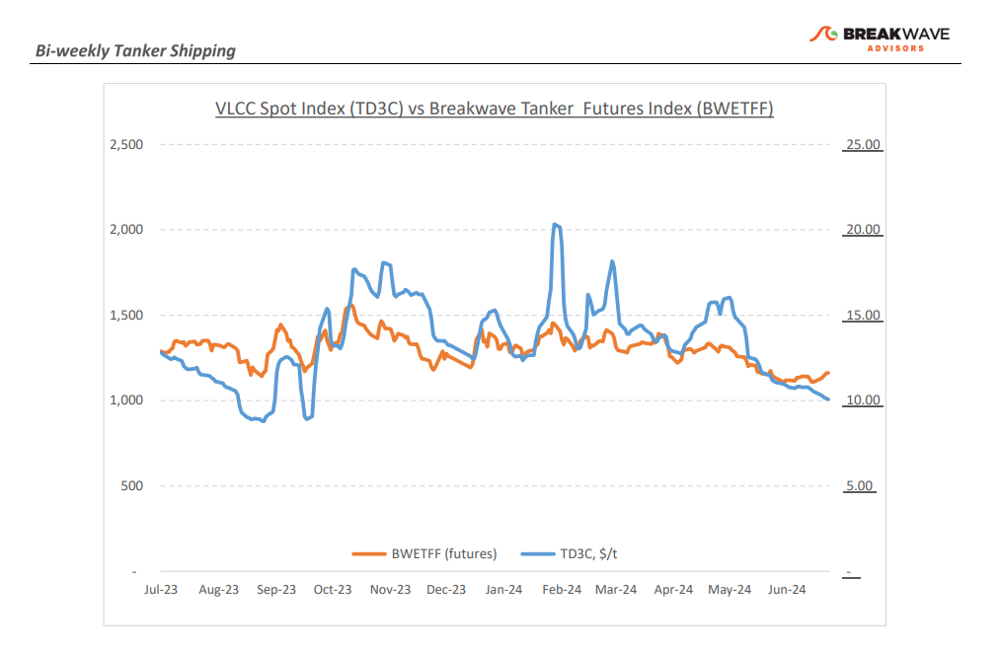
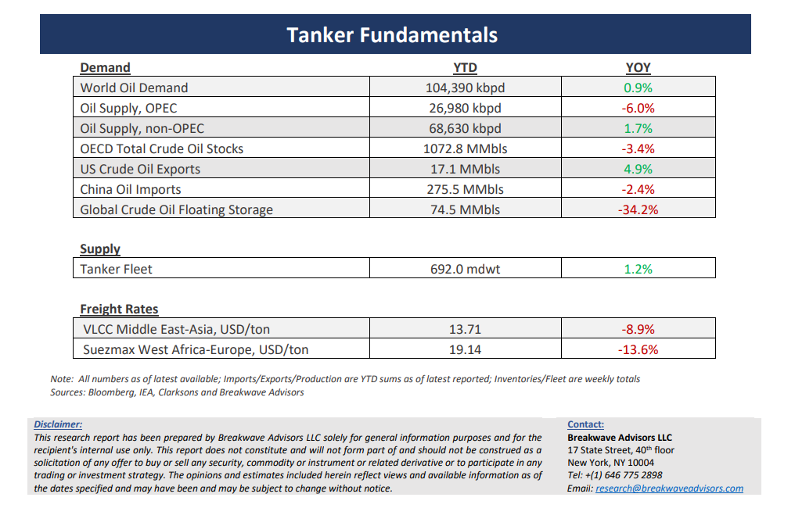

# Breakwave Bi-Weekly Tanker Report - July 16, 2024

**Date:** July 16, 2024  
**Publisher:** Breakwave Advisors | **Category:** Market Insights  
**Original URL:** [https://www.breakwaveadvisors.com/insights/2024716wet-87w498](https://www.breakwaveadvisors.com/insights/2024716wet-87w498)  

---

> **Figure 1: Cea3cf84ceb9ceb3cebcceb9cf8ccf84cf85**  
> [Local Asset](file:///C:/Users/Dell/Github/Shipping/corpus/03-breakwave/insights/2024/assets/2024-07-16_2024716wet-87w498_img_cea3cf84ceb9ceb3cebcceb9cf8ccf84cf85_8f71bf146bda.png)

**· VLCCs remain weak as activity plummets**– The first half of July reflected an almost identical sentiment to the end of June, with the VLCC market experiencing**steady yet sluggish**activity. Tonnage flow remains constant, with not many vessels predicted to set sail in the coming days, providing a semblance of stability. The freight**market sentiment is quite depressed**, with rates continuing to decline in both the Middle East Gulf (MEG) and West Africa basins, with rates slipping by about 12% month-over-month. Such a decline underscores the**need for more robust demand**in order for rates to unstuck from their current relatively low levels. Comparing today's situation with the first half of July last year, we observe a similar market structure, marked by a lack of significant momentum and steady yet subdued activity. Such recurring trend highlights the**cyclical nature of the VLCC market**, where periods of stability and sluggishness dominate during this time of year. Notably, two outstanding peaks were recorded within this timeframe: one in mid-November of last year and another before mid-March of this year. These peaks, though short-lived, brought a temporary surge in rates and market activity. Looking ahead to next week, there is some**cautious optimism**that rates might slightly firm up with the impending release of MEG dates. This could potentially spur some activity and provide a slight boost to the market. However, it remains to be seen whether this will be enough to counter the current rough downward trend and instill a more positive outlook in the VLCC market.

**· China’s crude oil imports drop by 11%, reflecting domestic sluggish demand**– China's crude oil imports dropped by 11% in June compared to the same month in 2023, driven by**lower fuel demand and reduced refining rates**at independent refiners. Crude arrivals in the first half of 2024 also decreased by 2.3% compared to the previous year, according to China’s General Administration of Customs. The International Energy Agency (IEA) reported that sluggish Chinese consumption is slowing global oil demand growth. In June, China, the world's largest oil importer, recorded crude imports of 46.45 million metric tons, or approximately 11.3 million barrels per day (bpd). While this was slightly higher than May's imports of 11.06 million bpd, it was 1.3 million bpd below the all-time high import volume of 12.67 million bpd set in June 2023. The**property crisis in China**and weaker-than-expected fuel demand have weighed on refining margins, prompting independent refiners to reduce crude throughput. Despite the above relatively negative data, oil prices remain elevated at multi-month highs, reflecting expectations for a recovery in global oil demand in the second half of the year as well as the ongoing**geopolitical disorder**that increases**optionality**for holders of physical crude oil.

**· Our Long-term View –**The tanker market is recovering from a long period of staggered rates as the growth in new vessel supply shrinks while oil demand is recovering in line with the global economy. A historically low orderbook combined with favorable demand fundamentals should continue to support increased spot rate volatility, which combined with the ongoing geopolitical turmoil, should support freight rates in the medium to long term.

> **Figure 2: Cea3cf84ceb9ceb3cebcceb9cf8ccf84cf85**  
> [Local Asset](file:///C:/Users/Dell/Github/Shipping/corpus/03-breakwave/insights/2024/assets/2024-07-16_2024716wet-87w498_img_cea3cf84ceb9ceb3cebcceb9cf8ccf84cf85_b032923ec288.png)

> **Figure 3: Cea3cf84ceb9ceb3cebcceb9cf8ccf84cf85**  
> [Local Asset](file:///C:/Users/Dell/Github/Shipping/corpus/03-breakwave/insights/2024/assets/2024-07-16_2024716wet-87w498_img_cea3cf84ceb9ceb3cebcceb9cf8ccf84cf85_b4fd3d247428.png)

### Subscribe:
