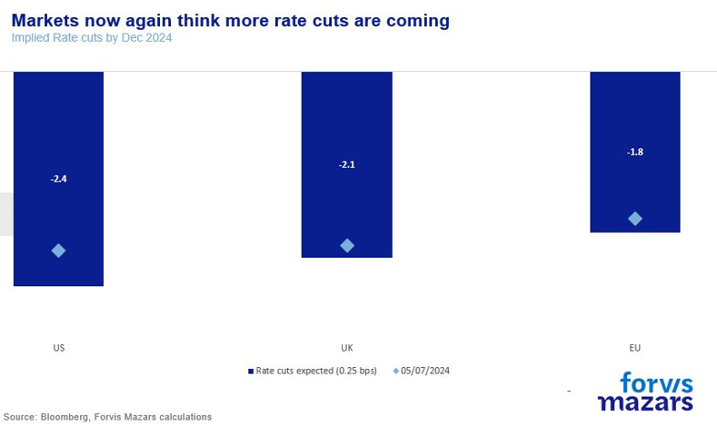
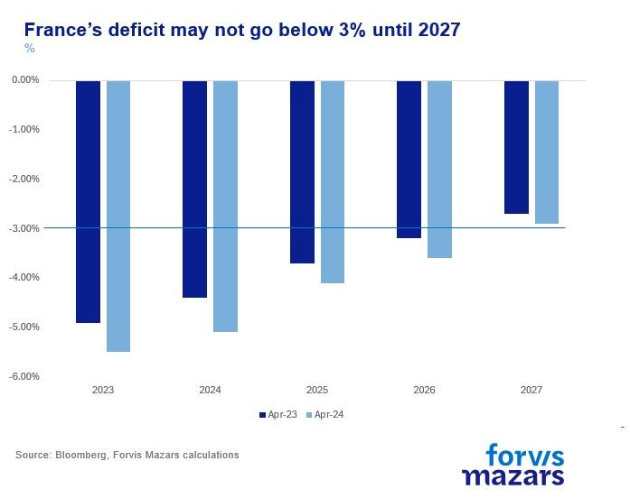
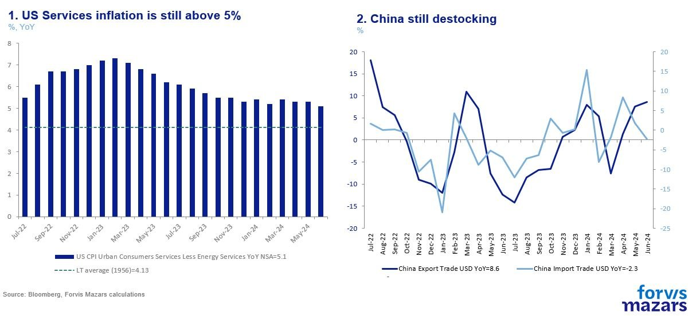

# The Centre Barely Hangs On And Inflation Is Only Moderating

**Date:** July 16, 2024  
**Publisher:** Breakwave Advisors | **Category:** Market Insights  
**Original URL:** [https://www.breakwaveadvisors.com/insights/2024/7/16/the-centre-barely-hangs-on-and-inflation-is-only-moderating](https://www.breakwaveadvisors.com/insights/2024/7/16/the-centre-barely-hangs-on-and-inflation-is-only-moderating)  

---

The three things investors should know this week:

1. Market performance in equities and bonds has improved on the back of a narrative which sees good electoral outcomes and lower inflation.
2. The case for bullishness on these factors is not as clear cut as it may seem. Centrist policies in Europe are still under fire, and US inflation coming down will likely continue to be a bumpy ride.
3. Despite lower market volatility, investors should not be too quick to exhaust their risk buckets.

*By*[*George Lagarias*](https://www.linkedin.com/in/george-lagarias-mba-3baa769/)

The world looks like a better place in the last few weeks. In France, Mr Macron managed to hand an electoral loss to surging Ms Le Pen. In the UK, the people decided overwhelmingly to install a moderate government with a strong mandate and possibly a more favourable eye towards Europe, after years of convulsions and five Prime Ministers, in the formerly ruling Tory party. Meanwhile, US inflation receded back to 3%, prompting markets to price in 2 to 3 rate cuts by the end of 2024, which would also allow European central banks to climb down their own rate ladders quicker than anticipated. US large caps are cheerful on the prospect, rising to fresh all-time highs, and bond yields have receded as traders are optimistic that we are finally on the verge of a new rate-cut cycle.

> **Figure 1: Market Chart 1**  
> **Interactive Data & Source:** [Economist](https://www.economist.com/leaders/2024/07/11/britains-skewed-election-reinforces-the-case-for-voting-reform-after-2029) | [Local Asset](file:///C:/Users/Dell/Github/Shipping/corpus/03-breakwave/insights/2024/assets/2024-07-16_the-centre-barely-hangs-on-and-inflation-is-only-moderating_img_image001_66977ecc069f.png)

And the shy optimist in me would honestly like to see it this way. No one likes a Grinch. But the evidence is stacking against all these theses and suggests that the markets might be slightly on the exuberant side.

**One: The (political) centre is barely holding.**

Moderate forces seem to have prevailed in the UK and France. However, their victories are precarious at best (in France the word is probably “pyrrhic”) and failure to deliver growth could swing voters even more to the fringes.

Mr Starmer is a moderate pro-business politician and not at all hostile to Europe. If anything, he epitomises the political centre. He gained an absolute 85-seat majority which means that he will not need to surrender his agenda to any block within his party. All that may be true. But he won half a million fewer votes than his predecessor. The seat advantage is mostly the result of a split vote in his rival party, which, in a first-past-the-post system can lead to an electoral landslide. Now Mr Starmer needs to deliver on growth, without raising taxes and with limited fiscal space. He needs to please eager markets by re-approaching Brussels (where governments in France and Germany are comprised of fragile coalitions), without alienating many of his constituents. And markets won’t wait forever. Because the Labour Party did little talking before the election (lest it jeopardised a 25-point lead), people voted largely on their own diverse set of expectations. Meeting those expectations will be a difficult proposition, especially given the fiscal limitations he inherits. The King’s speech due Wednesday may give some more concrete evidence of the HRM Government’s plans, providing some clarifications needed by investors. Meanwhile, 4 and a half million voters punished the Tory Party, because they felt it didn’t take an aggressive enough stance on Brexit.**Seats might have swung towards moderation, but voters swung more towards the fringes.**[Measured by the difference in voting share and seats,](https://www.economist.com/leaders/2024/07/11/britains-skewed-election-reinforces-the-case-for-voting-reform-after-2029)this UK election was the second most skewed in Western democratic history. So, the time to prove the concept is not ample for the new government. Neither markets nor voters might give the new government nearly as much leeway as their parliamentary seat margin suggests.

In France, things are more overtly difficult. For one, Ms Le Pen did win the popular vote, with 10 million votes, as opposed to 7 million votes for either Mr Macron’s Party or the Left Coalition. It is because of the idiosyncrasies of the electoral system that the first party in votes ended with the third amount of seats in the National Assembly. Second, Mr Macron was in a difficult fiscal position to begin with. After the Ministry of Finance’s numbers in April, which suggested that France would not reach the 3% deficit target before the end of 2027, Europe issued warnings and threatened the French economy with sanctions. France has a big debt (110% of GDP) and a high deficit.

> **Figure 2: Market Chart 2**  
> [Local Asset](file:///C:/Users/Dell/Github/Shipping/corpus/03-breakwave/insights/2024/assets/2024-07-16_the-centre-barely-hangs-on-and-inflation-is-only-moderating_img_image002_86df4a6b392b.jpg)

Mr Macron’s challenge now is to reduce it faster than anticipated (lest Europe’s second-biggest economy is seen ignoring the stability pact), co-governing with a coalition of left parties whose explicit agenda has been to cancel Mr Macron’s reforms and incur higher fiscal burdens, even as the hard-right is now the most popular party in France. Much like Mr Starmer, failing to deliver on heightened expectations, threatens a backlash from markets and, eventually, voters.

**Two: Inflation is moderating, but not retreating.**

On paper, US consumer inflation is coming down to 3%. This breeds hopes for central banks in Europe, where the economy is much weaker, and who are eagerly waiting for the Fed to start cutting rates so they too can move more aggressively. The ECB in particular, headed by a French person, might be more keen to return to a lower rate regime, in case it will have to re-stabilise Europe once more. It all hinges on US continuing to deflate. Despite the headline numbers, however, there’s much concern that inflation might persist. Services inflation is at 5.1%, well above the 2.8% average in the period before the pandemic. Deflation is almost exclusively a story of cheaper durable goods in the past five months. And that is enough to give central banks pause. We have often said we are not in the Great Moderation environment anymore. De-globalisation forces are destabilising global supply chains and reducing efficiencies, leading to higher inflation outcomes and reduced productivity. US price moderation has mostly been the result of China deflating the world again. But, unlike the nearly 25-year period leading to the pandemic, this is not part of an agreed global new order. China has been moving aggressively to re-capture market share in markets where it has lost its competitive advantage, and re-building industrial capacity. Unlike the period that preceded the pandemic, however, there’s much less appetite in the West for Chinese goods sold at or below cost. Geopolitical concerns have overtaken inflation concerns, so the West is already responding with (inflationary) tariffs. Even if it weren’t for the tariffs, which will eventually breed inflation back into durable goods, Chinese producer prices are positive for the first time in seven months. While China continues to de-stock, goods deflation may last a bit longer. But that effect may not continue for very long, even as services inflation persists.

> **Figure 3: Market Chart 3**  
> [Local Asset](file:///C:/Users/Dell/Github/Shipping/corpus/03-breakwave/insights/2024/assets/2024-07-16_the-centre-barely-hangs-on-and-inflation-is-only-moderating_img_image003_4dfd946457b4.jpg)

So, the world might not be as disinflationary as the narrative suggests. Also, if the last two weekends showed us anything (in the UK, France but also in the US were political acrimony turned into political violence), is that**centrist democracy, the kind that breeds economic and financial stability, is more likely hanging on by its fingernails than staging a comeback.**

In this world,**asset allocators need to leave ample room for economic and financial surprises in their portfolios.**What does this mean? Despite lower financial volatility, this may not be the time to exhaust to test the limits of portfolio risk thresholds.

---

**Tags:** Markets, Economy, Macro  
