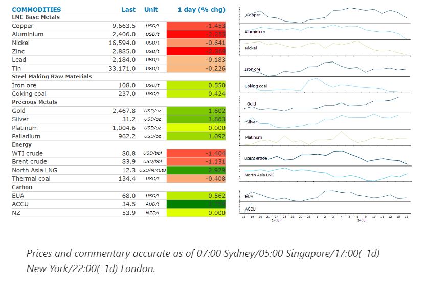
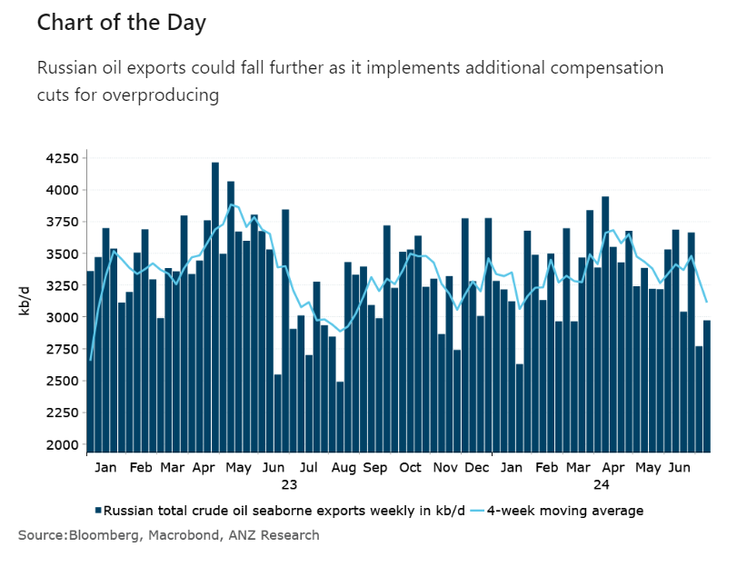

# Gold hits record high amid rising expectations of rate cuts

**Date:** July 17, 2024  
**Publisher:** Breakwave Advisors | **Category:** Market Insights  
**Original URL:** [https://www.breakwaveadvisors.com/insights/2024/7/17/gold-hits-record-high-amid-rising-expectations-of-rate-cuts](https://www.breakwaveadvisors.com/insights/2024/7/17/gold-hits-record-high-amid-rising-expectations-of-rate-cuts)  

---

A stronger USD created headwinds for commodity markets. Concerns over demand in China continue to weigh on sentiment.

*By*[*Daniel Hynes*](https://www.linkedin.com/in/dahynes/)

> **Figure 1: Στιγμιότυπο Οθόνης 2024 07 17 114228**  
> **Interactive Data & Source:** [Linkedin](https://www.linkedin.com/newsletters/commodities-wrap-6692196755876012032/?fbclid=IwAR3kiXJqZdxmp9ZcRwBNI7FsBySI-XSC0pfPur1qzjt7OZp7PTE59Tsl1QI) | [Local Asset](file:///C:/Users/Dell/Github/Shipping/corpus/03-breakwave/insights/2024/assets/2024-07-17_gold-hits-record-high-amid-rising-expectations-of-rate-cuts_img_cea3cf84ceb9ceb3cebcceb9cf8ccf84cf85_a5876aee8964.png)

### Market Commentary

**Gold**extended recent gains to reach another record high as the market increased its bets on a Fed rate cut. The move has been ignited by signs of slowing inflation. That has been followed up by weak economic data. US car repossession surged 23% y/y in the first half of 2024, to 14% above the 2019 level, a sign of rising consumer distress. This is providing greater confidence that policy makers will be keen to ease monetary policy. There is also increasing expectations that Donald Trump will return to the White House, which could also draw some support for the precious metal.

The stronger USD has also weighed on investors across the metals complex.**Copper**fell amid a broad sell-off despite the allure of easing monetary policy. There are also mounting concerns of weaker demand in China. The State Grid Corp of China is said to have slowed its purchases of copper wire this year amid the rally in prices. Moreover, it has ramped up purchases of**aluminium**wire, a cheaper substitute. This could have a meaningful impact on demand, with investment in grid infrastructure in China being one of the biggest sectors for demand in the world. Another disappointing production report from Rio Tinto failed to ignite fears of supply shortages. The diversified miner said mined output would be at the lower end of its recent guidance for 2024. A disruption at the Kennecott mine in Utah would scrimp supply.

**Battery metals**remained under pressure, despite recent supply side issues. BHP announced earlier this week that it was closing its WA nickel operations due to low prices. The market is also watching the impact of the proposed EU tariffs on China EV imports. The move is gaining bloc support, a secret non-binding ballot shows. A number of key governments, including Germany, abstained, with some planning to form a firmer position at a later date.

**Iron ore**futures fell amid concerns of weak demand in China just as supply increases. Rio Tinto reported a 1.5% y/y rise in second quarter shipments of iron ore. In Brazil, exports averaged 1.66mt/d in the first 10 days of July, up 14% from the full month pace of July 2023. This comes following weak economic data released earlier this week. The value of home sales decreased by 26.9% y/y YTD in June, compared with a 30.5% decline over the first five months. The property investment sector remains weak, -10.1%y/y YTD.

**Crude oil**fell as a weaker USD and sign of softening demand triggered algorithmic selling. WTI futures are now testing their 100-day moving average, a key support level. Russia’s Deputy Prime Minister Alexander Novak said that the global oil market will remain balanced even when some members of the OPEC+ alliance gradually start to increase production. In the meantime, Russia plans to make extra crude output cuts to compensate for pumping above its quota, Bloomberg reported. The nation’s four-week average of oil exports fell to their lowest level since January.

**Global gas**prices pushed higher as US LNG export terminals struggle to recover from Hurricane Beryl. Freeport LNG has cancelled at least seven shipments after the storm damaged part of the plant.

> **Figure 2: Στιγμιότυπο Οθόνης 2024 07 17 114339**  
> **Interactive Data & Source:** [Linkedin](https://www.linkedin.com/newsletters/commodities-wrap-6692196755876012032/?fbclid=IwAR3kiXJqZdxmp9ZcRwBNI7FsBySI-XSC0pfPur1qzjt7OZp7PTE59Tsl1QI) | [Local Asset](file:///C:/Users/Dell/Github/Shipping/corpus/03-breakwave/insights/2024/assets/2024-07-17_gold-hits-record-high-amid-rising-expectations-of-rate-cuts_img_cea3cf84ceb9ceb3cebcceb9cf8ccf84cf85_c5c3f141bbdd.png)

Data source:[Commodities Wrap](https://www.linkedin.com/newsletters/commodities-wrap-6692196755876012032/?fbclid=IwAR3kiXJqZdxmp9ZcRwBNI7FsBySI-XSC0pfPur1qzjt7OZp7PTE59Tsl1QI)

---

**Tags:** Commodities, Economy, Shipping  
