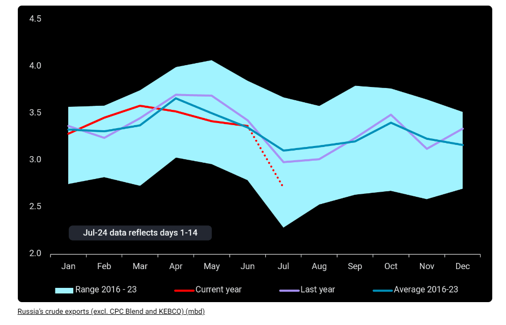
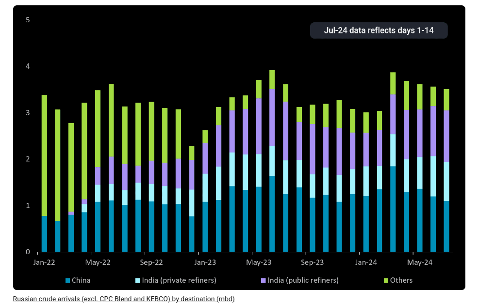

# Russia’s crude exports navigate demand shifts and sanctions

**Date:** July 17, 2024  
**Publisher:** Breakwave Advisors | **Category:** Market Insights  
**Original URL:** [https://www.breakwaveadvisors.com/insights/2024/7/17/russias-crude-exports-navigate-demand-shifts-and-sanctions](https://www.breakwaveadvisors.com/insights/2024/7/17/russias-crude-exports-navigate-demand-shifts-and-sanctions)  

---

Russian crude exports have fallen sharply in the first two weeks of July, with the impact partially mitigated by lower demand from China. Growing sanctions are impinging on tonnage supply for Russian trade in the short-term.

*By*[*Serena Huang*](https://www.linkedin.com/in/serena-huang-2466b489/)

Russian seaborne crude exports have sharply declined in the first two weeks of July, reaching 2.7mbd, the lowest since December 2022. As Russia’s domestic refineries ramp up to meet summer seasonal demand, a decline in exports during this time of year is expected. However, even accounting for seasonality, the country’s crude exports are still down 13% compared to the historical average. Notably, exports from Russia’s Baltic ports have recorded 1.07mbd in the first 14 days of the month, marking a 19-month low, while supplies from the Black Sea have decreased to 200kbd, the lowest since at least 2016.

> **Figure 1: Στιγμιότυπο Οθόνης 2024 07 17 113640**  
> **Interactive Data & Source:** [Vortexa](https://www.vortexa.com//oil-gas-data-traders-analysts-data-scientists?gclid=Cj0KCQjw8_qRBhCXARIsAE2AtRZKOvMnbilZ_6_91d7huSFFy71pWLrnPwGwOHVzXsmsG-1a1mZnQw8aAt89EALw_wcB&hsa_acc=1782073842&hsa_ad=548425387665&hsa_cam=14746637662&hsa_grp=125038601902&hsa_kw=&hsa_mt=&hsa_net=adwords&hsa_src=g&hsa_tgt=dsa-1431852288425&hsa_ver=3&utm_campaign=%5BCD%5D%20-%20DSA%20-%20EMEA&utm_medium=cpc&utm_medium=ppc&utm_source=google&utm_source=adwords&utm_term=) | [Local Asset](file:///C:/Users/Dell/Github/Shipping/corpus/03-breakwave/insights/2024/assets/2024-07-17_russias-crude-exports-navigate-demand-shifts-and-sanctions_img_cea3cf84ceb9ceb3cebcceb9cf8ccf84cf85_ad4c564c125c.png)

## Tepid China Demand Sends More Russian Crude to India

China’s tepid crude import demand has redirected more Russian crude cargoes to India. Seaborne arrivals of Russian crude into China in June declined to 1.2mbd, a 7-month low, with early indications suggesting that July’s arrivals could fall further. Meanwhile, imports of Russian crude into India exceeded 1.9mbd in June, the highest since last July. The majority of this increase has been directed to private refiners, with their imports of Russian crude up nearly 30% month-on-month. India’s import momentum could continue into this month, as more Russian Far East supplies are expected to land in India, offsetting the decline in Russian Urals imports.

Despite the narrowing discounts of Russian crude, it remains a more attractive feedstock compared to Middle Eastern grades from Saudi Arabia and the UAE. The average delivered price of Russian crude into India in May was $84/bl, a $3/bl and $11/bl discount compared to the average UAE and Saudi crude delivered prices respectively (India Ministry of Commerce and Industry). However, Russian crude was more expensive than some other sources, including Iraq, Kuwait, and Brazil. Tighter Russian crude exports this month would inevitably lead to weaker deliveries in August and September, but also drive Russian crude prices up.

> **Figure 2: Στιγμιότυπο Οθόνης 2024 07 17 113657**  
> **Interactive Data & Source:** [Vortexa](https://www.vortexa.com//oil-gas-data-traders-analysts-data-scientists?gclid=Cj0KCQjw8_qRBhCXARIsAE2AtRZKOvMnbilZ_6_91d7huSFFy71pWLrnPwGwOHVzXsmsG-1a1mZnQw8aAt89EALw_wcB&hsa_acc=1782073842&hsa_ad=548425387665&hsa_cam=14746637662&hsa_grp=125038601902&hsa_kw=&hsa_mt=&hsa_net=adwords&hsa_src=g&hsa_tgt=dsa-1431852288425&hsa_ver=3&utm_campaign=%5BCD%5D%20-%20DSA%20-%20EMEA&utm_medium=cpc&utm_medium=ppc&utm_source=google&utm_source=adwords&utm_term=) | [Local Asset](file:///C:/Users/Dell/Github/Shipping/corpus/03-breakwave/insights/2024/assets/2024-07-17_russias-crude-exports-navigate-demand-shifts-and-sanctions_img_cea3cf84ceb9ceb3cebcceb9cf8ccf84cf85_935082e7ad24.png)

## Rising Western Sanctions Tighten Fleet Supply, Rebound Expected

A growing number of vessels have come under Western sanctions this year, especially as the West increasingly sanctions individual vessels rather than corporate entities. Most of the 26 sanctioned tankers that were previously operating in the Russian crude trade have been idle, with seven tankers going dark as their last AIS signals were received more than two weeks ago at the time of writing. A leaner tanker fleet for the Russian trade may be offset by lower tonnage demand amidst lower Russian crude exports in the near-term, but exports are expected to rebound in Q3, which may drive a rise in freight rates. This could entice more vessel owners to enter the Russian trade. Unlike the past, growing Western scrutiny and sanctions is likely to put more pressure on incumbent vessel owners to be price-cap compliant, although shipowners willing to bear the risk of sanctions may also seize the opportunity to join the grey fleet involved in trades above the price cap.

Data Source:[Vortexa](https://www.vortexa.com//oil-gas-data-traders-analysts-data-scientists?gclid=Cj0KCQjw8_qRBhCXARIsAE2AtRZKOvMnbilZ_6_91d7huSFFy71pWLrnPwGwOHVzXsmsG-1a1mZnQw8aAt89EALw_wcB&hsa_acc=1782073842&hsa_ad=548425387665&hsa_cam=14746637662&hsa_grp=125038601902&hsa_kw=&hsa_mt=&hsa_net=adwords&hsa_src=g&hsa_tgt=dsa-1431852288425&hsa_ver=3&utm_campaign=%5BCD%5D%20-%20DSA%20-%20EMEA&utm_medium=cpc&utm_medium=ppc&utm_source=google&utm_source=adwords&utm_term=)
