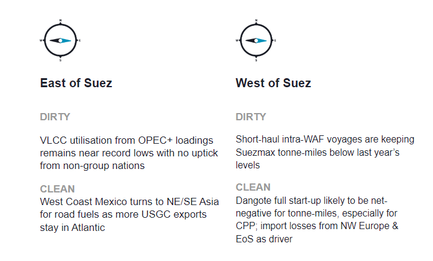
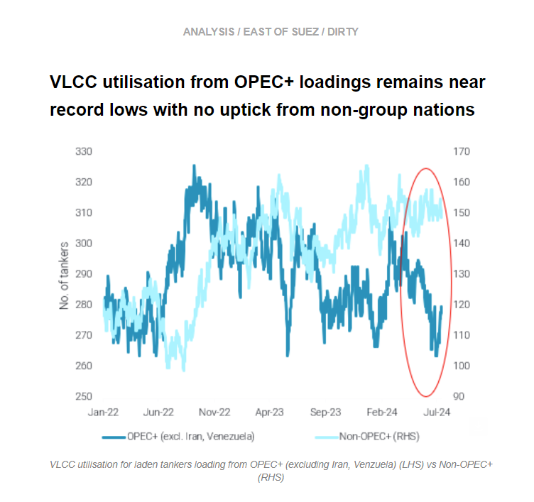
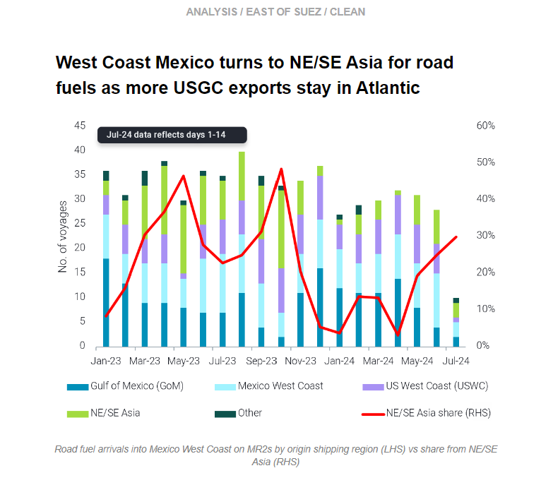
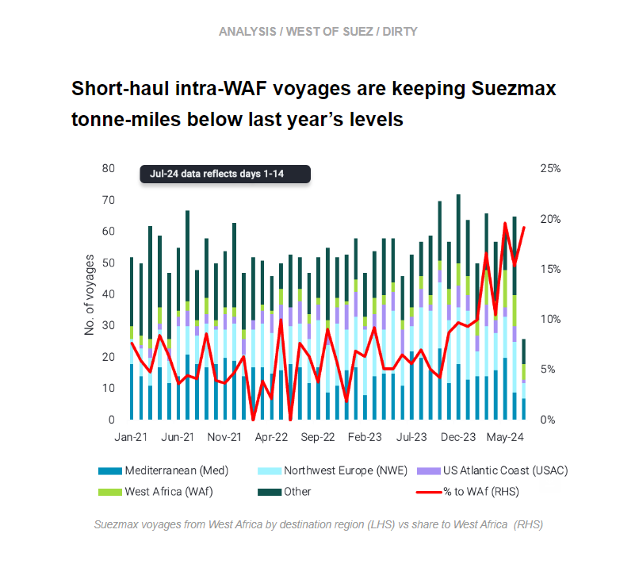
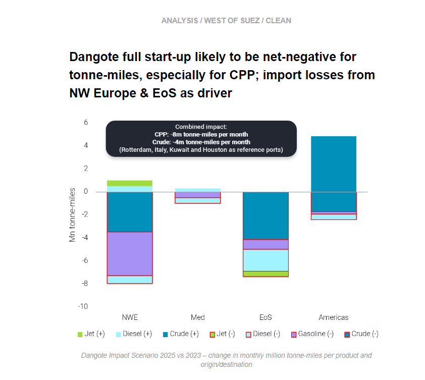

# Low VLCC utilisation from OPEC+

**Date:** July 18, 2024  
**Publisher:** Breakwave Advisors | **Category:** Market Insights  
**Original URL:** [https://www.breakwaveadvisors.com/insights/2024/7/18/m5x8ejlk7sp40zz3mmy9j60avwtpnj](https://www.breakwaveadvisors.com/insights/2024/7/18/m5x8ejlk7sp40zz3mmy9j60avwtpnj)  

---

This week, in the East, we look at near record-lows in VLCC utilisation from the OPEC+ group, and we discuss the impact for MRs as West Coast Mexico turns to APAC for road fuels. In the West, we explore the effect of an increase in intra-WAf voyages on Suezmax demand. On the clean side, we investigate the possible impact to tonne-miles as the Dangote refinery ramps up.

*By*[*Mary Melton*](https://www.linkedin.com/search/results/all/?fetchDeterministicClustersOnly=true&heroEntityKey=urn%3Ali%3Afsd_profile%3AACoAABXVyecBtg-pRnIrZe0BoWk0ygPiUfbvhsw&keywords=mary%20melton&origin=RICH_QUERY_SUGGESTION&position=0&searchId=40e8d7d2-c4d0-4022-81e7-176f6eba418b&sid=H_Y&spellCorrectionEnabled=false)

> **Figure 1: Στιγμιότυπο Οθόνης 2024 07 18 100124**  
> **Interactive Data & Source:** [Marketingmail Vortexa](https://marketingmail.vortexa.com/ODM3LU1aRS01NzgAAAGUX-lryoWOYm0_kmPyCLlSbbQmWHGf87aFMum5QIGE92-93Y-0We2mboAktDOXDsFuSKbx9no=) | [Local Asset](file:///C:/Users/Dell/Github/Shipping/corpus/03-breakwave/insights/2024/assets/2024-07-18_m5x8ejlk7sp40zz3mmy9j60avwtpnj_img_cea3cf84ceb9ceb3cebcceb9cf8ccf84cf85_39577884e75c.png)

> **Figure 2: Στιγμιότυπο Οθόνης 2024 07 18 100140**  
> **Interactive Data & Source:** [Marketingmail Vortexa](https://marketingmail.vortexa.com/ODM3LU1aRS01NzgAAAGUX-lryoWOYm0_kmPyCLlSbbQmWHGf87aFMum5QIGE92-93Y-0We2mboAktDOXDsFuSKbx9no=) | [Local Asset](file:///C:/Users/Dell/Github/Shipping/corpus/03-breakwave/insights/2024/assets/2024-07-18_m5x8ejlk7sp40zz3mmy9j60avwtpnj_img_cea3cf84ceb9ceb3cebcceb9cf8ccf84cf85_9ce839fd3ca7.png)

- [VLCC utilisation for OPEC+](https://marketingmail.vortexa.com/ODM3LU1aRS01NzgAAAGUX-lryoWOYm0_kmPyCLlSbbQmWHGf87aFMum5QIGE92-93Y-0We2mboAktDOXDsFuSKbx9no=)(excluding Iran and Venezuela) fell sharply during June and reached a record low early July, as exports from the OPEC+ group, especially Saudi Arabia, fell sharply -[read our latest insight on the subject here](https://marketingmail.vortexa.com/ODM3LU1aRS01NzgAAAGUX-lry8zC8fCOdc-IgjYpWSehLGVD7XkGg9BnsiWYzeJBScUM68udeGVNcKYCFJ64vj7wYB8=). So far in July VLCC utilisation for the producer group remains low compared to historical levels.

- Despite the lower VLCC utilisation for OPEC+ loadings, utilisation for the vessel class[outside of the group has remained relatively unchanged](https://marketingmail.vortexa.com/ODM3LU1aRS01NzgAAAGUX-lry_YOpGfY53XGHKiW3udyCfWMT9qv-bfcQwnUFjy14CPkzIkq0UU-I_11lo2n83ABtp8=). This reinforces the current weak sentiment for VLCC rates globally, but also on routes such as TD3C (US-China).
- The lack of sizeable alternative routes for VLCC flows, i.e. outside of OPEC+ (mostly Middle East) to Asia, is likely to keep VLCC rates under pressure. This is also likely to provide an incentive to traders looking at dirty-to-clean switches for VLCCs/Suezmaxes. Other pockets of utilisation for VLCCs outside of OPEC+ are the emergence of STS activity off PADD5 (from Vancouver loaded/TMX crude), USGC/Brazil loadings to Nigeria (for Dangote refinery) and potentially increased USGC-Europe flows, all which are much smaller in volume than Middle East-to-Asia employment.

> **Figure 3: Στιγμιότυπο Οθόνης 2024 07 18 100357**  
> **Interactive Data & Source:** [Marketingmail Vortexa](https://marketingmail.vortexa.com/ODM3LU1aRS01NzgAAAGUX-lry_9R1Rr0B3pNc20QSS0PD9ysXpAUXy1Awb7iiADB2FfbaOhW5GYqIR-KVtksttWW1Cw=) | [Local Asset](file:///C:/Users/Dell/Github/Shipping/corpus/03-breakwave/insights/2024/assets/2024-07-18_m5x8ejlk7sp40zz3mmy9j60avwtpnj_img_cea3cf84ceb9ceb3cebcceb9cf8ccf84cf85_991c45877ae5.png)

- [Mexico’s road fuel imports](https://marketingmail.vortexa.com/ODM3LU1aRS01NzgAAAGUX-lry_9R1Rr0B3pNc20QSS0PD9ysXpAUXy1Awb7iiADB2FfbaOhW5GYqIR-KVtksttWW1Cw=)are increasing for the fourth consecutive month (July days 1-15), following a spate of refinery issues which has reduced run rates after record-setting highs earlier this year. Mexico East Coast has turned to the USGC to satisfy increased demand for road fuels, which is contributing to high short-haul utilisation for MRs in the region. This combined with high short-haul demand to Caribbean destinations is attractive to US refiners, because it cuts down on shipping costs. As a result, less volume has been going through the Panama Canal to West Coast Mexico, even though Panama Canal transits are recovering.

- As a result, West Coast Mexico has steadily increased its exposure to road fuels from NE and SE Asia. The market share of[MR arrivals from NE/SE Asia](https://marketingmail.vortexa.com/ODM3LU1aRS01NzgAAAGUX-lrymMtgERKiwM9fprN10HJP48ffwcIDIii52YfxcIFP24rZgOgqLJE8t6tXCG5IFLfmx8=)has increased from around 3% in April to 30% in July days 1-14. This number does not include[6 additional MRs from Asia](https://marketingmail.vortexa.com/ODM3LU1aRS01NzgAAAGUX-lry_Vb8pEH4b4s6yLp1T3u34aYRagXEtxiyZ_pa6YKSLEKGyN7vNr7Ao422ZTQt9orDTs=)which are either en route to West Coast Mexico ports (2 vessels) or have been waiting to fully discharge at Rosarito due to limited capacity in storage tanks (4 vessels). Factoring in these vessels, market share from NE/SE Asia for the full month of July will likely be higher.
- If PADD 3 CPP exports remain largely in the Atlantic, West Coast Mexico demand for Asian road fuels will likely continue. Though comprising a very small share of the APAC MR market, the high voyage mileage required for this route could provide an attractive source of employment for trade in APAC.

> **Figure 4: Στιγμιότυπο Οθόνης 2024 07 18 100509**  
> **Interactive Data & Source:** [Marketingmail Vortexa](https://marketingmail.vortexa.com/ODM3LU1aRS01NzgAAAGUX-lry_HmHESuV7_nYDb89d2ly4ZBv5MkUdUzLR9RINvjGx1C4_S5Qdei74O8w-6IgGS7N1w=) | [Local Asset](file:///C:/Users/Dell/Github/Shipping/corpus/03-breakwave/insights/2024/assets/2024-07-18_m5x8ejlk7sp40zz3mmy9j60avwtpnj_img_cea3cf84ceb9ceb3cebcceb9cf8ccf84cf85_be55327e26a5.png)

- Freight rates for the Suezmax West Africa-to-Europe ([TD20](https://marketingmail.vortexa.com/ODM3LU1aRS01NzgAAAGUX-lry_HmHESuV7_nYDb89d2ly4ZBv5MkUdUzLR9RINvjGx1C4_S5Qdei74O8w-6IgGS7N1w=)) route are following the VLCC trends, currently reaching a 2024 low on the back of thinning crude supplies.

- For Suezmaxes specifically, however, the Dangote refinery start-up is unveiling its negative impact on crude tanker demand. Increasingly more[Suezmax tankers are employed for intra-WAf voyages](https://marketingmail.vortexa.com/ODM3LU1aRS01NzgAAAGUX-lryjR1JyDqcNooJ1lzv0VbpT9gKRYVZ5aQwyxsShlgUV3D-pSJnMuokNAzooWFwXbbsvE=)to satisfy the refinery's crude throughput, keeping voyage distances at low levels. The share of intra-WAf voyages has increased by a record of 15% on a y-o-y basis.
- As a result, tonne-miles for[Suezmaxes originating in the Atlantic Basin remained below 2023-levels](https://marketingmail.vortexa.com/ODM3LU1aRS01NzgAAAGUX-lrymNvuTSsYZBZM8vi0ONTI1PXmUvOTSazjpUj0fVJtu-WJ2hll7wmpz3SDLJoNQigSUE=)for the second consecutive month. This is not the only contributor, nevertheless, as plateauing[Americas East Coast supplies also keep Suezmax demand capped](https://marketingmail.vortexa.com/ODM3LU1aRS01NzgAAAGUX-lryusbxivXoTglHkb_vT37Anowms9vYpRYJPyMGF6M-NvG7DAB2CuFM0cnRaEyK4ffVu8=).

> **Figure 5: Στιγμιότυπο Οθόνης 2024 07 18 100528**  
> **Interactive Data & Source:** [Vortexa](https://www.vortexa.com//oil-gas-data-traders-analysts-data-scientists?gclid=Cj0KCQjw8_qRBhCXARIsAE2AtRZKOvMnbilZ_6_91d7huSFFy71pWLrnPwGwOHVzXsmsG-1a1mZnQw8aAt89EALw_wcB&hsa_acc=1782073842&hsa_ad=548425387665&hsa_cam=14746637662&hsa_grp=125038601902&hsa_kw=&hsa_mt=&hsa_net=adwords&hsa_src=g&hsa_tgt=dsa-1431852288425&hsa_ver=3&utm_campaign=%5BCD%5D%20-%20DSA%20-%20EMEA&utm_medium=cpc&utm_medium=ppc&utm_source=google&utm_source=adwords&utm_term=) | [Local Asset](file:///C:/Users/Dell/Github/Shipping/corpus/03-breakwave/insights/2024/assets/2024-07-18_m5x8ejlk7sp40zz3mmy9j60avwtpnj_img_cea3cf84ceb9ceb3cebcceb9cf8ccf84cf85_0b8d94192445.png)

- As the new Dangote refinery (nameplate capacity 650kbd) continues to ramp-up production, we created a Dangote impact scenario, comparing the changes in projected tonne-miles in 2025 versus 2023 values.

- Losses in tonne-mile demand from WAf crude exports to NW Europe and East of Suez markets contribute to an overall projected tonne-mile loss for crude tankers of 4 million tonne-miles per month. VLCCs operating in the Americas are set to find a pocket of strength in terms of extra crude tanker tonne-mile demand (+3.1 million tonne-miles per month).
- On the clean side, the projected negative tonne-mile impact is doubled. Our scenario projects a loss of 8 million tonne-miles per month in demand for clean tankers, the bulk of which comes from Dangote’s projected output of 325kbd of gasoline, which will be consumed domestically, replacing seaborne demand (mostly NW Europe) and negatively affecting MR demand. Our scenario assumes a small gain in tonne-miles based on middle distillate exports from Dangote to Europe, but these are far outweighed by the loss in gasoline import demand from WAf. A further loss of around 3 million tonne-miles per month will come from CPP import demand drying up from West Coast India and the Middle East to WAf.

Data Source:[Vortexa](https://www.vortexa.com//oil-gas-data-traders-analysts-data-scientists?gclid=Cj0KCQjw8_qRBhCXARIsAE2AtRZKOvMnbilZ_6_91d7huSFFy71pWLrnPwGwOHVzXsmsG-1a1mZnQw8aAt89EALw_wcB&hsa_acc=1782073842&hsa_ad=548425387665&hsa_cam=14746637662&hsa_grp=125038601902&hsa_kw=&hsa_mt=&hsa_net=adwords&hsa_src=g&hsa_tgt=dsa-1431852288425&hsa_ver=3&utm_campaign=%5BCD%5D%20-%20DSA%20-%20EMEA&utm_medium=cpc&utm_medium=ppc&utm_source=google&utm_source=adwords&utm_term=)

---

**Tags:** Shipping, Crude Oil, Tankers  
