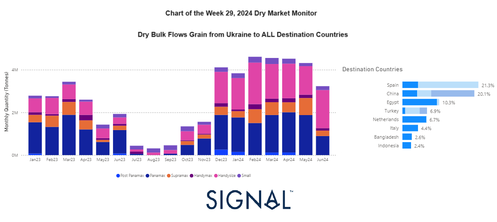
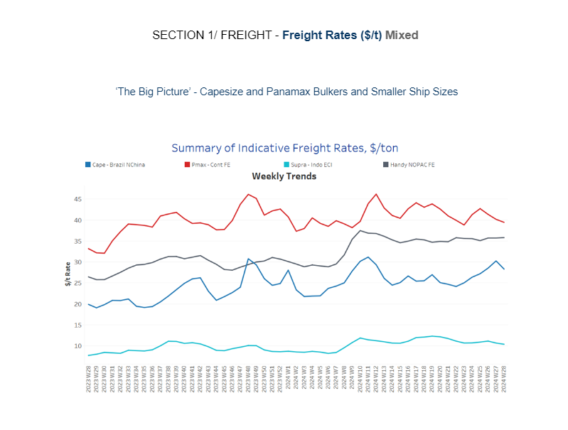
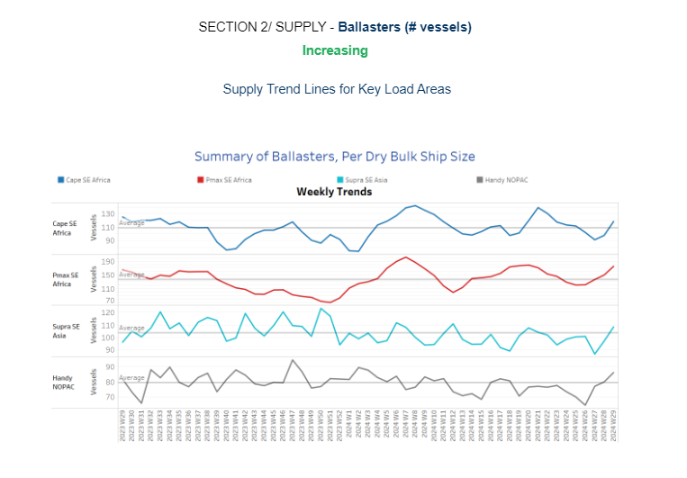
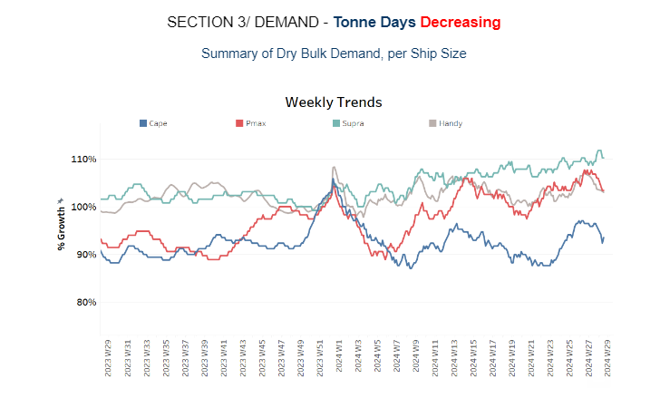
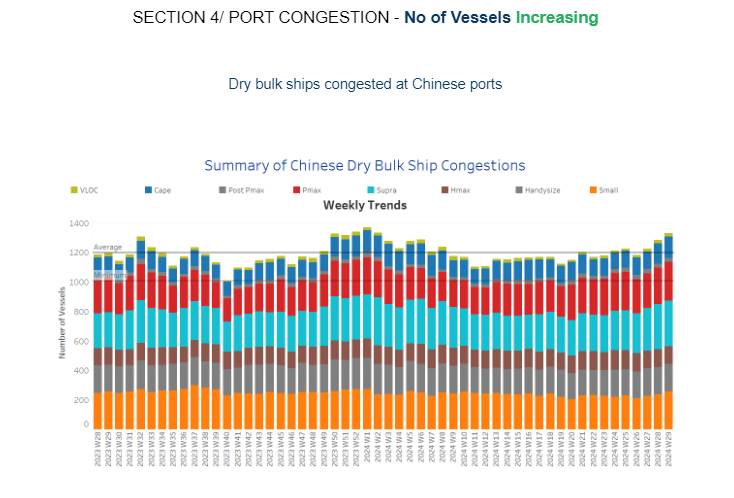

# Ukrainian Grain Shipments to ALL Destinations

**Date:** July 18, 2024  
**Publisher:** Breakwave Advisors | **Category:** Market Insights  
**Original URL:** [https://www.breakwaveadvisors.com/insights/2024/7/18/xbnwv034u0p3qm4d5yt7shngqf3zxk](https://www.breakwaveadvisors.com/insights/2024/7/18/xbnwv034u0p3qm4d5yt7shngqf3zxk)  

---

**Dry Weekly Market Monitor - Week 29.2024**
Snapshot of Spot Freight Rates, Supply-Demand Trends, Port Congestions
July 18, 2024

This week's chart illustrates the increase in the monthly volume of Ukrainian grain shipments during the first half of this year (left chart), following Russia's withdrawal from the[Black Sea Grain Initiative](https://go.signalocean.com/e/983831/ack-sea-grain-deal-2023-06-16-/2qd9tx/424453770/h/SxogwAUFzPHOSlglpbTUxe5tUH4pv7EsojFAS0t1yFw)in the summer of 2023. Despite the heightened security risks and logistical challenges, Ukraine has managed to significantly boost its grain exports through alternative routes and increased efficiency.

The data reveal that Spain and China have become the top destinations for Ukrainian grain, each accounting for 20% of the total exports, followed by Egypt with a 10% share (right chart). This diversification of export destinations highlights Ukraine's efforts to maintain its agricultural trade flows amidst geopolitical disruptions.

Per vessel class category, Panamax and Handysize vessels have absorbed a higher percentage of the grain shipments compared to Supramax vessels. The increased utilization of Panamax vessels, which can carry around 60,000 to 80,000 metric tons, and Handysize vessels, typically carrying between 10,000 to 40,000 metric tons, indicates a strategic adaptation to the constraints imposed by the current situation. These vessel classes are more versatile and can navigate alternative routes more efficiently than the larger Supramax vessel*s.*

> **Figure 1: Market Chart 1**  
> **Interactive Data & Source:** [Signal Ocean Platform](https://go.signalocean.com/e/983831/st-estimates-in-second-quarter/2qd9v1/424453770/h/SxogwAUFzPHOSlglpbTUxe5tUH4pv7EsojFAS0t1yFw) | [Local Asset](file:///C:/Users/Dell/Github/Shipping/corpus/03-breakwave/insights/2024/assets/2024-07-18_xbnwv034u0p3qm4d5yt7shngqf3zxk_img_unnamed_beec7ee0089c.png)

The third week of July concluded with a notable decline in the Capesize Brazil to North China rates, signaling a shift towards weaker market conditions exacerbated by an increasing number of ballast vessels in the SE Africa region. This rise in ballast vessels suggests a potential oversupply scenario looming ahead. Concurrently, the growth in demand tonne days indicates a subdued weekly percentage increase, indicating a cautious outlook for July, particularly in the larger vessel size segments.

In the grain segment, recent data illustrates a robust uptrend in the monthly volume of Ukrainian grain shipments during the first half of this year, surpassing figures from the same period last year. This growth trend presents promising trading opportunities, particularly benefiting the Handysize vessel size segment.

In the[iron ore market,](https://go.signalocean.com/e/983831/st-estimates-in-second-quarter/2qd9v1/424453770/h/SxogwAUFzPHOSlglpbTUxe5tUH4pv7EsojFAS0t1yFw)Vale SA’s iron ore production in the second quarter was stronger than expected, driven by robust output at its biggest mine in the north of Brazil. The world’s second-biggest iron ore supplier said the quarter’s performance reinforces its confidence in achieving the upper end of its 2024 production guidance for the steelmaking ingredient.

> **Figure 2: Στιγμιότυπο Οθόνης 2024 07 18 135604**  
> **Interactive Data & Source:** [Signal Ocean Platform](https://www.thesignalgroup.com/signal-ocean-platform) | [Local Asset](file:///C:/Users/Dell/Github/Shipping/corpus/03-breakwave/insights/2024/assets/2024-07-18_xbnwv034u0p3qm4d5yt7shngqf3zxk_img_cea3cf84ceb9ceb3cebcceb9cf8ccf84cf85_d191274e38bb.png)

In the third week of July, the dry bulk freight market witnessed a decline in rates for the Cape Brazil to North China routes. In contrast, the Panamax Continental Far East rates showed a stronger performance. Meanwhile, the smaller vessel size segments maintained resistance, suggesting a stable or stronger outlook.

- **Capesize**vessel freight rates for shipments from Brazil to North China have dipped below $26 per ton, though they still reflect a 34% increase compared to the same week last year.
- **Panamax**vessel freight rates from the Continent to the Far East held levels around $40 per ton, 25% higher than those recorded a year ago.
- **Supramax**vessel freight rates on the Indo-ECI route held steady around $10 per ton, reflecting similar sentiment to the previous week. These rates remain 35% higher compared to the same period last year.
- **Handysize**freight rates for the NOPAC Far East route have remained consistent over the past nine weeks, holding steady at approximately $36 per ton. This marks a notable 36% increase compared to rates observed one year ago.

> **Figure 3: Στιγμιότυπο Οθόνης 2024 07 18 135617**  
> **Interactive Data & Source:** [Signal Ocean Platform](https://www.thesignalgroup.com/signal-ocean-platform) | [Local Asset](file:///C:/Users/Dell/Github/Shipping/corpus/03-breakwave/insights/2024/assets/2024-07-18_xbnwv034u0p3qm4d5yt7shngqf3zxk_img_cea3cf84ceb9ceb3cebcceb9cf8ccf84cf85_f3b9e1ae8fa0.png)

In the third week of July, the Cape and Panamax SE Africa markets, which had been on a declining trend in previous weeks, showed a reversal with an upward movement. Similar increases were also observed in the smaller vessel size segments.

- **Capesize SE Africa:**The number of ballast ships has rose nearly 120, up approximately 30 from the low observed nearly three weeks ago.
- **Panamax SE Africa:**The number of ballast ships has risen to over 170, marking an increase of approximately 50 vessels compared to the low point observed in week 25.
- **Supramax SE Asia:**The count of ballast ships has now exceeded the annual average of 103 for the first time since the end of week 21, reaching a peak similar to the level observed at the end of week 11.
- **Handysize NOPAC:**Following a decline noted in week 25, the number of ballast vessels has shown an upward trend since the end of the previous week, now surpassing the annual average of 80. Today, the count of ballasters has risen to 86, marking an increase of 6 from the previous week.

> **Figure 4: Στιγμιότυπο Οθόνης 2024 07 18 140339**  
> **Interactive Data & Source:** [Signal Ocean Platform](https://www.thesignalgroup.com/signal-ocean-platform) | [Local Asset](file:///C:/Users/Dell/Github/Shipping/corpus/03-breakwave/insights/2024/assets/2024-07-18_xbnwv034u0p3qm4d5yt7shngqf3zxk_img_cea3cf84ceb9ceb3cebcceb9cf8ccf84cf85_bb7b737864fd.png)

In the third week of July, the outlook for dry tonne days indicated a weakening trend. Both the large vessel size segment and the Handysize experienced signs of slower growth. In contrast, the Supramax segment maintained a more robust outlook.

- **Capesize**: Recent estimates of tonne-day growth have shown a decline from the peak observed in week 25; nevertheless, growth remains markedly higher than the low point recorded at the end of week 21.
- **Panamax**: The renewed increase observed in the second week of July was reversed in the third week, contradicting expectations of a positive trend in demand. It remains uncertain whether the weekly percentage growth will stabilize in the remaining days of the month.
- **Supramax**: The growth rate held its upward trend observed over the past four weeks, showing improvement from the low point recorded at the end of week 21.
- **Handysize**: The upward trend in the Handysize vessel segment reversed course at the end of the second week of the month; nonetheless, it still stands significantly above the low point observed in week 18.

> **Figure 5: Στιγμιότυπο Οθόνης 2024 07 18 140448**  
> **Interactive Data & Source:** [Signal Ocean Platform](https://www.thesignalgroup.com/signal-ocean-platform) | [Local Asset](file:///C:/Users/Dell/Github/Shipping/corpus/03-breakwave/insights/2024/assets/2024-07-18_xbnwv034u0p3qm4d5yt7shngqf3zxk_img_cea3cf84ceb9ceb3cebcceb9cf8ccf84cf85_ee9102142ea9.png)

In the third week of July, Chinese dry bulk port congestion continued its upward trend from the previous week, reaching a new peak for the current year.

- **Capesize**: Capesize ship congestion surged to over 140 vessels, marking a substantial increase of more than 20 ships compared to levels observed three weeks prior.
- **Panamax**: The number of Panamax vessels rose to the 260 mark, an increase of nearly 14 compared to the previous week.
- **Supramax**: Congestion levels remained above 300, representing an increase of 40 vessels compared to three weeks ago.
- **Handysize**: Congestion levels held levels around 180, this marks an increase of nearly 15 compared to levels observed seven weeks ago.

Data Source:[Signal Ocean Platform](https://www.thesignalgroup.com/signal-ocean-platform)

---

**Tags:** Drybulk, Shipping, Capesize  
