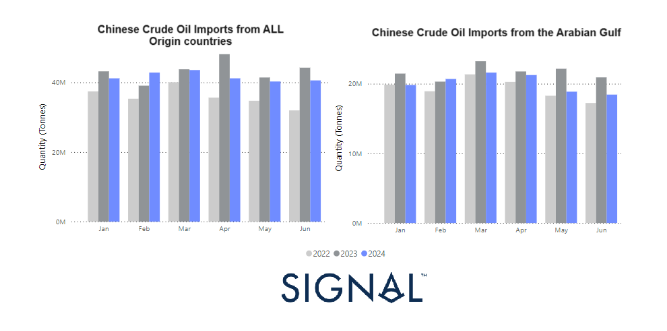
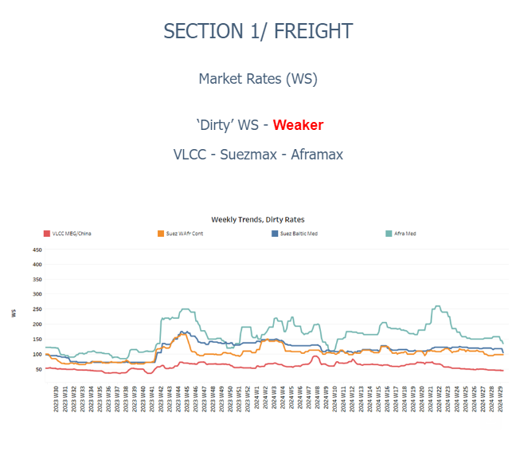
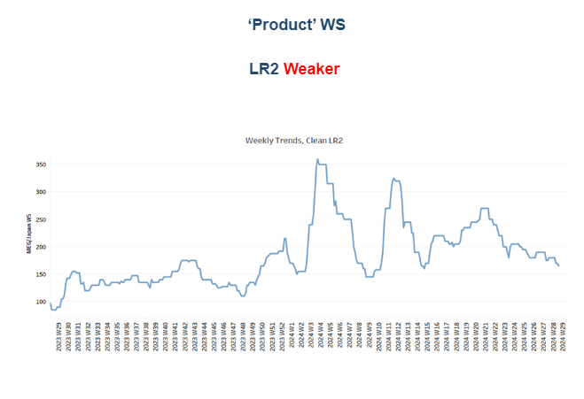
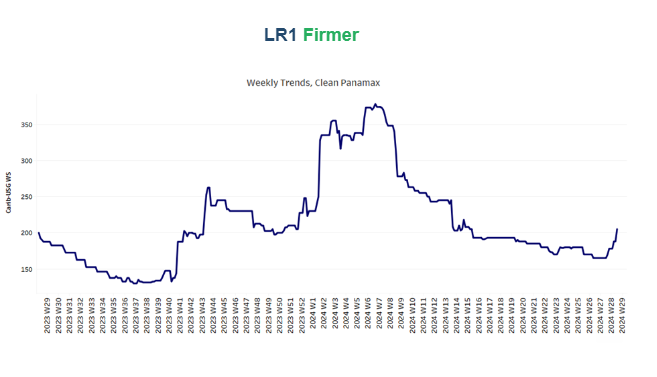
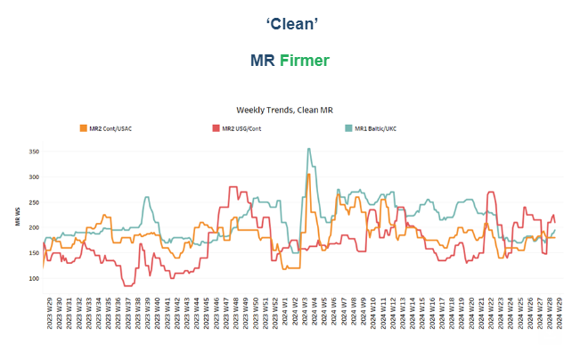
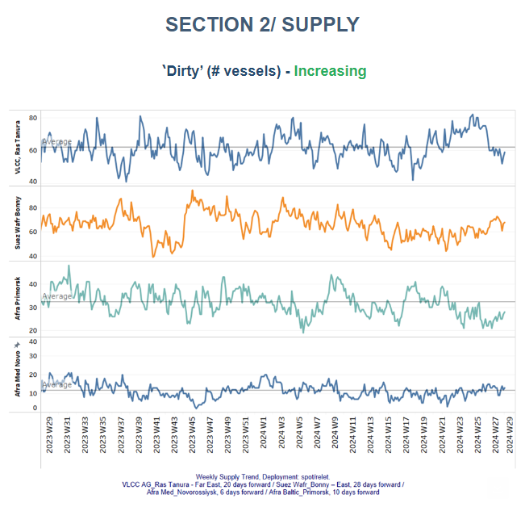
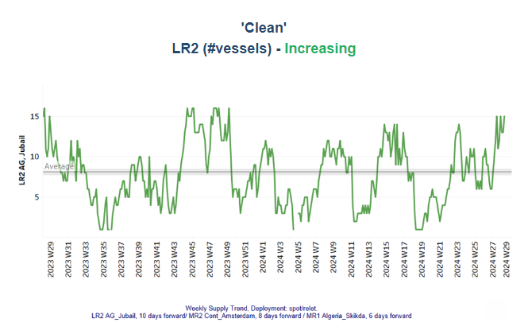
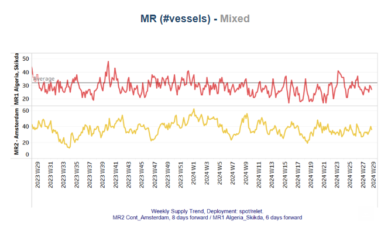
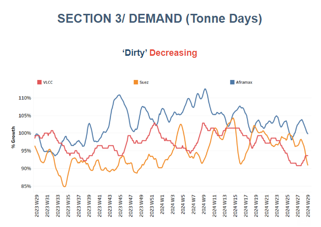
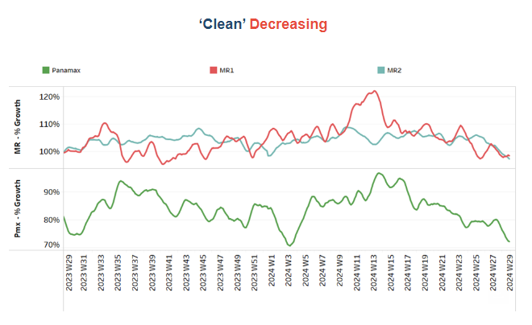

# Downward trajectory for crude oil freight rates

**Date:** July 19, 2024  
**Publisher:** Breakwave Advisors | **Category:** Market Insights  
**Original URL:** [https://www.breakwaveadvisors.com/insights/2024/7/19/downward-trajectory-for-crude-oil-freight-rates](https://www.breakwaveadvisors.com/insights/2024/7/19/downward-trajectory-for-crude-oil-freight-rates)  

---

### Tanker - Weekly Market Monitor

Snapshot of Crude and Product Freight Rates, Supply-Demand

Week 29, July 19, 2024

**Chart of the Week: Dirty & Clean Tonne Days**
*This week's chart underscores the decline in the growth of crude oil shipments to China from all origin countries during the second quarter of the year, with the monthly quantity in June recording an 8% drop compared to the same month in the previous year (left chart). This decline reflects a broader trend influenced by various factors including economic slowdowns, changes in demand, and strategic stockpiling. Looking specifically at crude oil flows from the Arabian Gulf to China, we observe that May and June recorded significantly lower levels than in the previous year (left chart). Despite the noticeable dip in May and June, the overall trend for the first half of the year shows that the monthly volume of crude oil shipments from all origin countries to China maintained a higher pace than the levels recorded in 2022 (right chart). In*[*March 2024*](https://go.signalocean.com/e/983831/et-monitor-tanker-week-12-2024/2qdfc4/424874322/h/y58T4qP-BSCIOTA4cTe_s4k2y5JhQgrbqA6sEmweTW8)*, we noted a decline in the monthly volume of Russian crude oil shipments to China. This drop was observed at the end of the month, following the highs recorded in January and February.*

> **Figure 1: Στιγμιότυπο Οθόνης 2024 07 19 123512**  
> **Interactive Data & Source:** [Signal Ocean Platform](https://go.signalocean.com/e/983831/s-Could-Hit-100-This-Year-html/2qdfcb/424874322/h/y58T4qP-BSCIOTA4cTe_s4k2y5JhQgrbqA6sEmweTW8) | [Local Asset](file:///C:/Users/Dell/Github/Shipping/corpus/03-breakwave/insights/2024/assets/2024-07-19_downward-trajectory-for-crude-oil-freight-rates_img_cea3cf84ceb9ceb3cebcceb9cf8ccf84cf85_e34dc2786273.png)

In the third week of July, crude oil freight rates continued their downward trajectory, with the clean segment showing early signs of gaining momentum. At Ras Tanura, the number of vessels available for the VLCC MEG-China route remains below the annual average, indicating a tightening supply. However, forecasts suggest a potential increase in vessel availability in the coming days, which could once again exert downward pressure on freight market sentiment. The outlook for growth in tonne days remains bearish, further contributing to the cautious sentiment prevailing in the market.

Meanwhile, in the oil market, according to[JP Morgan](https://go.signalocean.com/e/983831/s-Could-Hit-100-This-Year-html/2qdfcb/424874322/h/y58T4qP-BSCIOTA4cTe_s4k2y5JhQgrbqA6sEmweTW8), WTI crude oil prices may see a substantial rise to $100 per barrel in the near future due to reduced incentives for producers to increase production. The investment bank's analysis indicates that the current equilibrium price for WTI oil stands at approximately $70 per barrel. However, they argue that a price of $60 per barrel is insufficient to stimulate adequate production levels. This perceived imbalance between production incentives and market demand could potentially create conditions favourable for a significant price surge to $100 per barrel, as reported by Forexlive.

> **Figure 2: Στιγμιότυπο Οθόνης 2024 07 19 123652**  
> **Interactive Data & Source:** [Signal Ocean Platform](https://www.thesignalgroup.com/signal-ocean-platform) | [Local Asset](file:///C:/Users/Dell/Github/Shipping/corpus/03-breakwave/insights/2024/assets/2024-07-19_downward-trajectory-for-crude-oil-freight-rates_img_cea3cf84ceb9ceb3cebcceb9cf8ccf84cf85_6ef945f132b6.png)

​​​​​The downward trend in VLCC MEG-China freight rates continued through the first half of July. Similarly, other categories of crude tanker vessels also experienced weakening rates, except for the Suezmax Wafr Continent route, which showed resilience.

- The**VLCC**MEG-China freight rates have dropped to 46 WS, marking a 13% decrease compared to rates observed one month ago.
- Suezmax freight rates for shipments from**West Africa to continental Europe**have remained below 100 WS since last week, marking a 13% decrease compared to levels observed a month ago. Similarly, rates on the**Suez Baltic Med**route have dropped to below 110 WS, reflecting a 14% decline from a month ago.
- Aframax**Mediterranean**freight rates have declined to approximately WS130, representing a 17% decrease compared to the previous week.

> **Figure 3: Στιγμιότυπο Οθόνης 2024 07 19 123733**  
> **Interactive Data & Source:** [Signal Ocean Platform](https://www.thesignalgroup.com/signal-ocean-platform) | [Local Asset](file:///C:/Users/Dell/Github/Shipping/corpus/03-breakwave/insights/2024/assets/2024-07-19_downward-trajectory-for-crude-oil-freight-rates_img_cea3cf84ceb9ceb3cebcceb9cf8ccf84cf85_04a5a440d6c5.png)

- **LR2**AG freight rates have dropped to WS160, reflecting a 20-point decrease from rates observed a week ago. Recent sentiment suggests a 20% decrease compared to the same week last year.

> **Figure 4: Στιγμιότυπο Οθόνης 2024 07 19 123755**  
> **Interactive Data & Source:** [Signal Ocean Platform](https://www.thesignalgroup.com/signal-ocean-platform) | [Local Asset](file:///C:/Users/Dell/Github/Shipping/corpus/03-breakwave/insights/2024/assets/2024-07-19_downward-trajectory-for-crude-oil-freight-rates_img_cea3cf84ceb9ceb3cebcceb9cf8ccf84cf85_7a768e5d4842.png)

- **Panamax**Carib-to-USG rates recorded a peak for the first time since the end of week 8, hovering around WS 220, which is 24% weaker compared to rates observed a week ago.

> **Figure 5: Στιγμιότυπο Οθόνης 2024 07 19 123808**  
> **Interactive Data & Source:** [Signal Ocean Platform](https://www.thesignalgroup.com/signal-ocean-platform) | [Local Asset](file:///C:/Users/Dell/Github/Shipping/corpus/03-breakwave/insights/2024/assets/2024-07-19_downward-trajectory-for-crude-oil-freight-rates_img_cea3cf84ceb9ceb3cebcceb9cf8ccf84cf85_993899fbc23f.png)

- **MR1**rates for shipments from the**Baltic to the continent**gained momentum in the second week of July, reaching nearly 200 WS, marking an 11% increase compared to levels observed a month ago. Meanwhile,**MR2**rates for shipments from the**continent to the USAC**maintained a steady sentiment at 180 WS on a weekly basis, reflecting a 12% increase compared to the previous month. On the**USG-Cont route, MR2**rates peaked at 190 WS, showing a significant 29% weekly increase.

> **Figure 6: Στιγμιότυπο Οθόνης 2024 07 19 124234**  
> **Interactive Data & Source:** [Signal Ocean Platform](https://www.thesignalgroup.com/signal-ocean-platform) | [Local Asset](file:///C:/Users/Dell/Github/Shipping/corpus/03-breakwave/insights/2024/assets/2024-07-19_downward-trajectory-for-crude-oil-freight-rates_img_cea3cf84ceb9ceb3cebcceb9cf8ccf84cf85_e5b1e781d9c3.png)

​​​​​​The supply trend for crude tankers at the VLCC Ras Tanura has remained below the annual average. In contrast, the Suezmax market, particularly at the WAFR (West Africa) Bonny terminal, has experienced upward pressure for the second consecutive week.

- **VLCC Ras Tanura**: The supply of crude tankers at VLCC Ras Tanura has dropped below 60, a significant decrease from the peak of over 80 recorded four weeks ago. Recent market indicators suggest that an increase in supply may be imminent in the coming days.
- **Suezmax Wafr**: The current ship count has increased to 68, up from last week's estimate which had anticipated levels surpassing 70.
- **Aframax Primorsk**: For the past six weeks, the number of ships has consistently remained well below the annual average of 30, nearly 13 fewer than the peak recorded ten weeks ago. However, levels have started to show an increase during the second half of the month.
- **Aframax Med Novo**: Since the end of week 22, the vessel count has consistently hovered around the annual average of 10. Early estimates for the second week of July suggested a slight upward trend similar to what was observed at the beginning of the month.

> **Figure 7: Στιγμιότυπο Οθόνης 2024 07 19 124442**  
> **Interactive Data & Source:** [Signal Ocean Platform](https://www.thesignalgroup.com/signal-ocean-platform) | [Local Asset](file:///C:/Users/Dell/Github/Shipping/corpus/03-breakwave/insights/2024/assets/2024-07-19_downward-trajectory-for-crude-oil-freight-rates_img_cea3cf84ceb9ceb3cebcceb9cf8ccf84cf85_866cea00eb73.png)

> **Figure 8: Στιγμιότυπο Οθόνης 2024 07 19 124454**  
> **Interactive Data & Source:** [Signal Ocean Platform](https://www.thesignalgroup.com/signal-ocean-platform) | [Local Asset](file:///C:/Users/Dell/Github/Shipping/corpus/03-breakwave/insights/2024/assets/2024-07-19_downward-trajectory-for-crude-oil-freight-rates_img_cea3cf84ceb9ceb3cebcceb9cf8ccf84cf85_3dd2f17cc199.png)

- **Clean LR2 AG Jubail**: The upward trend in the number of vessels observed in July is continuing at an exceptionally high rate. The count is now nearing 15, indicating that the increase above the annual trend is likely to persist at a similar pace in the coming days.
- **Clean MR**: Vessel activity for**MR1**at Algeria's Skikda port has dropped to 25, a significant decrease of nearly 14 from the peak observed six weeks ago. Meanwhile,**MR2**activity in Amsterdam has maintained the accelerated pace seen in the previous week, with indications of a slight drop below 40. However, the recent trend shows an increase in activity for July compared to June.

> **Figure 9: Στιγμιότυπο Οθόνης 2024 07 19 124625**  
> **Interactive Data & Source:** [Signal Ocean Platform](https://www.thesignalgroup.com/signal-ocean-platform) | [Local Asset](file:///C:/Users/Dell/Github/Shipping/corpus/03-breakwave/insights/2024/assets/2024-07-19_downward-trajectory-for-crude-oil-freight-rates_img_cea3cf84ceb9ceb3cebcceb9cf8ccf84cf85_e1ddd0c2d719.png)

- **Dirty**tonne days: The growth of VLCC tonne-days confirmed earlier weekly signs of a slight upward shift in the third week of July. In the Suezmax segment, early indications of a potential upward reversal at the end of June were not confirmed, leading to a downward correction in the first half of July. Meanwhile, the Aframax segment, which showed a potential upward trend peaking at the end of week 27, has since decreased, with no signs of a rebound yet.

> **Figure 10: Στιγμιότυπο Οθόνης 2024 07 19 124637**  
> **Interactive Data & Source:** [Signal Ocean Platform](https://www.thesignalgroup.com/signal-ocean-platform) | [Local Asset](file:///C:/Users/Dell/Github/Shipping/corpus/03-breakwave/insights/2024/assets/2024-07-19_downward-trajectory-for-crude-oil-freight-rates_img_cea3cf84ceb9ceb3cebcceb9cf8ccf84cf85_6f4f4efebb27.png)

- **Panamax**tonne days: Growth rates continued significantly weaker compared to the peak observed in week 13.
- For**Clean MR**tonne days, demand appears to have reached its lowest growth point. Both MR1 and MR2 vessel size segments are experiencing a similar weakening trend in the pace of growth.

Data Source:[Signal Ocean Platform](https://www.thesignalgroup.com/signal-ocean-platform)

---

**Tags:** Shipping, Tankers, Crude  
