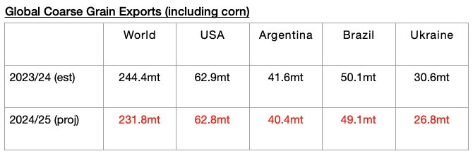

# Grain Contraction Just One of Several Potential Concerning Headwinds

**Date:** July 19, 2024  
**Publisher:** Breakwave Advisors | **Category:** Market Insights  
**Original URL:** [https://www.breakwaveadvisors.com/insights/2024/7/19/lf04956k9n3w6ziswdi7ub4cod7eo1](https://www.breakwaveadvisors.com/insights/2024/7/19/lf04956k9n3w6ziswdi7ub4cod7eo1)  

---

*By*[*Jeffrey Landsberg*](https://www.linkedin.com/in/jeffrey-landsberg-70ab957/)

As we discussed in Commodore Research's most recent Weekly Dry Bulk Report, last week ended up seeing a very large jump in spot cargo volume reported in the market. In fact, it was the largest volume reported all year. Spot cargo volume is historically volatile and can wax and wane significantly during any given week. For now, last week’s jump is not at all predictive of what will come next in the near term. Overall, time will tell if this has marked the start of a sustained trend, or if instead if it was just a normal and brief fluctuation — and we will be publishing updates for Commodore's subscribers. The majority of last week’s robust cargo volume was coal and grain cargoes.

Overall, we remain concerned that the three new engines of demand-side growth that we have been highlighting this year could all become headwinds, as there is a solid chance all will return to contraction. This week's Weekly Dry Bulk Report highlighted grain trade prospects, and particularly concerning is that the United States Department of Agriculture has again lowered its forecast for global grain exports for the 2024/25 season (due to weaker harvests) and has again raised its estimate for 2023/24’s export total. An even larger year-on-year contraction is now expected in 2024/25. The forecast is still very preliminary, but if a contraction does occur, this would mark a reversal from very robust growth in 2023/24.

The USDA is now predicting that global coarse grain, wheat, soybean, and soymeal exports will total 699.4 million tons. This is 1.5 million tons less than was predicted a month ago and marks a year-on-year decline of 13.2 million tons (-2%) from the 712.6 million tons that is now expected for 2023/24. Just one month ago, the USDA was estimating 704.9 million tons of exports for 2023/24. Coarse grain will continue to serve as the dry bulk market’s largest grain export type by volume. The USDA is now forecasting that global coarse grain exports in 2024/25 will total 231.8 million tons, which is 1.5 million tons (-1%) less than predicted a month ago and would mark a year-on-year decline of 12.6 million tons (-5%). A full examination of grain trade prospects has been included in this week's Weekly Dry Bulk Report.

> **Figure 1: Chart**  
> [Local Asset](file:///C:/Users/Dell/Github/Shipping/corpus/03-breakwave/insights/2024/assets/2024-07-19_lf04956k9n3w6ziswdi7ub4cod7eo1_img_chart_f6422e470064.jpg)

---

**Tags:** Drybulk, Coal, Commodities  
