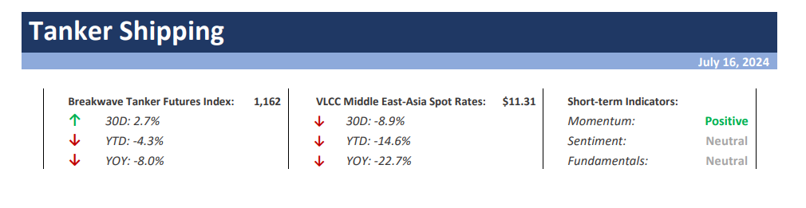

# Weekly Insights Review

**Date:** July 19, 2024  
**Publisher:** Breakwave Advisors | **Category:** Market Insights  
**Original URL:** [https://www.breakwaveadvisors.com/insights/2024/7/19/weekly-insights-review](https://www.breakwaveadvisors.com/insights/2024/7/19/weekly-insights-review)  

---

## Welcome to Our Weekly Insights Review

## Read Here Everything You Need to Know

## Breakwave Tanker Report

**VLCCs remain weak as activity plummets**– The first half of July reflected an almost identical sentiment to the end of June, with the VLCC market experiencing**steady yet sluggish**activity.

> **Figure 1: Στιγμιότυπο Οθόνης 2024 07 16 135454**  
> **Interactive Data & Source:** [Breakwave Advisors Market Insights](https://www.breakwaveadvisors.com/insights/2024/7/15/ja9xr2is43etm19efflv9xqvfcfhpu) | [Local Asset](file:///C:/Users/Dell/Github/Shipping/corpus/03-breakwave/insights/2024/assets/2024-07-19_weekly-insights-review_img_cea3cf84ceb9ceb3cebcceb9cf8ccf84cf85_8f71bf146bda.png)

> **Figure 2: Read More**  
> **Interactive Data & Source:** [Breakwave Advisors Market Insights](https://www.breakwaveadvisors.com/insights/2024/7/15/ja9xr2is43etm19efflv9xqvfcfhpu) | [Local Asset](file:///C:/Users/Dell/Github/Shipping/corpus/03-breakwave/insights/2024/assets/2024-07-19_weekly-insights-review_img_image-asset281029_a44c7463e2ae.jpeg)

## Notably Strong China’s Export Performance

Doric Weekly Market Insight

As the star performer of the twenty-eighth trading week, the Baltic Panamax index posted an impressive 8.6 percent weekly gain, reaching $15,106 per day.

> **Figure 3: Oil Drilling**  
> **Interactive Data & Source:** [Breakwave Advisors Market Insights](https://www.breakwaveadvisors.com/insights/2024/7/15/cash-cow) | [Local Asset](file:///C:/Users/Dell/Github/Shipping/corpus/03-breakwave/insights/2024/assets/2024-07-19_weekly-insights-review_img_oil-drilling_1f62af173c53.jpg)

## Cash Cow

Gibson Tanker Market Report

In December 2023, when the newly elected Xavier Milei took the oath as the Argentinian president, the country was reeling under hyper-inflation, which stood at 133.5% annually.

[Read More](https://www.breakwaveadvisors.com/insights/2024/7/15/cash-cow)

> **Figure 4: Market Chart 4**  
> **Interactive Data & Source:** [Breakwave Advisors Market Insights](https://www.breakwaveadvisors.com/insights/2024/7/15/sentiment-supported-by-strong-commodity-imports-into-china) | [Local Asset](file:///C:/Users/Dell/Github/Shipping/corpus/03-breakwave/insights/2024/assets/2024-07-19_weekly-insights-review_img_image-asset_b8fd8267fba6.jpeg)

## Sentiment Supported by Strong Commodity Imports Into China

Commodities Wrap

The prospect of easing monetary policy helped boost sentiment across the commodity complex. However, this was offset by easing supply side issues.

[Read More](https://www.breakwaveadvisors.com/insights/2024/7/15/sentiment-supported-by-strong-commodity-imports-into-china)

> **Figure 5: Market Chart 5**  
> **Interactive Data & Source:** [Breakwave Advisors Market Insights](https://www.breakwaveadvisors.com/insights/2024/7/16/headwinds-for-the-chinese-economy) | [Local Asset](file:///C:/Users/Dell/Github/Shipping/corpus/03-breakwave/insights/2024/assets/2024-07-19_weekly-insights-review_img_image-asset28129_1dec383eac94.jpeg)

## Headwinds for the Chinese Economy

The Fix - Global Market Update

The Baltic Dry Index recorded a minor gain last week, with the panamaxes chiefly responsible for the positive development as the gauge for the capesizes retreated.

> **Figure 6: Market Chart 6**  
> **Interactive Data & Source:** [Breakwave Advisors Market Insights](https://www.breakwaveadvisors.com/insights/2024/7/16/the-centre-barely-hangs-on-and-inflation-is-only-moderating) | [Local Asset](file:///C:/Users/Dell/Github/Shipping/corpus/03-breakwave/insights/2024/assets/2024-07-19_weekly-insights-review_img_image-asset28229_4918437cf216.jpeg)

## The Centre Barely Hangs on and Inflation Is Only Moderating

Forvis Mazars Weekly Note

The world looks like a better place in the last few weeks. In France, Mr Macron managed to hand an electoral loss to surging Ms Le Pen.

> **Figure 7: Στιγμιότυπο Οθόνης 2024 07 17 113322**  
> **Interactive Data & Source:** [Breakwave Advisors Market Insights](https://www.breakwaveadvisors.com/insights/2024/7/17/russias-crude-exports-navigate-demand-shifts-and-sanctions) | [Local Asset](file:///C:/Users/Dell/Github/Shipping/corpus/03-breakwave/insights/2024/assets/2024-07-19_weekly-insights-review_img_cea3cf84ceb9ceb3cebcceb9cf8ccf84cf85_eda8385f446f.png)

## Russia’s Crude Exports Navigate Demand Shifts and Sanctions

Vortexa Freight Weekly

Russian crude exports have fallen sharply in the first two weeks of July, with the impact partially mitigated by lower demand from China.

> **Figure 8: Market Chart 8**  
> **Interactive Data & Source:** [Breakwave Advisors Market Insights](https://www.breakwaveadvisors.com/insights/2024/7/17/gold-hits-record-high-amid-rising-expectations-of-rate-cuts) | [Local Asset](file:///C:/Users/Dell/Github/Shipping/corpus/03-breakwave/insights/2024/assets/2024-07-19_weekly-insights-review_img_image-asset28329_129ed0c485e3.jpeg)

## Gold Hits Record High Amid Rising Expectations of Rate Cuts

Commodities Wrap

A stronger USD created headwinds for commodity markets. Concerns over demand in China continue to weigh on sentiment.

[Read More](https://www.breakwaveadvisors.com/insights/2024/7/17/gold-hits-record-high-amid-rising-expectations-of-rate-cuts)

> **Figure 9: Unsplash Image Fthjdjetimq**  
> **Interactive Data & Source:** [Breakwave Advisors Market Insights](https://www.breakwaveadvisors.com/insights/2024/7/18/m5x8ejlk7sp40zz3mmy9j60avwtpnj) | [Local Asset](file:///C:/Users/Dell/Github/Shipping/corpus/03-breakwave/insights/2024/assets/2024-07-19_weekly-insights-review_img_unsplash-image-fthjdjetimq_f9d9cefc29b4.jpg)

## Low VLCC Utilisation From OPEC+

Vortexa Freight Weekly

This week, in the East, we look at near record-lows in VLCC utilisation from the OPEC+ group, and we discuss the impact for MRs as West Coast Mexico turns to APAC for road fuels.

[Read More](https://www.breakwaveadvisors.com/insights/2024/7/18/m5x8ejlk7sp40zz3mmy9j60avwtpnj)

> **Figure 10: Unsplash Image Kj718nfsvpy**  
> **Interactive Data & Source:** [Breakwave Advisors Market Insights](https://www.breakwaveadvisors.com/insights/2024/7/18/mixed-session-for-commodities) | [Local Asset](file:///C:/Users/Dell/Github/Shipping/corpus/03-breakwave/insights/2024/assets/2024-07-19_weekly-insights-review_img_unsplash-image-kj718nfsvpy_c3815f6b7227.jpg)

## Mixed Session for Commodities

The Fix - Global Market Update

Headwinds for the capesizes weighed on the Baltic Dry Index the day before yesterday, which remained in the red for a second session amid a loss of more than two per cent.

> **Figure 11: Unsplash Image Sfndrzn3ecy**  
> **Interactive Data & Source:** [Signal Ocean Platform](https://go.signalocean.com/e/983831/ack-sea-grain-deal-2023-06-16-/2qd9tx/424453770/h/SxogwAUFzPHOSlglpbTUxe5tUH4pv7EsojFAS0t1yFw) | [Local Asset](file:///C:/Users/Dell/Github/Shipping/corpus/03-breakwave/insights/2024/assets/2024-07-19_weekly-insights-review_img_unsplash-image-sfndrzn3ecy_a5f0ba227f4e.jpg)

## Ukrainian Grain Shipments to All Destinations

Signal Ocean - Dry Weekly Market Monitor

This week's chart illustrates the increase in the monthly volume of Ukrainian grain shipments during the first half of this year, following Russia's withdrawal from the[Black Sea Grain Initiative](https://go.signalocean.com/e/983831/ack-sea-grain-deal-2023-06-16-/2qd9tx/424453770/h/SxogwAUFzPHOSlglpbTUxe5tUH4pv7EsojFAS0t1yFw)in the summer of 2023.

[Read More](https://www.breakwaveadvisors.com/insights/2024/7/18/xbnwv034u0p3qm4d5yt7shngqf3zxk)

> **Figure 12: Unsplash Image Hy97yy3e03a**  
> **Interactive Data & Source:** [Breakwave Advisors Market Insights](https://www.breakwaveadvisors.com/insights/2024/7/19/downward-trajectory-for-crude-oil-freight-rates) | [Local Asset](file:///C:/Users/Dell/Github/Shipping/corpus/03-breakwave/insights/2024/assets/2024-07-19_weekly-insights-review_img_unsplash-image-hy97yy3e03a_1244e38dd720.jpg)

## Downward Trajectory for Crude Oil Freight Rates

Signal Ocean - Tanker Weekly Market Monitor

In the third week of July, crude oil freight rates continued their downward trajectory, with the clean segment showing early signs of gaining momentum.

> **Figure 13: Unsplash Image Trwu Mgg1sq**  
> **Interactive Data & Source:** [Breakwave Advisors Market Insights](https://www.breakwaveadvisors.com/insights/2024/7/19/lf04956k9n3w6ziswdi7ub4cod7eo1) | [Local Asset](file:///C:/Users/Dell/Github/Shipping/corpus/03-breakwave/insights/2024/assets/2024-07-19_weekly-insights-review_img_unsplash-image-trwu-mgg1sq_bb4caca1c1eb.jpg)

## Grain Contraction Just One of Several Potential Concerning Headwinds

From Commodore's Weekly Dry Bulk Reports

As we discussed in Commodore Research's most recent Weekly Dry Bulk Report, last week ended up seeing a very large jump in spot cargo volume reported in the market.

[Read More](https://www.breakwaveadvisors.com/insights/2024/7/19/lf04956k9n3w6ziswdi7ub4cod7eo1)

---

**Tags:** Shipping, Economy, Markets  
