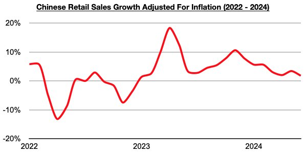
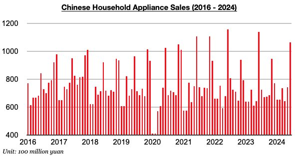

# Weaker Consumer Growth in China

**Date:** July 22, 2024  
**Publisher:** Breakwave Advisors | **Category:** Market Insights  
**Original URL:** [https://www.breakwaveadvisors.com/insights/2024/7/22/dp4v9cxaaa9yw3ebtby28yikdg8gwe](https://www.breakwaveadvisors.com/insights/2024/7/22/dp4v9cxaaa9yw3ebtby28yikdg8gwe)  

---

*By*[*Jeffrey Landsberg*](https://www.linkedin.com/in/jeffrey-landsberg-70ab957/)

As we discussed in Commodore Research's most recent Weekly China Report, China’s retail sales in June grew year-on-year by just 2%. This has marked the worst performance seen since December 2022. Taking June’s 0.2% inflation into account, retail sales adjusted for inflation grew year-on-year by just 1.8%. This has marked the worst performance seen since January 2023.

> **Figure 1: Chart 1 (1)**  
> [Local Asset](file:///C:/Users/Dell/Github/Shipping/corpus/03-breakwave/insights/2024/assets/2024-07-22_dp4v9cxaaa9yw3ebtby28yikdg8gwe_img_chart128129_cd776b1b82f3.jpg)

Retail sales growth is low, but the growth at least continues to exceed inflation. During each of the last eighteen months, retail sales growth has come in higher than inflation. Prior to the last eighteen months, China's retail sales came in lower than inflation for four straight months. Also of note and quite negative, though, is that outstanding loan growth has set another record low as we discussed in today’s update. The central government this year is continuing to work on letting air out of the nation’s grossly inflated debt bubble -- but at the expense of economic growth, including in the consumer sector.

All three of the major categories that Commodore monitors experienced weaker performance last month. Household appliance sales in particular (which includes consumer electronics) in China fell on a year-on-year basis by 6%. Sales had previously increased on a year-on-year basis during seven of the prior eight months.

> **Figure 2: Chart 2 (1)**  
> [Local Asset](file:///C:/Users/Dell/Github/Shipping/corpus/03-breakwave/insights/2024/assets/2024-07-22_dp4v9cxaaa9yw3ebtby28yikdg8gwe_img_chart228129_063f4871e77e.jpg)

---

**Tags:** China, Markets, Economy  
